.. contents::
   :depth: 3
..

|image0|

| Modelica® - A Unified Object-Oriented Language for Systems Modeling
| Language Specification
| Version 3.3 Revision 1

July 11, 2014

| **Abstract**
| This document defines the Modelica [1]_ language, version 3.3, which
  is developed by the Modelica Association, a non-profit organization
  with seat in Linköping, Sweden. Modelica is a freely available,
  object-oriented language for modeling of large, complex, and
  heterogeneous systems. It is suited for multi-domain modeling, for
  example, mechatronic models in robotics, automotive and aerospace
  applications involving mechanical, electrical, hydraulic control and
  state machine subsystems, process oriented applications and generation
  and distribution of electric power. Models in Modelica are
  mathematically described by differential, algebraic and discrete
  equations. No particular variable needs to be solved for manually. A
  Modelica tool will have enough information to decide that
  automatically. Modelica is designed such that available, specialized
  algorithms can be utilized to enable efficient handling of large
  models having more than one hundred thousand equations. Modelica is
  suited and used for hardware-in-the-loop simulations and for embedded
  control systems. More information is available at
  `*http://www.Modelica.org/* <http://www.modelica.org/>`__

Version 3.3 Revision 1 clarifies and fixes issues of the specification
text. In particular it includes all updates made in Version 3.2 Revision
2.

Copyright © 1998-2014, Modelica Association (*https://www.modelica.org*)

All rights reserved. Reproduction or use of editorial or pictorial
content is permitted, i.e., this document can be freely distributed
especially electronically, provided the copyright notice and these
conditions are retained. No patent liability is assumed with respect to
the use of information contained herein. While every precaution has been
taken in the preparation of this document no responsibility for errors
or omissions is assumed.

The contributors to this and to previous versions of this document are
listed in Appendix E. All contributors worked voluntarily and without
compensation.

`Preface 7 <#__RefHeading___Toc394060796>`__

`Chapter 1 Introduction 9 <#introduction>`__

`1.1 Overview of Modelica 9 <#overview-of-modelica>`__

`1.2 Scope of the Specification 9 <#scope-of-the-specification>`__

`1.3 Some Definitions 10 <#some-definitions>`__

`1.4 Notation and Grammar 10 <#notation-and-grammar>`__

`Chapter 2 Lexical Structure 11 <#lexical-structure>`__

`2.1 Character Set 11 <#character-set>`__

`2.2 Comments 11 <#comments>`__

`2.3 Identifiers, Names, and Keywords
12 <#__RefHeading___Toc394060805>`__

`2.4 Literal Constants 13 <#__RefHeading___Toc394060806>`__

`2.5 Operator Symbols 14 <#operator-symbols>`__

`Chapter 3 Operators and Expressions
15 <#__RefHeading___Toc394060808>`__

`3.1 Expressions 15 <#__RefHeading___Toc394060809>`__

`3.2 Operator Precedence and Associativity
15 <#__RefHeading___Toc394060810>`__

`3.3 Evaluation Order 16 <#__RefHeading___Toc394060811>`__

`3.4 Arithmetic Operators 17 <#__RefHeading___Toc394060812>`__

`3.5 Equality, Relational, and Logical Operators
17 <#__RefHeading___Toc394060813>`__

`3.6 Miscellaneous Operators and Variables
18 <#miscellaneous-operators-and-variables>`__

`3.7 Built-in Intrinsic Operators with Function Syntax
19 <#__RefHeading___Toc394060815>`__

`3.8 Variability of Expressions 31 <#__RefHeading___Toc394060816>`__

`Chapter 4 Classes, Predefined Types, and Declarations
33 <#classes-predefined-types-and-declarations>`__

`4.1 Access Control – Public and Protected Elements
33 <#__RefHeading___Toc394060818>`__

`4.2 Double Declaration not Allowed
34 <#double-declaration-not-allowed>`__

`4.3 Declaration Order and Usage before Declaration
34 <#__RefHeading___Toc394060820>`__

`4.4 Component Declarations 34 <#__RefHeading___Toc394060821>`__

`4.5 Class Declarations 39 <#__RefHeading___Toc394060822>`__

`4.6 Specialized Classes 42 <#__RefHeading___Toc394060823>`__

`4.7 Balanced Models 44 <#__RefHeading___Toc394060824>`__

`4.8 Predefined Types 50 <#__RefHeading___Toc394060825>`__

`Chapter 5 Scoping, Name Lookup, and Flattening
55 <#__RefHeading___Toc394060826>`__

`5.1 Flattening Context 55 <#flattening-context>`__

`5.2 Enclosing Classes 55 <#__RefHeading___Toc394060828>`__

`5.3 Static Name Lookup 55 <#__RefHeading___Toc394060829>`__

`5.4 Instance Hierarchy Name Lookup of Inner Declarations
57 <#__RefHeading___Toc394060830>`__

`5.5 Simultaneous Inner/Outer Declarations
59 <#__RefHeading___Toc394060831>`__

`5.6 Flattening Process 59 <#__RefHeading___Toc394060832>`__

`Chapter 6 Interface or Type Relationships
61 <#__RefHeading___Toc394060833>`__

`6.1 The Concepts of Type, Interface and Subtype
62 <#__RefHeading___Toc394060834>`__

`6.2 Interface or Type 63 <#__RefHeading___Toc394060835>`__

`6.3 Interface Compatibility or Subtyping
64 <#__RefHeading___Toc394060836>`__

`6.4 Plug-Compatibility or Restricted Subtyping
66 <#__RefHeading___Toc394060837>`__

`6.5 Function-Compatibility or Function-Subtyping for Functions
67 <#__RefHeading___Toc394060838>`__

`6.6 Type Compatible Expressions 68 <#__RefHeading___Toc394060839>`__

`Chapter 7 Inheritance, Modification, and Redeclaration
71 <#__RefHeading___Toc394060840>`__

`7.1 Inheritance—Extends Clause 71 <#__RefHeading___Toc394060841>`__

`7.2 Modifications 74 <#__RefHeading___Toc394060842>`__

`7.3 Redeclaration 77 <#__RefHeading___Toc394060843>`__

`Chapter 8 Equations 85 <#__RefHeading___Toc394060844>`__

`8.1 Equation Categories 85 <#__RefHeading___Toc394060845>`__

`8.2 Flattening and Lookup in Equations
85 <#__RefHeading___Toc394060846>`__

`8.3 Equations in Equation Sections 85 <#__RefHeading___Toc394060847>`__

`8.4 Synchronous Data-flow Principle and Single Assignment Rule
92 <#__RefHeading___Toc394060848>`__

`8.5 Events and Synchronization 92 <#__RefHeading___Toc394060849>`__

`8.6 Initialization, initial equation, and initial algorithm
94 <#__RefHeading___Toc394060850>`__

`Chapter 9 Connectors and Connections
99 <#__RefHeading___Toc394060851>`__

`9.1 Connect-Equations and Connectors
99 <#__RefHeading___Toc394060852>`__

`9.2 Generation of Connection Equations
104 <#__RefHeading___Toc394060853>`__

`9.3 Restrictions of Connections and Connectors
107 <#__RefHeading___Toc394060854>`__

`9.4 Equation Operators for Overconstrained Connection-Based Equation
Systems 109 <#__RefHeading___Toc394060855>`__

`Chapter 10 Arrays 115 <#__RefHeading___Toc394060856>`__

`10.1 Array Declarations 115 <#__RefHeading___Toc394060857>`__

`10.2 Flexible Array Sizes 117 <#flexible-array-sizes>`__

`10.3 Built-in Array Functions 117 <#__RefHeading___Toc394060859>`__

`10.4 Vector, Matrix and Array Constructors
121 <#__RefHeading___Toc394060860>`__

`10.5 Array Indexing 124 <#__RefHeading___Toc394060861>`__

`10.6 Scalar, Vector, Matrix, and Array Operator Functions
125 <#__RefHeading___Toc394060862>`__

`10.7 Empty Arrays 129 <#empty-arrays>`__

`Chapter 11 Statements and Algorithm Sections
131 <#__RefHeading___Toc394060864>`__

`11.1 Algorithm Sections 131 <#__RefHeading___Toc394060865>`__

`11.2 Statements 132 <#__RefHeading___Toc394060866>`__

`Chapter 12 Functions 139 <#__RefHeading___Toc394060867>`__

`12.1 Function Declaration 139 <#function-declaration>`__

`12.2 Function as a Specialized Class
140 <#__RefHeading___Toc394060869>`__

`12.3 Pure Modelica Functions 141 <#__RefHeading___Toc394060870>`__

`12.4 Function Call 142 <#__RefHeading___Toc394060871>`__

`12.5 Built-in Functions 149 <#built-in-functions>`__

`12.6 Record Constructor Functions 149 <#__RefHeading___Toc394060873>`__

`12.7 Declaring Derivatives of Functions
151 <#declaring-derivatives-of-functions>`__

`12.8 Declaring Inverses of Functions
155 <#__RefHeading___Toc394060875>`__

`12.9 External Function Interface 155 <#__RefHeading___Toc394060876>`__

`Chapter 13 Packages 169 <#__RefHeading___Toc394060877>`__

`13.1 Package as Specialized Class 169 <#__RefHeading___Toc394060878>`__

`13.2 Motivation and Usage of Packages
169 <#motivation-and-usage-of-packages>`__

`Chapter 14 Overloaded Operators 175 <#__RefHeading___Toc394060880>`__

`14.1 Matching Function 176 <#matching-function>`__

`14.2 Overloaded Constructors 176 <#__RefHeading___Toc394060882>`__

`14.3 Overloaded String Conversions
177 <#__RefHeading___Toc394060883>`__

`14.4 Overloaded Binary Operations 177 <#__RefHeading___Toc394060884>`__

`14.5 Overloaded Unary Operations 178 <#__RefHeading___Toc394060885>`__

`14.6 Example of Overloading for Complex Numbers
178 <#__RefHeading___Toc394060886>`__

`Chapter 15 Stream Connectors 183 <#stream-connectors>`__

`15.1 Definition of Stream Connectors
183 <#__RefHeading___Toc394060888>`__

`15.2 Stream Operator inStream and Connection Equations
184 <#__RefHeading___Toc394060889>`__

`15.3 Stream Operator actualStream 187 <#__RefHeading___Toc394060890>`__

`Chapter 16 Synchronous Language Elements
189 <#__RefHeading___Toc394060891>`__

`16.1 Introduction 189 <#introduction-1>`__

`16.2 Definitions 191 <#definitions>`__

`16.3 Clock Constructors 194 <#__RefHeading___Toc394060894>`__

`16.4 Discrete States 196 <#__RefHeading___Toc394060895>`__

`16.5 Partitioning Operators 196 <#__RefHeading___Toc394060896>`__

`16.6 Clocked When Clause 199 <#clocked-when-clause>`__

`16.7 Clock Partitioning 199 <#__RefHeading___Toc394060898>`__

`16.8 Continuous-Time Equations in Clocked Partitions
202 <#__RefHeading___Toc394060899>`__

`16.9 Initialization of Clocked Partitions
206 <#__RefHeading___Toc394060900>`__

`16.10 Other Operators 206 <#__RefHeading___Toc394060901>`__

`16.11 Semantics 207 <#semantics>`__

`Chapter 17 State Machines 209 <#__RefHeading___Toc394060903>`__

`17.1 Transitions 209 <#transitions>`__

`17.2 State Machine Graphics 210 <#state-machine-graphics>`__

`17.3 State Machine Semantics 212 <#__RefHeading___Toc394060906>`__

`Chapter 18 Annotations 221 <#__RefHeading___Toc394060907>`__

`18.1 Vendor-Specific Annotations 221 <#__RefHeading___Toc394060908>`__

`18.2 Annotations for Documentation
221 <#__RefHeading___Toc394060909>`__

`18.3 Annotations for Code Generation
222 <#__RefHeading___Toc394060910>`__

`18.4 Annotations for Simulation Experiments
224 <#__RefHeading___Toc394060911>`__

`18.5 Annotation for single use of class
224 <#__RefHeading___Toc394060912>`__

`18.6 Annotations for Graphical Objects
225 <#__RefHeading___Toc394060913>`__

`18.7 Annotations for the Graphical User Interface
233 <#__RefHeading___Toc394060914>`__

`18.8 Annotations for Version Handling
237 <#__RefHeading___Toc394060915>`__

`18.9 Annotations for Access Control to Protect Intellectual Property
240 <#__RefHeading___Toc394060916>`__

`18.10 Annotations for Functions 243 <#annotations-for-functions>`__

`18.11 Annotation Choices for Modifications and Redeclarations
243 <#annotation-choices-for-modifications-and-redeclarations>`__

`18.12 Annotation for External Libraries and Include Files
244 <#annotation-for-external-libraries-and-include-files>`__

`Chapter 19 Unit Expressions 245 <#unit-expressions>`__

`19.1 The Syntax of Unit Expressions
245 <#the-syntax-of-unit-expressions>`__

`19.2 Examples 246 <#examples-1>`__

`Chapter 20 The Modelica Standard Library
247 <#the-modelica-standard-library>`__

`Appendix A Glossary 251 <#__RefHeading___Toc394060924>`__

`Appendix B Modelica Concrete Syntax
255 <#__RefHeading___Toc394060925>`__

`Appendix C Modelica DAE Representation
262 <#__RefHeading___Toc394060926>`__

`Appendix D Derivation of Stream Equations
264 <#__RefHeading___Toc394060927>`__

`Appendix E Modelica Revision History
269 <#__RefHeading___Toc394060928>`__

`Appendix F Literature 292 <#__RefHeading___Toc394060929>`__

`Index 293 <#__RefHeading___Toc394060930>`__

Modelica is a freely available, object-oriented language for modeling of
large, complex, and heterogeneous physical systems. From a user’s point
of view, models are described by schematics, also called object
diagrams. Examples are shown in the next figure:

A schematic consists of connected components, like a resistor, or a
hydraulic cylinder. A component has “connectors” (often also called
“ports”) that describe the interaction possibilities, e.g., an
electrical pin, a mechanical flange, or an input signal. By drawing
connection lines between connectors a physical system or block diagram
model is constructed. Internally a component is defined by another
schematic or on “bottom” level, by an equation based description of the
model in Modelica syntax.

The Modelica language is a textual description to define all parts of a
model and to structure model components in libraries, called packages.
An appropriate Modelica simulation environment is needed to graphically
edit and browse a Modelica model (by interpreting the information
defining a Modelica model) and to perform model simulations and other
analysis. Information about such environments is available at
`*www.modelica.org/tools* <http://www.modelica.org/tools>`__. Basically,
all Modelica language elements are mapped to differential, algebraic and
discrete equations. There are no language elements to describe directly
partial differential equations, although some types of discretized
partial differential equations can be reasonably defined, e.g., based on
the finite volume method and there are Modelica libraries to import
results of finite-element programs.

This document defines the details of the Modelica language. It is not
intended to learn the Modelica language with this text. There are better
alternatives, such as the Modelica books referenced at
`*www.modelica.org/publications* <http://www.modelica.org/publications>`__.
This specification is used by computer scientist to implement a Modelica
translator and by modelers who want to understand the exact details of a
particular language element.

The Modelica language has been developed since 1996. This document
describes revision 1 of version 3.3 of the Modelica language. With
respect to version 3.2 new features are introduced such as synchronous
language elements to describe controllers and synchronous state
machines. A complete summary is available in Appendix E.1.

May, 9, 2012, The Modelica Association (revision on July 11, 2014)

1. .. rubric:: 
      Introduction
      :name: introduction

   1. .. rubric:: Overview of Modelica
         :name: overview-of-modelica

Modelica is a language for modeling of physical systems, designed to
support effective library development and model exchange. It is a modern
language built on acausal modeling with mathematical equations and
object-oriented constructs to facilitate reuse of modeling knowledge.

Scope of the Specification
==========================

The semantics of the Modelica language is specified by means of a set of
rules for translating any class described in the Modelica language to a
flat Modelica structure. A class must have additional properties in
order that its flat Modelica structure can be further transformed into a
set of differential, algebraic and discrete equations (= flat hybrid
DAE). Such classes are called simulation models.

The flat Modelica structure is also defined for other cases than
simulation models; including functions (can be used to provide
algorithmic contents), packages (used as a structuring mechanism), and
partial models (used as base-models). This allows correctness to be
verified before building the simulation model.

Modelica was designed to facilitate symbolic transformations of models,
especially by mapping basically every Modelica language construct to
continuous or instantaneous equations in the flat Modelica structure.
Many Modelica models, especially in the associated Modelica Standard
Library, are higher index systems, and can only be reasonably simulated
if symbolic index reduction is performed, i.e., equations are
differentiated and appropriate variables are selected as states, so that
the resulting system of equations can be transformed to state space form
(at least locally numerically), i.e., a hybrid DAE of index zero. The
Modelica specification does not define how to simulate a model. However,
it defines a set of equations that the simulation result should satisfy
as well as possible.

The key issues of the translation (or flattening) are:

-  Expansion of inherited base classes

-  Parameterization of base classes, local classes and components

-  Generation of connection equations from connect-equations

The flat hybrid DAE form consists of:

-  Declarations of variables with the appropriate basic types, prefixes
   and attributes, such as "parameter Real v=5".

-  Equations from equation sections.

-  Function invocations where an invocation is treated as a set of
   equations which involves all input and all result variables (number
   of equations = number of basic result variables).

-  Algorithm sections where every section is treated as a set of
   equations which involves the variables occurring in the algorithm
   section (number of equations = number of different assigned
   variables).

-  When-clauses where every when-clause is treated as a set of
   conditionally evaluated equations, also called instantaneous
   equations, which are functions of the variables occurring in the
   clause (number of equations = number of different assigned
   variables).

Therefore, a flat hybrid DAE is seen as a set of equations where some of
the equations are only conditionally evaluated (e.g. instantaneous
equations are only evaluated when the corresponding when-condition
becomes true). Initial setup of the model is specified using
start-values and instantaneous equations that hold at the initial time
only.

A Modelica class may also contain annotations, i.e. formal comments,
which specify graphical representations of the class (icon and diagram),
documentation text for the class, and version information.

Some Definitions
================

The semantic specification should be read together with the Modelica
grammar. Non-normative text, i.e., examples and comments, are enclosed
in [ ]; comments are set in italics. Additional terms are explained in
the glossary in Appendix A. Some important terms are:

+--------------+--------------------------------------------------------------------------------------------------------------------------------------------------------------------------------------------------------------------------------------------------------------------------------------------------------------------------------------------------------------------------------------------------------------------------------------------------------------------------------------------------------------+
| *Term*       | *Definition*                                                                                                                                                                                                                                                                                                                                                                                                                                                                                                 |
+--------------+--------------------------------------------------------------------------------------------------------------------------------------------------------------------------------------------------------------------------------------------------------------------------------------------------------------------------------------------------------------------------------------------------------------------------------------------------------------------------------------------------------------+
| Component    | An element defined by the production component\_clause in the Modelica grammar                                                                                                                                                                                                                                                                                                                                                                                                                               |
|              | (basically a variable or an instance of a class)                                                                                                                                                                                                                                                                                                                                                                                                                                                             |
+--------------+--------------------------------------------------------------------------------------------------------------------------------------------------------------------------------------------------------------------------------------------------------------------------------------------------------------------------------------------------------------------------------------------------------------------------------------------------------------------------------------------------------------+
| Element      | Class definitions, extends-clauses and component-clauses declared in a class                                                                                                                                                                                                                                                                                                                                                                                                                                 |
|              | (basically a class reference or a component in a declaration).                                                                                                                                                                                                                                                                                                                                                                                                                                               |
+--------------+--------------------------------------------------------------------------------------------------------------------------------------------------------------------------------------------------------------------------------------------------------------------------------------------------------------------------------------------------------------------------------------------------------------------------------------------------------------------------------------------------------------+
| Flattening   | The translation of a model described in Modelica to the corresponding model described as a hybrid DAE, involving expansion of inherited base classes, parameterization of base classes, local classes and components, and generation of connection equations from connect-equations (basically, mapping the hierarchical structure of a model into a set of differential, algebraic and discrete equations together with the corresponding variable declarations and function definitions from the model).   |
+--------------+--------------------------------------------------------------------------------------------------------------------------------------------------------------------------------------------------------------------------------------------------------------------------------------------------------------------------------------------------------------------------------------------------------------------------------------------------------------------------------------------------------------+

Notation and Grammar
====================

The following syntactic meta symbols are used (extended BNF):

[ ] optional

{ } repeat zero or more times

Boldface denotes keywords of the Modelica language. Keywords are
reserved words and may not be used as identifiers, with the exception of
initial which is a keyword in section headings, and der which is a
keyword for declaration functions, but it is also possible to call the
functions initial()and der(…).

See Appendix B for a full lexical specification and grammar.

Lexical Structure
=================

This chapter describes several of the basic building blocks of Modelica
such as characters and lexical units including identifiers and literals.
Without question, the smallest building blocks in Modelica are single
characters belonging to a character set. Characters are combined to form
lexical units, also called tokens. These tokens are detected by the
lexical analysis part of the Modelica translator. Examples of tokens are
literal constants, identifiers, and operators. Comments are not really
lexical units since they are eventually discarded. On the other hand,
comments are detected by the lexical analyzer before being thrown away.

The information presented here is derived from the more formal
specification in Appendix B.

Character Set
-------------

The character set of the Modelica language is Unicode, but restricted to
the Unicode characters corresponding to 7-bit ASCII characters in
several places; for details see Appendix B.1.

Comments
--------

There are two kinds of comments in Modelica which are not lexical units
in the language and therefore are treated as whitespace by a Modelica
translator. The whitespace characters are space, tabulator, and line
separators (carriage return and line feed); and whitespace cannot occur
inside tokens, e.g., <= must be written as two characters without space
or comments between them. [*The comment syntax is identical to that of
C++*\ ]. The following comment variants are available:

+-------------------+---------------------------------------------------------------------------+
| // comment        | Characters from // to the end of the line are ignored.                    |
+-------------------+---------------------------------------------------------------------------+
| /\* comment \*/   | Characters between /\* and \*/ are ignored, including line terminators.   |
+-------------------+---------------------------------------------------------------------------+

Modelica comments do not nest, i.e., /\* \*/ cannot be embedded within
/\* \*/. The following is *invalid*:

/\* Commented out - erroneous comment, invalid nesting of comments!

/\* This is a interesting model \*/

**model** interesting

...

**end** interesting;

\*/

There is also a kind of “documentation comment,” really a *documentation
string* that is part of the Modelica language and therefore not ignored
by the Modelica translator. Such “comments” may occur at the ends of
declarations, equations, or statements or at the beginning of class
definitions. For example:

**model** TempResistor "Temperature dependent resistor"

...

**parameter** Real R "Resistance for reference temp.";

...

**end** TempResistor;

Identifiers, Names, and Keywords
--------------------------------

*Identifiers* are sequences of letters, digits, and other characters
such as underscore, which are used for *naming* various items in the
language. Certain combinations of letters are *keywords* represented as
*reserved* words in the Modelica grammar and are therefore not available
as identifiers.

Identifiers
~~~~~~~~~~~

Modelica *identifiers*, used for naming classes, variables, constants,
and other items, are of two forms. The first form always start with a
letter or underscore (\_), followed by any number of letters, digits, or
underscores. Case is significant, i.e., the names Inductor and inductor
are different. The second form (Q-IDENT) starts with a single quote,
followed by a sequence of any printable ASCII character, where
single-quote must be preceded by backslash, and terminated by a single
quote, e.g. '12H', '13\\'H', '+foo'. Control characters in quoted
identifiers have to use string escapes. The single quotes are part of
the identifier, i.e., 'x' and x are distinct identifiers. The following
BNF-like rules define Modelica identifiers, where curly brackets {}
indicate repetition zero or more times, and vertical bar \| indicates
alternatives. A full BNF definition of the Modelica syntax and lexical
units is available in Appendix B.

IDENT = NONDIGIT { DIGIT \| NONDIGIT } \| Q-IDENT

Q-IDENT = "**’**\ " { Q-CHAR \| S-ESCAPE } "**’**\ "

NONDIGIT = "**\_**\ " \| letters "**a**\ " to "**z**\ " \| letters
"**A**\ " to "**Z**\ "

DIGIT = 0 \| 1 \| 2 \| 3 \| 4 \| 5 \| 6 \| 7 \| 8 \| 9

Q-CHAR = NONDIGIT \| DIGIT \| "!" \| "#" \| "$" \| "%" \| "&" \| "(" \|
")" \| "\*" \| "+" \| "," \|

"-" \| "." \| "/" \| ":" \| ";" \| "<" \| ">" \| "=" \| "?" \| "@" \|
"[" \| "]" \| "^" \|

"{" \| "}" \| "\|" \| "~" \| " "\_

S-ESCAPE = "**\\’**\ " \| "**\\"**\ " \| "**\\?**\ " \| "**\\\\**\ " \|

"**\\a**\ " \| "**\\b**\ " \| "**\\f**\ " \| "**\\n**\ " \| "**\\r**\ "
\| "**\\t**\ " \| "**\\v**\ "

Names
~~~~~

A *name* is an identifier with a certain interpretation or meaning. For
example, a name may denote an Integer variable, a Real variable, a
function, a type, etc. A name may have different meanings in different
parts of the code, i.e., different scopes. The interpretation of
identifiers as names is described in more detail in Chapter 5. The
meaning of package names is described in more detail in Chapter 13.

Modelica Keywords
~~~~~~~~~~~~~~~~~

The following Modelica *keywords* are reserved words and may not be used
as identifiers, except as listed in Appendix B.1:

+-----------------+----------------+------------+-------------+---------------+
| algorithm       | discrete       | false      | loop        | pure          |
+-----------------+----------------+------------+-------------+---------------+
| and             | each           | final      | model       | record        |
+-----------------+----------------+------------+-------------+---------------+
| annotation      | else           | flow       | not         | redeclare     |
+-----------------+----------------+------------+-------------+---------------+
|                 | elseif         | for        | operator    | replaceable   |
+-----------------+----------------+------------+-------------+---------------+
| block           | elsewhen       | function   | or          | return        |
+-----------------+----------------+------------+-------------+---------------+
| break           | encapsulated   | if         | outer       | stream        |
+-----------------+----------------+------------+-------------+---------------+
| class           | end            | import     | output      | then          |
+-----------------+----------------+------------+-------------+---------------+
| connect         | enumeration    | impure     | package     | true          |
+-----------------+----------------+------------+-------------+---------------+
| connector       | equation       | in         | parameter   | type          |
+-----------------+----------------+------------+-------------+---------------+
| constant        | expandable     | initial    | partial     | when          |
+-----------------+----------------+------------+-------------+---------------+
| constrainedby   | extends        | inner      | protected   | while         |
+-----------------+----------------+------------+-------------+---------------+
| der             | external       | input      | public      | within        |
+-----------------+----------------+------------+-------------+---------------+

Literal Constants
-----------------

Literal constants are unnamed constants that have different forms
depending on their type. Each of the predefined types in Modelica has a
way of expressing unnamed constants of the corresponding type, which is
presented in the ensuing subsections. Additionally, array literals and
record literals can be expressed.

Floating Point Numbers
~~~~~~~~~~~~~~~~~~~~~~

A floating point number is expressed as a decimal number in the form of
a sequence of decimal digits optionally followed by a decimal point,
optionally followed by an exponent. At least one digit must be present.
The exponent is indicated by an E or e, followed by an optional sign (+
or −) and one or more decimal digits. The minimal recommended range is
that of IEEE double precision floating point numbers, for which the
largest representable positive number is 1.7976931348623157E+308 and the
smallest positive number is 2.2250738585072014E−308. For example, the
following are floating point number literal constants:

22.5, 3.141592653589793, 1.2E-35

The same floating point number can be represented by different literals.
For example, all of the following literals denote the same number:

13., 13E0, 1.3e1, 0.13E2

Integer Literals
~~~~~~~~~~~~~~~~

Literals of type Integer are sequences of decimal digits, e.g. as in the
integer numbers 33, 0, 100, 30030044. [*Negative numbers are formed by
unary minus followed by an integer literal*\ ]. The minimal recommended
number range is from −2147483648 to +2147483647 for a two’s-complement
32-bit integer implementation.

Boolean Literals
~~~~~~~~~~~~~~~~

The two Boolean literal values are true and false.

Strings
~~~~~~~

String literals appear between double quotes as in "between". Any
character in the Modelica language character set (see appendix B.1 for
allowed characters) apart from double quote (") and backslash (\\),
including new-line, can be *directly* included in a string without using
an escape code. Certain characters in string literals can be represented
using escape codes, i.e., the character is preceded by a backslash (\\)
within the string. Those characters are:

+--------+------------------------------------------------------------------------+
| \\'    | single quotemay also appear without backslash in string constants.    |
+--------+------------------------------------------------------------------------+
| \\"    | double quote                                                           |
+--------+------------------------------------------------------------------------+
| \\?    | question-markmay also appear without backslash in string constants.   |
+--------+------------------------------------------------------------------------+
| \\\\   | backslash itself                                                       |
+--------+------------------------------------------------------------------------+
| \\a    | alert (bell, code 7, ctrl-G)                                           |
+--------+------------------------------------------------------------------------+
| \\b    | backspace (code 8, ctrl-H)                                             |
+--------+------------------------------------------------------------------------+
| \\f    | form feed (code 12, ctrl-L)                                            |
+--------+------------------------------------------------------------------------+
| \\n    | new-line (code 10, ctrl-J)                                             |
+--------+------------------------------------------------------------------------+
| \\r    | return (code 13, ctrl-M)                                               |
+--------+------------------------------------------------------------------------+
| \\t    | horizontal tab (code 9, ctrl-I)                                        |
+--------+------------------------------------------------------------------------+
| \\v    | vertical tab (code 11, ctrl-K)                                         |
+--------+------------------------------------------------------------------------+

For example, a string literal containing a tab, the words: This is,
double quote, space, the word: between, double quote, space, the word:
us, and new-line, would appear as follows:

"\\tThis is\\" between\\" us\\n"

Concatenation of string literals in certain situations (see the Modelica
grammar) is denoted by the + operator in Modelica, e.g. "a" + "b"
becomes "ab". This is useful for expressing long string literals that
need to be written on several lines.

[*Note, if the contents of a file is read into a Modelica string, it is
assumed that the reading function is responsible to handle the different
line ending symbols on file (e.g. on Linux systems to have a “newline”
character at the end of a line and on Windows systems to have a
“newline” and a “carriage return” character. As usual in programming
languages, the content of a file in a Modelica string only contains the
“newline” character. *

*For long string comments, e.g., the “info” annotation to store the
documentation of a model, it would be very inconvenient, if the string
concatenation operator would have to be used for every line of
documentation. It is assumed that a Modelica tool supports the
non-printable “newline” character when browsing or editing a string
literal. For example, the following statement defines one string that
contains (non-printable) newline characters:*

**assert**\ (**noEvent**\ (length > s\_small), "

The distance between the origin of frame\_a and the origin of frame\_b

of a LineForceWithMass component became smaller as parameter s\_small

(= a small number, defined in the \\"Advanced\\" menu). The distance is

set to s\_small, although it is smaller, to avoid a division by zero

| when computing the direction of the line force.",
| level = AssertionLevel.warning);

]

Operator Symbols
----------------

The predefined operator symbols are formally defined on page 255 and
summarized in the table of operators in Section 3.2.

Operators and Expressions
=========================

The lexical units are combined to form even larger building blocks such
as expressions according to the rules given by the expression part of
the Modelica grammar in Appendix B.

This chapter describes the evaluation rules for expressions, the concept
of expression variability, built-in mathematical operators and
functions, and the built-in special Modelica operators with function
syntax.

Expressions can contain variables and constants, which have types,
predefined or user defined. The predefined built-in types of Modelica
are Real, Integer, Boolean, String, and enumeration types which are
presented in more detail in Section 4.8. [*The abbreviated predefined
type information below is given as background information for the rest
of the presentation.*\ ]

Expressions
-----------

Modelica equations, assignments and declaration equations contain
expressions.

Expressions can contain basic operations, +, -, \*, /, ^, etc. with
normal precedence as defined in the Table in Section 3.2 and the grammar
in Appendix B. The semantics of the operations is defined for both
scalar and array arguments in Section 10.6.

It is also possible to define functions and call them in a normal
fashion. The function call syntax for both positional and named
arguments is described in Section 12.4.1 and for vectorized calls in
Section 12.4.4. The built-in array functions are given in Section 10.1.1
and other built-in operators in Section 3.7.

Operator Precedence and Associativity
-------------------------------------

Operator precedence determines the order of evaluation of operators in
an expression. An operator with higher precedence is evaluated before an
operator with lower precedence in the same expression.

The following table presents all the expression operators in order of
precedence from highest to lowest, as derived from the Modelica grammar
in Appendix B. All operators are binary except the postfix operators and
those shown as unary together with *expr*, the conditional operator, the
array construction operator {} and concatenation operator [ ], and the
array range constructor which is either binary or ternary. Operators
with the same precedence occur at the same line of the table:

Table ‎31. **Operators.**

+-------------------------------------------------------+-------------------------------------------------------------------------+-------------------------+
| *Operator Group*                                      | *Operator Syntax*                                                       | *Examples*              |
+-------------------------------------------------------+-------------------------------------------------------------------------+-------------------------+
| postfix array index operator                          | []                                                                      | arr[index]              |
+-------------------------------------------------------+-------------------------------------------------------------------------+-------------------------+
| postfix access operator                               | .                                                                       | a.b                     |
+-------------------------------------------------------+-------------------------------------------------------------------------+-------------------------+
| postfix function call                                 | *funcName*\ (*function-arguments*)                                      | sin(4.36)               |
+-------------------------------------------------------+-------------------------------------------------------------------------+-------------------------+
| array construct/concat                                | {*expressions*\ } [*expressions*\ ] [*expressions*; *expressions*...]   | {2,3} [5,6]             |
|                                                       |                                                                         |                         |
|                                                       |                                                                         | [2,3; 7,8]              |
+-------------------------------------------------------+-------------------------------------------------------------------------+-------------------------+
| exponentiation                                        | ^                                                                       | 2^3                     |
+-------------------------------------------------------+-------------------------------------------------------------------------+-------------------------+
| multiplicative and array elementwise multiplicative   | \* / .\* ./                                                             | 2\*3 2/3                |
|                                                       |                                                                         | [1,2;3,4].\*[2,3;5,6]   |
+-------------------------------------------------------+-------------------------------------------------------------------------+-------------------------+
| additive and array elementwise additive               | + - +\ *expr* -*expr                                                    | a+b, a-b, +a, -a        |
|                                                       | *.+ .-                                                                  |                         |
|                                                       |                                                                         | [1,2;3,4].+[2,3;5,6]    |
+-------------------------------------------------------+-------------------------------------------------------------------------+-------------------------+
| relational                                            | < <= > >= == <>                                                         | a<b, a<=b, a>b, ...     |
+-------------------------------------------------------+-------------------------------------------------------------------------+-------------------------+
| unary negation                                        | not *expr*                                                              | not b1                  |
+-------------------------------------------------------+-------------------------------------------------------------------------+-------------------------+
| logical and                                           | and                                                                     | b1 and b2               |
+-------------------------------------------------------+-------------------------------------------------------------------------+-------------------------+
| logical or                                            | or                                                                      | b1 or b2                |
+-------------------------------------------------------+-------------------------------------------------------------------------+-------------------------+
| array range                                           | *expr* : *expr*                                                         | 1:5                     |
|                                                       |                                                                         |                         |
|                                                       | *expr* : *expr* : *expr*                                                | start:step:stop         |
+-------------------------------------------------------+-------------------------------------------------------------------------+-------------------------+
| conditional                                           | if *expr* then *expr* else *expr*                                       | if b then 3 else x      |
+-------------------------------------------------------+-------------------------------------------------------------------------+-------------------------+
| named argument                                        | *ident* = *expr*                                                        | x = 2.26                |
+-------------------------------------------------------+-------------------------------------------------------------------------+-------------------------+

The conditional operator may also include elseif-clauses. Equality = and
assignment := are not expression operators since they are allowed only
in equations and in assignment statements respectively. All binary
expression operators are left associative, except exponentiation which
is non-associative. The array range operator is non-associative.

[*The unary minus and plus in Modelica is slightly different than in
Mathematica and in MATLAB*\  [2]_\ *, since the following expressions
are illegal (whereas in Mathematica*\  [3]_ *and in MATLAB these are
valid expressions):*

2\*-2 // = -4 in Mathematica/MATLAB; is illegal in Modelica

--2 // = 2 in Mathematica/MATLAB; is illegal in Modelica

++2 // = 2 in Mathematica/MATLAB; is illegal in Modelica

2--2 // = 4 in Mathematica/MATLAB; is illegal in Modelica

*Non-associative exponentation and array range operator:*

x^y^z // Not legal, use parenthesis to make it clear

a:b:c:d:e:f:g // Not legal, and scalar arguments gives no legal
interpretation.

]

Evaluation Order
----------------

A tool is free to solve equations, reorder expressions and to not
evaluate expressions if their values do not influence the result (e.g.
short-circuit evaluation of Boolean expressions). If-statements and
if-expressions guarantee that their clauses are only evaluated if the
appropriate condition is true, but relational operators generating state
or time events will during continuous integration have the value from
the most recent event.

If a numeric operation overflows the result is undefined. For literals
it is recommended to automatically convert the number to another type
with greater precision.

Example: Guarding Expressions Against Incorrect Evaluation
~~~~~~~~~~~~~~~~~~~~~~~~~~~~~~~~~~~~~~~~~~~~~~~~~~~~~~~~~~

[*Example. If one wants to guard an expression against incorrect
evaluation, it should be guarded by an if:*

Boolean v[n];

Boolean b;

Integer I;

**equation**

x=v[I] **and** (I>=1 **and** I<=n); // Invalid

x=\ **if** (I>=1 **and** I<=n) **then** v[I] **else** false; // Correct

*To guard square against square root of negative number use*
noEvent\ *:*

**der**\ (h)=**if** h>0 **then** –c\*sqrt(h) **else** 0; // Incorrect

**der**\ (h)=**if** noEvent(h>0) **then** –c\*sqrt(h) **else** 0; //
Correct

]

Arithmetic Operators
--------------------

Modelica supports five binary arithmetic operators that operate on any
numerical type:

+------+------------------+
| ^    | Exponentiation   |
+------+------------------+
| \*   | Multiplication   |
+------+------------------+
| /    | Division         |
+------+------------------+
| +    | Addition         |
+------+------------------+
| -    | Subtraction      |
+------+------------------+

Some of these operators can also be applied to a combination of a scalar
type and an array type, see Section 10.6.

The syntax of these operators is defined by the following rules from the
Modelica grammar:

arithmetic\_expression :

[ add\_op ] term { add\_op term }

add\_op :

"+" \| "-"

term :

factor { mul\_op factor }

mul\_op :

"\*" \| "/"

factor :

primary [ "^" primary ]

Equality, Relational, and Logical Operators
-------------------------------------------

Modelica supports the standard set of relational and logical operators,
all of which produce the standard boolean values true or false.

+------+-------------------------------+
| >    | greater than                  |
+------+-------------------------------+
| >=   | greater than or equal         |
+------+-------------------------------+
| <    | less than                     |
+------+-------------------------------+
| <=   | less than or equal to         |
+------+-------------------------------+
| ==   | equality within expressions   |
+------+-------------------------------+
| <>   | Inequality                    |
+------+-------------------------------+

A single equals sign = is never used in relational expressions, only in
equations (Chapter 8, Section 10.6.1) and in function calls using named
parameter passing (Section 12.4.1).

The following logical operators are defined:

+-----------+----------------------------+
| **not**   | negation, unary operator   |
+-----------+----------------------------+
| **and**   | logical and                |
+-----------+----------------------------+
| **or**    | logical or                 |
+-----------+----------------------------+

The grammar rules define the syntax of the relational and logical
operators.

logical\_expression :

logical\_term { **or** logical\_term }

logical\_term :

logical\_factor { **and** logical\_factor }

logical\_factor :

[ **not** ] relation

relation :

arithmetic\_expression [ rel\_op arithmetic\_expression ]

rel\_op :

"<" \| "<=" \| ">" \| ">=" \| "==" \| "<>"

The following holds for relational operators:

-  Relational operators <, <=, >, >=, ==, <>, are only defined for
   scalar operands of simple types. The result is Boolean and is true or
   false if the relation is fulfilled or not, respectively.

-  For operands of type String, str1 op str2 is for each relational
   operator, op, defined in terms of the C-function strcmp as
   strcmp(str1,str2) op 0.

-  For operands of type Boolean, false<true.

-  For operands of enumeration types, the order is given by the order of
   declaration of the enumeration literals.

-  In relations of the form v1 == v2 or v1 <> v2, v1 or v2 shall, unless
   used in a function, not be a subtype of Real. [*The reason for this
   rule is that relations with Real arguments are transformed to state
   events (see Events, Section* 8.5\ *) and this transformation becomes
   unnecessarily complicated for the == and <> relational operators
   (e.g. two crossing functions instead of one crossing function needed,
   epsilon strategy needed even at event instants). Furthermore, testing
   on equality of Real variables is questionable on machines where the
   number length in registers is different to number length in main
   memory*].

-  Relations of the form “v1 rel\_op v2”, with v1 and v2 variables and
   rel\_op a relational operator are called elementary relations. If
   either v1 or v2 or both variables are a subtype of Real, the relation
   is called a Real elementary relation.

   1. .. rubric:: Miscellaneous Operators and Variables
         :name: miscellaneous-operators-and-variables

Modelica also contains a few built-in operators which are not standard
arithmetic, relational, or logical operators. These are described below,
including time, which is a built-in variable, not an operator.

String Concatenation
~~~~~~~~~~~~~~~~~~~~

Concatenation of strings (see the Modelica grammar) is denoted by the +
operator in Modelica [*e.g.* "a" + "b" *becomes* "ab"].

Array Constructor Operator
~~~~~~~~~~~~~~~~~~~~~~~~~~

The array constructor operator { ... } is described in Section 10.4.

Array Concatenation Operator
~~~~~~~~~~~~~~~~~~~~~~~~~~~~

The array concatenation operator [ ... ] is described in Section 10.4.2.

Array Range Operator
~~~~~~~~~~~~~~~~~~~~

The array range constructor operator : is described in Section 10.4.3.

If-Expressions
~~~~~~~~~~~~~~

An expression

**if** expression1 **then** expression2 **else** expression3

is one example of if-expression. First expression1, which must be
boolean expression, is evaluated. If expression1 is true expression2 is
evaluated and is the value of the if-expression, else expression3 is
evaluated and is the value of the if-expression. The two expressions,
expression2 and expression3, must be type compatible expressions
(Section 6.6) giving the type of the if-expression. If-expressions with
elseif are defined by replacing elseif by else if. [*Note:* elseif *has
been added for symmetry with if-clauses.*] For short-circuit evaluation
see Section 3.3.

[*Example*:

Integer i;

Integer sign\_of\_i1=\ **if** i<0 **then** -1 **elseif** i==0 **then** 0
**else** 1;

Integer sign\_of\_i2=\ **if** i<0 **then** -1 **else** **if** i==0
**then** 0 **else** 1;

]

Member Access Operator
~~~~~~~~~~~~~~~~~~~~~~

It is possible to access members of a class instance using dot notation,
i.e., the . operator.

[*Example:* R1.R *for accessing the resistance component* R *of
resistor* R1\ *. Another use of dot notation: local classes which are
members of a class can of course also be accessed using dot notation on
the name of the class, not on instances of the class.*]

Built-in Variable time
~~~~~~~~~~~~~~~~~~~~~~

All declared variables are functions of the independent variable time.
The variable time is a built-in variable available in all models and
blocks, which is treated as an input variable. It is implicitly defined
as:

**input** Real time (**final** quantity = "Time",

**final** unit = "s");

The value of the start attribute of time is set to the time instant at
which the simulation is started.

[*Example*:

**encapsulated** **model** SineSource

**import** Modelica.Math.sin;

**connector** OutPort=\ **output** Real;

OutPort y=sin(time); // Uses the built-in variable time.

**end** SineSource;

]

Built-in Intrinsic Operators with Function Syntax
-------------------------------------------------

Certain built-in operators of Modelica have the same syntax as a
function call. However, they do not behave as a mathematical function,
because the result depends not only on the input arguments but also on
the status of the simulation.

There are also built-in functions that depend only on the input
argument, but also may trigger events in addition to returning a value.
Intrinsic means that they are defined at the Modelica language level,
not in the Modelica library. The following built-in intrinsic
operators/functions are available:

-  Mathematical functions and conversion functions, see Section 3.7.1
   below.

-  Derivative and special purpose operators with function syntax, see
   Section 3.7.2 below.

-  Event-related operators with function syntax, see Section 3.7.3
   below.

-  Array operators/functions, see Section 10.1.1.

With exception of built-in operator String(..), all operators in this
section can only be called with positional arguments.

Numeric Functions and Conversion Functions
~~~~~~~~~~~~~~~~~~~~~~~~~~~~~~~~~~~~~~~~~~

The following mathematical operators and functions, also including some
conversion functions, are predefined in Modelica, and are vectorizable
according to Section 12.4.6, except for the String function. The
functions which do not trigger events are described in the table below,
whereas the event-triggering mathematical functions are described in
Section 3.7.1.1.

+--------------------------+-----------------------------------------------------------------------------------------------------------------------------------------------------------------------------------------------------------------------------------------------------------------------------------------------------------------------------------------------------------------------------------------------------------------------------------------------------------------------------------------------------------+
| abs(v)                   | Is expanded into “noEvent(\ **if** v >= 0 **then** v **else** –v)”. Argument v needs to be an Integer or Real expression.                                                                                                                                                                                                                                                                                                                                                                                 |
+--------------------------+-----------------------------------------------------------------------------------------------------------------------------------------------------------------------------------------------------------------------------------------------------------------------------------------------------------------------------------------------------------------------------------------------------------------------------------------------------------------------------------------------------------+
| sign(v)                  | Is expanded into “noEvent(\ **if** v>0 **then** 1 **else if** v<0 **then** –1 **else** 0)”. Argument v needs to be an Integer or Real expression.                                                                                                                                                                                                                                                                                                                                                         |
+--------------------------+-----------------------------------------------------------------------------------------------------------------------------------------------------------------------------------------------------------------------------------------------------------------------------------------------------------------------------------------------------------------------------------------------------------------------------------------------------------------------------------------------------------+
| sqrt(v)                  | Returns the square root of v if v>=0, otherwise an error occurs. Argument v needs to be an Integer or Real expression.                                                                                                                                                                                                                                                                                                                                                                                    |
+--------------------------+-----------------------------------------------------------------------------------------------------------------------------------------------------------------------------------------------------------------------------------------------------------------------------------------------------------------------------------------------------------------------------------------------------------------------------------------------------------------------------------------------------------+
| Integer(e)               | Returns the ordinal number of the expression e of enumeration type that evaluates to the enumeration value E.enumvalue, where Integer(E.e1)=1, Integer(E.en)= n, for an enumeration type E=enumeration(e1, ..., en). See also Section 4.8.5.2.                                                                                                                                                                                                                                                            |
+--------------------------+-----------------------------------------------------------------------------------------------------------------------------------------------------------------------------------------------------------------------------------------------------------------------------------------------------------------------------------------------------------------------------------------------------------------------------------------------------------------------------------------------------------+
| | String(b, <options>)   | Convert a scalar non-String expression to a String representation. The first argument may be a Boolean b, an Integer i, a Real r or an Enumeration e (Section 4.8.5.2). The other arguments must use named arguments. The optional <options> are:                                                                                                                                                                                                                                                         |
| | String(i, <options>)   |                                                                                                                                                                                                                                                                                                                                                                                                                                                                                                           |
| | String(r,              | Integer minimumLength=0: minimum length of the resulting string. If necessary, the blank character is used to fill up unused space.                                                                                                                                                                                                                                                                                                                                                                       |
|                          |                                                                                                                                                                                                                                                                                                                                                                                                                                                                                                           |
| | significantDigits=d,   | Boolean leftJustified = true: if true, the converted result is left justified in the string; if false it is right justified in the string.                                                                                                                                                                                                                                                                                                                                                                |
| |  <options>)            |                                                                                                                                                                                                                                                                                                                                                                                                                                                                                                           |
| | String(r, format=s)    | For Real expressions the output shall be according to the Modelica grammar. Integer significantDigits=6: defines the number of significant digits in the result string. [*Examples: "*\ 12.3456\ *", "*\ 0.0123456\ *", "*\ 12345600\ *", "*\ 1.23456E-10\ *"*]\ *.*                                                                                                                                                                                                                                      |
| | String(e, <options>)   |                                                                                                                                                                                                                                                                                                                                                                                                                                                                                                           |
|                          | The format string corresponding to options is:                                                                                                                                                                                                                                                                                                                                                                                                                                                            |
|                          |                                                                                                                                                                                                                                                                                                                                                                                                                                                                                                           |
|                          | -  for Reals: (if leftJustified then "-" else "")+String(minimumLength)+"."+ String(signficantDigits)+"g",                                                                                                                                                                                                                                                                                                                                                                                                |
|                          |                                                                                                                                                                                                                                                                                                                                                                                                                                                                                                           |
|                          | -  for Integers: (if leftJustified then "-" else "")+String(minimumLength)+"d".                                                                                                                                                                                                                                                                                                                                                                                                                           |
|                          |                                                                                                                                                                                                                                                                                                                                                                                                                                                                                                           |
|                          | Format string: According to ANSI-C the format string specifies one conversion specifier (excluding the leading %), may not contain length modifiers, and may not use "\*" for width and/or precision. For all numeric values the format specifiers f, e, E, g, G are allowed. For integral values it is also allowed to use the d, i, o, x, X, u, and c-format specifiers (for non-integral values a tool may round, truncate or use a different format if the integer conversion characters are used).   |
|                          |                                                                                                                                                                                                                                                                                                                                                                                                                                                                                                           |
|                          | The x,X-formats (hexa-decimal) and c (character) for Integers does not lead to input that agrees with the Modelica-grammar.                                                                                                                                                                                                                                                                                                                                                                               |
+--------------------------+-----------------------------------------------------------------------------------------------------------------------------------------------------------------------------------------------------------------------------------------------------------------------------------------------------------------------------------------------------------------------------------------------------------------------------------------------------------------------------------------------------------+

Event Triggering Mathematical Functions
^^^^^^^^^^^^^^^^^^^^^^^^^^^^^^^^^^^^^^^

The built-in operators in this section trigger state events if used
outside of a when-clause and outside of a clocked discrete-time
partition (see Section 16.8.1). [ *If this is not desired, the* noEvent
*function can be applied to them. E.g.* noEvent(integer(v)) ]

+--------------+----------------------------------------------------------------------------------------------------------------------------------------------------------------------------------------------------------------------------------------------------------------------------------------------------------------------------------------------------------------------------------------------------------+
| div(x,y)     | Returns the algebraic quotient x/y with any fractional part discarded (also known as truncation toward zero). [*Note: this is defined for / in C99; in C89 the result for negative numbers is implementation-defined, so the standard function div() must be used.*\ ]. Result and arguments shall have type Real or Integer. If either of the arguments is Real the result is Real otherwise Integer.   |
+--------------+----------------------------------------------------------------------------------------------------------------------------------------------------------------------------------------------------------------------------------------------------------------------------------------------------------------------------------------------------------------------------------------------------------+
| mod(x,y)     | Returns the integer modulus of x/y, i.e. mod(x,y)=x-floor(x/y)\*y. Result and arguments shall have type Real or Integer. If either of the arguments is Real the result is Real otherwise Integer. [*Note, outside of a when-clause state events are triggered when the return value changes discontinuously. Examples* mod(3,1.4)=0.2\ *,* mod(-3,1.4)=1.2\ *,* mod(3,-1.4)=-1.2]                        |
+--------------+----------------------------------------------------------------------------------------------------------------------------------------------------------------------------------------------------------------------------------------------------------------------------------------------------------------------------------------------------------------------------------------------------------+
| rem(x,y)     | Returns the integer remainder of x/y, such that div(x,y)\*y + rem(x, y) = x. Result and arguments shall have type Real or Integer. If either of the arguments is Real the result is Real otherwise Integer. [*Note, outside of a when-clause state events are triggered when the return value changes discontinuously. Examples* rem(3,1.4)=0.2\ *,* rem(-3,1.4)=-0.2]                                   |
+--------------+----------------------------------------------------------------------------------------------------------------------------------------------------------------------------------------------------------------------------------------------------------------------------------------------------------------------------------------------------------------------------------------------------------+
| ceil(x)      | Returns the smallest integer not less than x. Result and argument shall have type Real. [*Note, outside of a when-clause state events are triggered when the return value changes discontinuously.*\ ]                                                                                                                                                                                                   |
+--------------+----------------------------------------------------------------------------------------------------------------------------------------------------------------------------------------------------------------------------------------------------------------------------------------------------------------------------------------------------------------------------------------------------------+
| floor(x)     | Returns the largest integer not greater than x. Result and argument shall have type Real. [*Note, outside of a when-clause state events are triggered when the return value changes discontinuously.*\ ].                                                                                                                                                                                                |
+--------------+----------------------------------------------------------------------------------------------------------------------------------------------------------------------------------------------------------------------------------------------------------------------------------------------------------------------------------------------------------------------------------------------------------+
| integer(x)   | Returns the largest integer not greater than x. The argument shall have type Real. The result has type Integer.                                                                                                                                                                                                                                                                                          |
|              | [*Note, outside of a when-clause state events are triggered when the return value changes discontinuously.*\ ].                                                                                                                                                                                                                                                                                          |
+--------------+----------------------------------------------------------------------------------------------------------------------------------------------------------------------------------------------------------------------------------------------------------------------------------------------------------------------------------------------------------------------------------------------------------+

Built-in Mathematical Functions and External Built-in Functions
^^^^^^^^^^^^^^^^^^^^^^^^^^^^^^^^^^^^^^^^^^^^^^^^^^^^^^^^^^^^^^^

The following built-in mathematical functions are available in Modelica
and can be called directly without any package prefix added to the
function name. They are also available as external built-in functions in
the Modelica.Math library.

+---------------------+---------------------------------------------------------------------------------------------------------------------+
| sin(\ *x*)          | sine                                                                                                                |
+---------------------+---------------------------------------------------------------------------------------------------------------------+
| cos(\ *x*)          | cosine                                                                                                              |
+---------------------+---------------------------------------------------------------------------------------------------------------------+
| tan(\ *x*)          | tangent (x shall not be: ..., -π/2, π/2, 3π/2, ...)                                                                 |
+---------------------+---------------------------------------------------------------------------------------------------------------------+
| asin(\ *x*)         | inverse sine (-1 ≤ x ≤ 1)                                                                                           |
+---------------------+---------------------------------------------------------------------------------------------------------------------+
| acos(\ *x*)         | inverse cosine (-1 ≤ x ≤ 1)                                                                                         |
+---------------------+---------------------------------------------------------------------------------------------------------------------+
| atan(\ *x*)         | inverse tangent                                                                                                     |
+---------------------+---------------------------------------------------------------------------------------------------------------------+
| atan2(\ *y*, *x*)   | the atan2(\ *y*, *x*) function calculates the principal value of the arc tangent of *y/x*, using the signs of the   |
|                     | two arguments to determine the quadrant of the result                                                               |
+---------------------+---------------------------------------------------------------------------------------------------------------------+
| sinh(\ *x*)         | hyperbolic sine                                                                                                     |
+---------------------+---------------------------------------------------------------------------------------------------------------------+
| cosh(\ *x*)         | hyperbolic cosine                                                                                                   |
+---------------------+---------------------------------------------------------------------------------------------------------------------+
| tanh(\ *x*)         | hyperbolic tangent                                                                                                  |
+---------------------+---------------------------------------------------------------------------------------------------------------------+
| exp(\ *x*)          | exponential, base *e*                                                                                               |
+---------------------+---------------------------------------------------------------------------------------------------------------------+
| log(\ *x*)          | natural (base *e*) logarithm (*x* > 0)                                                                              |
+---------------------+---------------------------------------------------------------------------------------------------------------------+
| log10(\ *x*)        | base 10 logarithm (*x* > 0)                                                                                         |
+---------------------+---------------------------------------------------------------------------------------------------------------------+

Derivative and Special Purpose Operators with Function Syntax
~~~~~~~~~~~~~~~~~~~~~~~~~~~~~~~~~~~~~~~~~~~~~~~~~~~~~~~~~~~~~

The following derivative operator and special purpose operators with
function syntax are predefined:

+------------------------------------------------------------------------------------------------------------------------------------------------------------------------------------------------------------------------------------------------------------------------------------------------------------------------------------------------------------------------------------------------------------------------------------------------------------+---------------------------------------------------------------------------------------------------------------------------------------------------------------------------------------------------------------------------------------------------------------------------------------------------------------------------------------------------------------------------------------------------------------------------------------------------------------------------------------------------------------------------------------------------------------------------+
| der(expr)The time derivative of expr. If the expression expr is a scalar it needs to be a subtype of Real. The expression and all its subexpressions must be differentiable. If expr is an array, the operator is applied to all elements of the array. For non-scalar arguments the function is vectorized according to Section 10.6.12. [*For Real parameters and constants the result is a zero scalar or array of the same size as the variable.*\ ]   |                                                                                                                                                                                                                                                                                                                                                                                                                                                                                                                                                                           |
+------------------------------------------------------------------------------------------------------------------------------------------------------------------------------------------------------------------------------------------------------------------------------------------------------------------------------------------------------------------------------------------------------------------------------------------------------------+---------------------------------------------------------------------------------------------------------------------------------------------------------------------------------------------------------------------------------------------------------------------------------------------------------------------------------------------------------------------------------------------------------------------------------------------------------------------------------------------------------------------------------------------------------------------------+
| | delay(expr,delayTime,                                                                                                                                                                                                                                                                                                                                                                                                                                    | Returns: expr(time–delayTime) for   time>time.start + delayTime and expr(time.start) for time <= time.start + delayTime. The arguments, i.e., expr, delayTime and delayMax, need to be subtypes of Real. DelayMax needs to be additionally a parameter expression. The following relation shall hold: 0 <= delayTime <= delayMax, otherwise an error occurs. If delayMax is not supplied in the argument list, delayTime need to be a parameter expression. See also Section 3.7.2.1. For non-scalar arguments the function is vectorized according to Section 10.6.12.   |
| |  delayMax)                                                                                                                                                                                                                                                                                                                                                                                                                                               |                                                                                                                                                                                                                                                                                                                                                                                                                                                                                                                                                                           |
|                                                                                                                                                                                                                                                                                                                                                                                                                                                            |                                                                                                                                                                                                                                                                                                                                                                                                                                                                                                                                                                           |
| delay(expr,delayTime)                                                                                                                                                                                                                                                                                                                                                                                                                                      |                                                                                                                                                                                                                                                                                                                                                                                                                                                                                                                                                                           |
+------------------------------------------------------------------------------------------------------------------------------------------------------------------------------------------------------------------------------------------------------------------------------------------------------------------------------------------------------------------------------------------------------------------------------------------------------------+---------------------------------------------------------------------------------------------------------------------------------------------------------------------------------------------------------------------------------------------------------------------------------------------------------------------------------------------------------------------------------------------------------------------------------------------------------------------------------------------------------------------------------------------------------------------------+
| cardinality(c)                                                                                                                                                                                                                                                                                                                                                                                                                                             | [*This is a deprecated operator. It should no longer be used, since it will be removed in one of the next Modelica releases.*\ ]                                                                                                                                                                                                                                                                                                                                                                                                                                          |
|                                                                                                                                                                                                                                                                                                                                                                                                                                                            |                                                                                                                                                                                                                                                                                                                                                                                                                                                                                                                                                                           |
|                                                                                                                                                                                                                                                                                                                                                                                                                                                            | Returns the number of (inside and outside) occurrences of connector instance c in a connect-equation as an Integer number. See also Section 3.7.2.3.                                                                                                                                                                                                                                                                                                                                                                                                                      |
+------------------------------------------------------------------------------------------------------------------------------------------------------------------------------------------------------------------------------------------------------------------------------------------------------------------------------------------------------------------------------------------------------------------------------------------------------------+---------------------------------------------------------------------------------------------------------------------------------------------------------------------------------------------------------------------------------------------------------------------------------------------------------------------------------------------------------------------------------------------------------------------------------------------------------------------------------------------------------------------------------------------------------------------------+
| homotopy(actual=actual,                                                                                                                                                                                                                                                                                                                                                                                                                                    | The scalar expressions “actual” and “simplified” are subtypes of Real. A Modelica translator should map this operator into either of the two forms:                                                                                                                                                                                                                                                                                                                                                                                                                       |
|  simplified=simplified)                                                                                                                                                                                                                                                                                                                                                                                                                                    |                                                                                                                                                                                                                                                                                                                                                                                                                                                                                                                                                                           |
|                                                                                                                                                                                                                                                                                                                                                                                                                                                            | 1. Returns “actual” *[a trivial implementation]*.                                                                                                                                                                                                                                                                                                                                                                                                                                                                                                                         |
|                                                                                                                                                                                                                                                                                                                                                                                                                                                            |                                                                                                                                                                                                                                                                                                                                                                                                                                                                                                                                                                           |
|                                                                                                                                                                                                                                                                                                                                                                                                                                                            | 2. | In order to solve algebraic systems of equations, the operator might during the solution process return a combination of the two arguments, ending at actual, *[e.g.,                                                                                                                                                                                                                                                                                                                                                                                                |
|                                                                                                                                                                                                                                                                                                                                                                                                                                                            |       actual\*lambda + simplified\*(1-lambda),                                                                                                                                                                                                                                                                                                                                                                                                                                                                                                                            |
|                                                                                                                                                                                                                                                                                                                                                                                                                                                            |      where lambda is a homotopy parameter going from 0 to 1].*                                                                                                                                                                                                                                                                                                                                                                                                                                                                                                            |
|                                                                                                                                                                                                                                                                                                                                                                                                                                                            |    | The solution must fulfill the equations for homotopy returning “actual”.                                                                                                                                                                                                                                                                                                                                                                                                                                                                                             |
|                                                                                                                                                                                                                                                                                                                                                                                                                                                            |                                                                                                                                                                                                                                                                                                                                                                                                                                                                                                                                                                           |
|                                                                                                                                                                                                                                                                                                                                                                                                                                                            | See also Section 3.7.2.4. For non-scalar arguments the function is vectorized according to Section 12.4.6.                                                                                                                                                                                                                                                                                                                                                                                                                                                                |
+------------------------------------------------------------------------------------------------------------------------------------------------------------------------------------------------------------------------------------------------------------------------------------------------------------------------------------------------------------------------------------------------------------------------------------------------------------+---------------------------------------------------------------------------------------------------------------------------------------------------------------------------------------------------------------------------------------------------------------------------------------------------------------------------------------------------------------------------------------------------------------------------------------------------------------------------------------------------------------------------------------------------------------------------+
| semiLinear(x,                                                                                                                                                                                                                                                                                                                                                                                                                                              | Returns:                                                                                                                                                                                                                                                                                                                                                                                                                                                                                                                                                                  |
|                                                                                                                                                                                                                                                                                                                                                                                                                                                            |                                                                                                                                                                                                                                                                                                                                                                                                                                                                                                                                                                           |
| positiveSlope,                                                                                                                                                                                                                                                                                                                                                                                                                                             | if x>=0 then positiveSlope\*x else negativeSlope\*x.                                                                                                                                                                                                                                                                                                                                                                                                                                                                                                                      |
|                                                                                                                                                                                                                                                                                                                                                                                                                                                            |                                                                                                                                                                                                                                                                                                                                                                                                                                                                                                                                                                           |
| negativeSlope)                                                                                                                                                                                                                                                                                                                                                                                                                                             | The result is of type Real. See Section 3.7.2.5 [*especially in the case when x = 0*\ ]\ *.* For non-scalar arguments the function is vectorized according to Section 10.6.12.                                                                                                                                                                                                                                                                                                                                                                                            |
+------------------------------------------------------------------------------------------------------------------------------------------------------------------------------------------------------------------------------------------------------------------------------------------------------------------------------------------------------------------------------------------------------------------------------------------------------------+---------------------------------------------------------------------------------------------------------------------------------------------------------------------------------------------------------------------------------------------------------------------------------------------------------------------------------------------------------------------------------------------------------------------------------------------------------------------------------------------------------------------------------------------------------------------------+
| inStream(v)                                                                                                                                                                                                                                                                                                                                                                                                                                                | The operator inStream(v) is only allowed on stream variables v defined in stream connectors, and is the value of the stream variable v close to the connection point assuming that the flow is from the connection point into the component. This value is computed from the stream connection equations of the flow variables and of the stream variables. The operator is vectorizable. For more details see Section 15.2.                                                                                                                                              |
+------------------------------------------------------------------------------------------------------------------------------------------------------------------------------------------------------------------------------------------------------------------------------------------------------------------------------------------------------------------------------------------------------------------------------------------------------------+---------------------------------------------------------------------------------------------------------------------------------------------------------------------------------------------------------------------------------------------------------------------------------------------------------------------------------------------------------------------------------------------------------------------------------------------------------------------------------------------------------------------------------------------------------------------------+
| actualStream(v)                                                                                                                                                                                                                                                                                                                                                                                                                                            | The actualStream(v) operator returns the actual value of the stream variable v for any flow direction. The operator is vectorizable. For more details, see Section 15.3.                                                                                                                                                                                                                                                                                                                                                                                                  |
+------------------------------------------------------------------------------------------------------------------------------------------------------------------------------------------------------------------------------------------------------------------------------------------------------------------------------------------------------------------------------------------------------------------------------------------------------------+---------------------------------------------------------------------------------------------------------------------------------------------------------------------------------------------------------------------------------------------------------------------------------------------------------------------------------------------------------------------------------------------------------------------------------------------------------------------------------------------------------------------------------------------------------------------------+
| spatialDistribution(                                                                                                                                                                                                                                                                                                                                                                                                                                       | The spatialDistribution(…) operator allows approximation of variable-speed transport of properties, see Section 3.7.2.2.                                                                                                                                                                                                                                                                                                                                                                                                                                                  |
|  in0, in1, x, pv, iP, iV)                                                                                                                                                                                                                                                                                                                                                                                                                                  |                                                                                                                                                                                                                                                                                                                                                                                                                                                                                                                                                                           |
+------------------------------------------------------------------------------------------------------------------------------------------------------------------------------------------------------------------------------------------------------------------------------------------------------------------------------------------------------------------------------------------------------------------------------------------------------------+---------------------------------------------------------------------------------------------------------------------------------------------------------------------------------------------------------------------------------------------------------------------------------------------------------------------------------------------------------------------------------------------------------------------------------------------------------------------------------------------------------------------------------------------------------------------------+
| getInstanceName()                                                                                                                                                                                                                                                                                                                                                                                                                                          | Returns a string with the name of the model/block that is simulated, appended with the fully qualified name of the instance in which this function is called, see Section 3.7.2.6.                                                                                                                                                                                                                                                                                                                                                                                        |
+------------------------------------------------------------------------------------------------------------------------------------------------------------------------------------------------------------------------------------------------------------------------------------------------------------------------------------------------------------------------------------------------------------------------------------------------------------+---------------------------------------------------------------------------------------------------------------------------------------------------------------------------------------------------------------------------------------------------------------------------------------------------------------------------------------------------------------------------------------------------------------------------------------------------------------------------------------------------------------------------------------------------------------------------+

A few of these operators are described in more detail in the following.

delay
^^^^^

[*The* delay() *operator allows a numerical sound implementation by
interpolating in the (internal) integrator polynomials, as well as a
more simple realization by interpolating linearly in a buffer containing
past values of expression expr. Without further information, the
complete time history of the delayed signals needs to be stored, because
the delay time may change during simulation. To avoid excessive storage
requirements and to enhance efficiency, the maximum allowed delay time
has to be given via* delayMax\ *. *

*This gives an upper bound on the values of the delayed signals which
have to be stored. For real-time simulation where fixed step size
integrators are used, this information is sufficient to allocate the
necessary storage for the internal buffer before the simulation starts.
For variable step size integrators, the buffer size is dynamic during
integration. In principle, a* delay *operator could break algebraic
loops. For simplicity, this is not supported because the minimum delay
time has to be give as additional argument to be fixed at compile time.
Furthermore, the maximum step size of the integrator is limited by this
minimum delay time in order to avoid extrapolation in the delay
buffer*.]

spatialDistribution
^^^^^^^^^^^^^^^^^^^

[*Many applications involve the modelling of variable-speed transport of
properties. One option to model this infinite-dimensional system is to
approximate it by an ODE, but this requires a large number of state
variables and might introduce either numerical diffusion or numerical
oscillations. Another option is to use a built-in operator that keeps
track of the spatial distribution of z(y, t), by suitable sampling,
interpolation, and shifting of the stored distribution. In this case,
the internal state of the operator is hidden from the ODE solver.*\ ]

The spatialDistribution() operator allows to approximate efficiently the
solution of the infinite-dimensional problem

where *z(y, t)* is the transported quantity, *y* is the normalized
spatial coordinate (0.0 ≤ *y* ≤ 1.0), *t* is the time,
*v*\ (*t*)=\ **der**\ (*x*) is the normalized transport velocity and the
boundary conditions are set at either *y* = 0.0 or *y* = 1.0, depending
on the sign of the velocity. The calling syntax is:

(out0, out1) = spatialDistribution(in0, in1, x, positiveVelocity

initialPoints = {0.0, 1.0},

initialValues = {0.0, 0.0});

where in0, in1, out0, out1, x, v are all subtypes of Real,
positiveVelocity is a Boolean, initialPoints and initialValues are
arrays of subtypes of Real of equal size, containing the y coordinates
and the *z* values of a finite set of points describing the initial
distribution of *z*\ (*y, t0*). The out0 and out1 are given by the
solutions at *z(0.0, t)* and *z(1.0, t)*; and in0 and in1 are the
boundary conditions at *z(0.0, t)* and *z(1.0, t)* (at each point in
time only one of in0 and in1 is used). Elements in the initialPoints
array must be sorted in non-descending order. The operator can not be
vectorized according to the vectorization rules described in section
12.4.6. The operator can be vectorized only with respect to the
arguments in0 and in1 (which must have the same size), returning
vectorized outputs out0 and out1 of the same size; the arguments
initialPoints and initialValues are vectorized accordingly.

The solution, z(..), can be described in terms of characteristics:

= *z*\ (*y*, *t*), for all, as long as staying inside the domain.

This allows to directly compute the solution based on interpolating the
boundary conditions.

The **spatialDistribution** operator can be described in terms of the
pseudo-code given as a block:

**block** spatialDistribution

**input** Real in0;

**input** Real in1;

**input** Real x;

**input** Boolean positiveVelocity;

**parameter** Real initialPoints(\ **each** min=0, **each** max=1)[:] =
{0.0, 1.0};

**parameter** Real initialValues[:] = {0.0, 0.0};

**output** Real out0;

**output** Real out1;

**protected**

Real points[:];

Real values[:];

Real x0;

Integer m;

**algorithm**

**if** positiveVelocity **then**

out1:=interpolate(points, values, 1—(x-x0));

out0:=values[1]; // similar to in0 but avoiding algebraic loop

**else**

out0:=interpolate(points, values, (x-x0));

out1:=values[end]; // similar to in1 but avoiding algebraic loop

**end** **if**;

**when** <*acceptedStep>* **then**

**if** x>x0 **then**

m:=size(points,1);

**while** (if m>0 **then** points[m]+(x-x0)>=1 else false) **then**

m:=m-1;

**end** **while**;

values:=cat(1, {in0}, values[1:m], {interpolate(points,
values,1-(x-x0))} );

points:=cat(1, {0}, points[1:m] .+ (x1-x0), {1} );

**elseif** x<x0 **then**

m:=1;

**while** (if m<size(points,1) then points[m]+(x-x0)<=0 else false) then

m:=m+1;

**end** **while**;

values:=cat(1, {interpolate(points, values,
0-(x-x0))},values[m:end],{in1});

points:=cat(1, {0}, points[m:end] .+ (x1-x0), {1});

**end** **if**;

x0:=x;

**end when**;

**initial algorithm**

x0:=x;

points:=initialPoints;

values:=initialValues;

**end** spatialDistribution;

[*The infinite-dimensional problem stated above can then be formulated
in the following way:*

**der**\ (x) = v;

(out0, out1) = **spatialDistribution**\ (in0, in1, x, v>=0

initialPoints, initialValues);

*Events are generated at the exact instants when the velocity changes
sign – if this is not needed, **noEvent**\ () can be used to suppress
event generation.*

*If the velocity is known to be always positive, then out0 can be
omitted, e.g.:*

der(x) = v;

(,out1) = spatialDistribution(in0, 0, x, true, initialPoints,
initialValues);

*Technically relevant use cases for the use of the*
spatialDistribution\ *() operator are modeling of electrical
transmission lines, pipelines and pipeline networks for gas, water and
district heating, sprinkler systems, impulse propagation in elongated
bodies, conveyor belts, and hydraulic systems. Vectorization is needed
for pipelines where more than one quantity is transported with velocity
v in the example above.*]

cardinality (deprecated)
^^^^^^^^^^^^^^^^^^^^^^^^

[*The cardinality operator is deprecated for the following reasons and
will be removed in a future release:*

-  *Reflective operator may make early type checking more difficult.*

-  *Almost always abused in strange ways*

-  *Not used for Bond graphs even though it was originally introduced
   for that purpose.*

]

[*The* cardinality() *operator allows the definition of connection
dependent equations in a model, for example*:

**connector** Pin

Real v;

**flow** Real i;

**end** Pin;

**model** Resistor

Pin p, n;

**equation**

**assert(cardinality(p) > 0 and cardinality(n) > 0,
 "Connectors p and n of Resistor must be connected");**

// Equations of resistor

...

**end** Resistor;

]

The cardinality is counted after removing conditional components. and
may not be applied to expandable connectors, elements in expandable
connectors, or to arrays of connectors (but can be applied to the scalar
elements of array of connectors). The cardinality operator should only
be used in the condition of assert and if-statements – that do not
contain connect (and similar operators – see section 8.3.3).

homotopy
^^^^^^^^

*[During the initialization phase of a dynamic simulation problem, it
often happens that large nonlinear systems of equations must be solved
by means of an iterative solver. The convergence of such solvers
critically depends on the choice of initial guesses for the unknown
variables. The process can be made more robust by providing an
alternative, simplified version of the model, such that convergence is
possible even without accurate initial guess values, and then by
continuously transforming the simplified model into the actual model.
This transformation can be formulated using expressions of this kind:*

*lambda\*actual + (1-lambda)\*simplified*

*in the formulation of the system equations, and is usually called a
homotopy transformation. If the simplified expression is chosen
carefully, the solution of the problem changes continuously with lambda,
so by taking small enough steps it is possible to eventually obtain the
solution of the actual problem.*

*The operator can be called with ordered arguments or preferably with
named arguments for improved readability.*

*It is recommended to perform (conceptually) one homotopy iteration over
the whole model, and not several homotopy iterations over the respective
non-linear algebraic equation systems. The reason is that the following
structure can be present:*

    | **w** = **f**\ :sub:`1`\ (**x**) // has homotopy operator
    | **0** = **f**\ :sub:`2`\ (der(**x**), **x**, **z**, **w**)

*Here, a non-linear equation system* **f**\ :sub:`2` *is present. The
homotopy operator is, however used on a variable that is an “input” to
the non-linear algebraic equation system, and modifies the
characteristics of the non-linear algebraic equation system. The only
useful way is to perform the homotopy iteration over* **f**\ :sub:`1`
*and* **f**\ :sub:`2` *together.*

*The suggested approach is “conceptual”, because more efficient
implementations are possible, e.g. by determining the smallest iteration
loop, that contains the equations of the first BLT block in which a
homotopy operator is present and all equations up to the last BLT block
that describes a non-linear algebraic equation system.*

*A trivial implementation of the homotopy operator is obtained by
defining the following function in the global scope:*

**function** homotopy

**input** Real actual;

**input** Real simplified;

**output** Real y;

**algorithm**

y := actual;

**annotation**\ (Inline = true);

**end** homotopy;

*Example 1:*

*In electrical systems it is often difficult to solve non-linear
algebraic equations if switches are part of the algebraic loop. An
idealized diode model might be implemented in the following way, by
starting with a “flat” diode characteristic and then move with the
homotopy operator to the desired “steep” characteristic:*

**model** IdealDiode

...

**parameter** Real Goff = 1e-5;

**protected**

Real Goff\_flat = max(0.01, Goff);

Real Goff2;

**equation**

off = s < 0;

Goff2 = **homotopy**\ (actual=Goff, simplified=Goff\_flat);

u = s\*(\ **if** off **then** 1 **else** Ron2) + Vknee;

i = s\*(\ **if** off **then** Goff2 **else** 1 ) + Goff2\*Vknee;

...

**end** IdealDiode;

*Example 2:*

*In electrical systems it is often useful that all voltage sources start
with zero voltage and all current sources with zero current, since
steady state initialization with zero sources can be easily obtained. A
typical voltage source would then be defined as:*

**model** ConstantVoltageSource

| **extends** Modelica.Electrical.Analog.Interfaces.OnePort;
|  **parameter** Modelica.SIunits.Voltage V;

**equation**

v = **homotopy**\ (actual=V, simplified=0.0);

**end** ConstantVoltageSource;

*Example 3:*

*In fluid system modelling, the pressure/flowrate relationships are
highly nonlinear due to the quadratic terms and due to the dependency on
fluid properties. A simplified linear model, tuned on the nominal
operating point, can be used to make the overall model less nonlinear
and thus easier to solve without accurate start values. Named arguments
are used here in order to further improve the readability.*

**model** PressureLoss

**import** SI = Modelica.SIunits;

...

**parameter** SI.MassFlowRate m\_flow\_nominal "Nominal mass flow rate";

**parameter** SI.Pressure dp\_nominal "Nominal pressure drop";

SI.Density rho "Upstream density";

SI.DynamicViscosity lambda "Upstream viscosity";

**equation**

...

m\_flow = **homotopy**\ (actual = turbulentFlow\_dp(dp, rho, lambda),

simplified = dp/dp\_nominal\*m\_flow\_nominal);

...

**end** PressureLoss;

*Example 4:*

*Note that the homotopy operator **shall not** be used to combine
unrelated expressions, since this can generate singular systems from
combining two well-defined systems.*

**model** DoNotUse

Real x;

**parameter** Real x0 = 0;

**equation**

der(x) = 1-x;

**initial equation**

0 = homotopy(\ **der**\ (x), x - x0);

**end** DoNotUse;

*The initial equation is expanded into*

*0 = lambda\*der(x) + (1-lambda)\*(x-x0)*

*and you can solve the two equations to give*

*x = (lambda+(lambda-1)\*x0)/(2\*lambda - 1)*

*which has the correct value of x0 at lambda = 0 and of 1 at lambda = 1,
but unfortunately has a singularity at lambda = 0.5.*

*]*

semiLinear
^^^^^^^^^^

(See definition of semiLinear in Section 3.7.2). In some situations,
equations with the semiLinear() function become underdetermined if the
first argument (x) becomes zero, i.e., there are an infinite number of
solutions. It is recommended that the following rules are used to
transform the equations during the translation phase in order to select
one meaningful solution in such cases:

**Rule 1**: The equations

y = semiLinear(x, sa, s1);

y = semiLinear(x, s1, s2);

y = semiLinear(x, s2, s3);

...

y = semiLinear(x, sN, sb);

...

may be replaced by

s1 = **if** x >= 0 **then** sa **else** sb

s2 = s1;

s3 = s2;

...

s\ :sub:`N` = s\ :sub:`N-1`;

y = semiLinear(x, sa, sb);

**Rule 2**: The equations

x = 0;

y = 0;

y = semiLinear(x, sa, sb);

may be replaced by

x = 0

y = 0;

sa = sb;

[*For symbolic transformations, the following property is useful (this
follows from the definition):*

semiLinear(m\_flow, port\_h, h);

*is identical to :*

-semiLinear(-m\_flow, h, port\_h);

*The* semiLinear *function is designed to handle reversing flow in fluid
systems, such as*

H\_flow =semiLinear(m\_flow, port.h, h);

*i.e., the enthalpy flow rate* H\_flow *is computed from the mass flow
rate* m\_flow *and the upstream specific enthalpy depending on the flow
direction. *

]

getInstanceName
^^^^^^^^^^^^^^^

Returns a string with the name of the model/block that is simulated,
appended with the fully qualified name of the instance in which this
function is called.

[*Example:*

**package** MyLib

**model** Vehicle

Engine engine;

...

**end** Vehicle;

**model** Engine

Controller controller;

...

**end** Engine;

**model** Controller

**equation**

Modelica.Utilities.Streams.print("Info from: " + getInstanceName());

**end** Controller;

**end** MyLib;

*If MyLib.Vehicle is simulated, the call of getInstanceName()
returns:"Vehicle.engine.controller"*

]

If this function is not called inside a model or block (e.g. the
function is called in a function or in a constant of a package), the
return value is not specified.

[*The simulation result should not depend on the return value of this
function.* ]

Event-Related Operators with Function Syntax
~~~~~~~~~~~~~~~~~~~~~~~~~~~~~~~~~~~~~~~~~~~~

The following event-related operators with function syntax are
supported. The operators noEvent, pre, edge, and change, are
vectorizable according to Section 12.4.6

+--------------------------+-------------------------------------------------------------------------------------------------------------------------------------------------------------------------------------------------------------------------------------------------------------------------------------------------------------------------------------------------------------------------------------------------------------------------------------------------------------------------------------------------------------------------------------------------------------------------------------------------------------------------------------------------------------------------------------------------------------------------------------------+
| initial()                | Returns true during the initialization phase and false otherwise [*thereby triggering a time event at the beginning of a simulation*\ ].                                                                                                                                                                                                                                                                                                                                                                                                                                                                                                                                                                                                  |
+--------------------------+-------------------------------------------------------------------------------------------------------------------------------------------------------------------------------------------------------------------------------------------------------------------------------------------------------------------------------------------------------------------------------------------------------------------------------------------------------------------------------------------------------------------------------------------------------------------------------------------------------------------------------------------------------------------------------------------------------------------------------------------+
| terminal()               | Returns true at the end of a successful analysis [*thereby ensuring an event at the end of successful simulation*\ ].                                                                                                                                                                                                                                                                                                                                                                                                                                                                                                                                                                                                                     |
+--------------------------+-------------------------------------------------------------------------------------------------------------------------------------------------------------------------------------------------------------------------------------------------------------------------------------------------------------------------------------------------------------------------------------------------------------------------------------------------------------------------------------------------------------------------------------------------------------------------------------------------------------------------------------------------------------------------------------------------------------------------------------------+
| noEvent(expr)            | Real elementary relations within expr are taken literally, i.e., no state or time event is triggered. See also Section 3.7.3.2 and Section 8.5.                                                                                                                                                                                                                                                                                                                                                                                                                                                                                                                                                                                           |
+--------------------------+-------------------------------------------------------------------------------------------------------------------------------------------------------------------------------------------------------------------------------------------------------------------------------------------------------------------------------------------------------------------------------------------------------------------------------------------------------------------------------------------------------------------------------------------------------------------------------------------------------------------------------------------------------------------------------------------------------------------------------------------+
| smooth(p, expr)          | If p>=0 smooth(p,expr) returns expr and states that expr is p times continuously differentiable, i.e.: expr is continuous in all real variables appearing in the expression and all partial derivatives with respect to all appearing real variables exist and are continuous up to order p.                                                                                                                                                                                                                                                                                                                                                                                                                                              |
|                          | The argument p should be a scalar integer parameter expression. The only allowed types for expr in smooth are: real expressions, arrays of allowed expressions, and records containing only components of allowed expressions. See also Section 3.7.3.2.                                                                                                                                                                                                                                                                                                                                                                                                                                                                                  |
+--------------------------+-------------------------------------------------------------------------------------------------------------------------------------------------------------------------------------------------------------------------------------------------------------------------------------------------------------------------------------------------------------------------------------------------------------------------------------------------------------------------------------------------------------------------------------------------------------------------------------------------------------------------------------------------------------------------------------------------------------------------------------------+
| sample(start,interval)   | Returns true and triggers time events at time instants start + i\*interval (i=0,1,...). During continuous integration the operator returns always false. The starting time start and the sample interval interval need to be parameter expressions and need to be a subtype of Real or Integer.                                                                                                                                                                                                                                                                                                                                                                                                                                           |
+--------------------------+-------------------------------------------------------------------------------------------------------------------------------------------------------------------------------------------------------------------------------------------------------------------------------------------------------------------------------------------------------------------------------------------------------------------------------------------------------------------------------------------------------------------------------------------------------------------------------------------------------------------------------------------------------------------------------------------------------------------------------------------+
| pre(y)                   | Returns the “left limit” y(t\ :sup:`pre`) of variable y(t) at a time instant t. At an event instant, y(t\ :sup:`pre`) is the value of y after the last event iteration at time instant t (see comment below). The pre() operator can be applied if the following three conditions are fulfilled simultaneously: (a) variable y is either a subtype of a simple type or is a record component, (b) y is a discrete-time expression (c) the operator is *not* applied in a function class. [*Note: This can be applied to continuous-time variables in when-clauses, see Section* 3.8.3 *for the definition of discrete-time expression.*] The first value of pre(y) is determined in the initialization phase. See also Section 3.7.3.1.   |
+--------------------------+-------------------------------------------------------------------------------------------------------------------------------------------------------------------------------------------------------------------------------------------------------------------------------------------------------------------------------------------------------------------------------------------------------------------------------------------------------------------------------------------------------------------------------------------------------------------------------------------------------------------------------------------------------------------------------------------------------------------------------------------+
| edge(b)                  | Is expanded into “(b and not pre(b))” for Boolean variable b. The same restrictions as for the pre() operator apply (e.g. not to be used in function classes).                                                                                                                                                                                                                                                                                                                                                                                                                                                                                                                                                                            |
+--------------------------+-------------------------------------------------------------------------------------------------------------------------------------------------------------------------------------------------------------------------------------------------------------------------------------------------------------------------------------------------------------------------------------------------------------------------------------------------------------------------------------------------------------------------------------------------------------------------------------------------------------------------------------------------------------------------------------------------------------------------------------------+
| change(v)                | Is expanded into “(v<>pre(v))”. The same restrictions as for the pre() operator apply.                                                                                                                                                                                                                                                                                                                                                                                                                                                                                                                                                                                                                                                    |
+--------------------------+-------------------------------------------------------------------------------------------------------------------------------------------------------------------------------------------------------------------------------------------------------------------------------------------------------------------------------------------------------------------------------------------------------------------------------------------------------------------------------------------------------------------------------------------------------------------------------------------------------------------------------------------------------------------------------------------------------------------------------------------+
| reinit(x, expr)          | In the body of a when clause, reinitializes x with expr at an event instant. x is a Real variable (or an array of Real variables) that is implicitly defined to have StateSelect.always [*so* *must be selected as a state, and it is an error, if this is not possible*]. expr needs to be type-compatible with x. The reinit operator can only be applied once for the same variable - either as an individual variable or as part of an array of variables. It can only be applied in the body of a when clause in an equation section. See also Section 8.3.6 .                                                                                                                                                                       |
+--------------------------+-------------------------------------------------------------------------------------------------------------------------------------------------------------------------------------------------------------------------------------------------------------------------------------------------------------------------------------------------------------------------------------------------------------------------------------------------------------------------------------------------------------------------------------------------------------------------------------------------------------------------------------------------------------------------------------------------------------------------------------------+

A few of these operators are described in more detail in the following.

pre
^^^

A new event is triggered if at least for one variable v “pre(v) <> v”
after the active model equations are evaluated at an event instant. In
this case the model is at once reevaluated. This evaluation sequence is
called “\ *event iteration*\ ”. The integration is restarted, if for all
v used in pre-operators the following condition holds: “pre(v) == v”.

[*If* v *and* pre(v) *are only used in when-clauses, the translator
might mask event iteration for variable v since v cannot change during
event iteration. It is a “quality of implementation” to find the minimal
loops for event iteration, i.e., not all parts of the model need to be
reevaluated. *

*The language allows mixed algebraic systems of equations where the
unknown variables are of type Real, Integer, Boolean, or an enumeration.
These systems of equations can be solved by a global fix point iteration
scheme, similarly to the event iteration, by fixing the Boolean,
Integer, and/or enumeration unknowns during one iteration. Again, it is
a quality of implementation to solve these systems more efficiently,
e.g., by applying the fix point iteration scheme to a subset of the
model equations.*]

noEvent and smooth
^^^^^^^^^^^^^^^^^^

The noEvent operator implies that real elementary expressions are taken
literally instead of generating crossing functions, Section 8.5. The
smooth operator should be used instead of noEvent, in order to avoid
events for efficiency reasons. A tool is free to not generate events for
expressions inside smooth. However, smooth does not guarantee that no
events will be generated, and thus it can be necessary to use noEvent
inside smooth. [*Note that* smooth *does not guarantee a smooth output
if any of the occurring variables change discontinuously.*]

[*Example*:

Real x,y,z;

**parameter** Real p;

**equation**

x = **if** time<1 **then** 2 **else** time-2;

z = smooth(0, **if** time<0 **then** 0 **else** time);

y = smooth(1, noEvent(\ **if** x<0 **then** 0 **else** sqrt(x)\*x));

// noEvent is necessary.

]

Variability of Expressions
--------------------------

The concept of variability of an expression indicates to what extent the
expression can vary over time. See also Section 4.4.4 regarding the
concept of variability. There are four levels of variability of
expressions, starting from the least variable:

-  constant variability

-  parameter variability

-  discrete-time variability

-  continuous-time variability

For an assignment v:=expr or binding equation v=expr, v must be declared
to be at least as variable as expr.

-  The right-hand side expression in a binding equation [*that is,
   expr*\ ] of a parameter component and of the base type attributes
   [*such as* start] needs to be a parameter or constant expression.

-  If v is a discrete-time component then expr needs to be a
   discrete-time expression.

   1. .. rubric:: Constant Expressions
         :name: constant-expressions

Constant expressions are:

-  Real, Integer, Boolean, String, and enumeration literals.

-  Variables declared as constant.

-  Except for the special built-in operators initial, terminal, der,
   edge, change, sample, and pre, a function or operator with constant
   subexpressions as argument (and no parameters defined in the
   function) is a constant expression.

Components declared as constant shall have an associated declaration
equation with a constant expression, if the constant is directly in the
simulation model, or used in the simulation model. The value of a
constant can be modified after it has been given a value, unless the
constant is declared final or modified with a final modifier. A constant
without an associated declaration equation can be given one by using a
modifier.

Parameter Expressions
~~~~~~~~~~~~~~~~~~~~~

Parameter expressions are:

-  Constant expressions.

-  Variables declared as parameter.

-  Except for the special built-in operators initial, terminal, der,
   edge, change, sample, and pre, a function or operator with parameter
   subexpressions is a parameter expression.

   1. .. rubric:: Discrete-Time Expressions
         :name: discrete-time-expressions

Discrete-time expressions are:

-  Parameter expressions.

-  Discrete-time variables, i.e., Integer, Boolean, String variables and
   enumeration variables, as well as Real variables assigned in
   when-clauses

-  Function calls where all input arguments of the function are
   discrete-time expressions.

-  Expressions where all the subexpressions are discrete-time
   expressions.

-  Expressions in the body of a when-clause, initial equation, or
   initial algorithm.

-  Unless inside noEvent: Ordered relations (>,<,>=,<=) if at least one
   operand is a subtype of Real (i.e. Real elementary relations, see
   Section 3.5) and the functions ceil, floor, div, mod, rem. These will
   generate events if at least one subexpression is not a discrete-time
   expression. [*In other words, relations inside* noEvent()\ *, such
   as* noEvent(x>1)\ *, are not discrete-time expressions*].

-  The functions pre, edge, and change result in discrete-time
   expressions.

-  Expressions in functions behave as though they were discrete-time
   expressions.

For an equation expr1 = expr2 where neither expression is of base type
Real, both expressions must be discrete-time expressions. For record
equations the equation is split into basic types before applying this
test. [*This restriction guarantees that the* noEvent() *operator cannot
be applied to* Boolean\ *,* Integer\ *,* String\ *, or enumeration
equations outside of a when-clause, because then one of the two
expressions is not discrete-time*]

Inside an if-expression, if-clause, while-statement or for-clause, that
is controlled by a non-discrete-time (that is continuous-time, but not
discrete-time) switching expression and not in the body of a
when-clause, it is not legal to have assignments to discrete variables,
equations between discrete-time expressions, or real elementary
relations/functions that should generate events. [*This restriction is
necessary in order to guarantee that there all equations for discrete
variable are discrete-time expressions, and to ensure that crossing
functions do not become active between events.*\ ]

[*Example*:

**model** Constants

**parameter** Real p1 = 1;

**constant** Real c1 = p1 + 2; // error, no constant expression

**parameter** Real p2 = p1 + 2; // fine

**end** Constants;

**model** Test

Constants c1(p1=3); // fine

Constants c2(p2=7); // fine, declaration equation can be modified

Boolean b;

Real x;

**equation**

b = noEvent(x > 1) // error, since b is a discrete-time expr. and

// noEvent(x > 1) is not a discrete-time expr.

**end** Test;

]

Continuous-Time Expressions
~~~~~~~~~~~~~~~~~~~~~~~~~~~

All expressions are continuous-time expressions including constant,
parameter and discrete expressions. The term “non-discrete-time
expression” refers to expressions that are not constant, parameter or
discrete expressions.

Classes, Predefined Types, and Declarations
===========================================

The fundamental structuring unit of modeling in Modelica is the class.
Classes provide the structure for objects, also known as instances.
Classes can contain equations which provide the basis for the executable
code that is used for computation in Modelica. Conventional algorithmic
code can also be part of classes. All data objects in Modelica are
instantiated from classes, including the basic data types—Real, Integer,
String, Boolean—and enumeration types, which are built-in classes or
class schemata.

Declarations are the syntactic constructs needed to introduce classes
and objects (i.e., components).

Access Control – Public and Protected Elements
----------------------------------------------

Members of a Modelica class can have two levels of visibility: public or
protected. The default is public if nothing else is specified

A protected element, P, in classes and components may not be accessed
via dot notation (e.g., A.P, a.P, a[1].P, a.b.P, .A.P; but there is no
restriction on using P or P.x for a protected element P). They may not
be modified or redeclared except for modifiers applied to protected
elements in a base-class modification (not inside any component or
class) and the modifier on the declaration of the protected element.

*[Example*

**package** A

**model** B

**protected **

**parameter** Real x;

**end** B;

**protected **

    **model** C **end** C;

**public**

    **model** D

    C c; // Legal use of protected class C from enclosing scope

**extends** A.B(x=2); // Legal modifier for x in derived class

// also x.start=2 and x(start=2) are legal.

Real y=x; // Legal use of x in derived class

    **end** D;

    **model** E

A.B a(x=2); // Illegal modifier, also x.start=2 and x(start=2) are
illegal

A.C c; // Illegal use of protected class C

**model** F=A.C; // Illegal use of protected class C

    **end** E;

**end A;**

*]*

All elements defined under the heading protected are regarded as
protected. All other elements [*i.e., defined under the heading*
public\ *, without headings or in a separate file*] are public [*i.e.
not protected*\ ]. Regarding inheritance of protected and public
elements, see Section 7.1.2.

Double Declaration not Allowed
------------------------------

The name of a declared element shall not have the same name as any other
element in its partially flattened enclosing class. A component shall
not have the same name as its type specifier. However, the internal
flattening of a class can in some cases be interpreted as having two
elements with the same name; these cases are described in Section 5.5,
and Section 7.3.

[*Example*:

**record** R

Real x\ **;**

**end** R;

**model** M // wrong Modelica model

R R; // not correct, since component name and type specifier are
identical

equation

R.x = 0;

**end** M;

]

Declaration Order and Usage before Declaration
----------------------------------------------

Variables and classes can be used before they are declared.

[*In fact, declaration order is only significant for:*

-  *Functions with more than one input variable called with positional
   arguments, Section* 12.4.1\ *.*

-  *Functions with more than one output variable, Section* 12.4.3\ *.*

-  *Records that are used as arguments to external functions, Section*
   12.9.1.3

-  *Enumeration literal order within enumeration types, Section*
   4.8.5\ *.*

]

Component Declarations
----------------------

Component declarations are described in this section.

Syntax and Examples of Component Declarations
~~~~~~~~~~~~~~~~~~~~~~~~~~~~~~~~~~~~~~~~~~~~~

The formal syntax of a component declaration clause is given by the
following syntactic rules:

component\_clause:

type\_prefix type\_specifier [ array\_subscripts ] component\_list

type\_prefix :

[ **flow** \| **stream** ]

[ **discrete** \| **parameter** \| **constant** ] [ **input** \|
**output** ]

type\_specifier :

name

component\_list :

component\_declaration { "," component\_declaration }

component\_declaration :

declaration [ condition\_attribute ] comment

condition\_attribute:

**if** expression

declaration :

IDENT [ array\_subscripts ] [ modification ]

[*The declaration of a component states the type, access, variability,
data flow, and other properties of the component. A* component\_clause
*i.e., the whole declaration*, *contains type prefixes followed by a*
type\_specifier *with optional* array\_subscripts *followed by a*
component\_list.

*There is no semantic difference between variables declared in a single
declaration or in multiple declarations. For example, regard the
following single declaration* (component\_clause*) of two matrix
variables:*

Real[2,2] A, B;

*That declaration has the same meaning as the following two declarations
together:*

Real[2,2] A;

Real[2,2] B;

*The array dimension descriptors may instead be placed after the
variable name, giving the two declarations below, with the same meaning
as in the previous example:*

Real A[2,2];

Real B[2,2];

*The following declaration is different, meaning that the variable a is
a scalar but B is a matrix as above:*

Real a, B[2,2];

]

Component Declaration Static Semantics
~~~~~~~~~~~~~~~~~~~~~~~~~~~~~~~~~~~~~~

If the type\_specifier of the component declaration denotes a built-in
type (RealType, IntegerType, etc.), the flattened or instantiated
component has the same type.

If the type\_specifier of the component does not denote a built-in type,
the name of the type is looked up (Section 5.3). The found type is
flattened with a new environment and the partially flattened enclosing
class of the component. It is an error if the type is partial in a
simulation model, or if a simulation model itself is partial. The new
environment is the result of merging

-  the modification of enclosing class element-modification with the
   same name as the component

-  the modification of the component declaration

in that order.

Array dimensions shall be non-negative parameter expressions, or the
colon operator denoting that the array dimension is left unspecified.

The rules for components in functions are described in Section 12.2.

Conditional declarations of components are described in Section 4.4.5.

Declaration Equations
^^^^^^^^^^^^^^^^^^^^^

An environment that defines the value of a component of built-in type is
said to define a declaration equation associated with the declared
component. For declarations of vectors and matrices, declaration
equations are associated with each element.

Prefix Rules
^^^^^^^^^^^^

Variables declared with the flow or the stream type prefix shall be a
subtype of Real.

Type prefixes (that is , flow, stream, discrete, parameter, constant,
input, output) shall only be applied for type, record and connector
components – see also record specialized class, Section 4.6. In addition
components of classes extending from ExternalObject may in addition have
type prefixes parameter and constant, and in functions also type
prefixes input and output - see Section 12.9.7. An exception is input
for components whose type is of the special class function type (these
can only be used for function formal parameters and has special
semantics, see Section 12.4.2), and the input prefix is not applied to
the elements of the component and is allowed even if the elements have
input or output prefix.

The type prefixes flow, stream, input and output of a structured
component are also applied to the elements of the component (this is
done after verifying that the type prefixes occurring on elements of the
component are correct; e.g. the flow prefix can be used on a record
component and all the record elements will generate zero-sum equations,
even if elements of a record may not be declared with the flow prefix).
The type prefixes flow, stream, input and output shall only be applied
for a structured component, if no element of the component has a
corresponding type prefix of the same category (the two categories are
input/output and flow/stream). [*For example,* input *can only be used,
if none of the elements has an* input *or* output *type prefix*]. The
corresponding rules for the type prefixes discrete, parameter and
constant are described in Section 4.4.4.1 for structured components.

The prefixes input and output have a slightly different semantic meaning
depending on the context where they are used:

-  In *functions*, these prefixes define the computational causality of
   the function body, i.e., given the variables declared as input, the
   variables declared as output are computed in the function body, see
   Section 12.4.

-  In *simulation* *models* and *blocks* (i.e., on the top level of a
   model or block that shall be simulated), these prefixes define the
   interaction with the environment where the simulation model or block
   is used. Especially, the input prefix defines that values for such a
   variable have to be provided from the simulation environment and the
   output prefix defines that the values of the corresponding variable
   can be directly utilized in the simulation environment, see the
   notion of Globally balanced in Section 4.7.

-  In component *models* and *blocks*, the input prefix defines that a
   binding equation has to be provided for the corresponding variable
   when the component is utilized in order to guarantee a locally
   balanced model (i.e., the number of local equations is identical to
   the local number of unknowns), see Section 4.7. Example:

    **block** FirstOrder

    **input** Real u;

    ...

    **end** FirstOrder;

    **model** UseFirstOrder

    FirstOrder firstOrder(u=time); // binding equation for u

    ...

    **end** UseFirstOrder;

    The output prefix does not have a particular effect in a model or
    block component and is ignored.

-  In *connectors*, prefixes input and output define that the
   corresponding connectors can only be connected according to block
   diagram semantics, see Section 9.1 (e.g., a connector with an output
   variable can only be connected to a connector where the corresponding
   variable is declared as input). There is the restriction that
   connectors which have at least one variable declared as input must be
   externally connected, see Section 4.7 (in order to get a locally
   balanced model, where the number of local unknowns is identical to
   the number of unknown equations). Together with the block diagram
   semantics rule this means, that such connectors must be connected
   *exactly once externall*\ y.

-  In *records*, prefixes input and output are not allowed, since
   otherwise a record could not be, e.g., passed as input argument to a
   function.

   1. .. rubric:: Acyclic Bindings of Constants and Parameters
         :name: acyclic-bindings-of-constants-and-parameters

The binding equations for parameters and constants in the translated
model must be acyclic after flattening; except that cycles are allowed
if the cycles disappear when evaluating parameters having annotation
Evaluate=true that are not part of the cycle.Thus it is not possible to
introduce equations for parameters by cyclic dependencies.

[*Example*:

**constant** Real p=2\*q;

**constant** Real q=sin(p); // Illegal since p=2\*q, q=sin(p) are
cyclical

**model** ABCD

**parameter** Real A[n,n];

**parameter** Integer n=size(A,1);

**end** ABCD;

**final** ABCD a;

// Illegal since cyclic dependencies between size(a.A,1) and a.n

ABCD b(\ **redeclare** Real A[2,2]=[1,2;3,4]);

// Legal since size of A is no longer dependent on n.

ABCD c(n=2); // Legal since n is no longer dependent on the size of A.

**parameter** Real r = 2\*sin(r); // Illegal, since r = 2\*sin(r) is
cyclic

**partial** **model** PartialLumpedVolume

**parameter** **Boolean** use\_T\_start = true "= true, use T\_start,
otherwise h\_start"

**annotation**\ (Dialog(tab = "Initialization"), Evaluate=true);

**parameter** Medium.Temperature T\_start=if use\_T\_start then
system.T\_start else

Medium.temperature\_phX(p\_start,h\_start,X\_start)

**annotation**\ (Dialog(tab = "Initialization", enable =
use\_T\_start));

    **parameter** Medium.SpecificEnthalpy h\_start=if use\_T\_start then

    Medium.specificEnthalpy\_pTX(p\_start, T\_start, X\_start) else
    Medium.h\_default

**annotation**\ (Dialog(tab = "Initialization", enable = not
use\_T\_start));

**end** PartialLumpedVolume;

// Cycle for T\_start and h\_start, but ok since disappears

// when evaluating use\_T\_start

]

Component Variability Prefixes discrete, parameter, constant
~~~~~~~~~~~~~~~~~~~~~~~~~~~~~~~~~~~~~~~~~~~~~~~~~~~~~~~~~~~~

The prefixes discrete, parameter, constant of a component declaration
are called variability prefixes and define in which situation the
variable values of a component are initialized (see Section 8.5 and
Section 8.6) and when they are changed in transient analysis (= solution
of initial value problem of the hybrid DAE):

-  A variable vc declared with the parameter or constant prefixes
   remains constant during transient analysis.

-  A *discrete-time* variable vd has a vanishing time derivative
   (informally der(vd)=0, but it is not legal to apply the der()
   operator to discrete-time variables) and can change its values only
   at event instants during transient analysis (see Section 8.5).

-  A *continuous-time* variable vn may have a non-vanishing time
   derivative (der(vn)<>0 possible) and may also change its value
   discontinuously at any time during transient analysis (see Section
   8.5). If there are any discontinuities the variable is not
   differentiable.

If a Real variable is declared with the prefix discrete it must in a
simulation model be assigned in a when-clause, either by an assignment
or an equation. The variable assigned in a when-clause may not be
defined in a sub-component of model or block specialized class. [*This
is to keep the property of balanced models*\ ]

A Real variable assigned in a when-clause is a discrete-time variable,
even though it was not declared with the prefix discrete. A Real
variable not assigned in any when-clause and without any type prefix is
a continuous-time variable.

The default variability for Integer, String, Boolean, or enumeration
variables is discrete-time, and it is not possible to declare
continuous-time Integer, String, Boolean, or enumeration variables. [*A
Modelica translator is able to guarantee this property due to
restrictions imposed on discrete expressions, see Section* 3.8]

The variability of expressions and restrictions on variability for
definition equations is given in Section 3.8.

[*A discrete-time variable is a piecewise constant signal which changes
its values only at event instants during simulation. Such types of
variables are needed in order that special algorithms, such as the
algorithm of Pantelides for index reduction, can be applied (it must be
known that the time derivative of these variables is identical to zero).
Furthermore, memory requirements can be reduced in the simulation
environment, if it is known that a component can only change at event
instants. *

*A parameter variable is constant during simulation. This prefix gives
the library designer the possibility to express that the physical
equations in a library are only valid if some of the used components are
constant during simulation. The same also holds for discrete-time and
constant variables. Additionally, the parameter prefix allows a
convenient graphical user interface in an experiment environment, to
support quick changes of the most important constants of a compiled
model. In combination with an if-clause, a parameter prefix allows to
remove parts of a model before the symbolic processing of a model takes
place in order to avoid variable causalities in the model (similar to
#ifdef in C). Class parameters can be sometimes used as an alternative.
Example: *

**model** Inertia

**parameter** Boolean state = true;

...

**equation**

J\*a = t1 – t2;

**if** state **then** // code which is removed during symbolic

**der**\ (v) = a; // processing, if state=false

**der**\ (r) = v;

**end** **if**;

**end** Inertia;

*A constant variable is similar to a parameter with the difference that
constants cannot be changed after translation and usually not changed
after they have been given a value. It can be used to represent
mathematical constants, e.g. *

**final constant** Real PI=4\*atan(1);

*There are no continuous-time* Boolean, Integer *or* String *variables.*
*In the rare cases they are needed they can be faked by using* Real
variables, *e.g.:*

Boolean off1, off1a;

Real off2;

**equation**

off1 = s1 < 0;

off1a = noEvent(s1 < 0); // error, since off1a is discrete

off2 = **if** noEvent(s2 < 0) **then** 1 **else** 0; // possible

u1 = **if** off1 **then** s1 **else** 0; // state events

u2 = **if** noEvent(off2 > 0.5) **then** s2 **else** 0; // no state
events

*Since* off1 *is a discrete-time variable, state events are generated
such that* off1 *is only changed at event instants. Variable* off2 *may
change its value during continuous integration. Therefore,* u1 *is
guaranteed to be continuous during continuous integration whereas no
such guarantee exists for* u2\ *.*

]

Variability of Structured Entities
^^^^^^^^^^^^^^^^^^^^^^^^^^^^^^^^^^

For elements of structured entities with variability prefixes the most
restrictive of the variability prefix and the variability of the
component wins (using the default variability for the component if there
is no variability prefix on the component).

[*Example*:

**record** A

**constant** Real pi=3.14;

Real y;

Integer i;

**end** A;

**parameter** A a;

// a.pi is a constant

// a.y and a.i are parameters

A b;

// b.pi is a constant

// b.y is a continuous-time variable

// b.i is a discrete-time variable

]

Conditional Component Declaration
~~~~~~~~~~~~~~~~~~~~~~~~~~~~~~~~~

A component declaration can have a condition\_attribute: "if"
*expression*.

[*Example*:

**parameter** Integer level(min=1)=1;

Motor motor;

Level1 component1(J=J) **if** level==1 "Conditional component";

Level2 component2 **if** level==2 "Conditional component";

Level3 component3(J=component1.J) **if** level<2 "Conditional
component";

    // Illegal modifier on component3 since component1.J is conditional

    // Even if we can see that component1 always exist if component3
    exist

**equation**

    **connect**\ (component1..., ...) "Connection to conditional
    component 1";

**connect**\ (component2.n, motor.n) "Connection to conditional
component 2";

**connect**\ (component3.n, motor.n) "Connection to conditional
component 3";

component1.u=0; // Illegal

]

The expression must be a Boolean scalar expression, and must be a
parameter-expression [*that can be evaluated at compile time*\ ].

A redeclaration of a component may not include a condition attribute;
and the condition attribute is kept from the original declaration (see
Section 6.3).

If the Boolean expression is false the component is not present in the
flattened DAE [*its modifier is ignored*\ ], and connections to/from the
component are removed. A component declared with a condition\_attribute
can only be modified and/or used in connections. If the condition is
false, the component, its modifiers, and any connect-equations involving
the component, are removed. [*If a connect statement defines the
connection of a non-conditional component c1 with a conditional
component c2 and c2 is de-activated, then c1 must still be a declared
element.*\ ]

If the condition is true for a public connector containing flow
variables the connector must be connected from the outside. [*The reason
for this restriction is that the default flow equation is probably
incorrect (since it could otherwise be an unconditional connector) and
the model cannot check that connector is connected*.]

Class Declarations
------------------

Essentially everything in Modelica is a class, from the predefined
classes Integer and Real, to large packages such as the Modelica
standard library.

[*Example: A rather typical structure of a Modelica class is shown
below. A class with a name, containing a number of declarations followed
by a number of equations in an equation section.*

**class** *ClassName*

*Declaration1*

*Declaration2*

...

**equation**

*equation1*

*equation2*

...

**end** *ClassName*;

]

The following is the formal syntax of class definitions, including the
special variants described in later sections.

class\_definition :

[ **encapsulated** ] class\_prefixes

class\_specifier

class\_prefixes :

[ **partial** ]

( **class** \| **model** \| [ **operator** ] **record** \| **block** \|
[ **expandable** ] **connector** \| **type** \|

**package** \| [ ( **pure** \| **impure** ) ] [ **operator** ]
**function** \| **operator** )

class\_specifier :

long\_class\_specifier \| short\_class\_specifier \|
der\_class\_specifier

long\_class\_specifier :

IDENT string\_comment composition **end** IDENT

\| extends IDENT [ class\_modification ] string\_comment composition

**end** IDENT

short\_class\_specifier :

IDENT "=" base\_prefix name [ array\_subscripts ]

[ class\_modification ] comment

\| IDENT "=" **enumeration** "(" ( [enum\_list] \| ":" ) ")" comment

der\_class\_specifier :

IDENT "=" **der** "(" name "," IDENT { "," IDENT } ")" comment

base\_prefix :

type\_prefix

enum\_list : enumeration\_literal { "," enumeration\_literal}

enumeration\_literal : IDENT comment

composition :

element\_list

{ **public** element\_list \|

**protected** element\_list \|

equation\_section \|

algorithm\_section

}

[ **external** [ language\_specification ]

[ external\_function\_call ] [ annotation ] ";" ]

[ annotation ";" ]

Short Class Definitions
~~~~~~~~~~~~~~~~~~~~~~~

A class definition of the form

**class** IDENT1 = IDENT2 class\_modification;

is identical, except that IDENT2 may be replaceable and for the lexical
scope of modifiers, where the short class definition does not introduce
an additional lexical scope for modifiers, to the longer form

**class** IDENT1

**extends** IDENT2 class\_modification;

**end** IDENT1;

[*Example: demonstrating the difference in scopes*:

**model** Resistor

**parameter** Real R;

...

**end** Resistor;

**model** A

**parameter** Real R;

**replaceable** **model** Load=Resistor(R=R) **constrainedby** TwoPin;

// Correct, sets the R in Resistor to R from model A.

**replaceable** **model** LoadError

**extends** Resistor(R=R);

// Gives the singular equation R=R, since the right-hand side R

// is searched for in LoadError and found in its base-class Resistor.

**end** LoadError **constrainedby** TwoPin;

Load a,b,c;

ConstantSource ...;

...

**end** A;

]

A short class definition of the form

**type** TN = T[N] (optional modifier);

where N represents arbitrary array dimensions, conceptually yields an
array class

’array’ TN

T[n] \_ (optional modifiers);

’end’ TN;

Such an array class has exactly one anonymous component (\_); see also
section 4.5.2. When a component of such an array class type is
flattened, the resulting flattened component type is an array type with
the same dimensions as \_ and with the optional modifier applied.

[*Example*:

**type** Force = Real[3](unit={"Nm","Nm","Nm"});

Force f1;

Real f2[3](unit={"Nm","Nm","Nm"});

*the types of* f1 *and* f2 *are identical.*]

If a short class definition inherits from a partial class the new class
definition will be partial, regardless of whether it is declared with
the keyword partial or not.

[*Example*:

**replaceable** **model** Load=TwoPin;

Load R; // Error unless Load is redeclared since TwoPin is a partial
class.

]

If a short class definition does not specify any specialized class the
new class definition will inherit the specialized class (this rule
applies iteratively and also for redeclare).

A base-prefix applied in the short-class definition does not influence
its type, but is applied to components declared of this type or types
derived from it; see also section 4.5.2.

[*Example*:

**type** InArgument = **input** Real;

**type** OutArgument = **output** Real[3];

**function** foo

InArgument u; // Same as: input Real u

OutArgument y; // Same as: output Real[3] y

**algorithm**

y:=fill(u,3);

**end** foo;

Real x[:]=foo(time);

]

Restriction on combining base-classes and other elements
~~~~~~~~~~~~~~~~~~~~~~~~~~~~~~~~~~~~~~~~~~~~~~~~~~~~~~~~

It is not legal to combine other components or base-classes with an
extends from an array class, a class with non-empty base-prefix, a
simple type (Real, Boolean, Integer, String and enumeration types), or
any class transitively extending from an array class, a class with
non-empty base-prefix, or a simple type (Real, Boolean, Integer, String
and enumeration types).

[*Example:*

**model** Integrator

**input** Real u;

**output** Real y=x;

Real x;

**equation**

**der**\ (x)=u;

**end** Integrator;

model Integrators = Integrator[3]; // Legal

**model IllegalModel**

**extends Integrators;**

| Real x; // Illegal combination of component and array class
| **end** IllegalModel;

**connector** IllegalConnector

**extends** Real;

Real y; // Illegal combination of component and simple type

**end** IllegalConnector;

]

Local Class Definitions – Nested Classes
~~~~~~~~~~~~~~~~~~~~~~~~~~~~~~~~~~~~~~~~

The local class should be statically flattenable with the partially
flattened enclosing class of the local class apart from local class
components that are partial or outer. The environment is the
modification of any enclosing class element modification with the same
name as the local class, or an empty environment.

The unflattened local class together with its environment becomes an
element of the flattened enclosing class.

[*The following example demonstrates parameterization of a local class*:

**class** C1

**class** Voltage = Real(nominal=1);

Voltage v1, v2;

**end** C1;

**class** C2

**extends** C1(Voltage(nominal=1000));

**end** C2;

*Flattening of class* C2 *yields a local class Voltage with
nominal-modifier 1000. The variables* v1 *and* v2 *are instances of this
local class and thus have a nominal value of 1000.*

]

 Specialized Classes
--------------------

Specialized kinds of classes [*Earlier known as restricted classes*\ ]
record, type, model, block, package, function, connector have the
properties of a general class, apart from restrictions. Moreover, they
have additional properties called enhancements. The following table
summarizes the definition of the specialized classes:

+-------------------------+---------------------------------------------------------------------------------------------------------------------------------------------------------------------------------------------------------------------------------------------------------------------------------------------------------------------------------------------------------------------------------------------------------------------------------------------------------------------------------------------------------------------------------------------------------------------------------------------------------------------+
|     **record**          | Only public sections are allowed in the definition or in any of its components (i.e., equation, algorithm, initial equation, initial algorithm and protected sections are not allowed). The elements of a record may not have prefixes input, output, inner, outer, stream, or flow. Enhanced with implicitly available record constructor function, see Section 12.6. Additionally, record components can be used as component references in expressions and in the left hand side of assignments, subject to normal type compatibility rules. May only contain components of specialized class record and type.   |
+-------------------------+---------------------------------------------------------------------------------------------------------------------------------------------------------------------------------------------------------------------------------------------------------------------------------------------------------------------------------------------------------------------------------------------------------------------------------------------------------------------------------------------------------------------------------------------------------------------------------------------------------------------+
|     **type**            | May only be predefined types, enumerations, array of type, or classes extending from type. Enhanced to extend from predefined types. [*No other specialized class has this property*\ ]                                                                                                                                                                                                                                                                                                                                                                                                                             |
+-------------------------+---------------------------------------------------------------------------------------------------------------------------------------------------------------------------------------------------------------------------------------------------------------------------------------------------------------------------------------------------------------------------------------------------------------------------------------------------------------------------------------------------------------------------------------------------------------------------------------------------------------------+
|     **model**           | Identical to class, the basic class concept, i.e., no restrictions and no enhancements.                                                                                                                                                                                                                                                                                                                                                                                                                                                                                                                             |
+-------------------------+---------------------------------------------------------------------------------------------------------------------------------------------------------------------------------------------------------------------------------------------------------------------------------------------------------------------------------------------------------------------------------------------------------------------------------------------------------------------------------------------------------------------------------------------------------------------------------------------------------------------+
|     **block**           | Same as model with the restriction that each connector component of a block must have prefixes input and/or output for all connector variables. [*The purpose is to model input/output blocks of block diagrams. Due to the restrictions on input and output prefixes, connections between blocks are only possible according to block diagram semantic*\ ]                                                                                                                                                                                                                                                         |
+-------------------------+---------------------------------------------------------------------------------------------------------------------------------------------------------------------------------------------------------------------------------------------------------------------------------------------------------------------------------------------------------------------------------------------------------------------------------------------------------------------------------------------------------------------------------------------------------------------------------------------------------------------+
|     **function**        | See Section 12.2 for restrictions and enhancements of functions.                                                                                                                                                                                                                                                                                                                                                                                                                                                                                                                                                    |
+-------------------------+---------------------------------------------------------------------------------------------------------------------------------------------------------------------------------------------------------------------------------------------------------------------------------------------------------------------------------------------------------------------------------------------------------------------------------------------------------------------------------------------------------------------------------------------------------------------------------------------------------------------+
|     **connector**       | Only public sections are allowed in the definition or in any of its components (i.e., equation, algorithm, initial equation, initial algorithm and protected sections are not allowed).                                                                                                                                                                                                                                                                                                                                                                                                                             |
|                         |                                                                                                                                                                                                                                                                                                                                                                                                                                                                                                                                                                                                                     |
|                         | Enhanced to allow connect(..) to components of connector classes. The elements of a connector may not have prefixes inner, or outer. May only contain components of specialized class connector, record and type.                                                                                                                                                                                                                                                                                                                                                                                                   |
+-------------------------+---------------------------------------------------------------------------------------------------------------------------------------------------------------------------------------------------------------------------------------------------------------------------------------------------------------------------------------------------------------------------------------------------------------------------------------------------------------------------------------------------------------------------------------------------------------------------------------------------------------------+
|     **package**         | May only contain declarations of classes and constants. Enhanced to allow import of elements of packages. (See also Chapter 13 on packages.)                                                                                                                                                                                                                                                                                                                                                                                                                                                                        |
+-------------------------+---------------------------------------------------------------------------------------------------------------------------------------------------------------------------------------------------------------------------------------------------------------------------------------------------------------------------------------------------------------------------------------------------------------------------------------------------------------------------------------------------------------------------------------------------------------------------------------------------------------------+
| **operator record**     | Similar to record; but operator overloading is possible, and due to this the typing rules are different – see Chapter 6. It is not legal to extend from an operator record, except if the new class is an operator record that is declared as a short class definition modifying the default attributes for the component elements directly inside the operator record. An operator record can only extend from an operator record [*as short class definition, and not from another specialized class*\ ]. It is not legal to extend from any of its enclosing scopes. (See Chapter 14).                           |
+-------------------------+---------------------------------------------------------------------------------------------------------------------------------------------------------------------------------------------------------------------------------------------------------------------------------------------------------------------------------------------------------------------------------------------------------------------------------------------------------------------------------------------------------------------------------------------------------------------------------------------------------------------+
| **operator**            | Similar to package; but may only contain declarations of functions. May only be placed directly in an operator record. (See also Chapter 14).                                                                                                                                                                                                                                                                                                                                                                                                                                                                       |
+-------------------------+---------------------------------------------------------------------------------------------------------------------------------------------------------------------------------------------------------------------------------------------------------------------------------------------------------------------------------------------------------------------------------------------------------------------------------------------------------------------------------------------------------------------------------------------------------------------------------------------------------------------+
| **operator function**   | Shorthand for an operator with exactly one function; same restriction as function class and in addition may only be placed directly in an operator record.                                                                                                                                                                                                                                                                                                                                                                                                                                                          |
|                         | [*“\ **operator function** foo … **end** foo;” is conceptually treated as                                                                                                                                                                                                                                                                                                                                                                                                                                                                                                                                           |
|                         | “\ **operator** foo **function** foo1 … **end** foo1;\ **end** foo;”*\ ]                                                                                                                                                                                                                                                                                                                                                                                                                                                                                                                                            |
+-------------------------+---------------------------------------------------------------------------------------------------------------------------------------------------------------------------------------------------------------------------------------------------------------------------------------------------------------------------------------------------------------------------------------------------------------------------------------------------------------------------------------------------------------------------------------------------------------------------------------------------------------------+

[*Example for ”operator”: *

**operator record** Complex

Real re;

Real im;

...

**encapsulated** **operator** **function** ′\*′

**import** Complex;

**input** Complex c1;

**input** Complex c2;

**output** Complex result

**algorithm**

result = Complex(re=c1.re\*c2.re – c1.im\*c2.im,

im=c1.re\*c2.im + c1.im\*c2.re);

**end** ′\*′;

**end** Complex;

**record** MyComplex

**extends** Complex; // not allowed, since extending from enclosing
scope

Real k;

**end** MyComplex;

**operator record** ComplexVoltage = Complex(re(unit="V"),im(unit="V"));
// allowed

]

Balanced Models
---------------

[*In this section restrictions for model and block classes are present,
in order that missing or too many equations can be detected and
localized by a Modelica translator before using the respective model or
block class. A non-trivial case is demonstrated in the following
example:*

**partial** **model** BaseCorrelation

**input** Real x;

Real y;

**end** BaseCorrelation;

**model** SpecialCorrelation // correct in Modelica 2.2 and 3.0

**extends** BaseCorrelation(x=2);

**equation**

y=2/x;

**end** SpecialCorrelation;

**model** UseCorrelation // correct according to Modelica 2.2

// not valid according to Modelica 3.0

**replaceable** **model** Correlation=BaseCorrelation;

Correlation correlation;

**equation**

correlation.y=time;

**end** UseCorrelation;

**model** Broken // after redeclaration, there is 1 equation too much in
Modelica 2.2

UseCorrelation example(\ **redeclare** Correlation=SpecialCorrelation);

**end** Broken;

*In this case one can argue that both* UseCorrelation *(adding an
acausal equation) and* SpecialCorrelation *(adding a default to an
input) are correct, but still when combined they lead to a model with
too many equations – and it is not possible to determine which model is
incorrect without strict rules, as the ones defined here.*

*In Modelica 2.2, model* Broken *will work with some models. However, by
just redeclaring it to model* SpecialCorrelation\ *, an error will occur
and it will be very difficult in a larger model to figure out the source
of this error. *

*In Modelica 3.0, model* UseCorrelation *is no longer allowed and the
translator will give an error. In fact, it is guaranteed that a
redeclaration cannot lead to an unbalanced model any more.*

].

The restrictions below apply after flattening – i.e. inherited
components are included – possibly modified. The corresponding
restrictions on connectors and connections are in Section 9.3.

Definition 1: Local Number of Unknowns

    The local number of unknowns of a model or block class is the sum
    based on the components:

-  For each declared component of specialized class type (Real, Integer,
   String, Boolean, enumeration and arrays of those, etc) or record, not
   declared as outer, it is the “number of unknown variables” inside it
   (i.e., excluding parameters and constants and counting the elements
   after expanding all records and arrays to a set of scalars of
   primitive types).

-  Each declared component of specialized class type or record declared
   as outer is ignored [*i.e., all variables inside the component are
   treated as known*\ ].

-  For each declared component of specialized class connector component,
   it is the “number of unknown variables” inside it (i.e., excluding
   parameters and constants and counting the elements after expanding
   all records and arrays to a set of scalars of primitive types).

-  For each declared component of specialized class block or model, it
   is the “sum of the number of inputs and flow variables” in the (top
   level) public connector components of these components (and counting
   the elements after expanding all records and arrays to a set of
   scalars of primitive types).

Definition 2: Local Equation Size

    The local equation size of a model or block class is the sum of the
    following numbers:

-  The number of equations defined locally (i.e. not in any model or
   block component), including binding equations, and equations
   generated from connect-equations. *This includes the proper count for
   when-clauses (see Section* 8.3.5\ *), and algorithms (see Section*
   11.1\ *), and is also used for the flat Hybrid DAE formulation (see*
   Appendix C\ *).*

-  The number of input and flow-variables present in each (top-level)
   public connector component. [*This represents the number of
   connection equations that will be provided when the class is
   used.*\ ]

-  The number of (top level) public input variables that neither are
   connectors nor have binding equations [*i.e., top-level inputs are
   treated as known variables. This represents the number of binding
   equations that will be provided when the class is used.*\ ].

    [*To clarify top-level inputs without binding equation (for
    non-inherited inputs binding equation is identical to declaration
    equation, but binding equations also include the case where another
    model extends M and has a modifier on ‘u’ giving the value):*

    **model** M

    **input** Real u;

    **input** Real u2=2;

    **end** M;

    *Here ‘u’ and ‘u2’ are top-level inputs and not connectors. The
    variable u2 has a binding equation, but u does not have a binding
    equation. In the equation count, it is assumed that an equation for
    u is supplied when using the model.*

    ]

Definition 3: Locally Balanced

    A model or block class is “locally balanced” if the “local number of
    unknowns” is identical to the “local equation size” for all legal
    values of constants and parameters [*respecting final bindings and
    min/max-restrictions. A tool shall verify the “locally balanced”
    property for the actual values of parameters and constants in the
    simulation model. It is a quality of implementation for a tool to
    verify this property in general, due to arrays of (locally)
    undefined sizes, conditional declarations, for loops etc*\ ]\ *.*

Definition 4: Globally Balanced

    Similarly as locally balanced, but including all unknowns and
    equations from all components. The global number of unknowns is
    computed by expanding all unknowns (i.e. excluding parameters and
    constants) into a set of scalars of primitive types. This should
    match the global equation size defined as:

-  The number of equations defined (included in any model or block
   component), including equations generated from connect-equations.

-  The number of input and flow-variables present in each (top-level)
   public connector component.

-  The number of (top level) public input variables that neither are
   connectors nor have binding equations [*i.e., top-level inputs are
   treated as known variables*\ ].

The following restrictions hold:

-  In a non-partial model or block, all non-connector inputs of model or
   block components must have binding equations. [*E.g. if the model
   contains a component,* firstOrder *(of specialized class* model\ *)
   and* firstOrder *has ‘*\ input Real u\ *’ then there must be a
   binding equation for* firstOrder.u\ *.*]

-  A component declared with the inner or outer prefix shall not be of a
   class having top-level public connectors containing inputs.

-  | In a declaration of a component of a record, connector, or simple
     type, modifiers can be applied to any element – and these are also
     considered for the equation count. [*Example:*
   |  Flange support(phi=phi, tau=torque1+torque2) **if** use\_support;
     *If use\_support=true, there are two additional equations for
     support.phi and support.tau via the modifier*]

-  In other cases (declaration of a component of a model or block type,
   modifiers on extends, and modifier on short-class-definitions):
   modifiers for components shall only contain redeclarations of
   replaceable elements and binding equations. The binding equations in
   modifiers for components may in these cases only be for parameters,
   constants, inputs and variables having a default binding equation.

-  **All non-partial model and block classes must be locally balanced**
   [*this means that the local number of unknowns equals the local
   equation size*\ ].

Based on these restrictions, the following strong guarantee can be given
for simulation models and blocks:

Proposition 1:

    All simulation models and blocks are globally balanced. [*Therefore
    the number of unknowns equal to the number of equations of a
    simulation model or block, provided that every used non-partial
    model or block class is locally balanced.*\ ]

[*Example 1:*

    **connector** Pin

    Real v;

    flow Real i;

    **end** Pin;

    **model** Capacitor

    **parameter** Real C;

    Pin p, n;

    Real u;

    **equation**

    | 0 = p.i + n.i;
    |  u = p.v – n.v;

    | C\*\ **der**\ (u) = p.i;
    | **end** Capacitor;

*Model* Capacitor *is a locally balanced model according to the
following analysis:*

    *Locally unknown variables*: p.i, p.v, n.i, n.v, u

    *Local equations*: 0 = p.i + n.i;

    u = p.v – n.v;

    C\*\ **der**\ (u) = p.i;

    *and 2 equations corresponding to the 2 flow-variables* p.i *and*
    n.i.

*These are 5 equations in 5 unknowns (**locally** **balanced model**). A
more detailed analysis would reveal that this is **structurally
non-singular**, i.e. that the hybrid DAE will not contain a singularity
independent of actual values.*

*If the equation “u = p.v – n.v” would be missing in the Capacitor
model, there would be 4 equations in 5 unknowns and the model would be
**locally** **unbalanced** and thus simulation models in which this
model is used would be usually structurally singular and thus not
solvable.*

*If the equation* “u = p.v – n.v\ *” would be replaced by the equation
“*\ u = 0\ *” and the equation* C\*der(u) = p.i *would be replaced by
the equation “*\ C\*der(u) = 0\ *”, there would be 5 equations in 5
unknowns (**locally** **balanced**), but the equations would be
**singular**, regardless of how the equations corresponding to the
flow-variables are constructed because the information that “u” is
constant is given twice in a slightly different form.*

*Example 2:*

    **connector** Pin

    Real v;

    **flow** Real i;

    **end** Pin;

    **partial** **model** TwoPin

    Pin p,n;

    **end** TwoPin;

    **model** Capacitor

    **parameter** Real C;

    **extends** TwoPin;

    Real u;

    **equation**

    | 0 = p.i + n.i;
    |  u = p.v – n.v;

    | C\*\ **der**\ (u) = p.i;
    | **end** Capacitor;

    **model** Circuit

    **extends** TwoPin;

    **replaceable** TwoPin t;

    Capacitor c(C=12);

    **equation**

    **connect**\ (p, t.p);

    **connect**\ (t.n, c.p);

    **connect**\ (c.n, n);

    **end** Circuit;

*Since t is partial we cannot check whether this is a **globally
balanced model**, but we can check that* Circuit *is **locally
balanced**.*

*Counting on model* Circuit *results in the following balance sheet:*

*Locally unknown variables (8):* p.i, p.v, n.i, n.v\ *, and 2 flow
variables for* t (t.p.i, t.n.i)

*and 2 flow variable for* c (c.p.i, c.n.i).

*Local equations*: p.v = t.p.v;

0 = p.i-t.p.i;

c.p.v = load.n.v;

0 = c.p.i+load.n.i;

n.v = c.n.v;

0 = n.i-c.n.i;

*and 2 equation corresponding to the flow variables p.i, n.i*

*In total we have 8 scalar unknowns and 8 scalar equations, i.e., a
**locally** **balanced model** (and this feature holds for any models
used for the replaceable component “t”). *

*Some more analysis reveals that this local set of equations and
unknowns is structurally non-singular. However, this does not provide
any guarantees for the global set of equations, and specific
combinations of models that are “locally non-singular” may lead to a
globally non-singular model.*]

*Example 3:*

**import** SI = Modelica.SIunits;

**partial model** BaseProperties

"Interface of medium model for all type of media"

**parameter** Boolean preferredMediumStates=\ **false**;

**constant** Integer nXi "Number of independent mass fractions";

InputAbsolutePressure p;

InputSpecificEnthalpy h;

InputMassFraction Xi[nXi];

SI.Temperature T;

SI.Density d;

SI.SpecificInternalEnergy u;

**connector** InputAbsolutePressure = **input** SI.AbsolutePressure;

**connector** InputSpecificEnthalpy = **input** SI.SpecificEnthalpy;

**connector** InputMassFraction = **input** SI.MassFraction;

**end** BaseProperties;

*The use of connector here is a special design pattern. The variables*
p\ *,* h\ *,* Xi *are marked as input to get correct equation count.
Since they are connectors they should neither be given binding equations
in derived classes nor when using the model. The design pattern is to
give textual equations for them (as below); using connect-equations for
these connectors would be possible (and would work) but is not part of
the design.*

*This partial model defines that* T,d,u *can be computed from the medium
model, provided* p,h,Xi *are given. Every medium with one or multiple
substances and one or multiple phases, including incompressible media,
has the property that* T,d,u *can be computed from* p,h,Xi\ *. A
particular medium may have different “independent variables” from which
all other intrinsic thermodynamic variables can be recursively computed.
For example, a simple air model could be defined as:*

**model** SimpleAir "Medium model of simple air. Independent variables:
p,T"

**extends** BaseProperties(nXi = 0,

p(stateSelect = **if** preferredMediumStates **then** StateSelect.prefer

**else** StateSelect.default),

T(stateSelect = **if** preferredMediumStates **then** StateSelect.prefer

**else** StateSelect.default));

**constant** SI.SpecificHeatCapacity R = 287;

**constant** SI.SpecificHeatCapacity cp = 1005.45;

**constant** SI.Temperature T0 = 298.15

**equation**

d = p/(R\*T);

h = cp\*(T-T0);

u = h – p/d;

**end** SimpleAir;

*The local number of unknowns in model* SimpleAir *(after flattening)
is:*

-  3 *(*\ T\ *,* d\ *,* u\ *: variables defined in* BaseProperties *and
   inherited in* SimpleAir\ *), plus*

-  2\ *+*\ nXi *(*\ p\ *,* h\ *,* Xi\ *: variables inside connectors
   defined in* BaseProperties *and inherited in* SimpleAir\ *)*

*resulting in* 5\ *+*\ nXi *unknowns. The local equation size is:*

-  3 *(equations defined in SimpleAir), plus*

-  2\ *+*\ nXi *(input variables in the connectors inherited from
   BaseProperties)*

*Therefore, the model is locally balanced. *

*The generic medium model* BaseProperties *is used as a **replaceable**
model in different components, like a dynamic volume or a fixed boundary
condition:*

**import** SI = Modelica.SIunits

**connector** FluidPort

**replaceable** **model** Medium = BaseProperties;

SI.AbsolutePressure p;

**flow** SI.MassFlowRate m\_flow;

SI.SpecificEnthalpy h;

**flow** SI.EnthalpyFlowRate H\_flow;

SI.MassFraction Xi [Medium.nXi] "Independent mixture mass fractions";

**flow** SI.MassFlowRate mXi\_flow[Medium.nXi] "Independent subst. mass
flow rates";

**end** FluidPort;

**model** DynamicVolume

**parameter** SI.Volume V;

**replaceable model** Medium = BaseProperties;

FluidPort port(redeclare model Medium = Medium);

Medium medium(preferredMediumStates=\ **true)**; // No modifier for
p,h,Xi

SI.InternalEnergy U;

SI.Mass M;

SI.Mass MXi[medium.nXi];

**equation **

U = medium.u\*M;

M = medium.d\*V;

MXi = medium.Xi\*M;

**der**\ (U) = port.H\_flow; // Energy balance

**der**\ (M) = port.m\_flow; // Mass balance

**der**\ (MXi) = port.mXi\_flow; // Substance mass balance

// Equations binding to medium (inputs)

medium.p = port.p;

medium.h = port.h;

medium.Xi = port.Xi;

**end** DynamicVolume;

*The local number of unknowns of* DynamicVolume *is:*

-  4+2\ *\**\ nXi *(inside the* port *connector), plus*

-  2\ *+*\ nXi *(variables* U\ *,* M *and* MXi\ *), plus*

-  2\ *+*\ nXi *(the input variables in the connectors of the* medium
   *model)*

*resulting in* 8+4\ *\**\ nXi unknowns\ *; the local equation size is *

-  6+3\ *\**\ nXi *from the equation section, plus*

-  2\ *+*\ nXi *flow variables in the* port *connector. *

*Therefore,* DynamicVolume *is a **locally balanced** model.*

*Note, when the* DynamicVolume *is used and the* Medium *model is
redeclared to “*\ SimpleAir\ *”, then a tool will try to select* p,T *as
states, since these variables have* StateSelect.prefer *in the*
SimpleAir *model (this means that the default states* U,M *are derived
quantities). If this state selection is performed, all intrinsic medium
variables are computed from* medium.p *and* medium.T\ *, although* p
*and* h *are the input arguments to the medium model. This demonstrates
that in Modelica input/output does not define the computational
causality. Instead, it defines that equations have to be provided here
for* p,h,Xi\ *, in order that the equation count is correct. The actual
computational causality can be different as it is demonstrated with the*
SimpleAir *model.*

**model** FixedBoundary\_pTX

**parameter** SI.AbsolutePressure p "Predefined boundary pressure";

**parameter** SI.Temperature T "Predefined boundary temperature";

**parameter** SI.MassFraction Xi[medium.nXi]

"Predefined boundary mass fraction";

**replaceable model** Medium = BaseProperties;

FluidPort port(redeclare model Medium = Medium);

Medium medium;

**equation**

port.p = p;

port.H\_flow = **semiLinear**\ (port.m\_flow, port.h , medium.h);

port.MXi\_flow = **semiLinear**\ (port.m\_flow, port.Xi, medium.Xi);

// Equations binding to medium (note: T is not an input).

medium.p = p;

medium.T = T;

medium.Xi = Xi;

**end** FixedBoundary\_pTX;

*The number of local variables in* FixedBoundary\_pTX *is:*

-  4+2\ *\**\ nXi *(inside the* port *connector), plus*

-  2+nXi *(the input variables in the connectors of the* medium *model)*

*resulting in* 6+3\ *\**\ nXi *unknowns, while the local equation size
is*

-  4+2\ *\**\ nXi *from the equation section, plus*

-  2\ *+*\ nXi *flow variables in the port connector. *

*Therefore,* FixedBoundary\_pTX *is a **locally balanced** model. The
predefined boundary variables* p *and* Xi *are provided via equations to
the input arguments* medium.p *and* medium.Xi\ *, in addition there is
an equation for* T *in the same way – even though* T *is not an input.
Depending on the flow direction, either the specific enthalpy in the
port (*\ port.h\ *) or h is used to compute the enthalpy flow rate*
H\_flow\ *. “h” is provided as binding equation to the medium. With the
equation “*\ medium.T = T\ *”, the specific enthalpy “h” of the
reservoir is indirectly computed via the medium equations. Again, this
demonstrates, that an “input” just defines the number of equations have
to be provided, but that it not necessarily defines the computational
causality.* ]

Predefined Types
----------------

The attributes of the predefined variable types and enumeration types
are described below with Modelica syntax although they are predefined.
Redeclaration of any of these types is an error, and the names are
reserved such that it is illegal to declare an element with these names.
It is furthermore not possible to combine extends from the predefined
types with other components. The definitions use RealType, IntegerType,
BooleanType, StringType, EnumType as mnemonics corresponding to machine
representations. [*Hence the only way to declare a subtype of e.g.* Real
*is to use the* extends *mechanism.*]

Real Type
~~~~~~~~~

The following is the predefined Real type:

**type** Real // Note: Defined with Modelica syntax although predefined

RealType value; // Accessed without dot-notation

**parameter** StringType quantity = "";

**parameter** StringType unit = "" "Unit used in equations";

**parameter** StringType displayUnit = "" "Default display unit";

**parameter** RealType min=-Inf, max=+Inf; // Inf denotes a large value

**parameter** RealType start = 0; // Initial value

**parameter** BooleanType fixed = true, // default for
parameter/constant;

= false; // default for other variables

**parameter** RealType nominal; // Nominal value

**parameter** StateSelect stateSelect = StateSelect.default;

**equation**

assert(value >= min **and** value <= max, "Variable value out of
limit");

assert(nominal >= min **and** nominal <= max, "Nominal value out of
limit");

**end** Real;

Integer Type
~~~~~~~~~~~~

The following is the predefined Integer type:

**type** Integer // Note: Defined with Modelica syntax although
predefined

IntegerType value; // Accessed without dot-notation

**parameter** StringType quantity = "";

**parameter** IntegerType min=-Inf, max=+Inf;

**parameter** IntegerType start = 0; // Initial value

**parameter** BooleanType fixed = true, // default for
parameter/constant;

= false; // default for other variables

**equation**

assert(value >= min **and** value <= max, "Variable value out of
limit");

**end** Integer;

Boolean Type
~~~~~~~~~~~~

The following is the predefined Boolean type:

**type** Boolean // Note: Defined with Modelica syntax although
predefined

BooleanType value; // Accessed without dot-notation

**parameter** StringType quantity = "";

**parameter** BooleanType start = false; // Initial value

**parameter** BooleanType fixed = true, // default for
parameter/constant;

= false, // default for other variables

**end** Boolean;

String Type
~~~~~~~~~~~

The following is the predefined String type:

**type** String // Note: Defined with Modelica syntax although
predefined

StringType value; // Accessed without dot-notation

**parameter** StringType quantity = "";

**parameter** StringType start = ""; // Initial value

**end** String;

Enumeration Types
~~~~~~~~~~~~~~~~~

A declaration of the form

**type** E = **enumeration**\ ([enum\_list]);

defines an enumeration type E and the associated enumeration literals of
the enum-list. The enumeration literals shall be distinct within the
enumeration type. The names of the enumeration literals are defined
inside the scope of E. Each enumeration literal in the enum\_list has
type E.

[*Example*:

**type** Size = **enumeration**\ (small, medium, large, xlarge);

Size t\_shirt\_size = Size.medium;

].

An optional comment string can be specified with each enumeration
literal:

[*Example*:

**type** Size2 = **enumeration**\ (small "1st", medium "2nd", large
"3rd", xlarge "4th");

]

An enumeration type is a simple type and the attributes are defined in
Section 4.8.5.1. The Boolean type name or an enumeration type name can
be used to specify the dimension range for a dimension in an array
declaration and to specify the range in a for loop range expression; see
Section 11.2.2.2. An element of an enumeration type can be accessed in
an expression [*e.g. an array index value*\ ].

[*Example*:

**type** DigitalCurrentChoices = **enumeration**\ (zero, one);

// Similar to Real, Integer

*Setting attributes: *

**type** DigitalCurrent = DigitalCurrentChoices(quantity="Current",

start = DigitalCurrentChoices.one, fixed = true);

DigitalCurrent c(start = DigitalCurrent.one, fixed = true);

DigitalCurrentChoices c(start = DigitalCurrentChoices.one, fixed =
true);

]

Accessing attribute values in expressions:

Real x[DigitalCurrentChoices];

// Example using the **type** name to represent the range

**for** e **in** DigitalCurrentChoices **loop**

x[e] := 0.;

**end** **for**;

**for** e **loop** // Equivalent example using short form

x[e] := 0.;

**end** **for**;

// Equivalent example using the colon range constructor

**for** e **in** DigitalCurrentChoices.zero : DigitalCurrentChoices.one
**loop**

x[e] := 0.;

**end** **for**;

**model** Mixing1 "Mixing of multi-substance flows, alternative 1"

**replaceable** **type** E=\ **enumeration**\ (:)"Substances in Fluid";

**input** Real c1[E], c2[E], mdot1, mdot2;

**output** Real c3[E], mdot3;

**equation**

0 = mdot1 + mdot2 + mdot3;

**for** e **in** E **loop**

0 = mdot1\*c1[e] + mdot2\*c2[e]+ mdot3\*c3[e];

**end** **for**;

/\* Array operations on enumerations are NOT (yet) possible:

zeros(n) = mdot1\*c1 + mdot2\*c2 + mdot3\*c3 // error

\*/

**end** Mixing1;

**model** Mixing2 "Mixing of multi-substance flows, alternative 2"

**replaceable** **type** E=\ **enumeration**\ (:)"Substances in Fluid";

**input** Real c1[E], c2[E], mdot1, mdot2;

**output** Real c3[E], mdot3;

**protected**

// No efficiency loss, since cc1, cc2, cc3

// may be removed during translation

Real cc1[:]=c1, cc2[:]=c2, cc3[:]=c3;

**final** **parameter** Integer n = size(cc1,1);

**equation**

0 = mdot1 + mdot2 + mdot3;

zeros(n) = mdot1\*cc1 + mdot2\*cc2 + mdot3\*cc3

**end** Mixing2;

]

Attributes of Enumeration Types
^^^^^^^^^^^^^^^^^^^^^^^^^^^^^^^

For each enumeration:

**type** E=\ **enumeration**\ (e1, e2, ..., en);

a new simple type is conceptually defined as

**type** E // Note: Defined with Modelica syntax although predefined

EnumType value; // Accessed without dot-notation

**parameter** StringType quantity = "";

**parameter** EnumType min=e1, max=en;

**parameter** EnumType start = e1; // Initial value

**parameter** BooleanType fixed = true, // default for
parameter/constant;

= false; // default for other variables

**constant** EnumType e1=...;

...

**constant** EnumType en=...;

**equation**

assert(value >= min **and** value <= max, "Variable value out of
limit");

**end** E;

[*Since the attributes and enumeration literals are on the same level,
it is not possible to use the enumeration attribute names (quantity,
min, max, start, fixed) as enumeration literals*\ ]

Type Conversion of Enumeration Values to String or Integer
^^^^^^^^^^^^^^^^^^^^^^^^^^^^^^^^^^^^^^^^^^^^^^^^^^^^^^^^^^

The type conversion function Integer(<expression of enumeration type>)
returns the ordinal number of the enumeration value E.enumvalue, to
which the expression is evaluated, where Integer(E.e1) =1, Integer(E.en)
= n, for an enumeration type E=enumeration(e1, …, en).

String(E.enumvalue) gives the string representation of the enumeration
value. [*Example:* String(E.Small) *gives "*\ Small\ *".*]

See also Section 3.7.1.

Unspecified enumeration
^^^^^^^^^^^^^^^^^^^^^^^

An enumeration type defined using enumeration(:) is unspecified and can
be used as a replaceable enumeration type that can be freely redeclared
to any enumeration type. There can be no enumeration variables declared
using enumeration(:) in a simulation model.

Clock Types
~~~~~~~~~~~

See Sections 16.2.1 and 16.3.

Attributes start, fixed, and nominal
~~~~~~~~~~~~~~~~~~~~~~~~~~~~~~~~~~~~

The attributes start and fixed define the initial conditions for a
variable. “fixed=false” means an initial guess, i.e., value may be
changed by static analyzer. “fixed=true” means a required value. The
resulting consistent set of values for ALL model variables is used as
initial values for the analysis to be performed.

The attribute nominal gives the nominal value for the variable. The user
need not set it even though the standard does not define a default
value. [*The nominal value can be used by an analysis tool to determine
appropriate tolerances or epsilons, or may be used for scaling. For
example, the absolute tolerance for an integrator could be computed as
“*\ absTol=abs(nominal)\*relTol/100\ *”. A default value is not provided
in order that in cases such as “*\ a=b\ *”, where “*\ b\ *” has a
nominal value but not “*\ a\ *”, the nominal value can be propagated to
the other variable).*] [*For external functions in C89,* RealType *by
default maps to double and IntegerType by default maps to* int\ *. In
the mapping proposed in Annex F of the C99 standard,* RealType/double
*matches the IEC 60559:1989 (ANSI/IEEE 754-1985) double format.
Typically* IntegerType *represents a 32-bit 2-complement signed
integer.*]

1. .. rubric:: Other Predefined Types
      :name: other-predefined-types

   1. .. rubric:: StateSelect
         :name: stateselect

The predefined StateSelect enumeration type is the type of the
stateSelect attribute of the Real type. It is used to explicitly control
state selection.

**type** StateSelect = **enumeration**\ (

never "Do not use as state at all.",

avoid "Use as state, if it cannot be avoided (but only if variable
appears

differentiated and no other potential state with attribute

default, prefer, or always can be selected).",

default "Use as state if appropriate, but only if variable appears

differentiated.",

prefer "Prefer it as state over those having the default value

(also variables can be selected, which do not appear

differentiated). ",

always "Do use it as a state."

);

ExternalObject
^^^^^^^^^^^^^^

See Section 12.9.7 for information about the predefined type
ExternalObject.

AssertionLevel
^^^^^^^^^^^^^^

The predefined AssertionLevel enumeration type is used together with
assert, section 8.3.7.

**type** AssertionLevel=\ **enumeration**\ (warning, error);

Graphical Annotation Types
^^^^^^^^^^^^^^^^^^^^^^^^^^

A number of “predefined” record types and enumeration types for
graphical annotations are described in Chapter 18. These types are not
predefined in the usual sense since they cannot be referenced in
ordinary Modelica code, only within annotations.

Scoping, Name Lookup, and Flattening
====================================

This chapter describes the scope rules, and most of the name lookup and
flattening of Modelica.

Flattening Context
------------------

Flattening is made in a context which consists of a modification
environment (Section 7.2.2) and an ordered set of enclosing classes.

Enclosing Classes
-----------------

The classes lexically enclosing an element form an ordered set of
enclosing classes. A class defined inside another class definition (the
enclosing class) precedes its enclosing class definition in this set.

Enclosing all class definitions is an unnamed enclosing class that
contains all top-level class definitions, and not-yet read classes
defined externally as described in Section 13.2.2. The order of
top-level class definitions in the unnamed enclosing class is undefined.

During flattening, the enclosing class of an element being flattened is
a partially flattened class. [*For example, this means that a
declaration can refer to a name inherited through an extends-clause.*\ ]

[*Example*:

**class** C1 ... **end** C1;

**class** C2 ... **end** C2;

**class** C3

Real x=3;

C1 y;

**class** C4

Real z;

**end** C4;

**end** C3;

*The unnamed enclosing class of class definition C3 contains C1, C2, and
C3 in arbitrary order. When flattening class definition C3, the set of
enclosing classes of the declaration of x is the partially flattened
class C3 followed by the unnamed enclosing class with C1, C2, and C3.
The set of enclosing classes of z is C4, C3 and the unnamed enclosing
class in that order.*]

Static Name Lookup
------------------

Names are looked up at class flattening to find names of base classes,
component types, etc. Implicitly defined names of record constructor
functions are ignored during type name lookup [*since a record and the
implicitly created record constructor function, see Section* 12.6\ *,
have the same name*]. Names of record classes are ignored during
function name lookup.

Simple Name Lookup
~~~~~~~~~~~~~~~~~~

For a simple name [not composed using dot-notation] lookup is performed
as follows:

-  First look for implicitly declared iteration variables if inside the
   body of a for-loop, Section 8.3.2 and Section 11.2.2, or if inside
   the body of a reduction expression, Section 10.3.4.

-  When an element, equation, or section is flattened, any name is
   looked up sequentially in each member of the ordered set of enclosing
   classes until a match is found or an enclosing class is encapsulated.
   In the latter case the lookup stops except for the predefined types,
   functions and operators defined in this specification. For these
   cases the lookup continues in the global scope, where they are
   defined. [*E.g.* abs *is searched upwards in the hierarchy as usual.
   If an encapsulated boundary is reached,* abs *is searched in the
   global scope instead. The operator* abs *cannot be redefined in the
   global scope, because an existing class cannot be redefined at the
   same level.*]

Reference to variables successfully looked up in an enclosing class is
only allowed for variables declared as constant. The values of modifiers
are thus resolved in the scope of which the modifier appears; if the use
is in a modifier on a short class definition, see Section 4.5.1.

[*Example*:

**package** A

**constant** Real x=2;

**model** B

Real x;

**function** foo

**output** Real y;

**algorithm** y := x; // Illegal since reference to non-constant x in B.

]

This lookup in each scope is performed as follows

-  Among declared named elements (class\_definition and
   component\_declaration) of the class (including elements inherited
   from base-classes).

-  Among the import names of qualified import statements in the lexical
   scope. The import name of import A.B.C; is C and the import name of
   import D=A.B.C; is D.

-  Among the public members of packages imported via unqualified
   import-statements in the lexical scope. It is an error if this step
   produces matches from several unqualified imports.

[*Note, that import statements defined in inherited classes are ignored
for the lookup, i.e. import statements are not inherited.*\ ]

Composite Name Lookup
~~~~~~~~~~~~~~~~~~~~~

For a composite name of the form A.B or A.B.C, etc. lookup is performed
as follows:

-  The first identifier (A) is looked up as defined above.

-  If the first identifier denotes a component, the rest of the name
   (e.g., B or B.C) is looked up among the declared named component
   elements of the component.

-  If not found, and if the first identifier denotes a scalar component;
   and if the composite name is used as a function call, the lookup is
   also performed among the declared named class elements of the scalar
   component, and must find a non-operator function. All identifiers of
   the rest of the name (e.g., B and B.C] must be classes.

-  If the identifier denotes a class, that class is temporarily
   flattened (as if instantiating a component without modifiers of this
   class, see Section 7.2.2) and using the enclosing classes of the
   denoted class. The rest of the name (e.g., B or B.C] is looked up
   among the declared named elements of the temporary flattened class.
   If the class does not satisfy the requirements for a package, the
   lookup is restricted to encapsulated elements only. The class we look
   inside may not be partial in a simulation model.

[*The temporary class flattening performed for composite names follow
the same rules as class flattening of the base class in an
extends-clause, local classes and the type in a component clause, except
that the environment is empty. See also* MoistAir2 *example in Section*
7.3 *for further explanations regarding looking inside partial
packages.*]

Global Name Lookup
~~~~~~~~~~~~~~~~~~

For a name starting with dot, e.g.: .A [*or* .A.B\ *,* .A.B.C *etc*.]
lookup is performed as follows:

-  The first identifier [A] is looked up in the global scope. This is
   possible even if the class is encapsulated and import statements are
   not used for this. If there does not exist a class A in global scope
   this is an error.

-  If the name is simple then the class A is the result of lookup.

-  If the name is a composite name then the class A is temporarily
   flattened with an empty environment (i.e. no modifiers, see Section
   7.2.2) and using the enclosing classes of the denoted class. The rest
   of the name [e.g., B or B.C] is looked up among the declared named
   elements of the temporary flattened class. If the class does not
   satisfy the requirements for a package, the lookup is restricted to
   encapsulated elements only. The class we look inside may not be
   partial.

[*The package-restriction ensure that global name lookup of component
references can only find global constants.*\ ]

Lookup of Imported Names
~~~~~~~~~~~~~~~~~~~~~~~~

See Section 13.2.1.1.

Instance Hierarchy Name Lookup of Inner Declarations
----------------------------------------------------

An element declared with the prefix outer references an element instance
with the same name but using the prefix inner which is nearest in the
enclosing instance hierarchy of the outer element declaration.

There shall exist at least one corresponding inner element declaration
for an outer element reference in a simulation model. An outer element
component may be of a partial class [*but the referenced* inner
*component must be of a non-partial class*]. [inner*/*\ outer
*components may be used to model simple fields, where some physical
quantities, such as gravity vector, environment temperature or
environment pressure, are accessible from all components in a specific
model hierarchy. Inner components are accessible throughout the model,
if they are not “shadowed” by a corresponding* inner *declaration in a
more deeply nested level of the model hierarchy.*]

[*Simple Example*:

**class** A

**outer** Real T0;

...

**end** A;

**class** B

**inner** Real T0;

A a1, a2; // B.T0, B.a1.T0 and B.a2.T0 is the same variable

...

**end** B;

More complicated example:

**class** A

**outer** Real TI;

**class** B

Real TI;

**class** C

Real TI;

**class** D

**outer** Real TI; //

**end** D;

D d;

**end** C;

C c;

**end** B;

B b;

**end** A;

**class** E

**inner** Real TI;

**class** F

**inner** Real TI;

**class** G

Real TI;

**class** H

A a;

**end** H;

H h;

**end** G;

G g;

**end** F;

F f;

**end** E;

**class** I

**inner** Real TI;

E e;

// e.f.g.h.a.TI, e.f.g.h.a.b.c.d.TI, and e.f.TI is the same variable

// But e.f.TI, e.TI and TI are different variables

A a; // a.TI, a.b.c.d.TI, and TI is the same variable

**end** I;

]

The inner component shall be a subtype of the corresponding outer
component. [*If the two types are not identical, the type of the* inner
*component defines the instance and the* outer *component references
just part of the* inner *component*].

[*Example*:

**class** A

**inner** Real TI;

**class** B

**outer** Integer TI; // error, since A.TI is no subtype of A.B.TI

**end** B;

**end** A;

]

Example of Field Functions using Inner/Outer
~~~~~~~~~~~~~~~~~~~~~~~~~~~~~~~~~~~~~~~~~~~~

[*Inner declarations can be used to define field functions, such as
position dependent gravity fields, e.g.:*

**partial function** A

**input** Real u;

**output** Real y;

**end** A;

**function** B // B is a subtype of A

**extends** A;

**algorithm**

...

**end** B;

**class** D

**outer** **function** fc = A;

...

**equation**

y = fc(u);

**end** D;

**class** C

**inner** **function** fc = B; // define function to be actually used

D d; // The equation is now treated as y = B(u)

**end** C;

]

Simultaneous Inner/Outer Declarations
-------------------------------------

An element declared with both the prefixes inner and outer conceptually
introduces two declarations with the same name: one that follows the
above rules for inner and another that follows the rules for outer.
[*Local references for elements with both the prefix* inner *and* outer
*references the* outer *element. That in turn references the
corresponding element in an enclosing scope with the prefix* inner\ *.*]

Outer component declarations may only have modifications [*including
declaration equations*\ ] if they also have the inner prefix. Outer
class declarations should be defined using short-class definitions which
only may have modifications if they also have the inner prefix. For both
cases those modifications are only applied to the inner declaration.

[*Example*:

**class** A

**outer** **parameter** Real p=2; // error, since modification

**end** A;

*Intent of the following example: Propagate* enabled *through the
hierarchy, and also be able to disable subsystems locally.*

**model** ConditionalIntegrator "Simple differential equation if
isEnabled"

**outer** Boolean isEnabled;

Real x(start=1);

**equation**

**der**\ (x)=**if** isEnabled **then** –x **else** 0;

**end** ConditionalIntegrator;

**model** SubSystem "subsystem that 'enable' its conditional
integrators"

Boolean enableMe = time<=1;

// Set inner isEnabled to outer isEnabled and enableMe

**inner** **outer** Boolean isEnabled = isEnabled **and** enableMe;

ConditionalIntegrator conditionalIntegrator;

ConditionalIntegrator conditionalIntegrator2;

**end** SubSystem;

**model** System

SubSystem subSystem;

**inner** Boolean isEnabled = time>=0.5;

// subSystem.conditionalIntegrator.isEnabled will be

// 'isEnabled and subSystem.enableMe'

**end** System;

]

Flattening Process
------------------

In order to guarantee that elements can be used before they are declared
and that elements do not depend on the order of their declaration
(Section 4.3) in the enclosing class, the flattening proceeds in the
following three steps, described in Section 5.6.1, Section 5.6.2, and
Section 5.6.3, respectively.

Partial Flattening
~~~~~~~~~~~~~~~~~~

First the names of declared local classes and components are found. Here
modifiers are merged to the local elements and redeclarations take
effect (including redeclared elements, see Section 7.3). Then
base-classes are looked up, flattened and inserted into the class. The
lookup of the base-classes should be independent of the order in which
they are handled, and a name used for a base-class may not be inherited
from any base-class.

[*The lookup of the names of extended classes should give the same
result before and after flattening the extends-clauses. One should not
find any element used during this flattening by lookup through the
extends-clauses. It should be possible to flatten all extends-clauses in
a class before inserting the result of flattening. Local classes used
for extends should be possible to flatten before inserting the result of
flattening the extends-clauses.*\ ]

Flattening
~~~~~~~~~~

Partially flatten the class, apply the modifiers (Section 7.2) and
flatten all local elements.

Check of Flattening
~~~~~~~~~~~~~~~~~~~

Check that duplicate elements [*due to multiple inheritance*\ ] are
identical after flattening.

 
Interface or Type Relationships 
================================

A class or component, e.g. denoted A, can in some cases be used at a
location designed for another class or component, e.g. denoted B. In
Modelica this is the case for replaceable classes (see Section 7.3) and
for inner/outer elements (see Section 5.4). Replaceable classes are the
primary mechanism to create very flexible models. In this chapter, the
precise rules are defined when A can be used at a location designed for
B. The restrictions are defined in terms of compatibility rules
(Sections 6.3 and 6.4) between ”interfaces” (Section 6.1); this can also
be viewed as sub-typing (Section 6.1).

In this chapter, two kinds of terminology is used for identical concepts
to get better understanding [*e.g. by both engineers and computer
scientists*\ ]. A short summary of the terms is given in the following
table. The details are defined in the rest of this chapter.

+---------------------------------+------------------------------------------------------------------------------------------------------------------------------------------------------------------------------------------------------------------------------------------------------------------------------------------------------------------------------------------------------------------------------------------------------------------------------------------------------------------------------------------------------------------------------------------------------------------------------------+
| **term**                        | **description**                                                                                                                                                                                                                                                                                                                                                                                                                                                                                                                                                                    |
+---------------------------------+------------------------------------------------------------------------------------------------------------------------------------------------------------------------------------------------------------------------------------------------------------------------------------------------------------------------------------------------------------------------------------------------------------------------------------------------------------------------------------------------------------------------------------------------------------------------------------+
| type or                         | The “essential” part of the public declaration sections of a class that is needed to decide whether A can be used instead of B [*E.g. a declaration “*\ Real x\ *” is part of the type, also called interface, but “*\ import A\ *” is not*].                                                                                                                                                                                                                                                                                                                                      |
|                                 |                                                                                                                                                                                                                                                                                                                                                                                                                                                                                                                                                                                    |
| interface                       |                                                                                                                                                                                                                                                                                                                                                                                                                                                                                                                                                                                    |
+---------------------------------+------------------------------------------------------------------------------------------------------------------------------------------------------------------------------------------------------------------------------------------------------------------------------------------------------------------------------------------------------------------------------------------------------------------------------------------------------------------------------------------------------------------------------------------------------------------------------------+
| class type or                   | The “essential” part of the public *and protected* declaration sections of a class that is needed to decide whether A can be used instead of B. The class type , also called inheritance interface, is needed when inheritance takes place, since then the protected declarations have to be taken into account.                                                                                                                                                                                                                                                                   |
|                                 |                                                                                                                                                                                                                                                                                                                                                                                                                                                                                                                                                                                    |
| inheritance interface           |                                                                                                                                                                                                                                                                                                                                                                                                                                                                                                                                                                                    |
+---------------------------------+------------------------------------------------------------------------------------------------------------------------------------------------------------------------------------------------------------------------------------------------------------------------------------------------------------------------------------------------------------------------------------------------------------------------------------------------------------------------------------------------------------------------------------------------------------------------------------+
| subtype or                      | A is a subtype of B, or equivalently, the interface of A is compatible to the interface of B, if the “essential” part of the public declaration sections of B is also available in A [*E.g., if B has a declaration “*\ Real x\ *”, this declaration must also be present in A. If A has a declaration “Real y”, this declaration must not be present in B*].                                                                                                                                                                                                                      |
|                                 |                                                                                                                                                                                                                                                                                                                                                                                                                                                                                                                                                                                    |
| compatible interface            |                                                                                                                                                                                                                                                                                                                                                                                                                                                                                                                                                                                    |
+---------------------------------+------------------------------------------------------------------------------------------------------------------------------------------------------------------------------------------------------------------------------------------------------------------------------------------------------------------------------------------------------------------------------------------------------------------------------------------------------------------------------------------------------------------------------------------------------------------------------------+
| restricted subtype or           | A is a restricted subtype of B, or equivalently, the interface of A is plug compatible to the interface of B, if A is a subtype of B and if connector components in A that are not in B, are default connectable. [*E.g. it is not allowed that these connectors have variables with the “input” prefix, because then they must be connected.*\ ] A model or block A cannot be used instead of B, if the particular situation does not allow to make a connection to these additional connectors. In such a case the stricter “plug compatible” is required for a redeclaration.   |
|                                 |                                                                                                                                                                                                                                                                                                                                                                                                                                                                                                                                                                                    |
| plug compatible interface       |                                                                                                                                                                                                                                                                                                                                                                                                                                                                                                                                                                                    |
+---------------------------------+------------------------------------------------------------------------------------------------------------------------------------------------------------------------------------------------------------------------------------------------------------------------------------------------------------------------------------------------------------------------------------------------------------------------------------------------------------------------------------------------------------------------------------------------------------------------------------+
| function subtype or             | A is a function subtype of B, or equivalently, the interface of A is function compatible to the interface of B, if A is a subtype of B and if the additional arguments of function A that are not in function B are defined in such a way, that A can be called at places where B is called. [*E.g. an additional argument must have a default value.*\ ]                                                                                                                                                                                                                          |
|                                 |                                                                                                                                                                                                                                                                                                                                                                                                                                                                                                                                                                                    |
| function compatible interface   |                                                                                                                                                                                                                                                                                                                                                                                                                                                                                                                                                                                    |
+---------------------------------+------------------------------------------------------------------------------------------------------------------------------------------------------------------------------------------------------------------------------------------------------------------------------------------------------------------------------------------------------------------------------------------------------------------------------------------------------------------------------------------------------------------------------------------------------------------------------------+

The Concepts of Type, Interface and Subtype 
--------------------------------------------

A *type* can conceptually be viewed as a *set of values*. When we say
that the variable x has the type Real, we mean that the value of x
belongs to the set of values represented by the type Real i.e., roughly
the set of floating point numbers representable by Real, for the moment
ignoring the fact that Real is also viewed as a class with certain
attributes. Analogously, the variable b having Boolean type means that
the value of b belongs to the set of values {false, true}. The built-in
types Real, Integer, String, Boolean are considered to be distinct
types.

The *subtype* relation between types is analogous to the subset relation
between sets. A type A1 being a subtype of type A means that the set of
values corresponding to type A1 is a subset of the set of values
corresponding to type A.

The type Integer is not a subtype of Real in Modelica even though the
set of primitive integer values is a subset of the primitive real values
since there are some attributes of Real that are not part of Integer
(Section 4.8).

The concept of *interface* as defined in Section 6.2 and used in this
document is equivalent to the notion of type based on sets in the
following sense:

An element is characterized by its interface defined by some attributes
(Section 6.2). The *type* of the element is the set of values having the
same interface, i.e. the same attributes.

A *subtype* A1 in relation to another type A, means that the elements of
the set corresponding to A1 is a subset of the set corresponding to A,
characterized by the elements of that subset having additional
properties.

[*Example*:

*A record* R: record R Boolean b; Real x; end R;

*Another record called* R2: R2 Boolean b; Real x; Real y; end R2;

*An instance* r: R r;

*An instance* r2: R2 r2;

*The type* R *of* r *can be viewed as the set of all record values
having the attributes defined by the interface of* R\ *, e.g. the
infinite set* {R(b=false,x=1.2), R(b=false, x=3.4), R(b=true, x=1.2),
R(b=true, x=1.2, y=2), R(b=true, x=1.2, a=2),...)\ *. The statement
that* r *has the type (or interface)* R *means that the value of* r
*belongs to this infinite set*.

*The type* R2 *is a subtype of* R *since its instances fulfill the
additional property of having the component* Real y; *in all its
values.*]

*Figure* \ *‎6*\ 1\ ***. The type R can be defined as the set of record
values containing x and b. The subtype R2 is the subset of values that
all contain x, b, and y.***

]

Interface or Type 
------------------

Based on a flattened class or component we can construct an interface
for that flattened class or component. The interface or type [*the terms
interface and type are equivalent and can be used interchangeably*\ ] is
defined as the following information about the flattened element itself:

-  Whether it is replaceable or not.

-  Whether the class itself or the class of the component is
   transitively non-replaceable (Section 6.2.1), and if not, the
   reference to the replaceable class it refers to.

-  Whether it is a component or a class.

-  Additional information about the element:

   -  The flow- or stream-prefix.

   -  Declared variability (constant, parameter, discrete).

   -  The prefixes input and output.

   -  The prefixes inner and/or outer.

   -  Whether the declaration is final, and in that case its semantics
      contents.

   -  Array sizes (if any).

   -  Condition of conditional components (if any).

   -  Which kind of specialized class.

   -  For an enumeration type or component of enumeration type the names
      of the enumeration literals in order.

   -  Whether it is a built-in type and the built-in type (RealType,
      IntegerType, StringType or BooleanType).

-  Only for an operator record class and classes derived from
   ExternalObject: the full name of the operator record base-class (i.e.
   the one containing the operations), or the derived class. See Chapter
   14 and Section 12.9.7. The following item does not apply for an
   operator record class or class derived from ExternalObject, since the
   type is already uniquely defined by the full name.

-  For each named public element of the class or component (including
   both local and inherited named elements) a tuple comprised of:

   -  Name of the element.

   -  Interface or type of the element. *This might have been modified
      by modifiers and is thus not necessarily identical to the
      interface of the original declaration*.

The corresponding *constraining* interface is constructed based on the
*constraining* type (Section 7.3.2) of the declaration (if replaceable –
otherwise same as actual type) and with the *constraining* interface for
the named elements.

In a class all references to elements of that class should be limited to
their constraining interface *(i.e. only public elements and if the
declaration is replaceable limited to the constraining interface)*.

[*The public interface does not contain all of the information about the
class or component. When using a class as a base-class we also need
protected elements, and for internal type-checking we need e.g.
import-elements. However, the information is sufficient for checking
compatibility and for using the class to flatten components.*\ ]

Transitively non-Replaceable
~~~~~~~~~~~~~~~~~~~~~~~~~~~~

[*In several cases it is important that no new elements can be added to
the interface of a class, especially considering short class
definitions. Such classes are defined as transitively
non-replaceable.*\ ]

A class reference is transitively non-replaceable iff (i.e. “if and only
if”) all parts of the name satisfy the following:

-  If the class definition is long it is transitively non-replaceable if
   not declared replaceable.

-  If the class definition is short (i.e. ‘class A=P.B’) it is
   transitively non-replaceable if it is non-replaceable and equal to
   class reference (“P.B”) that is transitively non-replaceable.

[*According to section* 7.1.4\ *, for a hierarchical name all parts of
the name must be transitively non-replaceable, i.e. in “extends A.B.C”
this implies that A.B.C must be transitively non-replaceable, as well as
A and A.B, with the exception of the “class extends redeclaration
mechanism” see Section* 7.3.1]

Inheritance Interface or Class Type
~~~~~~~~~~~~~~~~~~~~~~~~~~~~~~~~~~~

For inheritance the interface also must include protected elements; this
is the only change compared to above.

Based on a flattened class we can construct an inheritance interface or
class type for that flattened class. The inheritance interface or class
type is defined as the following information about the flattened element
itself:

-  Whether it is replaceable or not.

-  Whether the class itself or the class of the component is
   transitively non-replaceable (Section 6.2.1), and if not the
   reference to replaceable class it refers to.

-  For each named element of the class (including both local and
   inherited named elements) a tuple comprised of:

   -  Name of the element.

   -  Whether the element is component or a class.

   -  For elements that are classes: Inheritance interface or class type
      of the element. *This might have been modified by modifiers and is
      thus not necessarily identical to the interface of the original
      declaration*.

   -  For elements that are components: interface or type of the
      element. *This might have been modified by modifiers and is thus
      not necessarily identical to the interface of the original
      declaration*.

-  Additional information about the element:

   -  The flow- or stream-prefix.

   -  Declared variability (constant, parameter, discrete).

   -  The prefixes input and output.

   -  The prefixes inner and/or outer.

   -  Whether the declaration is final, and in that case its semantics
      contents.

   -  Array sizes (if any).

   -  Condition of conditional components (if any).

   -  Which kind of specialized class.

   -  For an enumeration type or component of enumeration type the names
      of the enumeration literals in order.

   -  Whether it is a built-in type and the built-in type (RealType,
      IntegerType, StringType or BooleanType).

   -  Visibility (public or protected).

   1. .. rubric:: Interface Compatibility or Subtyping
         :name: interface-compatibility-or-subtyping

An interface of a class or component A is compatible with an interface
of a class or component B (or the constraining interface of B), or
equivalently that the type of A is a subtype of the type of B, iff
[*intuitively all important elements of B must be present in A* ]\ *:*

-  A is a class if and only if B is a class (and thus: A is a component
   if and only if B is a component).

-  If A has an operator record base-class then B must also have one and
   it must be the same. If A does not have an operator record base-class
   then B may not have one. See Chapter 14.

-  If A is derived from ExternalObject, then B must also be derived from
   ExternalObject and have the same full name. If A is not derived from
   ExternalObject then B may not derived from ExternalObject. See
   Section 12.9.7.

-  If B is not replaceable then A may not be replaceable.

-  If B is transitively non-replaceable then A must be transitively
   non-replaceable (Section 6.2.1). For all elements of the inheritance
   interface of B there must exist a compatible element with the same
   name and visibility in the inheritance interface of A. The interface
   of A may not contain any other elements. [*We might even extend this
   to say that A and B should have the same contents, as in the
   additional restrictions below.*\ ]

-  If B is replaceable then for all elements of the component interface
   of B there must exist a plug-compatible element with the same name in
   the component interface of A.

-  If B is neither transitively non-replaceable nor replaceable then A
   must be linked to the same class, and for all elements of the
   component interface of B there must thus exist a plug-compatible
   element with the same name in the component interface of A.

-  Additional restrictions on the additional information. These elements
   should either match or have a natural total order:

   -  If B is a non-replaceable long class definition A must also be a
      long class definition.

   -  The flow-or stream-prefix should be matched for compatibility.

   -  Variability is ordered constant< parameter< discrete< (no prefix:
      continuous-time for Real), and A is only compatible with B if the
      declared variability in A is less than or equal the variability in
      B. *For a redeclaration of an element the variability prefix is as
      default inherited by the redeclaration (i.e. no need to repeat
      ‘parameter’ when redeclaring a parameter).*

   -  The input and output prefixes must be matched. This ensures that
      the rules regarding inputs/outputs for matching connectors and
      (non-connector inputs) are preserved, as well as the restriction
      on blocks. *For a redeclaration of an element the input or output
      prefix is inherited from the original declaration.*

   -  The inner and/or outer prefixes should be matched. *For a
      redeclaration of an element the* inner *and/or* outer *prefixes
      are inherited from the original declaration (since it is not
      possible to have* inner *and/or* outer *as part of a redeclare)*.

   -  If B is final A must also be final and have the same semantic
      contents.

   -  The number of array dimensions in A and B must be matched.
      Furthermore the following must be valid for each array dimension:
      either the array size in B is unspecified (“:”) or the content of
      the array dimension in A is identical to the one in B.

   -  Conditional components are only compatible with conditional
      components. The conditions must have equivalent contents (similar
      as array sizes – except there is no “:” for conditional
      components). *For a redeclaration of an element the conditional
      part is inherited from the original.*

   -  A function class is only compatible with a function class, a
      package class only compatible with a package class, a connector
      class only with a connector class, a model or block class only
      compatible with a model or block class, and a type or record class
      only compatible with a type or record class.

   -  If B is an enumeration type A must also be an enumeration type and
      vice versa. If B is an enumeration type not defined as (:) then A
      must have the same enumeration literals in the same order; if B is
      an enumeration type defined as (:) then there is no restriction on
      the enumeration type A.

   -  If B is a built-in type then A must also be of the same built-in
      type and vice versa.

Plug-compatibility is a further restriction of compatibility (subtyping)
defined in Section 6.4, and further restricted for functions, see
Section 6.5. For a replaceable declaration or modifier the default class
must be compatible with the constraining class.

For a modifier the following must apply:

-  The modified element should exist in the element being modified.

-  The modifier should be compatible with the element being modified,
   and in most cases also plug-compatible, Section 6.4.

[*If the original constraining flat class is legal (no references to
unknown elements and no illegal use of class/component), and modifiers
legal as above – then the resulting flat class will be legal (no
references to unknown elements and no illegal use of class/component and
compatible with original constraining class) and references refer to
similar entities.*\ ]

Plug-Compatibility or Restricted Subtyping
------------------------------------------

[*If a sub-component is redeclared, see Section* 7.3\ *, it is
impossible to connect to any new connector. A connector with input
prefix must be connected to, and since one cannot connect across
hierarchies, one should not be allowed to introduce such a connector at
a level where a connection is not possible. Therefore all public
components present in the interface A that are not present in B must be
connected by default.*]

Definition 5: Plug-compatibility (= restricted subtyping)

    An interface A is plug-compatible with (a restricted subtype of) an
    interface B (or the constraining interface of B) iff:

-  A is compatible with (subtype of) B.

-  All public components present in A but not in B must be
   default-connectable (as defined below).

Definition 6: Default connectable

    A component of an interface is default-connectable iff:

-  All of its components are default connectable.

-  A connector component must not be an input. [*Otherwise a connection
   to the input will be missing.*\ ]

-  A connector component must not be of an expandable connector class.
   [*The expandable connector does potentially have inputs.*\ ]

-  A parameter, constant, or non-connector input must either have a
   binding equation or all of its sub-components must have binding
   equations.

Based on the above definitions, there are the following restrictions:

-  A redeclaration of an inherited top-level component must be
   *compatible* *with* (subtype of) the constraining interface of the
   element being redeclared.

-  In all other cases redeclarations must be *plug-compatible* with the
   constraining interface of the element being redeclared.

[*The reason for the difference is that for an inherited top-level
component it is possible to connect to the additional connectors, either
in this class or in a derived class.*

*Example:*

**partial model** TwoFlanges

Modelica.Mechanics.Rotational.Interfaces.Flange\_a flange\_a;

Modelica.Mechanics.Rotational.Interfaces.Flange\_b flange\_b;

**end** TwoFlanges;

**partial model** FrictionElement

**extends** TwoFlanges;

...

**end** FrictionElement;

**model** Clutch "compatible – but not plug-compatible with
FrictionElement"

Modelica.Blocks.Interfaces.RealInput pressure;

**extends** FrictionElement;

...

**end** Clutch;

**model** DriveLineBase

**extends** TwoFlanges;

Inertia J1;

**replaceable** FrictionElement friction;

**equation**

**connect**\ (flange\_a, J1.flange\_a);

**connect**\ (J1.flange\_b, friction.flange\_a);

**connect**\ (friction.flange\_b, flange\_b);

**end** DriveLineBase;

\ **model** DriveLine

**extends** DriveLineBase(\ **redeclare** Clutch friction);

Constant const;

**equation **

**connect**\ (const.y, frition.pressure);

// Legal connection to new input connector.

\ **end** DriveLine;

**model** UseDriveLine "illegal model"

DriveLineBase base(\ **redeclare** Clutch friction);

// Cannot connect to friction.pressure

**end** UseDriveLine;

*If a subcomponent is redeclared, it is impossible to connect to any new
connector. Thus any new connectors must work without being connected,
i.e., the default connection of flow-variables. That fails for inputs
(and expandable connectors may contain inputs). For parameters and
non-connector inputs it would be possible to provide bindings in a
derived class, but that would require hierarchical modifiers and it
would be bad modeling practice that a hierarchical modifier must be used
in order to make a model valid. A replaceable class might be used as the
class for a sub-component, therefore plug-compatibility is required not
only for replaceable sub-components, but also for replaceable classes.*]

Function-Compatibility or Function-Subtyping for Functions 
-----------------------------------------------------------

[*Functions may be called with either named or positional arguments, and
thus both the name and order is significant. If a function is
redeclared, see Section* 7.3\ *, any new arguments must have defaults
(and be at the end) in order to preserve the meaning of existing
calls.*]

Definition 7: Function-Compatibility or Function-Subtyping for Functions

    A function class A is *function-compatible with or a function
    subtype of* function class B iff, [*The terms function-compatible
    and function subtype of are synonyms and used interchangeably*\ ]:

-  A is compatible to (subtype of) B.

-  All public input components of B have correspondingly named public
   input components of A in the same order and preceding any additional
   public input components of A.

-  All public output components of B have correspondingly named public
   output components of A in the same order and preceding any additional
   public output components of A.

-  A public input component of A must have a binding assignment if the
   corresponding named element has a binding assignment in B.

-  A public input component of A not present in B must have a binding
   assignment.

Based on the above definition the following restriction holds:

-  The interface of a redeclared function must be *function-compatible
   with or a function subtype of* the constraining interface of the
   function being redeclared.

[*Example: Demonstrating a redeclaration using a function-compatible
function*

**function** GravityInterface

**input** Modelica.SIunits.Position position[3];

**output** Modelica.SIunits.Acceleration acceleration[3];

**end** GravityInterface;

**function** PointMassGravity

**extends** GravityInterface;

**input** Modelica.SIunits.Mass m;

**algorithm**

acceleration:=
-Modelica.Constants.G\*m\*position/(position\*position)^1.5;

**end** PointMassGravity;

**model** Body

Modelica.Mechanics.MultiBody.Interface.Frame\_a frame\_a;

**replaceable function** gravity=GravityInterface;

**equation**

frame\_a.f = gravity(frame\_a.r0); // or gravity(position=frame\_a.r0);

frame\_a.t = zeros(3);

**end** Body;

**model** PlanetSimulation

**function** sunGravity = PointMassGravity(m=2e30);

Body planet1(\ **redeclare function** gravity=sunGravity);

Body planet2(\ **redeclare function** gravity=PointMassGravity(m=2e30));

...

**end** PlanetSimulation;

*Note:* PointMassGravity *is not function-compatible with*
GravityInterface *(no default for* m\ *), but* sunGravity *inside*
PlanetSimulation *is function-compatible with* GravityInterface\ *.*]

Type Compatible Expressions 
----------------------------

Certain expressions consist of an operator applied to two or more type
compatible sub-expressions (A and B), including binary operators, e.g. A
+ B, if-expressions, e.g. if x then A else B, and array expressions,
e.g. {A,B}. The resulting type of the expression in case of two type
compatible subexpressions A and B is defined as follows:

-  If A is a record-expression B must also be a record-expression with
   the same named elements. The type compatible expression is a record
   comprised of named elements that are compatible with the
   corresponding named elements of both A and B.

-  If A is an array expression then B must also be an array expression,
   and ndims(A)=ndims(B). The type compatible expression an array
   expression with elements compatible with the elements of both A and
   B. If both size(A) and size(B) are known and size(A)=size(B) then
   this defines the size of the type compatible expression, otherwise
   the size of the expression is not known until the expression is about
   to be evaluated. In case of an if-expression the size of the type
   compatible expression is defined based on the branch selected, and
   for other cases size(A)=size(B) must hold at this point..

-  If A is a scalar expression of a simple type B must also be a scalar
   expression of a simple type.

-  If A is a Real expression then B must be a Real or Integer expression
   and the type compatible expression is Real.

-  If A is an Integer expression then B must be a Real or Integer
   expression and the type compatible expression is Real or Integer
   (same as B).

-  If A is a Boolean expression then B must be a Boolean expression and
   the type compatible expression is Boolean.

-  If A is a String expression then B must be a String expression and
   the type compatible expression is String.

-  If A is an enumeration expression then B must be a enumeration
   expression and the type compatible expression is enumeration
   expression, and all enumeration expressions must be defined in terms
   of an enumeration type with the same enumeration literals in the same
   order.

-  If A has an operator record base-class then B must also have an
   operator record base-class, and it must be the same, and otherwise
   neither A nor B may have an operator record base-class. This is also
   the operator record base-class for the expression e.g. for ‘if (cond)
   then A else B’.

-  If A is derived from ExternalObject then B must also be derived from
   ExternalObject and they must have the same full name; and otherwise
   neither A nor B may be derived from ExternalObject. The common full
   name also defines the type of the expression, e.g. for ‘if (cond)
   then A else B’.

Inheritance, Modification, and Redeclaration
============================================

One of the major benefits of object-orientation is the ability to
*extend* the behavior and properties of an existing class. The original
class, known as the *base class*, is extended to create a more
specialized version of that class, known as the *derived class* or
*subclass*. In this process, the data and behavior of the original class
in the form of variable declarations, equations, and certain other
contents are reused, or *inherited*, by the subclass. In fact, the
inherited contents is copied from the superclass into the subclass, but
before copying certain operations, such as type expansion, checking, and
modification, are performed on the inherited contents when appropriate.
This chapter describes the inheritance concept in Modelica, together
with the related concepts modification and redeclaration.

Inheritance—Extends Clause
--------------------------

The extends-clause is used to specify inheritance from a base class into
an (enclosing) class containing the extends-clause. The syntax of the
extends-clause is as follows:

extends\_clause :

**extends** name [ class\_modification ] [annotation]

The name of the base class is looked up in the partially flattened
enclosing class (Section 5.2) of the extends-clause. The found base
class is flattened with a new environment and the partially flattened
enclosing class of the extends-clause. The new environment is the result
of merging

-  arguments of all enclosing class environments that match names in the
   flattened base class

-  the optional class\_modification of the extends-clause

in that order.

[*Example*:

**class** A

**parameter** Real a, b;

**end** A;

**class** B

**extends** A(b=2);

**end** B;

**class** C

**extends** B(a=1);

**end** C;

]

The elements of the flattened base class become elements of the
flattened enclosing class, and are added at the place of the
extends-clause [*e.g.,* *including equation sections and algorithm
sections, but excluding import-clauses*].

[*From the example above we get the following flattened class:*

**class** Cinstance

**parameter** Real a=1;

**parameter** Real b=2;

**end** Cinstance;

*The ordering of the merging rules ensures that, given classes A and B
defined above, *

**class** C2

B bcomp(b=3);

**end** C2;

*yields an instance with* bcomp.b=3\ *, which overrides* b=2.]

The declaration elements of the flattened base class shall either

-  Not already exist in the partially flattened enclosing class [*i.e.,
   have different names*\ ] .

-  The new element is a long form of redeclare or uses the ‘class
   extends A’ syntax, see Section 7.3.

-  Be exactly identical to any element of the flattened enclosing class
   with the same name and the same level of protection (public or
   protected) and same contents. In this case, the first element in
   order (can be either inherited or local) is kept. It is recommended
   to give a warning for this case; unless it can be guaranteed that the
   identical contents will behave in the same way.

Otherwise the model is incorrect.

Equations of the flattened base class that are syntactically equivalent
to equations in the flattened enclosing class are discarded. This
feature is deprecated, and it is recommend to give a warning when
discarding them and for the future give a warning about all forms of
equivalent equations due to inheritance. [*Note: equations that are
mathematically equivalent but not syntactically equivalent are not
discarded, hence yield an overdetermined system of equations.*\ ]

Multiple Inheritance
~~~~~~~~~~~~~~~~~~~~

Multiple inheritance is possible since multiple extends-clauses can be
present in a class.

Inheritance of Protected and Public Elements
~~~~~~~~~~~~~~~~~~~~~~~~~~~~~~~~~~~~~~~~~~~~

If an extends-clause is used under the protected heading, all elements
of the base class become protected elements of the current class. If an
extends-clause is a public element, all elements of the base class are
inherited with their own protection. The eventual headings protected and
public from the base class do not affect the consequent elements of the
current class (i.e., headings protected and public are not inherited).

Restrictions on the Kind of Base Class
~~~~~~~~~~~~~~~~~~~~~~~~~~~~~~~~~~~~~~

Since specialized classes of different kinds have different properties,
see Section 4.6, only specialized classes that are “in some sense
compatible” to each other can be derived from each other via
inheritance. The following table shows which kind of specialized class
can be used in an extends clause of another kind of specialized class
(the “grey” cells mark the few exceptional cases, where a specialized
class can be derived from a specialized class of another kind):

+---------------+------------------+------------+------------+------------+--------+----------+------------+--------------+-------------+---------+---------+
|               | **Base Class**   |
+---------------+------------------+------------+------------+------------+--------+----------+------------+--------------+-------------+---------+---------+
| **Derived**   | package          | operator   | function   | operator   | type   | record   | operator   | expandable   | connector   | block   | model   |
|               |                  |            |            | function   |        |          |            |              |             |         |         |
| **Class**     |                  |            |            |            |        |          | record     | connector    |             |         |         |
+---------------+------------------+------------+------------+------------+--------+----------+------------+--------------+-------------+---------+---------+
| package       | yes              |            |            |            |        |          |            |              |             |         |         |
+---------------+------------------+------------+------------+------------+--------+----------+------------+--------------+-------------+---------+---------+
| operator      |                  | yes        |            |            |        |          |            |              |             |         |         |
+---------------+------------------+------------+------------+------------+--------+----------+------------+--------------+-------------+---------+---------+
| function      |                  |            | yes        |            |        |          |            |              |             |         |         |
+---------------+------------------+------------+------------+------------+--------+----------+------------+--------------+-------------+---------+---------+
| operator      |                  |            | yes        | yes        |        |          |            |              |             |         |         |
| function      |                  |            |            |            |        |          |            |              |             |         |         |
+---------------+------------------+------------+------------+------------+--------+----------+------------+--------------+-------------+---------+---------+
| type          |                  |            |            |            | yes    |          |            |              |             |         |         |
+---------------+------------------+------------+------------+------------+--------+----------+------------+--------------+-------------+---------+---------+
| record        |                  |            |            |            |        | yes      |            |              |             |         |         |
+---------------+------------------+------------+------------+------------+--------+----------+------------+--------------+-------------+---------+---------+
| operator      |                  |            |            |            |        |          | yes        |              |             |         |         |
|               |                  |            |            |            |        |          |            |              |             |         |         |
| record        |                  |            |            |            |        |          |            |              |             |         |         |
+---------------+------------------+------------+------------+------------+--------+----------+------------+--------------+-------------+---------+---------+
| expandable    |                  |            |            |            |        |          |            | yes          |             |         |         |
|               |                  |            |            |            |        |          |            |              |             |         |         |
| connector     |                  |            |            |            |        |          |            |              |             |         |         |
+---------------+------------------+------------+------------+------------+--------+----------+------------+--------------+-------------+---------+---------+
| connector     |                  |            |            |            | yes    | yes      |            | yes          | yes         |         |         |
+---------------+------------------+------------+------------+------------+--------+----------+------------+--------------+-------------+---------+---------+
| block         |                  |            |            |            |        | yes      |            |              |             | yes     |         |
+---------------+------------------+------------+------------+------------+--------+----------+------------+--------------+-------------+---------+---------+
| model         |                  |            |            |            |        | yes      |            |              |             | yes     | yes     |
+---------------+------------------+------------+------------+------------+--------+----------+------------+--------------+-------------+---------+---------+

If a derived class is inherited from another type of specialized class,
then the result is a specialized class of the derived class type. [*For
example, if a block inherits from a record, then the result is a
block.*\ ]

All specialized classes can be derived from class [*provided the
resulting class fulfills the restriction of the specialized class. It is
recommended to use the most specific specialized class.*\ ]

The specialized classes package, operator, function, type, record,
operator record, and expandable connector can only be derived from their
own kind [*(e.g. a package can only be base class for packages. All
other kinds of classes can use the import statement to use the contents
of a package)*\ ] and from class\ *.*

[*Examples*:

**record** RecordA

...

**end** RecordA;

**package** PackageA

...

**end** PackageA;

**package** PackageB

**extends** PackageA; // fine

**end** PackageB;

**model** ModelA

**extends** RecordA; // fine

**end** ModelA;

**model** ModelB

**extends** PackageA; // error, inheritance not allowed

**end** ModelB;

]

Restrictions on Base Classes and Constraining Types to be Transitively Non-Replaceable
~~~~~~~~~~~~~~~~~~~~~~~~~~~~~~~~~~~~~~~~~~~~~~~~~~~~~~~~~~~~~~~~~~~~~~~~~~~~~~~~~~~~~~

The class name used after extends for base-classes and for constraining
classes must use a class reference considered transitively
non-replaceable, see definition in Section 6.2.1. [*This formulation
excludes the long form of redeclare, i.e. ‘*\ redeclare model extends
M…\ *’ where* M *must be an inherited replaceable class.*] For a
replaceable component declaration without constraining clause the class
must use a class reference considered transitively non-replaceable.
[*This implies that constraining classes are always transitively
non-replaceable – both if explicitly given or implicitly by the
declaration.*\ ]

Modifications
-------------

There are three kinds of constructs in the Modelica language in which
modifications can occur:

-  Variable declarations.

-  Short class declarations.

-  Extends-clauses.

A modifier modifies one or more declarations from a class by changing
some aspect(s) of the declarations. The most common kind of modifier
just changes the *default value* or the *start value* in a binding
equation; the value and/or start-value should be compatible with the
variable according to Section 6.6.

[*Example: Modifying the default* start *value of the* altitude
*variable*:

Real altitude(start= 59404);

]

A modification (i.e. C1 c1(x = 5) is considered a modification equation,
if the modified variable is a non-parameter (here: c1.x) variable.
[*This equation is created, if the modified component (here: c1) is also
created (see section* 4.54.4.5\ *). In most cases a modification
equation for a non-parameter variable requires that the variable was
declared with a declaration equation, see section* 4.7\ *; in those
cases the declaration equation is replaced by the modification
equation.*]

A more dramatic change is to modify the *type* and/or the *prefixes* and
possibly the *dimension sizes* of a declared element. This kind of
modification is called a *redeclaration* (Section 7.3) and requires the
special keyword redeclare to be used in the modifier in order to reduce
the risk for accidental modeling errors. In most cases a declaration
that can be redeclared must include the prefix replaceable (Section
7.3). The modifier value (and class for redeclarations) is found in the
context in which the modifier occurs, see also section 5.3.1.

[*Example: Scope for modifiers*

**model** B

**parameter** Real x;

**package** Medium=Modelica.Media.PartialMedium;

**end** B;

**model** C

**parameter** Real x=2;

**package** Medium=Modelica.Media.PartialMedium;

B b(x=x, **redeclare package** Medium=Medium);

// The ‘x’ and ‘Medium’ being modified are declared in the model B.

// The modifiers ‘=x’ and ‘=Medium’ are found in the model C.

**end** C;

**model** D

**parameter** Real x=3;

**package** Medium=Modelica.Media.PartialMedium;

C c(b(x=x, **redeclare package** Medium=Medium));

// The ‘x’ and ‘Medium’ being modified are declared in the model B.

// The modifiers ‘=x’ and ‘=Medium’ are found in the model D.

**end** D;

]

Syntax of Modifications and Redeclarations
~~~~~~~~~~~~~~~~~~~~~~~~~~~~~~~~~~~~~~~~~~

The syntax is defined in the grammar, Section B.2.5.

Modification Environment
~~~~~~~~~~~~~~~~~~~~~~~~

The modification environment contains arguments which modify elements of
the class (e.g., parameter changes). The modification environment is
built by merging class modifications, where outer modifications override
inner modifications. [*Note: this should not be confused with* inner
outer *prefixes described in Section* 5.4]

Merging of Modifications
~~~~~~~~~~~~~~~~~~~~~~~~

Merging of modifiers means that outer modifiers override inner
modifiers. The merging is hierarchical, and a value for an entire
non-simple overrides value modifiers for all components, and it is an
error if this overrides a final prefix for a component. When merging
modifiers each modification keeps its own each-prefix.

[*The following larger example demonstrates several aspects:*

**class** C1

**class** C11

**parameter** Real x;

**end** C11;

**end** C1;

**class** C2

**class** C21

...

**end** C21;

**end** C2;

**class** C3

**extends** C1;

C11 t(x=3); // ok, C11 has been inherited from C1

C21 u; // ok, even though C21 is inherited below

**extends** C2;

**end** C3;

*The modification environment of the declaration of* t *is (*\ x=3\ *).
The modification environment is built by merging class modifications, as
shown by: *

**class** C1

**parameter** Real a;

**end** C1;

**class** C2

**parameter** Real b,c;

**end** C2;

**class** C3

**parameter** Real x1; // No default value

**parameter** Real x2 = 2; // Default value 2

**parameter** C1 x3; // No default value for x3.a

**parameter** C2 x4(b=4); // x4.b has default value 4

**parameter** C1 x5(a=5); // x5.a has default value 5

**extends** C1; // No default value for inherited element a

**extends** C2(b=6,c=77); // Inherited b has default value 6

**end** C3;

**class** C4

**extends** C3(x2=22, x3(a=33), x4(c=44), x5=x3, a=55, b=66);

**end** C4;

*Outer modifications override inner modifications, e.g.,* b=66
*overrides the nested class modification of extends* C2(b=6). *This is
known as merging of modifications*: merge((b=66), (b=6)) *becomes*
(b=66).

*A flattening of class* C4 *will give an object with the following
variables: *

+--------------+-------------------+
| *Variable*   | *Default value*   |
+--------------+-------------------+
| *x1*         | *none*            |
+--------------+-------------------+
| *x2*         | *22*              |
+--------------+-------------------+
| *x3.a*       | *33*              |
+--------------+-------------------+
| *x4.b*       | *4*               |
+--------------+-------------------+
| *x4.c*       | *44*              |
+--------------+-------------------+
| *x5.a*       | *x3.a*            |
+--------------+-------------------+
| *a*          | *55*              |
+--------------+-------------------+
| *b*          | *66*              |
+--------------+-------------------+
| *c*          | *77*              |
+--------------+-------------------+

]

Single Modification
~~~~~~~~~~~~~~~~~~~

Two arguments of a modification shall not modify the same element,
attribute, or string-comment. When using qualified names the different
qualified names starting with the same identifier are merged into one
modifier.

[*Example*:

**class** C1

Real x[3];

**end** C1;

**class** C2 = C1(x=ones(3), x=ones(3)); // Error: x designated twice

**class** C3

**class** C4

Real x;

**end** C4;

C4 a(x.unit = "V", x.displayUnit="mV", x=5.0);

// Ok, different attributes designated (unit, displayUnit and value)

// identical to:

C4 b(x(unit = "V", displayUnit="mV") = 5.0));

**end** C3;

*The following examples are incorrect:*

m1(r=1.5, r=1.6) // Multiple modifier for r (its value)

m1(r=1.5, r=1.5) // Multiple modifier for r (its value) - even if
identical

m1(r.start=2, r(start=3)) // Multiple modifier for r.start

m1(x.r=1.5 "x", x.r(start=2.0) "y")) // Multiple string-comment for x.r

m1(r=R(), r(y=2)) // Multiple modifier for r.y - both direct value and
part of record

*The following examples are correct:*

m1(r=1.5, r(start=2.0))

m1(r=1.6, r "x")

m1(r=R(), r(y(min=2)))

]

Modifiers for Array Elements 
~~~~~~~~~~~~~~~~~~~~~~~~~~~~~

The following rules applies to modifiers:

-  The each keyword on a modifier requires that it is applied in an
   array declaration/modification, and the modifier is applied
   individually to each element of the array. If the modified element is
   a vector and the modifier does not contain the each-prefix, the
   modification is split such that the first element in the vector is
   applied to the first element of the vector of elements, the second to
   the second element, until the last element of the vector-expression
   is applied to the last element of the array; it is an error if these
   sizes do not match. Matrices and general arrays of elements are
   treated by viewing those as a vectors of vectors etc.

-  If a nested modifier is split, the split is propagated to all
   elements of the nested modifier, and if they are modified by the
   each-keyword the split is inhibited for those elements. If the nested
   modifier that is split in this way contains re-declarations that are
   split it is illegal.

[*Example*:

**model** C

**parameter** Real a [3];

**parameter** Real d;

**end** C;

**model** B

C c[5](\ **each** a ={1,2,3}, d={1,2,3,4,5});

**end** B;

*This implies that* c[i].a[j]=j\ *, and* c[i].d=i\ *.*

]

Final Element Modification Prevention
~~~~~~~~~~~~~~~~~~~~~~~~~~~~~~~~~~~~~

An element defined as final by the final prefix in an element
modification or declaration cannot be modified by a modification or by a
redeclaration. All elements of a final element are also final. [*Setting
the value of a parameter in an experiment environment is conceptually
treated as a modification. This implies that a final modification
equation of a parameter cannot be changed in a simulation
environment*\ ].

[*Examples*:

**type** Angle = Real(\ **final** quantity="Angle", **final** unit
="rad",

displayUnit="deg");

Angle a1(unit="deg"); // error, since unit declared as final!

Angle a2(displayUnit="rad"); // fine

**model** TransferFunction

**parameter** Real b[:] = {1} "numerator coefficient vector";

**parameter** Real a[:] = {1,1} "denominator coefficient vector";

...

**end** TransferFunction;

**model** PI "PI controller";

**parameter** Real k=1 "gain";

**parameter** Real T=1 "time constant";

TransferFunction tf(\ **final** b=k\*{T,1}, **final** a={T,0});

**end** PI;

**model** Test

PI c1(k=2, T=3); // fine, will indirectly change tf.b to 2\*{3,1}

PI c2(tf(b={1})); // error, b is declared as final

**end** Test;

]

Redeclaration
-------------

A redeclare construct in a modifier replaces the declaration of a local
class or component with another declaration. A redeclare construct as an
element replaces the declaration of a local class or component with
another declaration. Both redeclare constructs work in the same way. The
redeclare construct as an element requires that the element is
inherited, and cannot be combined with a modifier of the same element in
the extends-clause. For modifiers the redeclare of classes uses a
special short-class-definition construct; that is a subset of normal
class definitions and semantically behave as the corresponding
class-definition.

A modifier with the keyword replaceable is automatically seen as being a
redeclare.

In redeclarations some parts of the original declaration is
automatically inherited by the new declaration. This is intended to make
it easier to write declarations by not having to repeat common parts of
the declarations, and does in particular apply to prefixes that must be
identical. The inheritance only applies to the declaration itself and
not to elements of the declaration.

The general rule is that if no prefix within one of the following groups
is present in the new declaration the old prefixes of that kind are
preserved.

The groups that are valid for both classes and components:

-  public, protected

-  inner, outer

-  constraining type according to rules in Section 7.3.2.

The groups that are only valid for components:

-  flow, stream

-  discrete, parameter, constant

-  input, output

-  array dimensions

Note that if the old declaration was a short class definition with array
dimensions the array dimensions are not automatically preserved, and
thus have to be repeated in the few cases they are used.

[*Note: The inheritance is from the original declaration. In most cases
replaced or original does not matter. It does matter if a user
redeclares a variable to be a parameter and then redeclares it without
parameter.*\ ]

[\ *Example of modifiers*:

**class** A

**parameter** Real x;

**end** A;

**class** B

**parameter** Real x=3.14, y; // B is a subtype of A

**end** B;

**class** C

**replaceable** A a(x=1);

**end** C;

**class** D

**extends** C(\ **redeclare** B a(y=2));

**end** D;

*which is equivalent to defining D as *

**class** D

B a(x=1, y=2);

**end** D;

**model** HeatExchanger

**replaceable** **parameter** GeometryRecord geometry;

**replaceable** **input** Real u[2];

**end** HeatExchanger;

HeatExchanger(

/\*redeclare\*/ **replaceable** /\*parameter \*/ GeoHorizontal geometry,

**redeclare** /\* input \*/ Modelica.SIunits.Angle u /\*[2]\*/);

// The semantics ensure that parts in /\*.\*/ are automatically added

// from

]

The class extends Redeclaration Mechanism
~~~~~~~~~~~~~~~~~~~~~~~~~~~~~~~~~~~~~~~~~

A class declaration of the type ‘class extends B(…)’ , where class as
usual can be replaced by any other specialized class, replaces the
inherited class B with another declaration that extends the inherited
class where the optional class-modification is applied to the inherited
class. [*Since this implies that all declarations are inherited with
modifications applied there is no need to apply modifiers to the new
declaration.*\ ]

For ‘class extends B(…)’ the inherited class is subject to the same
restrictions as a redeclare of the inherited element, and the original
class B should be replaceable, and the new element is only replaceable
if the new definition is replaceable. In contrast to normal extends it
is not subject to the restriction that B should be transitively
non-replaceable (since B should be replaceable).

The syntax rule for class extends construct is in the definition of the
class\_specifier nonterminal (see also class declarations in Section
4.5):

class\_definition :

[ **encapsulated** ] class\_prefixes

class\_specifier

class\_specifier : long\_class\_specifier \| ...

long\_class\_specifier : ...

\| **extends** IDENT [ class\_modification ] string\_comment composition
**end** IDENT

The nonterminal class\_definition is referenced in several places in the
grammar, including the following case which is used in some examples
below, including package extends and model extends:

element :

import\_clause \|

extends\_clause \|

[ **redeclare** ]

[ **final** ]

[ **inner** ] [ **outer** ]

( ( class\_definition \| component\_clause) \|

**replaceable** ( class\_definition \| component\_clause)

[constraining\_clause comment])

 [\ *Example to extend from existing packages:*

**package** PowerTrain // library from someone else

**replaceable** **package** GearBoxes

...

**end** GearBoxes;

**end** PowerTrain;

**package** MyPowerTrain

**extends** PowerTrain; // use all classes from PowerTrain

**package** **extends** GearBoxes // add classes to sublibrary

...

**end** GearBoxes;

**end** MyPowerTrain;

*Example for an advanced type of package structuring with constraining
types:*

**partial** **package** PartialMedium ″Generic medium interface″

**constant** Integer nX ″number of substances″;

**replaceable** **partial** **model** BaseProperties

Real X[nX];

...

**end** BaseProperties;

**replaceable** **partial** **function** dynamicViscosity

**input** Real p;

**output** Real eta;...

**end** dynamicViscosity;

**end** PartialMedium;

**package** MoistAir ″Special type of medium″

**extends** PartialMedium(nX = 2);

**redeclare** **model** **extends** BaseProperties
(T(stateSelect=StateSelect.prefer))

| // replaces BaseProperties by a new implementation and
|  // extends from Baseproperties with modification

// note, nX = 2 (!)

**equation**

X = {0, 1};

...

**end** BaseProperties;

**redeclare** **function** **extends** dynamicViscosity

// replaces dynamicViscosity by a new implementation and

// extends from dynamicViscosity

**algorithm**

eta = 2\*p;

**end** dynamicViscosity;

**end** MoistAir;

*Note, since* MostAir *extends from* PartialMedium\ *, constant* nX\ *=2
in package* MoistAir *and the model* BaseProperties *and the function*
dynamicViscosity *is present in* MoistAir\ *. By the following
definitions, the available* BaseProperties *model is replaced by another
implementation which extends from the* BaseProperties *model that has
been temporarily constructed during the extends of package* MoistAir
*from* PartialMedium\ *. The redeclared* BaseProperties *model
references constant* nX *which is 2, since by construction the
redeclared* BaseProperties *model is in a package with* nX *= 2.*

*This definition is compact but is difficult to understand. At a first
glance an alternative exists that is more straightforward and easier to
understand: *

**package** MoistAir2 "Alternative definition that does not work"

**extends** PartialMedium(nX = 2,

**redeclare model** BaseProperties = MoistAir\_BaseProperties,

**redeclare function** dynamicViscosity = MoistAir\_dynamicViscosity);

**model** MoistAir\_BaseProperties // wrong model since nX has no value

**extends** PartialMedium.BaseProperties;

**equation **

X = {1,0};

**end** MoistAir\_BaseProperties;

**model** MoistAir\_dynamicViscosity

**extends** PartialMedium.dynamicViscosity;

**algorithm **

eta :=p;

**end** MoistAir\_dynamicViscosity;

**end** MoistAir2;

Here, the usual approach is used to extend (here from PartialMedium) and
in the modifier perform all redeclarations. In order to perform these
redeclarations, corresponding implementations of all elements of
PartialMedium have to be given under a different name, such as
MoistAir2.MoistAir\_BaseProperties, since the name BaseProperties
already exists due to “extends PartialMedium”. Then it is possible in
the modifier to redeclare PartialMedium.BaseProperties to
MoistAir2.MoistAir\_BaseProperties. Besides the drawback that the
namespace is polluted by elements that have different names but the same
implementation (e.g. MoistAir2.BaseProperties is identical to
MoistAir2.MoistAir\_BaseProperties) the whole construction does not work
if arrays are present that depend on constants in PartialMedium, such as
X[nX]: The problem is that MoistAir\_BaseProperties extends from
PartialMedium.BaseProperties where the constant nX does not yet have a
value. This means that the dimension of array X is undefined and model
MoistAir\_BaseProperties is wrong. With this construction, all constant
definitions have to be repeated whenever these constants shall be used,
especially in MoistAir\_BaseProperties and MoistAir\_dynamicViscosity.
For larger models this is not practical and therefore the only
practically useful definition is the complicated construction in the
previous example with “\ **redeclare model extends** BaseProperties”.

To detect this issue the rule on lookup of composite names (Section
5.3.2) ensure that ‘PartialMedium.dynamicViscosity’ is incorrect in a
simulation model.

]

Constraining Type
~~~~~~~~~~~~~~~~~

In a replaceable declaration the optional constraining\_clause defines a
constraining type. Any modifications following the constraining type
name are applied both for the purpose of defining the actual
constraining type and they are automatically applied in the declaration
and in any subsequent redeclaration. The precedence order is that
declaration modifiers override constraining type modifiers. If the
constraining\_clause is not present in the original declaration (i.e.,
the non-redeclared declaration), the type of the declaration is also
used as a constraining type and modifications affect the constraining
type and are applied in subsequent redeclarations.

The syntax of a constraining\_clause is as follows:

constraining\_clause :

**constrainedby** name [ class\_modification ]

[*Example*:

*A modification of the constraining type is automatically applied in
subsequent redeclarations:*

**model** ElectricalSource

**replaceable** SineSource **constrainedby** MO(\ **final** n=5);

...

**end** ElectricalSource;

**model** TrapezoidalSource

**extends** ElectricalSource(

**redeclare** Trapezoidal source); // source.n=5

**end** TrapezoidalSource;

*A modification of the base type without a constraining type is
automatically applied in subsequent redeclarations:*

**model** Circuit

**replaceable** **model** NonlinearResistor = Resistor(R=100);

...

**end** Circuit;

**model** Circuit2

**extends** Circuit(

**redeclare** **replaceable** **model** NonlinearResistor

= ThermoResistor(T0=300));

// As a result of the modification on the base type,

// the default value of R is 100

**end** Circuit2;

**model** Circuit3

**extends** Circuit2(

**redeclare** **replaceable** **model** NonlinearResistor

= Resistor(R=200));

// The T0 modification is not applied because it did not

// appear in the original declaration

**end** Circuit3;

*Circuit2 is intended to illustrate that a user can still select any
resistor model, including the original one - as is done in Circuit3,
since the constraining type is kept from the original declaration if not
specified in the redeclare. Thus it is easy to select an advanced
resistor model, without limiting the possible future changes. *

*A redeclaration can redefine the constraining type:*

\ **model** Circuit4

**extends** Circuit2(

**redeclare** **replaceable** **model** NonlinearResistor

= ThermoResistor **constrainedby** ThermoResistor);

\ **end** Circuit4;

**model** Circuit5

**extends** Circuit4(

**redeclare** **replaceable** **model** NonlinearResistor = Resistor);
// illegal

**end** Circuit5;

]

The class or type of component shall be a subtype of the constraining
type. In a redeclaration of a replaceable element, the class or type of
a component must be a subtype of the constraining type. The constraining
type of a replaceable redeclaration must be a subtype of the
constraining type of the declaration it redeclares. In an element
modification of a replaceable element, the modifications are applied
both to the actual type and to the constraining type.

In an element redeclaration of a replaceable element the modifiers of
the replaced constraining type are merged to both the new declaration
and to the new constraining type, using the normal rules where outer
modifiers override inner modifiers.

When a class is flattened as a constraining type, the flattening of its
replaceable elements will use the constraining type and not the actual
default types.

The number of dimension in the constraining type should correspond to
the number of dimensions in the type-part. Similarly the type used in a
redeclaration must have the same number of dimensions as the type of
redeclared element.

[*Examples:*

**replaceable** T1 x[n] **constrainedby** T2;

**replaceable** **type** T=T1[n] **constrainedby** T2;

**replaceable** T1[n] x **constrainedby** T2;

*In these examples the number of dimensions must be the same in T1 and
T2, as well as in a redeclaration. Normally T1 and T2 are scalar types,
but both could also be defined as array types – with the same number of
dimensions. Thus if T2 is a scalar type (e.g. type T2= Real) then T1
must also be a scalar type; and if T2 is defined as vector type (e.g.
type T2=Real[3]) then T1 must also be vector type.*]

Restrictions on Redeclarations
~~~~~~~~~~~~~~~~~~~~~~~~~~~~~~

The following additional constraints apply to redeclarations (after
prefixes are inherited, Section 7.3):

Only classes and components declared as replaceable can be redeclared
with a new type [*redeclaration with the same type can be used to
restrict variability and/or change array dimensions*\ ], which must have
an interface compatible with the constraining interface of the original
declaration, and to allow further redeclarations one must use “redeclare
replaceable”

-  an element declared as constant cannot be redeclared

-  an element declared as final may not be modified, and thus not
   redeclared

-  Modelica does not allow a protected element to be redeclared as
   public, or a public element to be redeclared as protected.

-  Array dimensions may be redeclared; provided the sub-typing rules in
   6.3 are satisfied. [*This is one example of redeclare of
   non-replaceable elements.*\ ]

   1. .. rubric:: Annotation Choices for Suggested Redeclarations and
         Modifications
         :name: annotation-choices-for-suggested-redeclarations-and-modifications

A declaration can have an annotation “choices” containing modifiers on
choice, where each of them indicates a suitable redeclaration or
modifications of the element.

This is a hint for users of the model, and can also be used by the user
interface to suggest reasonable redeclaration, where the string comments
on the choice declaration can be used as textual explanations of the
choices. The annotation is not restricted to replaceable elements but
can also be applied to non-replaceable elements, enumeration types, and
simple variables. For a Boolean variable, a choices annotation may
contain the definition checkbox = true, meaning to display a checkbox to
input the values false or true in the graphical user interface.

Choices menus of replaceable elements can be automatically constructed
showing the names of all classes that are either directly or indirectly
derived by inheritance from the constraining class of the declaration.
This can be recommended by having **annotation** choicesAllMatching =
true; and disabled by having **annotation** choicesAllMatching = false.
*The behavior when choicesAllMatching is not specified; ideally it
should present (at least) the same choices as for choicesAllMatching =
true; but if it takes (too long) time to present the list it is better
to have choicesAllMatching = false.*

[*Example*:

**replaceable** **model** MyResistor=Resistor

**annotation**\ (choices(

choice(\ **redeclare** model MyResistor=lib2.Resistor(a={2}) "…"),

choice(\ **redeclare** model MyResistor=lib2.Resistor2 "…")));

**replaceable** Resistor Load(R=2) **constrainedby** TwoPin

**annotation**\ (choices(

choice(\ **redeclare** lib2.Resistor Load(a={2}) "…"),

choice(\ **redeclare** Capacitor Load(L=3) "…")));

**replaceable** FrictionFunction a(func=exp) **constrainedby** Friction

**annotation**\ (choices(

choice(\ **redeclare** ConstantFriction a(c=1) "…"),

choice(\ **redeclare** TableFriction a(table="…") "…"),

choice(\ **redeclare** FunctionFriction a(func=exp) "…"))));

**replaceable** **package** Medium =
Modelica.Media.Water.ConstantPropertyLiquidWater

| **constrainedby** Modelica.Media.Interfaces.PartialMedium
|  **annotation** (choicesAllMatching=true);

*It can also be applied to nonreplaceable declarations, e.g. to describe
enumerations.*

**type** KindOfController=Integer(min=1,max=3)

**annotation**\ (choices(

choice=1 "P",

choice=2 "PI",

choice=3 "PID"));

**model** A

KindOfController x;

**end** A;

A a(x=3 "PID");

*It can also be applied to Boolean variables to define a check box.*

**parameter** Boolean useHeatPort=false
**annotation**\ (choices(checkBox=true));

]

1. .. rubric:: 
      Equations
      :name: equations

   1. .. rubric:: Equation Categories
         :name: equation-categories

Equations in Modelica can be classified into different categories
depending on the syntactic context in which they occur:

-  *Normal equality equations* occurring in equation sections, including
   connect-equations and other equation types of special syntactic form
   (Section 8.3)

-  *Declaration equations*, which are part of variable, parameter, or
   constant declarations (Section 4.4.2.1).

-  *Modification equations*, which are commonly used to modify
   attributes of classes (Section 7.2)

-  *Binding equations,* include both declaration equations and
   modification equations (for the value itself).

-  *Initial equations*, which are used to express equations for solving
   initialization problems (Section 8.6)

   1. .. rubric:: Flattening and Lookup in Equations
         :name: flattening-and-lookup-in-equations

A flattened equation is identical to the corresponding nonflattened
equation.

Names in an equation shall be found by looking up in the partially
flattened enclosing class of the equation.

Equations in Equation Sections
------------------------------

The following kinds of equations may occur in equation sections. The
syntax is defined as follows:

equation :

( simple\_expression "=" expression

\| if\_equation

\| for\_equation

\| connect\_clause

\| when\_equation

\| name function\_call\_args )

comment

No statements are allowed in equation sections, including the assignment
statement using the := operator.

Simple Equality Equations
~~~~~~~~~~~~~~~~~~~~~~~~~

Simple equality equations are the traditional kinds of equations known
from mathematics that express an equality relation between two
expressions. There are two syntactic forms of such equations in
Modelica. The first form below is *equality* equations between two
expressions, whereas the second form is used when calling a function
with *several* results. The syntax for simple equality equations is as
follows:

simple\_expression "=" expression

The types of the left-hand-side and the right-hand-side of an equation
need to be compatible in the same way as two arguments of binary
operators (Section 6.6).

Three examples:

-  simple\_expr1 = expr2;

-  (**if** pred **then** alt1 **else** alt2) = expr2;

-  (out1, out2, out3) = function\_name(inexpr1, inexpr2);

[*Note: According to the grammar the if-then-else expression in the
second example needs to be enclosed in parentheses to avoid parsing
ambiguities. Also compare with Section* 11.2.1.1 *about calling
functions with several results in assignment statements*.]

For-Equations – Repetitive Equation Structures
~~~~~~~~~~~~~~~~~~~~~~~~~~~~~~~~~~~~~~~~~~~~~~

The syntax of a for-equation is as follows:

**for** for\_indices **loop**

{ equation ";" }

**end** **for** ";"

For-equations may optionally use several iterators (for\_indices), see
Section 11.2.2.3 for more information:

for\_indices:

for\_index {"," for\_index}

for\_index:

IDENT [ **in** expression ]

The following is one example of a prefix of a for-equation:

**for** IDENT **in** expression **loop**

The expression of a for-equation shall be a vector expression. It is
evaluated once for each for-equation, and is evaluated in the scope
immediately enclosing the for-equation. The expression of a for-equation
shall be a parameter expression. The loop-variable (IDENT) is in scope
inside the loop-construct and shall not be assigned to. The
loop-variable has the same type as the type of the elements of the
vector expression.

[*Example*:

**for** i **in** 1:10 **loop** // i takes the values 1,2,3,...,10

**for** r **in** 1.0 : 1.5 : 5.5 **loop** // r takes the values 1.0,
2.5, 4.0, 5.5

**for** i **in** {1,3,6,7} **loop** // i takes the values 1, 3, 6, 7

**for** i **in** TwoEnums **loop** // i takes the values TwoEnums.one,
TwoEnums.two

// for TwoEnums = enumeration(one,two)

*The loop-variable may hide other variables as in the following example.
Using another name for the loop-variable is, however, strongly
recommended.*

**constant** Integer j=4;

Real x[j];

**equation**

**for** j **in** 1:j **loop** // The loop-variable j takes the values
1,2,3,4

x[j]=j; // Uses the loop-variable j

**end** **for**;

]

Implicit Iteration Ranges of For-Equations
^^^^^^^^^^^^^^^^^^^^^^^^^^^^^^^^^^^^^^^^^^

The iteration range of a loop variable may sometimes be inferred from
its use as an array index. See Section 11.2.2.1 for more information.

[*Example*:

Real x[n],y[n];

**for** i **loop** // Same as: for i in 1:size(x

,1) loop

x[i] = 2\*y[i];

**end** **for**;

]

Connect-Equations
~~~~~~~~~~~~~~~~~

A connect-equation has the following syntax:

**connect** "(" component\_reference "," component\_reference ")" ";"

These can be placed inside for-equations and if-equations; provided the
indices of the for-loop and conditions of the if-clause are parameter
expressions that do not depend on cardinality, rooted,
Connections.rooted, or Connections.isRoot. The
for-equations/if-equations are expanded. Connect-equations are described
in detail in Section 9.1.

The same restrictions apply to Connections.branch, Connections.root, and
Connections.potentialRoot; which after expansion are handled according
to section 9.4.

If-Equations
~~~~~~~~~~~~

If-equations have the following syntax:

**if** expression **then**

{ equation ";" }

{ **elseif** expression **then**

{ equation ";" }

}

[ **else**

{ equation ";" }

]

**end** **if** ";"

The expression of an if- or elseif-clause must be a scalar Boolean
expression. One if-clause, and zero or more elseif-clauses, and an
optional else-clause together form a list of branches. One or zero of
the bodies of these if-, elseif- and else-clauses is selected, by
evaluating the conditions of the if- and elseif-clauses sequentially
until a condition that evaluates to true is found. If none of the
conditions evaluate to true the body of the else-clause is selected (if
an else-clause exists, otherwise no body is selected). In an equation
section, the equations in the body are seen as equations that must be
satisfied. The bodies that are not selected have no effect on that model
evaluation.

If-equations in equation sections which do not have exclusively
parameter expressions as switching conditions shall have the same number
of equations in each branch (a missing else is counted as zero equations
and the number of equations is defined after expanding the equations to
scalar equations). [*If this condition is violated, the single
assignment rule would not hold, because the number of equations may
change during simulation although the number of unknowns remains the
same*\ ].

When-Equations
~~~~~~~~~~~~~~

When-equations have the following syntax:

**when** expression **then**

{ equation ";" }

{ **elsewhen** expression **then**

{ equation ";" } }

**end** **when** ";"

The expression of a when-equation shall be a discrete-time Boolean
scalar or vector expression. The statements within a when-equation are
activated when the scalar expression or any of the elements of the
vector expression becomes true.

[*Example*:

*The order between the equations in a when-equation does not matter,
e.g.*

**equation**

**when** x > 2 **then**

y3 = 2\*x +y1+y2; // Order of y1 and y3 equations does not matter

y1 = sin(x);

**end** **when**;

y2 = sin(y1);

]

Defining When-Equations by If-Expressions in Equality Equations
^^^^^^^^^^^^^^^^^^^^^^^^^^^^^^^^^^^^^^^^^^^^^^^^^^^^^^^^^^^^^^^

A when-equation:

**equation**

**when** x>2 **then**

v1 = expr1 ;

v2 = expr2 ;

**end** **when**;

is conceptually equivalent to the following equations containing special
if-expressions

// Not correct Modelica

Boolean b(start=x.start>2);

**equation**

b = x>2;

v1 = **if** edge(b) **then** expr1 **else** pre(v1);

 v2 = **if** edge(b) **then** expr2 **else** pre(v2);

[*The equivalence is conceptual since pre() of a non discrete-time Real
variable or expression can only be used within a when-clause. Example:*

**/\* discrete\*/ Real** x;

**input** **Real** u;

| **output Real** y;
| equation

**when** sample() **then**

x = a\*pre(x)+b\*pre(u);

**end** **when**;

**y = x**;

*In this example x is a discrete-time variable (whether it is declared
with the discrete prefix or not), but u and y cannot be discrete-time
variables (since they are not assigned in when-clauses). However, pre(u)
is legal within the when-clause, since the body of the when-clause is
only evaluated at events, and thus all expressions are discrete-time
expressions.*]

The start-values of the introduced Boolean variables are defined by the
taking the start-value of the when-condition, as above where b is a
parameter variable. The start-values of the special functions initial,
terminal, and sample is false.

Restrictions on Equations within When-Equations
^^^^^^^^^^^^^^^^^^^^^^^^^^^^^^^^^^^^^^^^^^^^^^^

-  When-statements may not occur inside initial equations.

-  When-equations cannot be nested.

[*Example*:

The following when-equation is invalid:

**when** x > 2 **then**

**when** y1 > 3 **then**

y2 = sin(x);

**end** **when**;

**end** **when**;

]

The equations within the when-equation must have one of the following
forms:

-  v = expr;

-  (out1, out2, out3, ...) = function\_call\_name(in1, in2, ...);

-  operators assert(), terminate(), reinit()

-  For- and if-equations if the equations within the for- and
   if-equations satisfy these requirements.

-  The different branches of when/elsewhen must have the same set of
   component references on the left-hand side.

-  The branches of an if-then-else clause inside when-equations must
   have the same set of component references on the left-hand side,
   unless the if-then-else have exclusively parameter expressions as
   switching conditions.

Any left hand side reference, (v, out1, …), in a when-clause must be a
component reference, and any indices must be parameter expressions.

[*The needed restrictions on equations within a when-equation becomes
apparent with the following example: *

Real x, y;

**equation**

x + y = 5;

**when** *condition* **then**

2\*x + y = 7; // error: not valid Modelica

**end** **when**;

*When the equations of the when-equation are not activated it is not
clear which variable to hold constant, either* x *or* y\ *. A corrected
version of this example is: *

Real x,y;

**equation**

x + y = 5;

**when** *condition* **then**

y = 7 – 2\*x; // fine

**end** **when**;

*Here, variable* y *is held constant when the when-equation is
deactivated and* x *is computed from the first equation using the value
of* y *from the previous event instant.*

]

Application of the Single-assignment Rule to When-Equations
^^^^^^^^^^^^^^^^^^^^^^^^^^^^^^^^^^^^^^^^^^^^^^^^^^^^^^^^^^^

The Modelica single-assignment rule (Section 8.4) has implications for
when-equations:

-  Two when-equations may *not* define the same variable.

[*Without this rule this may actually happen for the erroneous model*
DoubleWhenConflict *below, since there are two equations* (close = true;
close = false;) *defining the same variable* close\ *. A conflict
between the equations will occur if both conditions would become true at
the same time instant.*

**model** DoubleWhenConflict

Boolean close; // Erroneous model: close defined by two equations!

**equation**

...

**when** condition1 **then**

| close = true;
|  **end** **when**;

**when** condition2 **then**

close = false;

**end** **when**;

...

**end** DoubleWhenConflict

*One way to resolve the conflict would be to give one of the two
when-equations higher priority. This is possible by rewriting the
when-equation using* elsewhen\ *, as in the* WhenPriority *model below
or using the statement version of the when-construct, see Section*
11.2.7.]

-  When-equations involving elsewhen-parts can be used to resolve
   assignment conflicts since the first of the when/elsewhen parts are
   given higher priority than later ones:

[*Below it is well defined what happens if both conditions become* true
*at the same time instant since* condition1 *with associated conditional
equations has a higher priority than* condition2.

**model** WhenPriority

Boolean close; // Correct model: close defined by two equations!

**algorithm**

...

**when** condition1 **then**

close = true;

**elsewhen** condition2 **then**

close = false;

**end** when;

...

**end** WhenPriority;

]

reinit
~~~~~~

The reinit operator can only be used in the body of a when-equation. It
has the following syntax:

reinit(x, expr);

The operator reinitializes x with expr at an event instant. x is a Real
variable (or an array of Real variables) that must be selected as a
state (resp., states) , i.e. reinit on x implies
stateSelect=StateSelect.always on x. expr needs to be type-compatible
with x. The reinit operator can for the same variable (resp. array of
variables) only be applied (either as an individual variable or as part
of an array of variables) in one equation (having reinit of the same
variable in when and else-when of the same variable is allowed). In case
of reinit active during initialization (due to when initial), see
section 8.6.

The reinit operator does not break the single assignment rule, because
reinit(x,expr) in equations evaluates expr to a value (value), then at
the end of the current event iteration step it assigns this value to x
(this copying from values to reinitialized state(s) is done after all
other evaluations of the model and before copying x to pre(x)).

[*If a higher index system is present, i.e., constraints between state
variables, some state variables need to be redefined to non-state
variables. During simulation, non-state variables should be chosen in
such a way that variables with an applied* reinit *operator are selected
as states at least when the corresponding when-clauses become active. If
this is not possible, an error occurs, since otherwise the reinit
operator would be applied on a non-state variable.*

*Example for the usage of the* reinit *operator:*

*Bouncing ball*:

**der**\ (h) = v;

**der**\ (v) = **if** flying **then** -g **else** 0;

flying = **not**\ (h<=0 **and** v<=0);

**when** h < 0 **then**

| reinit(v, -e\***pre**\ (v));
| **end when;**

]

assert
~~~~~~

An equation or statement of one of the following forms:

assert(condition, message); // Uses level=AssertionLevel.error

assert(condition, message, assertionLevel);

assert(condition, message, level = assertionLevel);

is an assertion, where condition is a Boolean expression, message is a
string expression, and level is a built-in enumeration with a default
value. It can be used in equation sections or algorithm sections. [*This
means that assert can be called as if it were a function with three
formal parameters, the third formal parameter has the name 'level' and
the default value AssertionLevel.error.*\ ]

If the condition of an assertion is true, message is not evaluated and
the procedure call is ignored. If the condition evaluates to false
different actions are taken depending on the level input:

-  level = AssertionLevel.error: The current evaluation is aborted. The
   simulation may continue with another evaluation [*e.g., with a
   shorter step-size, or by changing the values of iteration
   variables*\ ]. If the simulation is aborted, message indicates the
   cause of the error. Failed assertions takes precedence over
   successful termination, such that if the model first triggers the end
   of successful analysis by reaching the stop-time or explicitly with
   terminate(), but the evaluation with terminal()=true triggers an
   assert, the analysis failed.

-  level = AssertionLevel.warning: The current evaluation is not
   aborted. message indicates the cause of the warning [*It is
   recommended to report the warning only once when the condition
   becomes false, and it is reported that the condition is no longer
   violated when the condition returns to true. The* **assert**\ *(..)
   statement shall have no influence on the behavior of the model. For
   example, by evaluating the condition and reporting the message only
   after accepted integrator steps. condition needs to be implicitly
   treated with noEvent(..) since otherwise events might be triggered
   that can lead to slightly changed simulation results*]\ *.*

[*The AssertionLevel.error case can be used to avoid evaluating a model
outside its limits of validity; for instance, a function to compute the
saturated liquid temperature cannot be called with a pressure lower than
the triple point value.*

*The AssertionLevel.warning case can be used when the boundary of
validity is not hard: for instance, a fluid property model based on a
polynomial interpolation curve might give accurate results between
temperatures of 250 K and 400 K, but still give reasonable results in
the range 200 K and 500 K. When the temperature gets out of the smaller
interval, but still stays in the largest one, the user should be warned,
but the simulation should continue without any further action. The
corresponding code would be*

| **assert**\ (T > 250 **and** T < 400, "Medium model outside full
  accuracy range",
|  AssertionLevel.warning);

**assert**\ (T > 200 **and** T < 500, "Medium model outside feasible
region");

]

terminate
~~~~~~~~~

The terminate(...) equation or statement [*using function syntax*\ ]
successfully terminates the analysis which was carried out, see also
Section 8.3.7. The termination is not immediate at the place where it is
defined since not all variable results might be available that are
necessary for a successful stop. Instead, the termination actually takes
place when the current integrator step is successfully finalized or at
an event instant after the event handling has been completed before
restarting the integration.

The terminate clause has a string argument indicating the reason for the
success. [*The intention is to give more complex stopping criteria than
a fixed point in time. Example*:

**model** ThrowingBall

Real x(start=0);

Real y(start=1);

**equation**

**der**\ (x)=...

**der**\ (y)=...

**algorithm**

**when** y<0 **then**

terminate("The ball touches the ground");

**end** **when**;

**end** ThrowingBall;

]

Equation Operators for Overconstrained Connection-Based Equation Systems
~~~~~~~~~~~~~~~~~~~~~~~~~~~~~~~~~~~~~~~~~~~~~~~~~~~~~~~~~~~~~~~~~~~~~~~~

See Section 9.4 for a description of this topic.

Synchronous Data-flow Principle and Single Assignment Rule
----------------------------------------------------------

Modelica is based on the synchronous data flow principle and the single
assignment rule, which are defined in the following way:

1. All variables keep their actual values until these values are
explicitly changed. Variable values can be accessed at any time instant
during continuous integration and at event instants.

2. At every time instant, during continuous integration and at event
instants, the active equations express relations between variables which
have to be fulfilled concurrently (equations are not active if the
corresponding if-branch, when-clause or block in which the equation is
present is not active).

3. Computation and communication at an event instant does not take time.
[*If computation or communication time has to be simulated, this
property has to be explicitly modeled*\ ].

4. The total number of equations is identical to the total “number of
unknown variables” (= single assignment rule).

Events and Synchronization
--------------------------

The integration is halted and an event occurs whenever a Real elementary
relation, e.g. “x > 2”, changes its value. The value of such a relation
can only be changed at event instants [*in other words, Real elementary
relations induce state or time events*\ ]. The relation which triggered
an event changes its value when evaluated literally before the model is
processed at the event instant [*in other words, a root finding
mechanism is needed which determines a small time interval in which the
relation changes its value; the event occurs at the right side of this
interval*\ ]. Relations in the body of a when-clause are always taken
literally. During continuous integration a Real elementary relation has
the constant value of the relation from the last event instant.

[*Example*:

y = **if** u > uMax **then** uMax **else** **if** u < uMin **then** uMin
**else** u;

*During continuous integration always the same if-branch is evaluated.
The integration is halted whenever* u-uMax *or* u-uMin *crosses zero. At
the event instant, the correct if-branch is selected and the integration
is restarted.*

Numerical integration methods of order n (n>=1) require continuous model
equations which are differentiable up to order n. This requirement can
be fulfilled if Real elementary relations are not treated literally but
as defined above, because discontinuous changes can only occur at event
instants and no longer during continuous integration.

]

[*It is a quality of implementation issue that the following special
relations*

time >= discrete expression

time < discrete expression

*trigger a time event at “time = discrete expression”, i.e., the event
instant is known in advance and no iteration is needed to find the exact
event instant.*

]

Relations are taken literally also during continuous integration, if the
relation or the expression in which the relation is present, are the
argument of the noEvent(..) function. The smooth(p,x) operator also
allows relations used as argument to be taken literally. The noEvent
feature is propagated to all subrelations in the scope of the noEvent
function. For smooth the liberty to not allow literal evaluation is
propagated to all subrelations, but the smooth-property itself is not
propagated.

[*Example*:

x = **if** noEvent(u > uMax) **then** uMax **elseif** noEvent(u < uMin)
**then** uMin **else** u;

y = noEvent( **if** u > uMax **then** uMax **elseif** u < uMin **then**
uMin **else** u);

z = smooth(0, **if** u > uMax **then** uMax **elseif** u < uMin **then**
uMin **else** u);

*In this case x=y=z, but a tool might generate events for z. The
if-expression is taken literally without inducing state events.*

The smooth function is useful, if e.g. the modeler can guarantee that
the used if-clauses fulfill at least the continuity requirement of
integrators. In this case the simulation speed is improved, since no
state event iterations occur during integration. The noEvent function is
used to guard against “outside domain” errors, e.g. y = if noEvent(x >=
0) then sqrt(x) else 0.]

All equations and assignment statements within when-clauses and all
assignment statements within function classes are implicitly treated
with the noEvent function, i.e., relations within the scope of these
operators never induce state or time events. [Using state events in
when-clauses is unnecessary because the body of a when-clause is not
evaluated during continuous integration.]

[*Example*:

Limit1 = noEvent(x1 > 1);

// Error since Limit1 is a discrete-time variable

**when** noEvent(x1>1) **or** x2>10 **then**

// error, when-conditions is not a discrete-time expression

Close = true;

**end** **when**;

]

Modelica is based on the synchronous data flow principle (Section 8.4).

[*The rules for the synchronous data flow principle guarantee that
variables are always defined by a unique set of equations. It is not
possible that a variable is e.g. defined by two equations, which would
give rise to conflicts or non-deterministic behavior. Furthermore, the
continuous and the discrete parts of a model are always automatically
“synchronized”. Example*:

**equation** // Illegal example

**when** condition1 **then**

close = true;

**end** **when**;

**when** condition2 **then**

close = false;

**end** **when**;

*This is not a valid model because rule 4 is violated since there are
two equations for the single unknown variable close. If this would be a
valid model, a conflict occurs when both conditions become true at the
same time instant, since no priorities between the two equations are
assigned. To become valid, the model has to be changed to:*

**equation**

**when** condition1 **then**

close = true;

**elsewhen** condition2 **then**

close = false;

**end** **when**;

*Here, it is well-defined if both conditions become true at the same
time instant (*\ condition1 *has a higher priority than*
condition2\ *).*

]

There is no guarantee that two different events occur at the same time
instant.

[*As a consequence, synchronization of events has to be explicitly
programmed in the model, e.g. via counters. Example*:

Boolean fastSample, slowSample;

Integer ticks(start=0);

**equation**

fastSample = sample(0,1);

**algorithm**

**when** fastSample **then**

ticks := **if** pre(ticks) < 5 **then** pre(ticks)+1 **else** 0;

slowSample := pre(ticks) == 0;

**end** **when**;

**algorithm**

**when** fastSample **then** // fast sampling

...

**end** **when**;

**algorithm**

**when** slowSample **then** // slow sampling (5-times slower)

...

**end** **when**;

The slowSample when-clause is evaluated at every 5th occurrence of the
fastSample when-clause.

]

[*The single assignment rule and the requirement to explicitly program
the synchronization of events allow a certain degree of model
verification already at compile time.*\ ]

Initialization, initial equation, and initial algorithm
-------------------------------------------------------

Before any operation is carried out with a Modelica model [*e.g.,
simulation or linearization*\ ], initialization takes place to assign
consistent values for all variables present in the model. During this
phase, also the derivatives, der(..), and the pre-variables, pre(..),
are interpreted as unknown algebraic variables. The initialization uses
all equations and algorithms that are utilized in the intended operation
[*such as simulation or linearization*\ ]. The equations of a
when-clause are active during initialization, if and only if they are
explicitly enabled with the initial() operator; and only in one of the
two forms when initial() then or when {…,initial(),…} then. In this
case, the when-clause equations remain active during the whole
initialization phase. [*If a when-clause equation* v = expr; *is not
active during the initialization phase, the equation* v = pre(v) *is
added for initialization. This follows from the mapping rule of
when-clause equations*]. In case of a reinit(x,expr) being active during
initialization (due to being inside when initial()) this is interpreted
as adding x=expr (the reinit-equation) as an initial equation.

Further constraints, necessary to determine the initial values of all
variables, can be defined in the following ways:

(1) As equations in an initial equation section or as assignments in an
    initial algorithm section. The equations and assignments in these
    initial sections are purely algebraic, stating constraints between
    the variables at the initial time instant. It is not allowed to use
    when-clauses in these sections.

(2) For all non-discrete (that is continuous-time) Real variables vc,
        the equation **pre**\ (vc) = vc is added to the initialization
        equations. [*If* **pre**\ (vc) *is not present in the flattened
        model, a tool may choose not to introduce this equation, or if
        it was introduced it can eliminate it (to avoid the introduction
        of many dummy variables* **pre**\ (vc)*).*]

(3) Implicitly by using the attributes start=value and fixed=true in the
        declaration of variables:

-  For all non-discrete (that is continuous-time) Real variables vc, the
   equation vc = startExpression is added to the initialization
   equations, if start = startExpression and fixed = true.

-  For all discrete variables vd, the equation pre(vd) = startExpression
   is added to the initialization equations, if start = startExpression
   and fixed = true.

-  For all variables declared as constant and parameter, with fixed =
   true; no equation is added to the initialization equations.

For constants and parameters, the attribute fixed is by default true.
For other variables fixed is by default false. For all variables
declared as constant it is an error to have fixed = false.

Start-values of variables having fixed = false can be used as initial
guesses, in case iterative solvers are used in the initialization phase.
[*In case of iterative solver failure, it is recommended to specially
report those variables for which the solver needs an initial guess, but
which only have the default value of the start attribute as defined in
Section* 4.8\ *, since the lack of appropriate initial guesses is a
likely cause of the solver failure.*]

If a parameter has a start-expression, does not have fixed=false, and
neither has a binding equation nor is part of a record having a binding
equation, the start-expression can be used as parameter-expression
although a diagnostic message is recommended when initializing the model
without setting the parameter value. [*This is used in libraries to give
non-zero defaults so that users can quickly combine models and simulate
without setting parameters; but still easily find the parameters that
need to be set. String parameters are also covered by this, since they
lack a* fixed\ *-attribute they can never have* fixed=false.]

All variables declared as parameter having fixed = false are treated as
unknowns during the initialization phase, i.e. there must be additional
equations for them – and the start-value can be used as a guess-value
during initialization.

*[In the case a parameter has both a binding equation and fixed = false
a diagnostics is recommended, but the parameter should be solved from
the binding equation.*

*Non-discrete (that is continuous-time) Real variables* vc *have exactly
one initialization value since the rules above assure that during
initialization* vc = **pre**\ (vc) = vc.startExpression *(if fixed=
true).*

*Before the start of the integration, it must be guaranteed that for all
variables* v\ *,* v = **pre**\ (v)*. If this is not the case for some
variables* vi\ *, “*\ **pre**\ (vi) := vi\ *” must be set and an event
iteration at the initial time must follow, so the model is re-evaluated,
until this condition is fulfilled.*

*A Modelica translator may first transform the continuous equations of a
model, at least conceptually, to state space form. This may require to
differentiate equations for index reduction, i.e., additional equations
and, in some cases, additional unknown variables are introduced. This
whole set of equations, together with the additional constraints defined
above, should lead to an algebraic system of equations where the number
of equations and the number of all variables (including* der(..) *and*
pre(..) *variables) is equal. Often, this is a nonlinear system of
equations and therefore it may be necessary to provide appropriate guess
values (i.e.,* start *values and* fixed=false\ *) in order to compute a
solution numerically.*

*It may be difficult for a user to figure out how many initial equations
have to be added, especially if the system has a higher index. A tool
may add or remove initial equations automatically such that the
resulting system is structurally nonsingular. In these cases diagnostics
are appropriate since the result is not unique and may not be what the
user expects. A missing initial value of a discrete variable which does
not influence the simulation result, may be automatically set to the
start value or its default without informing the user. For example,
variables assigned in a when-clause which are not accessed outside of
the when-clause and where the* pre() *operator is not explicitly used on
these variables, do not have an effect on the simulation.*

*Examples:*

*Continuous time controller initialized in steady-state*:

Real y(fixed = false); // fixed=false is redundant

**equation**

**der**\ (y) = a\*y + b\*u;

**initial** **equation**

**der**\ (y) = 0;

*This has the following solution at initialization:*

**der**\ (y) = 0;

y = -b/a \*u;

*Continuous time controller initialized either in steady-state or by
providing a start value for state y:*

**parameter** Boolean steadyState = true;

**parameter** Real y0 = 0 "start value for y, if not steadyState";

Real y;

**equation**

**der**\ (y) = a\*y + b\*u;

**initial** **equation**

**if** steadyState **then**

**der**\ (y)=0;

**else**

y = y0;

**end** **if**;

*This can also be written as follows (this form is less clear):*

**parameter** Boolean steadyState=true;

Real y (start=0, fixed=\ **not** steadyState);

Real der\_y(start=0, fixed=steadyState) = **der**\ (y);

**equation**

**der**\ (y) = a\*y + b\*u;

*Discrete time controller initialized in steady-state:*

discrete Real y;

**equation**

**when** {**initial**\ (), sampleTrigger} **then**

y = a\*pre(y) + b\*u;

**end** **when**;

**initial** **equation**

y = pre(y);

*This leads to the following equations during initialization:*

y = a\*pre(y) + b\*u;

y = pre(y);

*With the solution:*

y := (b\*u)/(1-a)

pre(y) := y;

]

The Number of Equations Needed for Initialization
~~~~~~~~~~~~~~~~~~~~~~~~~~~~~~~~~~~~~~~~~~~~~~~~~

[*In general, for the case of a pure ordinary differential equation
(ODE) system with n state variables and m output variables, we will have
n+m unknowns in the simulation problem. The ODE initialization problem
has n additional unknowns corresponding to the derivative variables. At
initialization of an ODE we will need to find the values of 2n+m
variables, in contrast to just n+m variables to be solved for during
simulation.*

*Example: Consider the following simple equation system*:

**der**\ (x1) = f1(x1);

**der**\ (x2) = f2(x2);

y = x1+x2+u;

*Here we have three variables with unknown values: two dynamic variables
that also are state variables,* x1 *and* x2\ *, i.e., n=2, one output
variable y, i.e., m=1, and one input variable u with known value. A
consistent solution of the initial value problem providing initial
values for* x1\ *,* x2\ *,* der(x1)\ *,* der(x2)\ *, and* y *needs to be
found. Two additional initial equations thus need to be provided to
solve the initialization problem.*

*Regarding DAEs, only that at most n additional equations are needed to
arrive at 2n+m equations in the initialization system. The reason is
that in a higher index DAE problem the number of dynamic continuous-time
state variables might be less than the number of state variables n. As
noted in Section* 8.6 *a tool may add/remove initial equations to
fulfill this requirement, if appropriate diagnostics are given. *

]

Recommended selection of start-values
~~~~~~~~~~~~~~~~~~~~~~~~~~~~~~~~~~~~~

In general many variables have start-values that are not fixed and
selecting a sub-set of these can give a consistent set of start-values
close to the user-expectations. The following gives a non-normative
procedure for finding such a sub-set.

[*A model has a hierarchical component structure. Each component of a
model can be given a unique model component hierarchy level number. The
top level model has a level number of 1. The level number increases by 1
for each level down in the model component hierarchy. The model
component hierarchy level number is used to give start values a
confidence number, where a lower number means that the start value is
more confident. Loosely, if the start value is set or modified on level
i then the confidence number is i. If a start value is set by a possibly
hierarchical modifier at the top level, then this start value has the
highest confidence, namely 1 irrespectively on what level, the variable
itself is declared*.]

Connectors and Connections
==========================

This chapter covers connectors, connect-equations, and connections.

The special functions cardinality, rooted [ *deprecated*],
Connections.isRoot, and Connections.rooted may not be used to control
them.

Connect-Equations and Connectors
--------------------------------

Connections between objects are introduced by connect-equations in the
equation part of a class. A connect-equation has the following syntax:

**connect** "(" component\_reference "," component\_reference ")" ";"

The connect-equation construct takes two references to connectors [*a
connector is an instance of a connector class*\ ], each of which is
either of the following forms:

-  c\ :sub:`1`. c\ :sub:`2` … c\ :sub:`n`, where c\ :sub:`1` is a
   connector of the class, n>=1 and c\ :sub:`i+1` is a connector element
   of c\ :sub:`i` for i=1:(n-1).

-  m.c, where m is a non-connector element in the class and c is a
   connector element of m.

There may optionally be array subscripts on any of the components; the
array subscripts shall be parameter expressions or the special operator
“:”. If the connect construct references array of connectors, the array
dimensions must match, and each corresponding pair of elements from the
arrays is connected as a pair of scalar connectors.

[*Example of array usage*:

**connector** InPort = **input** Real;

**connector** OutPort = **output** Real;

**block** MatrixGain

**input** InPort u[size(A,2)];

**output** OutPort y[size(A,1)];

**parameter** Real A[:,:] = [1];

**equation**

y=A\*u;

**end** MatrixGain;

Modelica.Blocks.Sources.Sine sinSource[5];

MatrixGain gain (A = 5\*identity(5));

MatrixGain gain2(A = ones(2,5));

OutPort x[2];

**equation**

**connect**\ (sinSource.y, gain.u); // Legal

**connect**\ (gain.y, gain2.u); // Legal

**connect**\ (gain2.y, x); // Legal

]

The three main tasks are to:

-  Elaborate expandable connectors.

-  Build connection sets from connect-equations.

-  Generate equations for the complete model.

   1. .. rubric:: Connection Sets
         :name: connection-sets

A connection set is a set of variables connected by means of
connect-equations. A connection set shall contain either only flow
variables or only non-flow variables.

Inside and Outside Connectors
~~~~~~~~~~~~~~~~~~~~~~~~~~~~~

In an element instance M, each connector element of M is called an
outside connector with respect to M. All other connector elements that
are hierarchically inside M, but not in one of the outside connectors of
M, is called an inside connector with respect to M. This is done before
resolving outer elements to corresponding inner ones.

[*Example:*

*The figure visualizes the following* connect *equations to the
connector c in the models m\ :sub:`i`. Consider the following* connect
*equations found in the model for component m0:*

**connect**\ (m1.c, m3.c); // m1.c and m3.c are inside connectors

**connect**\ (m2.c, m3.c); // m2.c and m3.c are inside connectors

*and in the model for component m3 (c.x is a sub-connector inside c):*

**connect**\ (c, m4.c); // **c** is an **outside** connector, m4.c is an
inside connector

**connect**\ (c.x, m5.c); // **c.x** is an **outside** connector, m5.c
is an inside connector

**connect**\ (c , d) ; // **c** is an **outside** connector, **d** is an
**outside** connector

*and in the model for component m6:*

**connect**\ (d, m7.c); // **d** is an **outside** connector, m7.c is an
inside connector

]

Expandable Connectors
~~~~~~~~~~~~~~~~~~~~~

If the expandable qualifier is present on a connector definition, all
instances of that connector are referred to as expandable connectors.
Instances of connectors that do not possess this qualifier will be
referred to as non-expandable connectors.

Before generating connection equations non-parameter scalar variables
and non-parameter array elements declared in expandable connectors are
marked as only being potentially present. A non-parameter array element
may be declared with array dimensions “:” indicating that the size is
unknown. This applies to both variables of simple types, and variables
of structured types.

Then connections containing expandable connectors are elaborated:

-  One connector in the connect equation must reference a declared
   component, and if the other connector is an undeclared element in an
   expandable connector it is handled as follows:

-  The expandable connector instance is automatically augmented with a
       new component having the used name and corresponding type.

-  If the undeclared component is subscripted, an array variable is
       created, and a connection to the specific array element is
       performed. Introducing elements in an array gives an array with
       at least the specified elements, other elements are either not
       created or have a default value (i.e. as if they were only
       potentially present).

-  If the variable on the other side of the connect-equation is input or
       output the new component will be either input or output to
       satisfy the restrictions in Section 9.3 for a non-expandable
       connector. [*If the existing side refers to an inside connector
       (i.e. a connector of a component) the new variable will copy its
       causality, i.e. input if input and output if output, since the
       expandable connector must be an outside connector*\ ]. For an
       array the input/output property can be deduced separately for
       each array element.

-  When two expandable connectors are connected, each is augmented with
   the variables that are only declared in the other expandable
   connector (the new variables are neither input nor output). This is
   repeated until all connected expandable connector instances have
   matching variables [*i.e. each of the connector instances is expanded
   to be the union of all connector variables*\ .]

-  The variables introduced in the elaboration follow additional rules
   for generating connection sets (given in Section 9.2).

-  If a variable appears as an input in one expandable connector, it
   should appear as a non-input in at least one other expandable
   connector instance in the same augmentation set. An augmentation set
   is defind as the set of connected expandable connector instances that
   through the elaboration will have matching variables.

    [*Example*:

    **expandable** **connector** EngineBus

    **end** EngineBus;

    **block** Sensor

    RealOutput speed; // Output, ie., non-input

    **end** Sensor;

    **block** Actuator

    RealInput speed; // Input

    **end** Actuator;

    **model** Engine

    EngineBus bus;

    Sensor sensor;

    Actuator actuator;

    **equation**

    **connect**\ (bus.speed, sensor.speed); // provides the non-input
    from sensor.speed

    **connect**\ (bus.speed, actuator.speed);

    **end** Engine;

    ]

-  All components in an expandable connector are seen as connector
   instances even if they are not declared as such [*i.e. it is possible
   to connect to e.g. a Real variable*\ ].

    [*Example*:

    **expandable** **connector** EngineBus // has predefined signals

    **import** SI=Modelica.SIunits;

    SI.AngularVelocity speed;

    SI.Temperature T;

    **end** EngineBus;

    **block** Sensor

    RealOutput speed;

    **end** Sensor;

    **model** Engine

    EngineBus bus;

    Sensor sensor;

    **equation**

    **connect**\ (bus.speed, sensor.speed);

    // connection to non-connector speed is possible

    // in expandable connectors

    **end** Engine;

    ]

-  An expandable connector may not contain a component declared with the
   prefix flow, but may contain non-expandable connector components with
   flow components.

    [*Example*:

    **import** Interfaces=Modelica.Electrical.Analog.Interfaces;

    **expandable** **connector** ElectricalBus

    Interfaces.PositivePin p12, n12; // OK

    **flow** Modelica.SIunits.Current i; // not allowed

    **end** ElectricalBus;

    **model** Battery

    Interfaces.PositivePin p42, n42;

    ElectricalBus bus;

    **equation**

    **connect**\ (p42, bus.p42); // Adds new electrical pin

    **connect**\ (n42, bus.n42); // Adds another pin

    **end** Battery;

    ]

-  expandable connectors can only be connected to other expandable
   connectors.

    [*Example*:

    **expandable** **connector** EmptyBus

    **end** EmptyBus;

    **model** Controller

    EmptyBus bus1;

    EmptyBus bus2;

    RealInput speed;

    **equation**

    **connect**\ (speed, bus1.speed); // ok, only one undeclared

    // and it is unsubscripted

    **connect**\ (bus1.pressure, bus2.pressure);

    // not allowed, both undeclared

    **connect**\ (speed, bus2.speed[2]);

    // introduces speed array (with element [2]).

    **end** Controller;

    ]

After this elaboration the expandable connectors are treated as normal
connector instances, and the connections as normal connections, and all
potentially present variables and array elements that are not actually
present are undefined [*a tool may remove them or set them to the
default value, e.g. zero for Real variables*\ ]. It is an error if there
are expressions referring to potentially present variables or array
elements that are not actually present or non-declared variables [*the
expressions can only “read” variables from the bus that are actually
declared and present in the connector, in order that the types of the
variables can be determined in the local scope*\ ]. This elaboration
implies that expandable connectors can be connected even if they do not
contain the same components.

[*Note that the introduction of variables, as described above, is
conceptual and does not necessarily impact the flattening hierarchy in
any way. Furthermore, it is important to note that these elaboration
rules must consider:*

*1) Expandable connectors nested hierarchically. This means that both
outside and inside connectors must be included at every level of the
hierarchy in this elaboration process.*

*2) When processing an expandable connector that possesses the* inner
*scope qualifier, all outer instances must also be taken into account
during elaboration*.

*Example*:

*Engine system with sensors, controllers, actuator and plant that
exchange information via a bus (i.e. via expandable connectors):*

**import** SI=Modelica.SIunits;

**import** Modelica.Blocks.Interfaces.\*;

// Plant Side

**model** SparkPlug

Real spark\_advance;

…

**end** SparkPlug;

**expandable** **connector** EngineBus

// No minimal set

**end** EngineBus;

**expandable** **connector** CylinderBus

Real spark\_advance;

**end** CylinderBus;

**model** Cylinder

CylinderBus cylinder\_bus;

SparkPlug spark\_plug;

...

**equation**

**connect**\ (spark\_plug.spark\_advance, cylinder\_bus.spark\_advance);

**end** Cylinder;

**model** I4

EngineBus engine\_bus;

Modelica.Mechanics.Rotational.Sensors.SpeedSensor speed\_sensor;

Modelica.Thermal.Sensors.TemperatureSensor temp\_sensor;

parameter Integer nCylinder = 4 "Number of cylinders";

Cylinder cylinder[nCylinder];

**equation**

// adds engine\_speed (as output)

**connect**\ (speed\_sensor.w, engine\_bus.engine\_speed);

// adds engine\_temp (as output)

**connect**\ (temp\_sensor.T, engine\_bus.engine\_temp);

// adds cylinder\_bus1 (a nested bus)

for i in 1:nCylinder loop

connect(cylinder[i].cylinder\_bus, engine\_bus.cylinder\_bus[i]);

end for;

**end** I4;

*Due to the above connection, conceptually a connector consisting of the
union of all connectors is introduced.*

*The engine\_bus contains the following variable declarations:*

RealOutput engine\_speed;

RealOutput engine\_temp;

CylinderBus cylinder\_bus[1];

CylinderBus cylinder\_bus[2];

CylinderBus cylinder\_bus[3];

CylinderBus cylinder\_bus[4];

]

Generation of Connection Equations 
-----------------------------------

When generating connection equations, outer elements are resolved to the
corresponding inner elements in the instance hierarchy (see instance
hierarchy name lookup 5.4). The arguments to each connect-equation are
resolved to two connector elements.

For every use of the connect-equation

**connect**\ (a, b);

the primitive components of a and b form a connection set – together
with an indication of whether they are from an inside or an outside
connector; the primitive elements are of simple types – or of types
defined as operator record (i.e. a component of an operator record type
is not split into sub-components). The elements of the connection sets
are tuples of primitive variables together with an indication of inside
or outside; if the same tuple belongs to two connection sets those two
sets are merged, until every tuple is only present in one set. Composite
connector types are broken down into primitive components. The outer
components are handled by mapping the objects to the corresponding inner
components – and the inside indication is not influenced. The outer
connectors are handled by mapping the objects to the corresponding inner
connectors – and they are always treated as outside connectors.

[*Rationale: The inside/outside as part of the connection sets ensure
that connections from different hierarchical levels are treated
separately. Connection sets are formed from the primitive elements and
not from the connectors; this handles connections to parts of
hierarchical connectors and also makes it easier to generate equations
directly from the connection sets. All variables in one connection set
will either be flow variables or non-flow variables due to restriction
on connect-equations. The mapping from an* outer *to an* inner *element
must occur before merging the sets in order to get one zero-sum
equation, and ensures that the equations for the* outer *elements are
all given for “one side” of the connector, and the* inner *element can
define the other “side”.*]

The following connection sets with just one member are also present (and
merged):

-  Each primitive flow-variable as inside connector.

-  Each flow variable *added* during augmentation of expandable
   connectors, both as inside and as outside. *[Note that the flow
   variable is not directly in the expandable connector, but in a
   connector inside the expandable connector.]*

[*Rationale: If these variables are not connected they will generate a
set comprised only of this element, and thus they will be implicitly set
to zero (see below). If connected, this set will be merged and adding
this at the start has no impact.*\ ]

Each connection set is used to generate equations for potential and flow
(zero-sum) variables of the form

-  a1 = a2 = ... = an; // non-flow variables

-  z1 + z2 + (-z3) + ... + zn = **0**; // flow-variables

The bold-face **0** represents an array or scalar zero of appropriate
dimensions (i.e. the same size as z).

For an operator record type this uses the operator '0' – which must be
defined in the operator record; and all of the flow-variables for the
operator record must be of the same operator record type. This implies
that in order to have flow variables of an operator record type the
operator record must define addition, negation, and '0'; and these
operations should define an additive group.

In order to generate equations for flow variables [*using the* **flow**
*prefix*], the sign used for the connector variable z\ :sub:`i` above is
+1 for inside connectors and -1 for outside connectors [z:sub:`3` *in
the example above*].

[*Example (simple):*

**model** Circuit

Ground ground;

| Load load;
|  Resistor resistor;

**equation**

| **connect**\ (load.p , ground.p);
|  **connect**\ (resistor.p, ground.p);

**end** Circuit;

**model** Load

**extends** TwoPin;

| Resistor resistor;
|  **equation**
|  **connect**\ (p, resistor.p);
|  **connect**\ (resistor.n, n);
|  **end** Load;

*The connection sets are before merging (note that one part of the load
and resistor is not connected):*

*{<load.p.i, inside>}*

*{<load.n.i, inside>}*

*{<ground.p.i, inside>}*

*{<load.resistor.p.i, inside>}*

*{<load.resistor.n.i, inside>}*

*{<resistor.p.i, inside>}*

*{<resistor.n.i, inside>}*

*{<resistor.p.i, inside>, <ground.p.i, inside>}*

*{<resistor.p.v, inside>, <ground.p.v, inside>}*

*{<load.p.i, inside>, <ground.p.i, inside>}*

*{<load.p.v, inside>, <ground.p.v, inside>}*

*{<load.p.i, outside>, <load.resistor.p.i, inside>}*

*{<load.p.v, outside>, <load.resistor.p.v, inside>}*

*{<load.n.i, outside>, <load.resistor.n.i, inside>}*

*{<load.n.v, outside>, <load.resistor.n.v, inside>}*

*After merging this gives:*

*{<load.p.i, outside>, <load.resistor.p.i, inside>}*

*{<load.p.v, outside>, <load.resistor.p.v, inside>}*

*{<load.n.i, outside>, <load.resistor.n.i, inside>}*

*{<load.n.v, outside>, <load.resistor.n.v, inside>}*

*{<load.p.i, inside>, <ground.p.i, inside>, <resistor.p.i, inside> }*

*{<load.p.v, inside>, <ground.p.v, inside>, <resistor.p.v, inside>}*

*{<load.n.i, inside>}*

*{<resistor.n.i, inside>}*

*And thus the equations:*

load.p.v = load.resistor.p.v;

load.n.v = load.resistor.n.v;

load.p.v = ground.p.v;

load.p.v = resistor.p.v;

0 = (-load.p.i) + load.resistor.p.i;

0 = (-load.n.i) + load.resistor.n.i;

0 = load.p.i + ground.p.i + resistor.p.i;

0 = load.n.i;

0 = resistor.n.i;

*Example (outer component):*

**model** Circuit

Ground ground;

| Load load;
|  **inner** Resistor resistor;

**equation**

**connect(load.p, ground.p);
 end** Circuit;

**model** Load

**extends** TwoPin;

| **outer** Resistor resistor;
|  **equation**
|  **connect**\ (p, resistor.p);
|  **connect**\ (resistor.n, n);
|  **end** Load;

*The connection sets are before merging (note that one part of the load
and resistor is not connected):*

*{<load.p.i, inside>}*

*{<load.n.i, inside>}*

*{<ground.p.i, inside>}*

*{<resistor.p.i, inside>}*

*{<resistor.n.i, inside>}*

*{<load.p.i, inside>, <ground.p.i, inside>}*

*{<load.p.v, inside>, <ground.p.v, inside>}*

*{<load.p.i, outside>, < resistor.p.i, inside>}*

*{<load.p.v, outside>, <resistor.p.v, inside>}*

*{<load.n.i, outside>, <resistor.n.i, inside>}*

*{<load.n.v, outside>, <resistor.n.v, inside>}*

*After merging this gives:*

*{<load.p.i, outside>, <resistor.p.i, inside>}*

*{<load.p.v, outside>, <resistor.p.v, inside>}*

*{<load.n.i, outside>, <resistor.n.i, inside>}*

*{<load.n.v, outside>, <resistor.n.v, inside>}*

*{<load.p.i, inside>, <ground.p.i, inside>}*

*{<load.p.v, inside>, <ground.p.v, inside>}*

*{<load.n.i, inside>}*

*And thus the equations:*

load.p.v = resistor.p.v;

load.n.v = resistor.n.v;

load.p.v = ground.p.v;

0 = (-load.p.i) + resistor.p.i;

0 = (-load.n.i) + resistor.n.i;

0 = load.p.i + ground.p.i;

0 = load.n.i;

*This corresponds to a direct connection of the resistor.*

]

Restrictions of Connections and Connectors
------------------------------------------

-  The connect-equations (and the special functions for overdetermined
   connectors) may only be used in equations and may not be used inside
   if-equations with non-parametric condition, or in when-equations.
   [*For-equations always have parameter expressions for the array
   expression*.]

-  A connector component may not be declared with the prefix parameter
   or constant. In the connect-equation the primitive components may
   only connect parameter variables to parameter variables and constant
   variables to constant variables.

-  The connect-equation construct only accepts forms of connector
   references as specified in Section 9.1.

-  In a connect-equation the two connectors must have the same named
   component elements with the same dimensions; recursively down to the
   primitive components. The primitive components with the same name are
   matched and belong to the same connection set.

-  The matched primitive components of the two connectors must have the
   same primitive types, and flow-variables may only connect to other
   flow-variables, causal variables (input/output) only to causal
   variables (input/output).

-  A connection set of causal variables (input/output) may at most
   contain variables from one inside output connector or one public
   outside input connector. [*i.e., a connection set may at most contain
   one source of a signal.*\ ]

-  At least one of the following must hold for a connection set
   containing causal variables generated for a non-partial model or
   block: (1) the connection set includes variables from an outside
   public expandable connector, (2) the set contains variables from
   protected outside connectors, (3) it contains variables from one
   inside output connector, or (4) from one public outside input
   connector, or (5) the set is comprised solely of one variable from
   one inside input connector that is not part of an expandable
   connector. [*i.e., a connection set must – unless the model or block
   is partial - contain one source of a signal (the last item (5) covers
   the case where a connector of a component is left unconnected and the
   source given textually).*\ ]

-  Variables from a protected outside connector must be part of a
   connection set containing at least one inside connector or one
   declared public outside connector (i.e. it may not be an implicitly
   defined part of an expandable connector). [*Otherwise it would not be
   possible to deduce the causality for the expandable connector
   element.*\ ]

-  In a connection set all variables having non-empty quantity attribute
   must have the same quantity attribute.

-  A connect equation may not (directly or indirectly) connect two
   connectors of outer elements. [*indirectly is similar to them being
   part of the same connection set – however, connections to* outer
   *elements are “moved up” before forming connection sets. Otherwise
   the connection sets could contain “redundant” information breaking
   the equation count for locally balanced models and blocks.*]

-  Subscripts in a connector reference shall be parameter expressions or
   the special operator “:”.

-  Constants or parameters in connected components yield the appropriate
   assert statements to check that they have the same value; connections
   are not generated.

-  For conditional connectors, see Section 4.4.5.

   1. .. rubric:: Size Restriction on Connectors
         :name: size-restriction-on-connectors

For each non-partial connector class the number of flow variables shall
be equal to the number of variables that are neither parameter,
constant, input, output, stream nor flow. The “number of variables” is
the number of all elements in the connector class after expanding all
records and arrays to a set of scalars of primitive types. The number of
variables of an overdetermined type or record class (see Section 9.4.1)
is the size of the output argument of the corresponding
equalityConstraint() function.

[*Examples:*

    **connector** Pin // a physical connector of
    Modelica.Electrical.Analog

    Real v;

    **flow** Real i;

    **end** Pin;

    **connector** Plug // a hierachical connector of
    Modelica.Electrical.MultiPhase

    **parameter** Integer m=3;

    Pin p[m];

    **end** Plug;

    **connector** InputReal **= input** Real; // A causal input
    connector

    **connector** OutputReal = **output** Real; // A causal output
    connector

    **connector** Frame\_Illegal

    Modelica.SIunits.Position r0[3] "Position vector of frame origin";

    Real S[3, 3] "Rotation matrix of frame";

    Modelica.SIunits.Velocity v[3] "Abs. velocity of frame origin";

    Modelica.SIunits.AngularVelocity w[3] "Abs. angular velocity of
    frame";

    Modelica.SIunits.Acceleration a[3] "Abs. acc. of frame origin";

    Modelica.SIunits.AngularAcceleration z[3] "Abs. angular acc. of
    frame";

    **flow** Modelica.SIunits.Force f[3] "Cut force";

    **flow** Modelica.SIunits.Torque t[3] "Cut torque";

    **end** Frame\_Illegal;

*The* Frame\_Illegal *connector (intended to be used in a simple
MultiBody-package without over-determined connectors) is illegal since
the number of flow and non-flow variables do not match. The solution is
to create two connector classes, where two 3-vectors (e.g., a and z) are
acausal Real and the other variables are matching pairs of* input *and*
output\ *. This ensures that the models can only be connected in a
tree-structure or require a “loop-breaker” joint for every closed
kinematic loop:*

    **connector** Frame\_a "correct connector"

    **input** Modelica.SIunits.Position r0[3];

    **input** Real S[3, 3];

    **input** Modelica.SIunits.Velocity v[3];

    **input** Modelica.SIunits.AngularVelocity w[3];

    Modelica.SIunits.Acceleration a[3];

    Modelica.SIunits.AngularAcceleration z[3];

    **flow** Modelica.SIunits.Force f[3];

    **flow** Modelica.SIunits.Torque t[3];

    **end** Frame\_a;

    **connector** Frame\_b "correct connector"

    **output** Modelica.SIunits.Position r0[3];

    **output** Real S[3, 3];

    **output** Modelica.SIunits.Velocity v[3];

    **output** Modelica.SIunits.AngularVelocity w[3];

    Modelica.SIunits.Acceleration a[3];

    Modelica.SIunits.AngularAcceleration z[3];

    **flow** Modelica.SIunits.Force f[3];

    **flow** Modelica.SIunits.Torque t[3];

    **end** Frame\_b;

*The subsequent connectors* Plug\_Expanded *and* PlugExpanded2 *are
correct, but* Plug\_Expanded\_Illegal *is illegal since the number of
non-flow and flow variables is different if “*\ n\ *” and “*\ m\ *” are
different. It is not clear how a tool can detect in general that
connectors such as* Plug\_Expanded\_Illegal *are illegal. However, it is
always possible to detect this defect after actual values of parameters
and constants are provided in the simulation model.*

    **connector** Plug\_Expanded "correct connector"

    **parameter** Integer m=3;

    Real v[m];

    **flow** Real i[m];

    **end** Plug\_Expanded;

    **connector** Plug\_Expanded2 "correct connector"

    **parameter** Integer m=3;

    **final parameter** Integer n=m;

    Real v[m];

    **flow** Real i[n];

    **end** Plug\_Expanded2;

    **connector** Plug\_Expanded\_Illegal "connector is illegal"

    **parameter** Integer m=3;

    **parameter** Integer n=m;

    Real v[m];

    **flow** Real i[n];

    **end** Plug\_Expanded\_Illegal;

]

Equation Operators for Overconstrained Connection-Based Equation Systems
------------------------------------------------------------------------

There is a special problem regarding equation systems resulting from
*loops* in connection graphs where the connectors contain *non-flow*
(i.e., potential) variables *dependent* on each other. When a loop
structure occurs in such a graph, the resulting equation system will be
*overconstrained*, i.e., have more equations than variables, since there
are implicit constraints between certain non-flow variables in the
connector in addition to the connection equations around the loop. At
the current state-of-the-art, it is not possible to automatically
eliminate the unneeded equations from the resulting equation system
without additional information from the model designer.

This section describes a set of equation operators for such
overconstrained connection-based equation systems, that makes it
possible for the model designer to specify enough information in the
model to allow a Modelica environment to automatically remove the
superfluous equations.

[*Connectors may contain redundant variables. For example, the
orientation between two coordinate systems in 3 dimensions can be
described by 3 independent variables. However, every description of
orientation with 3 variables has at least one singularity in the region
where the variables are defined. It is therefore not possible to declare
only 3 variables in a connector. Instead n variables (n > 3) have to be
used. These variables are no longer independent from each other and
there are n-3 constraint equations that have to be fulfilled. A proper
description of a redundant set of variables with constraint equations
does no longer have a singularity. A model that has loops in the
connection structure formed by components and connectors with redundant
variables, may lead to a differential algebraic equation system that has
more equations than unknown variables. The superfluous equations are
usually consistent with the rest of the equations, i .e., a unique
mathematical solution exists. Such models cannot be treated with the
currently known symbolic transformation methods. To overcome this
situation, operators are defined in order that a Modelica translator can
remove the superfluous equations. This is performed by replacing the
equality equations of non-flow variables from connection sets by a
reduced number of equations in certain situations.*

*This section handles a certain class of overdetermined systems due to
connectors that have a redundant set of variables. There are other
causes of overdetermined systems, e.g., explicit zero-sum equations for
flow variables, that are not handled by the method described below*.]

Overconstrained Equation Operators for Connection Graphs
~~~~~~~~~~~~~~~~~~~~~~~~~~~~~~~~~~~~~~~~~~~~~~~~~~~~~~~~

A type or record declaration may have an optional definition of function
“equalityConstraint(..)” that shall have the following prototype:

**type** Type // overdetermined type

**extends** <base type>;

**function** equalityConstraint // non-redundant equality

**input** Type T1;

**input** Type T2;

**output** Real residue[ <n> ];

**algorithm**

residue := ...

**end** equalityConstraint;

**end** Type;

**record** Record

< declaration of record fields>

**function** equalityConstraint // non-redundant equality

**input** Record R1;

**input** Record R2;

**output** Real residue[ <n> ];

**algorithm**

residue := ...

**end** equalityConstraint;

**end** Record;

The “residue” output of the equalityConstraint(..) function shall have
known size, say constant n. The function shall express the equality
between the two type instances T1 and T2 or the record instances R1 and
R2, respectively, with a non-redundant number n ≥ 0 of equations. The
residues of these equations are returned in vector “residue” of size n.
The set of n non-redundant equations stating that R1 = R2 is given by
the equation (**0** characterizes a vector of zeros of appropriate
size):

Record R1, R2;

**equation**

**0** = Record.equalityConstraint(R1,R2);

[*If the elements of a record* Record *are not independent from each
other, the equation “*\ R1 = R2\ *” contains redundant equations*].

A type class with an equalityConstraint function declaration is called
overdetermined type. A record class with an equalityConstraint function
definition is called overdetermined record. A connector that contains
instances of overdetermined type and/or record classes is called
overdetermined connector. An overdetermined type or record may neither
have flow components nor may be used as a type of flow components.

Every instance of an overdetermined type or record in an overdetermined
connector is a node in a virtual connection graph that is used to
determine when the standard equation “R1 = R2” or when the equation “0 =
equalityConstraint(R1,R2)”has to be used for the generation of
connect(...) equations. The branches of the virtual connection graph are
implicitly defined by “connect(..)” and explicitly by
Connections.branch(...) statements, see table below. Connections is a
built-in package in global scope containing built-in operators.
Additionally, corresponding nodes of the virtual connection graph have
to be defined as roots or as potential roots with functions
Connections.root(...) and Connections.potentialRoot(...), respectively.
In the following table, A and B are connector instances that may be
hierarchically structured, e.g., A may be an abbreviation for
EnginePort.Frame.

+-----------------------------------+--------------------------------------------------------------------------------------------------------------------------------------------------------------------------------------------------------------------------------------------------------------------------------------------------------------------------------------------------------------------------------------------------------------------------------------------------------------------------------------------------------------------------------------------------------------------------------------------------------------------------------------------------------------------------------------------+
| connect(A,B);                     | Defines *breakable branches* from the overdetermined type or record instances in connector instance A to the corresponding overdetermined type or record instances in connector instance B for a virtual connection graph. The types of the corresponding overdetermined type or record instances shall be the same.                                                                                                                                                                                                                                                                                                                                                                       |
+-----------------------------------+--------------------------------------------------------------------------------------------------------------------------------------------------------------------------------------------------------------------------------------------------------------------------------------------------------------------------------------------------------------------------------------------------------------------------------------------------------------------------------------------------------------------------------------------------------------------------------------------------------------------------------------------------------------------------------------------+
| Connections.branch(A.R,B.R);      | Defines a *non-breakable branch* from the overdetermined type or record instance R in connector instance A to the corresponding overdetermined type or record instance R in connector instance B for a virtual connection graph. This function can be used at all places where a connect(..) statement is allowed [*e.g., it is not allowed to use this function in a when-clause. This definition shall be used if in a model with connectors A and B the overdetermined records* A.R *and* B.R *are algebraically coupled in the model, e.g., due to* B.R = f(A.R\ *, <other unknowns>)*]\ *.*                                                                                           |
+-----------------------------------+--------------------------------------------------------------------------------------------------------------------------------------------------------------------------------------------------------------------------------------------------------------------------------------------------------------------------------------------------------------------------------------------------------------------------------------------------------------------------------------------------------------------------------------------------------------------------------------------------------------------------------------------------------------------------------------------+
| Connections.root(A.R);            | The overdetermined type or record instance R in connector instance A is a (definite) *root node* in a virtual connection graph. [*This definition shall be used if in a model with connector* A *the overdetermined record* A.R *is (consistently) assigned, e.g., from a parameter expressions*]                                                                                                                                                                                                                                                                                                                                                                                          |
+-----------------------------------+--------------------------------------------------------------------------------------------------------------------------------------------------------------------------------------------------------------------------------------------------------------------------------------------------------------------------------------------------------------------------------------------------------------------------------------------------------------------------------------------------------------------------------------------------------------------------------------------------------------------------------------------------------------------------------------------+
| Connections.potentialRoot(A.R);   | The overdetermined type or record instance R in connector instance A is a *potential root node* in a virtual connection graph with priority “p” (p ≥ 0). If no second argument is provided, the priority is zero. “p” shall be a parameter expression of type Integer\ *.* In a virtual connection subgraph without a Connections.root definition, one of the potential roots with the lowest priority number is selected as root [*This definition may be used if in a model with connector* A *the overdetermined record* A.R *appears differentiated –* der(A.R) *– together with the* constraint equations *of* A.R\ *, i.e., a non-redundant subset of* A.R *maybe used as states*]   |
|                                   |                                                                                                                                                                                                                                                                                                                                                                                                                                                                                                                                                                                                                                                                                            |
| | Connections.potentialRoot(      |                                                                                                                                                                                                                                                                                                                                                                                                                                                                                                                                                                                                                                                                                            |
| | A.R, priority = p);             |                                                                                                                                                                                                                                                                                                                                                                                                                                                                                                                                                                                                                                                                                            |
+-----------------------------------+--------------------------------------------------------------------------------------------------------------------------------------------------------------------------------------------------------------------------------------------------------------------------------------------------------------------------------------------------------------------------------------------------------------------------------------------------------------------------------------------------------------------------------------------------------------------------------------------------------------------------------------------------------------------------------------------+
| b = Connections.isRoot(A.R);      | Returns true, if the overdetermined type or record instance R in connector instance A is selected as a root in the virtual connection graph.                                                                                                                                                                                                                                                                                                                                                                                                                                                                                                                                               |
+-----------------------------------+--------------------------------------------------------------------------------------------------------------------------------------------------------------------------------------------------------------------------------------------------------------------------------------------------------------------------------------------------------------------------------------------------------------------------------------------------------------------------------------------------------------------------------------------------------------------------------------------------------------------------------------------------------------------------------------------+
| b = Connections.rooted(A.R);      | If the operator Connections.rooted(A.R) is used, or the equivalent but deprecated operator rooted(A.R), then there must be exactly one statement Connections.branch(A.R,B.R) involving A.R (the argument of Connections.rooted must be the first argument of Connections.branch). In that case Connections.rooted(A.R) returns true, if A.R is closer to the root of the spanning tree than B.R; otherwise false is returned. [*This operator can be used to avoid equation systems by providing analytic inverses, see Modelica.Mechanics.MultiBody.Parts.FixedRotation.*\ ]                                                                                                              |
| b = rooted(A.R); // deprecated    |                                                                                                                                                                                                                                                                                                                                                                                                                                                                                                                                                                                                                                                                                            |
+-----------------------------------+--------------------------------------------------------------------------------------------------------------------------------------------------------------------------------------------------------------------------------------------------------------------------------------------------------------------------------------------------------------------------------------------------------------------------------------------------------------------------------------------------------------------------------------------------------------------------------------------------------------------------------------------------------------------------------------------+

[*Note, that* Connections.branch\ *,* Connections.root\ *,*
Connections.potentialRoot *do not generate equations. They only generate
nodes and branches in the virtual graph for analysis purposes.*]

Converting the Connection Graph into Trees and Generating Connection Equations
~~~~~~~~~~~~~~~~~~~~~~~~~~~~~~~~~~~~~~~~~~~~~~~~~~~~~~~~~~~~~~~~~~~~~~~~~~~~~~

Before connect(...) equations are generated, the virtual connection
graph is transformed into a set of spanning trees by removing breakable
branches from the graph. This is performed in the following way:

1. Every root node defined via the “Connections.root(..)” statement is a
   definite root of one spanning tree.

2. The virtual connection graph may consist of sets of subgraphs that
       are not connected together. Every subgraph in this set shall have
       at least one root node or one potential root node in a simulation
       model. If a graph of this set does not contain any root node,
       then one potential root node in this subgraph that has the lowest
       priority number is selected to be the root of that subgraph. The
       selection can be inquired in a class with function
       Connections.isRoot(..), see table above.

3. If there are n selected roots in a subgraph, then breakable branches
       have to be removed such that the result shall be a set of n
       spanning trees with the selected root nodes as roots.

After this analysis, the connection equations are generated in the
following way:

1. For every breakable branch [*i.e., a* connect(A,B) *equation,*] in
   one of the spanning trees, the connection equations are generated
   according to Section 9.2.

2. For every breakable branch not in any of the spanning trees, the
       connection equations are generated according to Section 9.2,
       except for overdetermined type or record instances R. Here the
       equations “\ **0** = R.equalityConstraint(A.R,B.R)” are generated
       instead of “A.R = B.R”.

   1. .. rubric:: Examples of Overconstrained Connection Graphs
         :name: examples-of-overconstrained-connection-graphs

[*Example:*

*Figure* \ *‎9*\ 2\ ***.* *Example of a virtual connection graph*.**

]

An Overdetermined Connector for Power Systems
^^^^^^^^^^^^^^^^^^^^^^^^^^^^^^^^^^^^^^^^^^^^^

[*An overdetermined connector for power systems based on the
transformation theory of Park may be defined as:*

**type** AC\_Angle "Angle of source, e.g., rotor of generator"

**extends** Modelica.SIunits.Angle; // AC\_Angle is a Real number

// with unit = "rad"

**function** equalityConstraint

**input** AC\_Angle theta1;

**input** AC\_Angle theta2;

**output** Real residue[0] "No constraints"

**algorithm**

/\* make sure that theta1 and theta2 from

joining branches are identical \*/

assert(abs(theta1 – theta2) < 1.e-10);

**end** equalityConstraint;

**end** AC\_Angle;

**connector** AC\_Plug "3-phase alternating current connector"

**import** SI = Modelica.SIunits;

AC\_Angle theta;

SI.Voltage v[3] "Voltages resolved in AC\_Angle frame";

**flow** SI.Current i[3] "Currents resolved in AC\_Angle frame";

**end** AC\_Plug;

*The currents and voltages in the connector are defined relatively to
the harmonic, high-frequency signal of a power source that is
essentially described by angle theta of the rotor of the source. This
allows much faster simulations, since the basic high frequency signal of
the power source is not part of the differential equations. For example,
when the source and the rest of the line operates with constant
frequency (= nominal case), then* AC\_Plug.v *and* AC\_Plug.i *are
constant. In this case a variable step integrator can select large time
steps. An element, such as a 3-phase inductor, may be implemented as:*

**model** AC\_Inductor

**parameter** Real X[3,3], Y[3,3]; // component constants

AC\_plug p;

AC\_plug n;

**equation**

Connections.branch(p.theta,n.theta); //branch in virtual graph

// since n.theta = p.theta

n.theta = p.theta; // pass angle theta between plugs

omega = **der**\ (p.theta); // frequency of source

zeros(3) = p.i + n.i;

X\*\ **der**\ (p.i) + omega\*Y\*p.i = p.v – n.v;

**end** AC\_Inductor

*At the place where the source frequency, i.e., essentially variable
theta, is defined, a* Connections.root(..) *must be present:*

AC\_plug p;

**equation**

Connections.root(p.theta);

**der**\ (p.theta) = 2\*Modelica.Constants.pi\*50 // 50 Hz;

*The graph analysis performed with the virtual connection graph
identifies the connectors, where the* AC\_Angle *needs not to be passed
between components, in order to avoid redundant equations.*

An Overdetermined Connector for 3-dimensional Mechanical Systems 
^^^^^^^^^^^^^^^^^^^^^^^^^^^^^^^^^^^^^^^^^^^^^^^^^^^^^^^^^^^^^^^^^

*An overdetermined connector for 3-dimensional mechanical systems may be
defined as:*

**type** TransformationMatrix = Real[3,3];

**type** Orientation "Orientation from frame 1 to frame 2"

**extends**\ TransformationMatrix;

**function** equalityConstraint

**input** Orientation R1 "Rotation from inertial frame to frame 1";

**input** Orientation R2 "Rotation from inertial frame to frame 2";

**output** Real residue[3];

**protected**

Orientation R\_rel "Relative Rotation from frame 1 to frame 2";

**algorithm**

R\_rel = R2\*transpose(R1);

/\* If frame\_1 and frame\_2 are identical, R\_rel must be

the unit matrix. If they are close together, R\_rel can be

linearized yielding:

R\_rel = [ 1, phi3, -phi2;

-phi3, 1, phi1;

phi2, -phi1, 1 ];

where phi1, phi2, phi3 are the small rotation angles around

axis x, y, z of frame 1 to rotate frame 1 into frame 2.

The atan2 is used to handle large rotation angles, but does not

modify the result for small angles.

\*/

residue := { Modelica.Math.atan2(R\_rel[2, 3], R\_rel[1, 1]),

Modelica.Math.atan2(R\_rel[3, 1], R\_rel[2, 2]),

Modelica.Math.atan2(R\_rel[1, 2], R\_rel[3, 3])};

**end** equalityConstraint;

**end** Orientation;

**connector** Frame "3-dimensional mechanical connector"

**import** SI = Modelica.SIunits;

SI.Position r[3] "Vector from inertial frame to Frame";

Orientation R "Orientation from inertial frame to Frame";

**flow** SI.Force f[3] "Cut-force resolved in Frame";

**flow** SI.Torque t[3] "Cut-torque resolved in Frame";

**end** Frame;

*A fixed translation from a frame* A *to a frame* B *may be defined as*:

**model** FixedTranslation

**parameter** Modelica.SIunits.Position r[3];

Frame frame\_a, frame\_b;

**equation**

Connections.branch(frame\_a.R, frame\_b.R);

frame\_b.r = frame\_a.r + transpose(frame\_a.R)\*r;

frame\_b.R = frame\_a.R;

zeros(3) = frame\_a.f + frame\_b.f;

zeros(3) = frame\_a.t + frame\_b.t + cross(r, frame\_b.f);

**end** FixedTranslation;

*Since the transformation matrix* frame\_a.R *is algebraically coupled
with* frame\_b.R\ *, a branch in the virtual connection graph has to be
defined. At the inertial system, the orientation is consistently
initialized and therefore the orientation in the inertial system
connector has to be defined as root*:

**model** InertialSystem

Frame frame\_b;

**equation**

Connections.root(frame\_b.R);

frame\_b.r = zeros(3);

frame\_b.R = identity(3);

**end** InertialSystem;

]

Arrays
======

An array can be regarded as a collection of values, all of the same
type. Modelica arrays can be multidimensional and are “rectangular,”
which in the case of matrices has the consequence that all rows in a
matrix have equal length, and all columns have equal length.

Each array has a certain dimensionality, i.e., number of dimensions. The
degenerate case of a scalar variable is not really an array, but can be
regarded as an array with zero dimensions. Vectors have one dimension,
matrices have two dimensions, etc. [*So-called row vectors and column
vectors do not exist in Modelica and cannot be distinguished since
vectors have only one dimension. If distinguishing these is desired, row
matrices and column matrices are available, being the corresponding
two-dimensional entities. However, in practice this is seldom needed
since the usual matrix arithmetic and linear algebra operations have
been defined to give the expected behavior when operating on Modelica
vectors and matrices.*\ ]

Modelica is a strongly typed language, which also applies to array
types. The number of dimensions of an array is fixed and cannot be
changed at run-time [*in order to permit strong type checking and
efficient implementation.*\ ] However, the sizes of array dimensions can
be computed at run-time, [*allowing fairly generic array manipulation
code to be written as well as interfacing to standard numeric libraries
implemented in other programming languages*.]

An array is allocated by declaring an array variable or calling an array
constructor. Elements of an array can be indexed by Integer, Boolean, or
enumeration values.

Array Declarations
------------------

The Modelica type system includes scalar number, vector, matrix (number
of dimensions, ndim=2), and arrays of more than two dimensions. [*There
is no distinguishing between a row and column vector*.]

The following table shows the two possible forms of declarations and
defines the terminology. C is a placeholder for any class, including the
built-in type classes Real, Integer, Boolean, String, and enumeration
types. The type of a dimension upper bound expression, e.g. n, m, p,...
in the table below, need to be a subtype of Integer or EB for a class EB
that is an enumeration type or subtype of the Boolean type. Colon (:)
indicates that the dimension upper bound is unknown and is a subtype of
Integer.

Upper and lower array dimension index bounds are described in Section
10.1.1.

An array indexed by Boolean or enumeration type can only be used in the
following ways:

-  Subscripted using expressions of the appropriate type (i.e. Boolean
   or the enumerated type)

-  Binding equations of the form x1 = x2 as well as declaration
   assignments of the form x1 := x2 are allowed for arrays independent
   of whether the index types of dimensions are subtypes of Integer,
   Boolean, or enumeration types.

Table ‎102. **General forms of declaration of arrays.**

+--------------------------------------------------+--------------------------------------------------+-----------------+-----------------+--------------------------------------------------+
| *Modelica form 1Modelica form 2*                 | *# dimensions*                                   | *Designation*   | *Explanation*   |                                                  |
+--------------------------------------------------+--------------------------------------------------+-----------------+-----------------+--------------------------------------------------+
| C x;                                             | C x;                                             | 0               | Scalar          | Scalar                                           |
+--------------------------------------------------+--------------------------------------------------+-----------------+-----------------+--------------------------------------------------+
| C[n] x;                                          | C x[n];                                          | 1               | Vector          | n – Vector                                       |
+--------------------------------------------------+--------------------------------------------------+-----------------+-----------------+--------------------------------------------------+
| C[EB] x;                                         | C x[EB]                                          | 1               | Vector          | Vector index by enumeration or Boolean type EB   |
+--------------------------------------------------+--------------------------------------------------+-----------------+-----------------+--------------------------------------------------+
| C[n, m] x;                                       | C x[n, m];                                       | 2               | Matrix          | n x m Matrix                                     |
+--------------------------------------------------+--------------------------------------------------+-----------------+-----------------+--------------------------------------------------+
| C[n\ :sub:`1`, n\ :sub:`2, …,` n\ :sub:`k`] x;   | C x[n\ :sub:`1`, n\ :sub:`2, …,` n\ :sub:`k`];   | k               | Array           | Array with k dimensions (k>=0).                  |
+--------------------------------------------------+--------------------------------------------------+-----------------+-----------------+--------------------------------------------------+

[*The number of dimensions and the dimensions sizes are part of the
type, and shall be checked for example at redeclarations. Declaration
form 1 displays clearly the type of an array, whereas declaration form 2
is the traditional way of array declarations in languages such as
Fortran, C, C++.*

Real[:] v1, v2 // vectors v1 and v2 have unknown sizes. The actual sizes
may be different.

*It is possible to mix the two declaration forms although it might be
confusing.*

Real[3,2] x[4,5]; // x has type Real[4,5,3,2];

*The reason for this order is given by examples such as:*

**type** R3=Real[3];

R3 a;

R3 b[1]={a};

Real[3] c[1]=b;

*Using a type for “a” and “b” in this way is normal, and substituting a
type by its definition allow “c”.*

*A vector y indexed by enumeration values*

**type** TwoEnums = **enumeration**\ (one,two);

Real[TwoEnums] y;

]

Zero-valued dimensions are allowed, so: C x[0]; declares an empty vector
and: C x[0,3]; an empty matrix.

[*Special cases*:

Table ‎103. Declaration of **arrays as 1-vectors, row-vectors, or
column-vectors of arrays.**

+----------------------------------------+----------------------+---------------------+---------------------+---------------------------------------------+
|     *Modelica form 1Modelica form 2*   |     *# dimensions*   |     *Designation*   |     *Explanation*   |                                             |
+----------------------------------------+----------------------+---------------------+---------------------+---------------------------------------------+
|     C[1] x;                            |     C x[1];          |     1               |     Vector          |     1 – Vector, representing a scalar       |
+----------------------------------------+----------------------+---------------------+---------------------+---------------------------------------------+
|     C[1,1] x;                          |     C x[1, 1];       |     2               |     Matrix          |     1 x 1 – Matrix, representing a scalar   |
+----------------------------------------+----------------------+---------------------+---------------------+---------------------------------------------+
|     C[n,1] x;                          |     C x[n, 1];       |     2               |     Matrix          |     n x 1 – Matrix, representing a column   |
+----------------------------------------+----------------------+---------------------+---------------------+---------------------------------------------+
|     C[1,n] x;                          |     C x[1, n];       |     2               |     Matrix          |     1 x n – Matrix, representing a row      |
+----------------------------------------+----------------------+---------------------+---------------------+---------------------------------------------+

]

The type of an array of array is the multidimensional array which is
constructed by taking the first dimensions from the component
declaration and subsequent dimensions from the maximally expanded
component type. A type is maximally expanded, if it is either one of the
built-in types (Real, Integer, Boolean, String, enumeration type) or it
is not a type class. Before operator overloading is applied, a type
class of a variable is maximally expanded.

[*Example*:

**type** Voltage = Real(unit = "V");

**type** Current = Real(unit = "A");

**connector** Pin

Voltage v; // type class of v = Voltage, type of v = Real

**flow** Current i; // type class of i = Current, type of i = Real

**end** Pin;

**type** MultiPin = Pin[5];

MultiPin[4] p; // type class of p is MultiPin, type of p is Pin[4,5];

**type** Point = Real[3];

Point p1[10];

Real p2[10,3];

The components p1 and p2 have identical types.

p2[5] = p1[2]+ p2[4]; // equivalent to p2[5,:] = p1[2,:] + p2[4,:]

Real r[3] = p1[2]; // equivalent to r[3] = p1[2,:]

]

[*Automatic assertions at simulation time*:

*Let A be a declared array and i be the declared maximum dimension size
of the* di\ *-dimension, then an assert statement* assert(i>=0, ...) *is
generated provided this assertion cannot be checked at compile time. It
is a quality of implementation issue to generate a good error message if
the assertion fails.*

*Let A be a declared array and i be an index accessing an index of the*
di\ *-dimension. Then for every such index-access an assert statement*
assert(i>=1 and i<=size(A,di), ... *) is generated, provided this
assertion cannot be checked at compile time.*

*For efficiency reasons, these implicit assert statement may be
optionally suppressed.*]

Array Dimension Lower and Upper Index Bounds
~~~~~~~~~~~~~~~~~~~~~~~~~~~~~~~~~~~~~~~~~~~~

The lower and upper index bounds for a dimension of an array indexed by
Integer, Boolean, or enumeration values are as follows:

-  An array dimension indexed by integers has a lower bound of 1 and an
   upper bound being the size of the dimension.

-  An array dimension indexed by Boolean values has the lower bound
   false and the upper bound true.

-  An array dimension indexed by enumeration values of the type
   E=enumeration(e1, e2, ..., en) has the lower bound E.e1 and the upper
   bound E.en.

   1. .. rubric:: Flexible Array Sizes
         :name: flexible-array-sizes

Regarding flexible array sizes and resizing of arrays in functions, see
Section 12.4.5.

Built-in Array Functions
------------------------

Modelica provides a number of built-in functions that are applicable to
arrays.

The following promote function cannot be used in Modelica, but is
utilized below to define other array operators and functions:

+----------------+-------------------------------------------------------------------------------------------------------------------------------------------------------------------------------------------------------------------------------------------------------------------------------------------------------+
| promote(A,n)   | Fills dimensions of size 1 from the right to array A upto dimension n, where "n >= ndims(A)" is required. Let C = promote(A,n), with nA=ndims(A), then ndims(C) = n, size(C,j) = size(A,j) for 1 <= j <= nA, size(C,j) = 1 for nA+1 <= j <= n, C[i\_1, ..., i\_nA, 1, ..., 1] = A[i\_1, ..., i\_nA]   |
+----------------+-------------------------------------------------------------------------------------------------------------------------------------------------------------------------------------------------------------------------------------------------------------------------------------------------------+

[*The function* promote *cannot be used in Modelica, because the number
of dimensions of the returned array cannot be determined at compile time
if n is a variable. Below,* promote *is only used for constant n*.

*Some examples of using the functions defined in the following Section*
10.3.1 *to Section* 10.3.5:

Real x[4,1,6];

size(x,1) = 4;

size(x); // vector with elements 4, 1, 6

size(2\*x+x ) = size(x);

Real[3] v1 = fill(1.0, 3);

Real[3,1] m = matrix(v1);

Real[3] v2 = vector(m);

Boolean check[3,4] = fill(true, 3, 4);

]

Array Dimension and Size Functions
~~~~~~~~~~~~~~~~~~~~~~~~~~~~~~~~~~

The following built-in functions for array dimensions and dimension
sizes are provided:

Table ‎104. **Built-in array dimension and size functions.**

+-----------------+-----------------------------------------------------------------------------------------------+
| *Modelica*      | *Explanation*                                                                                 |
+-----------------+-----------------------------------------------------------------------------------------------+
|     ndims(A)    | Returns the number of dimensions k of expression A, with k >= 0.                              |
+-----------------+-----------------------------------------------------------------------------------------------+
|     size(A,i)   | Returns the size of dimension i of array expression A where i shall be > 0 and <= ndims(A).   |
+-----------------+-----------------------------------------------------------------------------------------------+
|     size(A)     | Returns a vector of length ndims(A) containing the dimension sizes of A.                      |
+-----------------+-----------------------------------------------------------------------------------------------+

Dimensionality Conversion Functions 
~~~~~~~~~~~~~~~~~~~~~~~~~~~~~~~~~~~~

The following built-in conversion functions convert scalars, vectors,
and arrays to scalars, vectors, or matrices by adding or removing
1-sized dimensions.

Table ‎105. **Built-in dimensionality conversion functions.**

+-----------------+---------------------------------------------------------------------------------------------------------------------------------------------------------------------------------+
| *Modelica*      | *Explanation*                                                                                                                                                                   |
+-----------------+---------------------------------------------------------------------------------------------------------------------------------------------------------------------------------+
|     scalar(A)   | Returns the single element of array A. size(A,i) = 1 is required for 1 <= i <= ndims(A).                                                                                        |
+-----------------+---------------------------------------------------------------------------------------------------------------------------------------------------------------------------------+
|     vector(A)   | Returns a 1-vector, if A is a scalar and otherwise returns a vector containing all the elements of the array, provided there is at most one dimension size > 1.                 |
+-----------------+---------------------------------------------------------------------------------------------------------------------------------------------------------------------------------+
|     matrix(A)   | Returns promote(A,2), if A is a scalar or vector and otherwise returns the elements of the first two dimensions as a matrix. size(A,i) = 1 is required for 2 < i <= ndims(A).   |
+-----------------+---------------------------------------------------------------------------------------------------------------------------------------------------------------------------------+

Specialized Array Constructor Functions
~~~~~~~~~~~~~~~~~~~~~~~~~~~~~~~~~~~~~~~

An array constructor function constructs and returns an array computed
from its arguments. Most of the constructor functions in the table below
construct an array by filling in values according to a certain pattern,
in several cases just giving all array elements the same value. The
general array constructor with syntax array (…) or {…} is described in
Section 10.4.

Table ‎106. **Specialized array constructor functions.**

+--------------------------------------------------------+----------------------------------------------------------------------------------------------------------------------------------------------------------------------------------------------------+
| *Modelica*                                             | *Explanation*                                                                                                                                                                                      |
+--------------------------------------------------------+----------------------------------------------------------------------------------------------------------------------------------------------------------------------------------------------------+
|     identity(n)                                        | Returns the n x n Integer identity matrix, with ones on the diagonal and zeros at the other places.                                                                                                |
+--------------------------------------------------------+----------------------------------------------------------------------------------------------------------------------------------------------------------------------------------------------------+
|     diagonal(v)                                        | Returns a square matrix with the elements of vector v on the diagonal and all other elements zero.                                                                                                 |
+--------------------------------------------------------+----------------------------------------------------------------------------------------------------------------------------------------------------------------------------------------------------+
|     zeros(n\ :sub:`1`,n\ :sub:`2`,n\ :sub:`3`,...)     | Returns the n\ :sub:`1` x n\ :sub:`2` x n\ :sub:`3` x ... Integer array with all elements equal to zero (n:sub:`i` >= 0). The function need one or more arguments, that is zeros() is not legal.   |
+--------------------------------------------------------+----------------------------------------------------------------------------------------------------------------------------------------------------------------------------------------------------+
|     ones(n\ :sub:`1`,n\ :sub:`2`,n\ :sub:`3`,...)      | Return the n\ :sub:`1` x n\ :sub:`2` x n\ :sub:`3` x ... Integer array with all elements equal to one (n:sub:`i` >=0 ). The function need one or more arguments, that is ones() is not legal.      |
+--------------------------------------------------------+----------------------------------------------------------------------------------------------------------------------------------------------------------------------------------------------------+
|     fill(s,n\ :sub:`1`,n\ :sub:`2`,n\ :sub:`3`, ...)   | | Returns the n\ :sub:`1` x n\ :sub:`2` x n\ :sub:`3` x ... array with all elements equal to scalar or array expression s (n:sub:`i` >= 0). The returned array has the same type as s.             |
|                                                        | | Recursive definition: fill(s,n\ :sub:`1`,n\ :sub:`2`,n\ :sub:`3`, ...) = fill(fill(s,n\ :sub:`2`,n\ :sub:`3`, ...), n\ :sub:`1`); fill(s,n)={s,s,…, s}                                           |
|                                                        |                                                                                                                                                                                                    |
|                                                        | The function needs two or more arguments; that is fill(s) is not legal.                                                                                                                            |
+--------------------------------------------------------+----------------------------------------------------------------------------------------------------------------------------------------------------------------------------------------------------+
|     linspace(x1,x2,n)                                  | Returns a Real vector with n equally spaced elements, such that v=linspace(x1,x2,n),                                                                                                               |
|                                                        | v[i] = x1 + (x2-x1)\*(i-1)/(n-1) for 1 <= i <= n. It is required that n >= 2. The arguments x1 and x2 shall be numeric scalar expressions.                                                         |
+--------------------------------------------------------+----------------------------------------------------------------------------------------------------------------------------------------------------------------------------------------------------+

Reduction Functions and Operators
~~~~~~~~~~~~~~~~~~~~~~~~~~~~~~~~~

A reduction function “reduces” an array (or several scalars) to one
value (normally a scalar). Note that none of these operators
(particularly min and max) generate events themselves (but arguments
could generate events). The restriction on the type of the input in
section 10.3.4.1 for reduction expressions also apply to the array
elements/scalar inputs for the reduction operator with the same name.
The following reduction functions are available:

Table ‎107. **Array reduction functions and operators.**

+-------------------------------+-----------------------------------------------------------------------------------------------------------------------------------------------------------------------------------------------------------------------------------------------+
| *Modelica*                    | *Explanation*                                                                                                                                                                                                                                 |
+-------------------------------+-----------------------------------------------------------------------------------------------------------------------------------------------------------------------------------------------------------------------------------------------+
|     min(A)                    | Returns the least element of array expression A; as defined by <.                                                                                                                                                                             |
+-------------------------------+-----------------------------------------------------------------------------------------------------------------------------------------------------------------------------------------------------------------------------------------------+
|     min(x,y)                  | Returns the least element of the scalars x and y; as defined by <.                                                                                                                                                                            |
+-------------------------------+-----------------------------------------------------------------------------------------------------------------------------------------------------------------------------------------------------------------------------------------------+
|     | min(                    | Also described in Section 10.3.4.1 Returns the least value (as defined by <) of the scalar expression e(i, ..., j) evaluated for all combinations of i in u, ..., j in v:                                                                     |
|     |  e(i, ..., j) **for**   |                                                                                                                                                                                                                                               |
|                               |                                                                                                                                                                                                                                               |
|     i **in** u, ...,          |                                                                                                                                                                                                                                               |
|                               |                                                                                                                                                                                                                                               |
|     j **in** v)               |                                                                                                                                                                                                                                               |
+-------------------------------+-----------------------------------------------------------------------------------------------------------------------------------------------------------------------------------------------------------------------------------------------+
|     max(A)                    | Returns the greatest element of array expression A; as defined by >.                                                                                                                                                                          |
+-------------------------------+-----------------------------------------------------------------------------------------------------------------------------------------------------------------------------------------------------------------------------------------------+
|     max(x,y)                  | Returns the greatest element of the scalars x and y; as defined by >.                                                                                                                                                                         |
+-------------------------------+-----------------------------------------------------------------------------------------------------------------------------------------------------------------------------------------------------------------------------------------------+
|     | max(                    | Also described in Section 10.3.4.1 Returns the greatest value (as defined by >) of the scalar expression e(i, ..., j) evaluated for all combinations of i in u, ..., j in v:                                                                  |
|     |  e(i, ..., j) **for**   |                                                                                                                                                                                                                                               |
|                               |                                                                                                                                                                                                                                               |
|     i **in** u, ...,          |                                                                                                                                                                                                                                               |
|                               |                                                                                                                                                                                                                                               |
|     j **in** v)               |                                                                                                                                                                                                                                               |
+-------------------------------+-----------------------------------------------------------------------------------------------------------------------------------------------------------------------------------------------------------------------------------------------+
|     sum(A)                    | Returns the scalar sum of all the elements of array expression: A[1,...,1]+A[2,...,1]+....+A[end,...,1]+A[end,...,end]                                                                                                                        |
+-------------------------------+-----------------------------------------------------------------------------------------------------------------------------------------------------------------------------------------------------------------------------------------------+
|     | sum(                    | Also described in Section 10.3.4.1 Returns the sum of the expression e(i, ..., j) evaluated for all combinations of i in u, ..., j in v: e(u[1],... ,v[1])+e(u[2],... ,v[1])+... +e(u[end],... ,v[1])+...+e(u[end],... ,v[end])               |
|     |  e(i, ..., j) **for**   |                                                                                                                                                                                                                                               |
|                               | The type of sum(e(i, ..., j) **for** i **in** u, ..., j **in** v) is the same as the type of e(i,...j).                                                                                                                                       |
|     i **in** u, ...,          |                                                                                                                                                                                                                                               |
|                               |                                                                                                                                                                                                                                               |
|     j **in** v)               |                                                                                                                                                                                                                                               |
+-------------------------------+-----------------------------------------------------------------------------------------------------------------------------------------------------------------------------------------------------------------------------------------------+
|     product(A)                | Returns the scalar product of all the elements of array expression A.                                                                                                                                                                         |
|                               | A[1,...,1]\*A[2,...,1]\*....\*A[end,...,1]\*A[end,...,end]                                                                                                                                                                                    |
+-------------------------------+-----------------------------------------------------------------------------------------------------------------------------------------------------------------------------------------------------------------------------------------------+
|     | product(                | Also described in Section 10.3.4.1. Returns the product of the scalar expression e(i, ..., j) evaluated for all combinations of i in u, ..., j in v: e(u[1],...,v[1])\*e(u[2],...,v[1])\*... \*(u[end],...,v[1])\*...\*e(u[end],...,v[end])   |
|     |  e(i, ..., j) **for**   |                                                                                                                                                                                                                                               |
|                               | The type of product(e(i, ..., j) **for** i **in** u, ..., j **in** v) is the same as the type of e(i,...j).                                                                                                                                   |
|     i **in** u, ...,          |                                                                                                                                                                                                                                               |
|                               |                                                                                                                                                                                                                                               |
|     j **in** v)               |                                                                                                                                                                                                                                               |
+-------------------------------+-----------------------------------------------------------------------------------------------------------------------------------------------------------------------------------------------------------------------------------------------+

Reduction Expressions
^^^^^^^^^^^^^^^^^^^^^

An expression:

function-name "(" expression1 **for** iterators ")"

is a reduction-expression. The expressions in the iterators of a
reduction-expression shall be vector expressions. They are evaluated
once for each reduction-expression, and are evaluated in the scope
immediately enclosing the reduction-expression.

For an iterator:

IDENT **in** expression2

the loop-variable, IDENT, is in scope inside expression1. The
loop-variable may hide other variables, as in for-clauses. The result
depends on the function-name, and currently the only legal
function-names are the built-in operators array, sum, product, min, and
max. For array, see Section 10.4. If function-name is sum, product, min,
or max the result is of the same type as expression1 and is constructed
by evaluating expression1 for each value of the loop-variable and
computing the sum, product, min, or max of the computed elements. For
deduction of ranges, see Section 11.2.2.1; and for using types as ranges
see Section 11.2.2.2.

+-------------------+------------------------------------------------+-------------------------------------------------------------+
| *Function-name*   | *Restriction on expression1*                   | *Result if expression2 is empty*                            |
+-------------------+------------------------------------------------+-------------------------------------------------------------+
| sum               | Integer or Real                                | zeros(…)                                                    |
+-------------------+------------------------------------------------+-------------------------------------------------------------+
| product           | Scalar Integer or Real                         | 1                                                           |
+-------------------+------------------------------------------------+-------------------------------------------------------------+
| min               | Scalar enumeration, Boolean, Integer or Real   | Greatest value of type ( Modelica.Constants.inf for Real)   |
+-------------------+------------------------------------------------+-------------------------------------------------------------+
| max               | Scalar enumeration, Boolean, Integer or Real   | Least value of type (                                       |
|                   |                                                | -Modelica.Constants.inf for Real)                           |
+-------------------+------------------------------------------------+-------------------------------------------------------------+

[*Example*:

sum(i **for** i **in** 1:10) // Gives 1+2+...+10=55

// Read it as: compute the sum of i **for** i in the range 1 to 10.

sum(i^2 **for** i **in** {1,3,7,6}) // Gives 1+9+49+36=95

{product(j **for** j **in** 1:i) **for** i **in** 0:4} // Gives
{1,1,2,6,24}

max(i^2 **for** i **in** {3,7,6}) // Gives 49

]

Matrix and Vector Algebra Functions
~~~~~~~~~~~~~~~~~~~~~~~~~~~~~~~~~~~

The following set of built-in matrix and vector algebra functions are
available. The function transpose can be applied to any matrix. The
functions outerProduct, symmetric, cross and skew require Real/Integer
vector(s) or matrix as input(s) and returns a Real vector or matrix:

Table ‎108. **Matrix and vector algebra functions.**

+---------------------------+---------------------------------------------------------------------------------------------------------------------------------------------------------------------------------------------------------------------------------------------------------------------------------------------------------------------------------+
| *Modelica*                | *Explanation*                                                                                                                                                                                                                                                                                                                   |
+---------------------------+---------------------------------------------------------------------------------------------------------------------------------------------------------------------------------------------------------------------------------------------------------------------------------------------------------------------------------+
|     transpose(A)          | Permutes the first two dimensions of array A. It is an error, if array A does not have at least 2 dimensions.                                                                                                                                                                                                                   |
+---------------------------+---------------------------------------------------------------------------------------------------------------------------------------------------------------------------------------------------------------------------------------------------------------------------------------------------------------------------------+
|     outerProduct(v1,v2)   | Returns the outer product of vectors v1 and v2 ( = matrix(v1)\*transpose( matrix(v2) ) ).                                                                                                                                                                                                                                       |
+---------------------------+---------------------------------------------------------------------------------------------------------------------------------------------------------------------------------------------------------------------------------------------------------------------------------------------------------------------------------+
|     symmetric(A)          | Returns a matrix where the diagonal elements and the elements above the diagonal are identical to the corresponding elements of matrix A and where the elements below the diagonal are set equal to the elements above the diagonal of A, i.e., B := symmetric(A) -> B[i,j] := A[i,j], if i <= j, B[i,j] := A[j,i], if i > j.   |
+---------------------------+---------------------------------------------------------------------------------------------------------------------------------------------------------------------------------------------------------------------------------------------------------------------------------------------------------------------------------+
|     cross(x,y)            | Returns the cross product of the 3-vectors x and y, i.e. cross(x,y) = vector( [ x[2]\*y[3]-x[3]\*y[2]; x[3]\*y[1]-x[1]\*y[3]; x[1]\*y[2]-x[2]\*y[1] ] );                                                                                                                                                                        |
+---------------------------+---------------------------------------------------------------------------------------------------------------------------------------------------------------------------------------------------------------------------------------------------------------------------------------------------------------------------------+
|     skew(x)               | Returns the 3 x 3 skew symmetric matrix associated with a 3-vector, i.e., cross(x,y) = skew(x)\*y; skew(x) = [0, -x[3], x[2]; x[3], 0, -x[1]; -x[2], x[1], 0];                                                                                                                                                                  |
+---------------------------+---------------------------------------------------------------------------------------------------------------------------------------------------------------------------------------------------------------------------------------------------------------------------------------------------------------------------------+

Vector, Matrix and Array Constructors
-------------------------------------

The constructor function array(A,B,C,...) constructs an array from its
arguments according to the following rules:

-  Size matching: All arguments must have the same sizes, i.e.,
   size(A)=size(B)=size(C)=...

-  All arguments must be type compatible expressions (Section 6.6)
   giving the type of the elements. The data type of the result array is
   the maximally expanded type of the arguments. Real and Integer
   subtypes can be mixed resulting in a Real result array where the
   Integer numbers have been transformed to Real numbers.

-  Each application of this constructor function adds a one-sized
   dimension to the left in the result compared to the dimensions of the
   argument arrays, i.e., ndims(array(A,B,C)) = ndims(A) + 1 = ndims(B)
   + 1, ...

-  {A, B, C, ...} is a shorthand notation for array(A, B, C, ...).

-  There must be at least one argument [*i.e.,* array() *or* {} *is not
   defined*].

[*Examples*:

{1,2,3} *is a 3-vector of type Integer*.

{{11,12,13}, {21,22,23}} *is a 2x3 matrix of type Integer*

{{{1.0, 2.0, 3.0}}} *is a 1x1x3 array of type Real*.

Real[3] v = array(1, 2, 3.0);

**type** Angle = Real(unit="rad");

**parameter** Angle alpha = 2.0; // type of alpha is Real.

// array(alpha, 2, 3.0) or {alpha, 2, 3.0} is a 3-vector of type Real.

Angle[3] a = {1.0, alpha, 4}; // type of a is Real[3].

]

Array Constructor with Iterators
~~~~~~~~~~~~~~~~~~~~~~~~~~~~~~~~

An expression:

"{" expression **for** iterators "}"

or

array "(" expression **for** iterators ")"

is an array constructor with iterators. The expressions inside the
iterators of an array constructor shall be vector expressions. They are
evaluated once for each array constructor, and is evaluated in the scope
immediately enclosing the array constructor.

For an iterator:

IDENT **in** array\_expression

the loop-variable, IDENT, is in scope inside expression in the array
construction. The loop-variable may hide other variables, as in
for-clauses. The loop-variable has the same type as the type of the
elements of array\_expression; and can be simple type as well as a
record type. The loop-variable will have the same type for the entire
loop - i.e. for an array\_expression {1,3.2} the iterator will have the
the type of the type-compatible expression (Real) for all iterations.
For deduction of ranges, see Section 11.2.2.1; and for using types as
range see Section 11.2.2.2.

Array Constructor with One Iterator
^^^^^^^^^^^^^^^^^^^^^^^^^^^^^^^^^^^

If only one iterator is used, the result is a vector constructed by
evaluating expression for each value of the loop-variable and forming an
array of the result.

[*Example*:

array(i **for** i **in** 1:10)

// Gives the vector 1:10={1,2,3,...,10}

{r **for** r **in** 1.0 : 1.5 : 5.5}

// Gives the vector 1.0:1.5:5.5={1.0, 2.5, 4.0, 5.5}

{i^2 **for** i **in** {1,3,7,6}}

// Gives the vector {1, 9, 49, 36}

Array Constructor with Several Iterators
^^^^^^^^^^^^^^^^^^^^^^^^^^^^^^^^^^^^^^^^

The notation with several iterators is a shorthand notation for nested
array constructors. The notation can be expanded into the usual form by
replacing each ',' by '} for' and prepending the array constructor with
a '{'.

[*Example*:

Real hilb[:,:]= {(1/(i+j-1) **for** i **in** 1:n, j **in** 1:n};

Real hilb2[:,:]={{(1/(i+j-1) **for** j **in** 1:n} **for** i **in**
1:n};

Array Concatenation
~~~~~~~~~~~~~~~~~~~

The function cat(k,A,B,C,...) concatenates arrays A,B,C,... along
dimension k according to the following rules:

-  Arrays A, B, C, ... must have the same number of dimensions, i.e.,
   ndims(A) = ndims(B) = ...

-  Arrays A, B, C, ... must be type compatible expressions (Section 6.6)
   giving the type of the elements of the result. The maximally expanded
   types should be equivalent. Real and Integer subtypes can be mixed
   resulting in a Real result array where the Integer numbers have been
   transformed to Real numbers.

-  k has to characterize an existing dimension, i.e., 1 <= k <= ndims(A)
   = ndims(B) = ndims(C); k shall be an integer number.

-  Size matching: Arrays A, B, C, ... must have identical array sizes
   with the exception of the size of dimension k, i.e., size(A,j) =
   size(B,j), for 1 <= j <= ndims(A) and j <> k.

[*Examples*:

Real[2,3] r1 = cat(1, {{1.0, 2.0, 3}}, {{4, 5, 6}});

Real[2,6] r2 = cat(2, r1, 2\*r1);

]

Concatenation is formally defined according to:

Let R = cat(k,A,B,C,...), and let n = ndims(A) = ndims(B) = ndims(C) =
...., then

size(R,k) = size(A,k) + size(B,k) + size(C,k) + ...

size(R,j) = size(A,j) = size(B,j) = size(C,j) = ...., for 1 <= j <= n
and j <> k.

R[i\_1, ..., i\_k, ..., i\_n] = A[i\_1, ..., i\_k, ..., i\_n], for i\_k
<= size(A,k),

R[i\_1, ..., i\_k, ..., i\_n] = B[i\_1, ..., i\_k - size(A,i), ...,
i\_n], for i\_k <= size(A,k) + size(B,k),

....

where 1 <= i\_j <= size(R,j) for 1 <= j <= n.

Array Concatenation along First and Second Dimensions
^^^^^^^^^^^^^^^^^^^^^^^^^^^^^^^^^^^^^^^^^^^^^^^^^^^^^

For convenience, a special syntax is supported for the concatenation
along the first and second dimensions.

-  *Concatenation along first dimension*: [A; B; C; ...] = cat(1,
   promote(A,n), promote(B,n), promote(C,n), ...) where n = max(2,
   ndims(A), ndims(B), ndims(C), ....). If necessary, 1-sized dimensions
   are added to the right of A, B, C before the operation is carried
   out, in order that the operands have the same number of dimensions
   which will be at least two.

-  *Concatenation along second dimension*: [A, B, C, ...] = cat(2,
   promote(A,n), promote(B,n), promote(C,n), ...) where n = max(2,
   ndims(A), ndims(B), ndims(C), ....). If necessary, 1-sized dimensions
   are added to the right of A, B, C before the operation is carried
   out, especially that each operand has at least two dimensions.

-  The two forms can be mixed. [...,...] has higher precedence than
   [...;...], e.g., [a, b; c, d] is parsed as [[a,b]; [c,d]].

-  [A] = promote(A,max(2,ndims(A))), i.e., [A] = A, if A has 2 or more
   dimensions, and it is a matrix with the elements of A, if A is a
   scalar or a vector.

-  There must be at least one argument (i.e. [] is not defined)

[*Examples*:

Real s1, s2, v1[n1], v2[n2], M1[m1,n],

M2[m2,n], M3[n,m1], M4[n,m2], K1[m1,n,k], K2[m2,n,k];

[v1;v2] is a (n1+n2) x 1 matrix

[M1;M2] is a (m1+m2) x n matrix

[M3,M4] is a n x (m1+m2) matrix

[K1;K2] is a (m1+m2) x n x k array

[s1;s2] is a 2 x 1 matrix

[s1,s1] is a 1 x 2 matrix

[s1] is a 1 x 1 matrix

[v1] is a n1 x 1 matrix

Real[3] v1 = array(1, 2, 3);

Real[3] v2 = {4, 5, 6};

Real[3,2] m1 = [v1, v2];

Real[3,2] m2 = [v1, [4;5;6]]; // m1 = m2

Real[2,3] m3 = [1, 2, 3; 4, 5, 6];

Real[1,3] m4 = [1, 2, 3];

Real[3,1] m5 = [1; 2; 3];

]

Vector Construction
~~~~~~~~~~~~~~~~~~~

Vectors can be constructed with the general array constructor, e.g.,
Real[3] v = {1,2,3}.

The range vector operator or colon operator of simple-expression can be
used instead of or in combination with this general constructor to
construct Real, Integer, Boolean or enumeration type vectors. Semantics
of the colon operator:

1. j : k is the Integer vector {j, j+1, ..., k}, if j and k are of type
   Integer.

-  j : k is the Real vector {j, j+1.0, ... n}, with n = floor(k-j), if j
   and/or k are of type Real.

-  j : k is a Real, Integer, Boolean, or enumeration type vector with
   zero elements, if j > k.

-  j : d : k is the Integer vector {j, j+d, ..., j+n\*d}, with n = div(k
   – j, d), if j, d, and k are of type Integer.

-  j : d : k is the Real vector {j, j+d, ..., j+n\*d}, with n =
   floor((k-j)/d), if j, d, or k are of type Real.

-  j : d : k is a Real or Integer vector with zero elements, if d > 0
   and j > k or if d < 0 and j < k.

-  false : true is the Boolean vector {false, true}.

-  j:j is {j} if j is Real, Integer, Boolean, or enumeration type.

-  E.ei : E.ej is the enumeration type vector { E.ei, ... E.ej} where
   E.ej> E.ei, and ei and ej belong to some enumeration type
   E=enumeration(...ei,...ej,...).

[*Examples*:

Real v1[5] = 2.7 : 6.8;

Real v2[5] = {2.7, 3.7, 4.7, 5.7, 6.7}; // = same as v1

Boolean b1[2] = false:true;

Colors = **enumeration**\ (red,blue,green);

Colors ec[3] = Colors.red : Colors.green;

]

Array Indexing
--------------

The array indexing operator *name*\ [*...*\ ] is used to access array
elements for retrieval of their values or for updating these values. An
indexing operation is subject to upper and lower array dimension index
bounds (Section 10.1.1). [*An indexing operation is assumed to take
constant time, i.e., largely independent of the size of the array.*\ ]
The indexing operator takes two or more operands, where the first
operand is the array to be indexed and the rest of the operands are
index expressions:

arrayname[\ *indexexpr1*, *indexexpr2*, ...]

A colon is used to denote all indices of one dimension. A vector
expression can be used to pick out selected rows, columns and elements
of vectors, matrices, and arrays. The number of dimensions of the
expression is reduced by the number of scalar index arguments.

It is also possible to use the array access operator to assign to
element/elements of an array in algorithm sections. If the index is an
array the assignments take place in the order given by the index array.
For assignments to arrays and elements of arrays, the entire right-hand
side and the index on the left-hand side is evaluated before any element
is assigned a new value.

[*Examples*:

a[:, j] *is a vector of the j-th column of a,*

a[j : k] is {[a[j], a[j+1], ... , a[k]}

a[:,j : k] is [a[:,j], a[:,j+1], ... , a[:,k]],

v[2:2:8] = v[ {2,4,6,8} ] .

v[{j,k}]:={2,3}; // Same as v[j]:=2; v[k]:=3;

v[{1,1}]:={2,3}; // Same as v[1]:=3;

*if* x *is a vector,* x[1] *is a scalar, but the slice* x[1:5] *is a
vector (a vector-valued or colon index expression causes a vector to be
returned).*

]

[*Examples given the declaration* x[n,m], v[k], z[i,j,p]:

Table ‎109. ***Examples of scalars vs. array slices created with the
colon index*.**

+---------------------+------------------+------------------------+
| *Expression*        | *# dimensions*   | *Type of value*        |
+---------------------+------------------+------------------------+
| x[1, 1]             | 0                | Scalar                 |
+---------------------+------------------+------------------------+
| x[:, 1]             | 1                | n – Vector             |
+---------------------+------------------+------------------------+
| x[1, :]             | 1                | m – Vector             |
+---------------------+------------------+------------------------+
| v[1:p]              | 1                | p – Vector             |
+---------------------+------------------+------------------------+
| x[1:p, :]           | 2                | p x m – Matrix         |
+---------------------+------------------+------------------------+
| x[1:1, :]           | 2                | 1 x m - "row" matrix   |
+---------------------+------------------+------------------------+
| x[{1, 3, 5}, :]     | 2                | 3 x m – Matrix         |
+---------------------+------------------+------------------------+
| x[: , v]            | 2                | n x k – Matrix         |
+---------------------+------------------+------------------------+
| z[: , 3, :]         | 2                | i x p – Matrix         |
+---------------------+------------------+------------------------+
| x[scalar([1]), :]   | 1                | m – Vector             |
+---------------------+------------------+------------------------+
| x[vector([1]), :]   | 2                | 1 x m - "row" matrix   |
+---------------------+------------------+------------------------+

]

Indexing with Boolean or Enumeration Values
~~~~~~~~~~~~~~~~~~~~~~~~~~~~~~~~~~~~~~~~~~~

Arrays can be indexed using values of enumeration types or the Boolean
type, not only by integers. The type of the index should correspond to
the type used for declaring the dimension of the array.

[*Example*:

**type** ShirtSizes **= enumeration**\ (small, medium, large, xlarge);

Real[ShirtSizes] w;

Real[Boolean] b2;

algorithm

w[ShirtSizes.large] := 2.28; // Assign a value to an element of w

b2[true] := 10.0;

b2[ShirtSizes.medium] := 4; // Error, b2 was declared with Boolean
dimension

w[1] := 3; // Error, w was declared with ShirtSizes dimension

]

Indexing with end
~~~~~~~~~~~~~~~~~

The expression end may only appear inside array subscripts, and if used
in the i:th subscript of an array expression A it is equivalent to
size(A,i) provided indices to A are a subtype of Integer. If used inside
nested array subscripts it refers to the most closely nested array.

[*Examples*:

A[\ **end**-1,**end**] is A[size(A,1)-1,size(A,2)]

A[v[**end**\ ],\ **end**] is A[v[size(v,1)],size(A,2)] // *since the
first* end *is referring to end of v.*

]

Scalar, Vector, Matrix, and Array Operator Functions
----------------------------------------------------

The mathematical operations defined on scalars, vectors, and matrices
are the subject of linear algebra.

In all contexts that require an expression which is a subtype of Real,
an expression which is a subtype of Integer can also be used; the
Integer expression is automatically converted to Real.

The term numeric or numeric class is used below for a subtype of the
Real or Integer type classes.

Equality and Assignment
~~~~~~~~~~~~~~~~~~~~~~~

Equality a=b and assignment a:=b of scalars, vectors, matrices, and
arrays is defined element-wise and require both objects to have the same
number of dimensions and corresponding dimension sizes. The operands
need to be type equivalent. This is legal for the simple types and all
types satisfying the requirements for a record, and is in the latter
case applied to each component-element of the records.

Table ‎1010. **Equality and assignment of arrays and scalars.**

+------------------+------------------+---------------------+------------------------------+
| *Type of a*      | *Type of b*      | *Result of* a = b   | *Operation* (j=1:n, k=1:m)   |
+------------------+------------------+---------------------+------------------------------+
| Scalar           | Scalar           | Scalar              | a = b                        |
+------------------+------------------+---------------------+------------------------------+
| Vector[n]        | Vector[n]        | Vector[n]           | a[j] = b[j]                  |
+------------------+------------------+---------------------+------------------------------+
| Matrix[n, m]     | Matrix[n, m]     | Matrix[n, m]        | a[j, k] = b[j, k]            |
+------------------+------------------+---------------------+------------------------------+
| Array[n, m, …]   | Array[n, m, …]   | Array[n, m, …]      | a[j, k, …] = b[j, k, …]      |
+------------------+------------------+---------------------+------------------------------+

Array Element-wise Addition, Subtraction, and String Concatenation
~~~~~~~~~~~~~~~~~~~~~~~~~~~~~~~~~~~~~~~~~~~~~~~~~~~~~~~~~~~~~~~~~~

Addition a+b and subtraction a-b of numeric scalars, vectors, matrices,
and arrays is defined element-wise and require size(a)=size(b) and a
numeric type for a and b. Addition a+b of string scalars, vectors,
matrices, and arrays is defined as element-wise string concatenation of
corresponding elements from a and b, and require size(a)=size(b).

Table ‎1011. **Array addition, subtraction, and string concatenation.**

+------------------+------------------+-----------------------+--------------------------------------------+
| *Type of a*      | *Type of b*      | *Result of a +/- b*   | *Operation c := a +/- b (j=1:n, k=1:m)*    |
+------------------+------------------+-----------------------+--------------------------------------------+
| Scalar           | Scalar           | Scalar                | c := a +/- b                               |
+------------------+------------------+-----------------------+--------------------------------------------+
| Vector[n]        | Vector[n]        | Vector[n]             | c[j] := a[j] +/- b[j]                      |
+------------------+------------------+-----------------------+--------------------------------------------+
| Matrix[n, m]     | Matrix[n, m]     | Matrix[n, m]          | c[j, k] := a[j, k] +/- b[j, k]             |
+------------------+------------------+-----------------------+--------------------------------------------+
| Array[n, m, …]   | Array[n, m, …]   | Array[n, m, …]        | c [j, k, …] := a[j, k, …] +/- b[j, k, …]   |
+------------------+------------------+-----------------------+--------------------------------------------+

Element-wise addition a.+b and subtraction a.-b of numeric scalars,
vectors, matrices or arrays a and b requires a numeric type class for a
and b and either size(a) = size(b) or scalar a or scalar b. Element-wise
addition a.+b of string scalars, vectors, matrices, and arrays is
defined as element-wise string concatenation of corresponding elements
from a and b, and require either size(a) = size(b) or scalar a or scalar
b.

Table ‎1012 **Array element-wise addition, subtraction, and string
concatenation.**

+------------------+------------------+---------------------------+---------------------------------------------+
| *Type of a*      | *Type of b*      | *Result of a* .+/.- *b*   | *Operation c := a .+/.- b (j=1:n, k=1:m)*   |
+------------------+------------------+---------------------------+---------------------------------------------+
| Scalar           | Scalar           | Scalar                    | c := a +/- b                                |
+------------------+------------------+---------------------------+---------------------------------------------+
| Scalar           | Array[n, m, …]   | Array[n, m, …]            | c[j, k, …] := a +/- b[j, k, …]              |
+------------------+------------------+---------------------------+---------------------------------------------+
| Array[n, m, …]   | Scalar           | Array[n, m, …]            | c[j, k, …] := a[j, k, …] +/- b              |
+------------------+------------------+---------------------------+---------------------------------------------+
| Array[n, m, …]   | Array[n, m, …]   | Array[n, m, …]            | c [j, k, …] := a[j, k, …] +/- b[j, k, …]    |
+------------------+------------------+---------------------------+---------------------------------------------+

Array Element-wise Multiplication
~~~~~~~~~~~~~~~~~~~~~~~~~~~~~~~~~

Scalar multiplication s\*a or a\*s with numeric scalar s and numeric
scalar, vector, matrix or array a is defined element-wise:

Table ‎1013. **Scalar and scalar to array multiplication of numeric
elements**

+---------------+--------------------+----------------------------+-----------------------------------------------------+
| *Type of s*   | *Type of a*        | *Type of s\* a and a\*s*   | *Operation* c := s\*a or c := a\*s (j=1:n, k=1:m)   |
+---------------+--------------------+----------------------------+-----------------------------------------------------+
| Scalar        | Scalar             | Scalar                     | c := s \* a                                         |
+---------------+--------------------+----------------------------+-----------------------------------------------------+
| Scalar        | Vector [n]         | Vector [n]                 | c[j] := s\* a[j]                                    |
+---------------+--------------------+----------------------------+-----------------------------------------------------+
| Scalar        | Matrix [n, m]      | Matrix [n, m]              | c[j, k] := s\* a[j, k]                              |
+---------------+--------------------+----------------------------+-----------------------------------------------------+
| Scalar        | Array[n, m, ...]   | Array [n, m, ...]          | c[j, k, ...] := s\*a[j, k, ...]                     |
+---------------+--------------------+----------------------------+-----------------------------------------------------+

Element-wise multiplication a.\*b of numeric scalars, vectors, matrices
or arrays a and b requires a numeric type class for a and b and either
size(a) = size(b) or scalar a or scalar b.

Table ‎1014 **Array element-wise multiplication**

+------------------+--------------------+---------------------+-----------------------------------------+
| *Type of a*      | *Type of b*        | *Type of a .\* b*   | *Operation* c:=a .\* b (j=1:n, k=1:m)   |
+------------------+--------------------+---------------------+-----------------------------------------+
| Scalar           | Scalar             | Scalar              | c := a \* b                             |
+------------------+--------------------+---------------------+-----------------------------------------+
| Scalar           | Array[n, m, …]     | Array[n, m, …]      | c[j, k, …] := a\* b[j, k, …]            |
+------------------+--------------------+---------------------+-----------------------------------------+
| Array[n, m, …]   | Scalar             | Array[n, m, …]      | c[j, k, …] := a[j, k, …]\* b            |
+------------------+--------------------+---------------------+-----------------------------------------+
| Array[n, m, …]   | Array[n, m, ...]   | Array [n, m, ...]   | c[j, k, …] := a[j, k, …]\* b[j, k, …]   |
+------------------+--------------------+---------------------+-----------------------------------------+

Matrix and Vector Multiplication of Numeric Arrays
~~~~~~~~~~~~~~~~~~~~~~~~~~~~~~~~~~~~~~~~~~~~~~~~~~

Multiplication a\*b of numeric vectors and matrices is defined only for
the following combinations:

Table ‎1015. **Matrix and vector multiplication of arrays with numeric
elements.**

+-----------------+-----------------+-------------------+--------------------------------------------------------------------+
| *Type of a*     | *Type of b*     | *Type of a\* b*   | *Operation c := a\*b*                                              |
+-----------------+-----------------+-------------------+--------------------------------------------------------------------+
| Vector [n]      | Vector [n]      | Scalar            | c := sum\ :sub:`k`\ (a[k]\*b[k]), k=1:n                            |
+-----------------+-----------------+-------------------+--------------------------------------------------------------------+
| Vector [n]      | Matrix [n, m]   | Vector [m]        | c[j] := sum\ :sub:`k`\ (a[k]\*b[k, j]), j=1:m, k=1:n               |
+-----------------+-----------------+-------------------+--------------------------------------------------------------------+
| Matrix [n, m]   | Vector [m]      | Vector [n]        | c[j] := sum\ :sub:`k`\ (a[j, k]\*b[k])                             |
+-----------------+-----------------+-------------------+--------------------------------------------------------------------+
| Matrix [n, m]   | Matrix [m, p]   | Matrix [n, p]     | c[i, j] = sum\ :sub:`k`\ (a[i, k]\*b[k, j]), i=1:n, k=1:m, j=1:p   |
+-----------------+-----------------+-------------------+--------------------------------------------------------------------+

[*Example*:

Real A[3,3], x[3], b[3], v[3];

A\*x = b;

x\*A = b; // same as transpose([x])\*A\*b

[v]\*transpose([v]) // outer product

v\*A\*v // scalar

tranpose([v])\*A\*v // vector with one element

]

Division of Scalars or Numeric Arrays by Numeric Scalars
~~~~~~~~~~~~~~~~~~~~~~~~~~~~~~~~~~~~~~~~~~~~~~~~~~~~~~~~

Division a/s of numeric scalars, vectors, matrices, or arrays a and
numeric scalars s is defined element-wise. The result is always of real
type. In order to get integer division with truncation use the function
div.

Table ‎1016. **Division of scalars and arrays by numeric elements.**

+------------------+---------------+---------------------+-----------------------------------------+
| *Type of a*      | *Type of s*   | *Result of a / s*   | *Operation c := a / s (j=1:n, k=1:m)*   |
+------------------+---------------+---------------------+-----------------------------------------+
| Scalar           | Scalar        | Scalar              | c := a / s                              |
+------------------+---------------+---------------------+-----------------------------------------+
| Vector[n]        | Scalar        | Vector[n]           | c[k] := a[k] / s                        |
+------------------+---------------+---------------------+-----------------------------------------+
| Matrix[n, m]     | Scalar        | Matrix[n, m]        | c[j, k] := a[j, k] / s                  |
+------------------+---------------+---------------------+-----------------------------------------+
| Array[n, m, …]   | Scalar        | Array[n, m, …]      | c[j, k, …] := a[j, k, …] / s            |
+------------------+---------------+---------------------+-----------------------------------------+

Array Element-wise Division
~~~~~~~~~~~~~~~~~~~~~~~~~~~

Element-wise division a./b of numeric scalars, vectors, matrices or
arrays a and b requires a numeric type class for a and b and either
size(a) = size(b) or scalar a or scalar b.

Table ‎1017 **Element-wise division of arrays**

+------------------+--------------------+---------------------+-----------------------------------------+
| *Type of a*      | *Type of b*        | *Type of a ./ b*    | *Operation* c:=a ./ b (j=1:n, k=1:m)    |
+------------------+--------------------+---------------------+-----------------------------------------+
| Scalar           | Scalar             | Scalar              | c := a / b                              |
+------------------+--------------------+---------------------+-----------------------------------------+
| Scalar           | Array[n, m, …]     | Array[n, m, …]      | c[j, k, …] := a / b[j, k, …]            |
+------------------+--------------------+---------------------+-----------------------------------------+
| Array[n, m, …]   | Scalar             | Array[n, m, …]      | c[j, k, …] := a[j, k, …] / b            |
+------------------+--------------------+---------------------+-----------------------------------------+
| Array[n, m, …]   | Array[n, m, ...]   | Array [n, m, ...]   | c[j, k, …] := a[j, k, …] / b[j, k, …]   |
+------------------+--------------------+---------------------+-----------------------------------------+

[*Element-wise division by scalar (./) and division by scalar (/) are
identical: a./s = a/s.*

*Example:*

2./[1,2;3,4] // error, since 2.0/[1,2;3,4]

2 ./[1,2;3,4] // fine, element-wise division

*This is a consequence of the parsing rules, since 2. is a lexical unit.
Using a space after the literal solves the problem.*]

Exponentiation of Scalars of Numeric Elements
~~~~~~~~~~~~~~~~~~~~~~~~~~~~~~~~~~~~~~~~~~~~~

Exponentiation "a^b" is defined as pow(double a,double b) in the ANSI C
library if both "a" and "b" are Real scalars. A Real scalar value is
returned. If "a" or "b" are Integer scalars, they are automatically
promoted to "Real". Consequences of exceptional situations, such as
(a==0.0 **and** b<=0.0, a<0 **and** b is not an integer) or overflow are
undefined

Element-wise exponentiation a.^b of numeric scalars, vectors, matrices,
or arrays a and b requires a numeric type class for a and b and either
size(a) = size(b) or scalar a or scalar b.

Table ‎1018 **Element-wise exponentiation of arrays**

+------------------+--------------------+---------------------+-----------------------------------------+
| *Type of a*      | *Type of b*        | *Type of a .^ b*    | *Operation* c:=a .^ b (j=1:n, k=1:m)    |
+------------------+--------------------+---------------------+-----------------------------------------+
| Scalar           | Scalar             | Scalar              | c := a ^ b                              |
+------------------+--------------------+---------------------+-----------------------------------------+
| Scalar           | Array[n, m, …]     | Array[n, m, …]      | c[j, k, …] := a ^ b[j, k, …]            |
+------------------+--------------------+---------------------+-----------------------------------------+
| Array[n, m, …]   | Scalar             | Array[n, m, …]      | c[j, k, …] := a[j, k, …] ^ b            |
+------------------+--------------------+---------------------+-----------------------------------------+
| Array[n, m, …]   | Array[n, m, ...]   | Array [n, m, ...]   | c[j, k, …] := a[j, k, …] ^ b[j, k, …]   |
+------------------+--------------------+---------------------+-----------------------------------------+

[*Example:*

2.^[1,2;3,4] // error, since 2.0^[1,2;3,4]

2 .^[1,2;3,4] // fine, element wise exponentiation

*This is a consequence of the parsing rules, i.e. since 2. could be a
lexical unit it seen as a lexical unit; using a space after literals
solves the problem.*]

Scalar Exponentiation of Square Matrices of Numeric Elements
~~~~~~~~~~~~~~~~~~~~~~~~~~~~~~~~~~~~~~~~~~~~~~~~~~~~~~~~~~~~

Exponentiation a^s is defined if a is a square numeric matrix and s is a
scalar as a subtype of Integer with s>=0. The exponentiation is done by
repeated multiplication

(e.g.:

a^3 = a\*a\*a; a^0 = identity(size(a,1));

assert(size(a,1)==size(a,2),"Matrix must be square");

a^1 = a;

[*Non-Integer exponents are forbidden, because this would require to
compute the eigenvalues and eigenvectors of “a” and this is no longer an
elementary operation*\ ].

Slice Operation
~~~~~~~~~~~~~~~

The following holds for slice operations:

-  If a is an array containing scalar components and m is a component of
   those components, the expression a.m is interpreted as a slice
   operation. It returns the array of components {a[1].m, …}.

-  If m is also an array component, the slice operation is valid only if
   size(a[1].m)=size(a[2].m)=…

-  The slicing operation can be combined with indexing, e.g. a.m[1]. It
   returns the array of components {a[1].m[1], a[2].m[1], …}, and does
   not require that size(a[1].m)=size(a[2].m). The number of subscripts
   on m must exactly correspond to the number of array dimension for m,
   and is only valid if size(a[1].m[…])=size(a[2].m[…])..

[*Example: The size-restriction on the operand is only applicable if the
indexing on the second operand uses vectors or colon as in the example:*

constant Integer m=3;

Modelica.Blocks.Continuous.LowpassButterworth tf[m](n=2:(m+1));

Real y[m];

Real y2,y3;

equation

// Extract the x1 slice even though different x1's have different
lengths

y=tf.x1[1] ; // Legal, ={tf[1].x1[1], tf[2].x1[1], … tf[m].x1[1]};

y2=sum(tf.x1[:]); // Illegal to extract all elements since they have

// different lengths. Does not satisfy:

// size(tf[1].x1[:])=size(tf[2].x1[:])=… =size(tf[m].x1[:])

y3=sum(tf.x1[1:2]); // Legal.

// Since x1 has at least 2 elements in all tf, and

// size(tf[1].x1[1:2])=size(tf[2].x1[1:2])=… =size(tf[m].x1[1:2])={2}

*In this example the different x1 vectors have different lengths, but it
is still possible to perform some operations on them.*]

Relational Operators
~~~~~~~~~~~~~~~~~~~~

Relational operators <, <=, >, >=, ==, <>, are only defined for scalar
operands of simple types, not for arrays, see Section 3.5

Boolean Operators
~~~~~~~~~~~~~~~~~

The operators, and and or take expressions of Boolean type, which are
either scalars or arrays of matching dimensions. The operator not takes
an expression of Boolean type, which is either scalar or an array. The
result is the element-wise logical operation. For short-circuit
evaluation of and and or see Section 3.3.

Vectorized Calls of Functions
~~~~~~~~~~~~~~~~~~~~~~~~~~~~~

See Section 12.4.6.

Empty Arrays
------------

Arrays may have dimension sizes of 0. E.g.

Real x[0]; // an empty vector

Real A[0, 3], B[5, 0], C[0, 0]; // empty matrices

Empty matrices can be constructed with the fill function. E.g.

Real A[:,:] = fill(0.0, 0, 1); // a Real 0 x 1 matrix

Boolean B[:, :, :] = fill(false, 0, 1, 0); // a Boolean 0 x 1 x 0 matrix

It is not possible to access an element of an empty matrix, e.g. v[j,k]
cannot be evaluated if v=[] because the assertion fails that the index
must be bigger than one.

Size-requirements of operations, such as +, -, have also to be fulfilled
if a dimension is zero. E.g.

Real[3,0] A, B;

Real[0,0] C;

A + B // fine, result is an empty matrix

A + C // error, sizes do not agree

Multiplication of two empty matrices results in a zero matrix of
corresponding numeric type if the result matrix has no zero dimension
sizes, i.e.,

Real[0,m]\*Real[m,n] = Real[0,n] (empty matrix)

Real[m,n]\*Real[n,0] = Real[m,0] (empty matrix)

Real[m,0]\*Real[0,n] = fill(0.0, m, n) (non-empty matrix, with zero
elements).

[*Example*:

Real u[p], x[n], y[q], A[n,n], B[n,p], C[q,n], D[q,p];

**der**\ (x) = A\*x + B\*u

y = C\*x + D\*u

*Assume n=0, p>0, q>0: Results in* y = D\*u

]

Statements and Algorithm Sections
=================================

Whereas equations are very well suited for physical modeling, there are
situations where computations are more conveniently expressed as
algorithms, i.e., sequences of statements. In this chapter we describe
the algorithmic constructs that are available in Modelica.

Statements are imperative constructs allowed in algorithm sections.

Algorithm Sections
------------------

Algorithm sections is comprised of the keyword algorithm followed by a
sequence of statements. The formal syntax is as follows:

algorithm\_section :

[ **initial** ] **algorithm** { statement ";" \| annotation ";" }

Equation equality = or any other kind of equation (see Chapter 8) shall
not be used in an algorithm section.

Initial Algorithm Sections
~~~~~~~~~~~~~~~~~~~~~~~~~~

See Section 8.6 for a description of both initial algorithm sections and
initial equation sections.

Execution of an algorithm in a model
~~~~~~~~~~~~~~~~~~~~~~~~~~~~~~~~~~~~

An algorithm section is conceptually a code fragment that remains
together and the statements of an algorithm section are executed in the
order of appearance. Whenever an algorithm section is invoked, all
variables appearing on the left hand side of the assignment operator
":=" are initialized (at least conceptually):

-  A non-discrete variable is initialized with its start value (i.e. the
   value of the start-attribute).

-  A discrete variable v is initialized with **pre**\ (v).

-  If at least one element of an array appears on the left hand side of
   the assignment operator, then the complete array is initialized in
   this algorithm section.

[*Initialization is performed, in order that an algorithm section cannot
introduce a "memory" (except in the case of discrete states which are
explicitly given), which could invalidate the assumptions of a numerical
integration algorithm. Note, a Modelica tool may change the evaluation
of an algorithm section, provided the result is identical to the case,
as if the above conceptual processing is performed.*

*An algorithm section is treated as an atomic vector-equation, which is
sorted together with all other equations. Conceptually the algorithm can
be viewed as (lhs1, lhs2, …) = someFunction(nonLhs1, nonLhs2, …), where
lhs are the variables assigned and nonLhs are other appearing variables.
For the sorting process (BLT), every algorithm section with N different
left-hand side variables, is treated as an atomic N-dimensional
vector-equation containing all variables appearing in the algorithm
section. This guarantees that all N equations end up in an algebraic
loop and the statements of the algorithm section remain together.*

*Example:*

model Test // wrong Modelica model (has 4 equations for 2 unknowns)

Real x[2](start={-11, -22});

algorithm // conceptually: x = {1,-22}

x[1] := 1;

algorithm // conceptually: x = {-11,2}

x[2] := 2;

end Test;

]

Execution of the algorithm in a function
~~~~~~~~~~~~~~~~~~~~~~~~~~~~~~~~~~~~~~~~

See section 12.4.4 “Initialization and Declaration Assignments of
Components in Functions”.

Statements
----------

Statements are imperative constructs allowed in algorithm sections. A
flattened statement is identical to the corresponding nonflattened
statement.

-  If the name occurs inside an expression: it is first found among the
   lexically enclosing reduction functions (see Section 10.3.4) in order
   starting from the inner-most, and if not found it proceeds as if it
   were outside an expression:

-  Names in a statement are first found among the lexically enclosing
   for-statements in order starting from the inner-most, and if not
   found:

-  Names in a statement shall be found by looking up in the partially
   flattened enclosing class of the algorithm section.

The syntax of statements is as follows:

statement :

( component\_reference ( ":=" expression \| function\_call\_args )

\| "(" output\_expression\_list ")" ":=" component\_reference
function\_call\_args

\| **break**

\| **return**

\| if\_statement

\| for\_statement

\| while\_statement

\| when\_statement )

comment

Simple Assignment Statements
~~~~~~~~~~~~~~~~~~~~~~~~~~~~

The syntax of simple assignment statement is as follows:

component\_reference ":=" expression

The expression is evaluated. The resulting value is stored into the
variable denoted by component\_reference.

Assignments from Called Functions with Multiple Results
^^^^^^^^^^^^^^^^^^^^^^^^^^^^^^^^^^^^^^^^^^^^^^^^^^^^^^^

There is a special form of assignment statement that is used only when
the right-hand side contains a call to a function with multiple results.
The left-hand side contains a parenthesized, comma-separated list of
variables receiving the results from the function call. A function with
*n* results needs *m<=n* receiving variables on the left-hand side.

(out1, out2, out3) := function\_name(in1, in2, in3, in4);

It is possible to omit receiving variables from this list:

(out1,, out3) := function\_name(in1, in2, in3, in4);

[*Example: The function* f *called below has three results and two
inputs*:

(a, b, c) := f(1.0, 2.0);

(x[1], x[2], x[3]) := f(3,4);

]

The syntax of an assignment statement with a call to a function with
multiple results is as follows:

"(" output\_expression\_list ")" ":=" component\_reference
function\_call\_args

[*Also see Section* 8.3.1 *regarding calling functions with multiple
results within equations.*]

For-statement
~~~~~~~~~~~~~

The syntax of a for-statement is as follows:

**for** for\_indices **loop**

{ statement ";" }

**end** **for**

For-statements may optionally use several iterators (for\_indices), see
Section 11.2.2.3 for more information:

for\_indices:

for\_index {"," for\_index}

for\_index:

IDENT [ **in** expression ]

The following is an example of a prefix of a for-statement:

**for** IDENT **in** expression **loop**

The expression of a for-statement shall be a vector expression. It is
evaluated once for each for-statement, and is evaluated in the scope
immediately enclosing the for-statement. The loop-variable (IDENT) is in
scope inside the loop-construct and shall not be assigned to. The
loop-variable has the same type as the type of the elements of the
vector expression.

[*Example*:

**for** i **in** 1:10 **loop** // i takes the values 1,2,3,...,10

**for** r **in** 1.0 : 1.5 : 5.5 **loop** // r takes the values 1.0,
2.5, 4.0, 5.5

**for** i **in** {1,3,6,7} **loop** // i takes the values 1, 3, 6, 7

**for** i **in** TwoEnums **loop** // i takes the values TwoEnums.one,
TwoEnums.two

// for TwoEnums = enumeration(one,two)

*The loop-variable may hide other variables as in the following example.
Using another name for the loop-variable is, however, strongly
recommended.*

**constant** Integer j=4;

Real x[j];

**equation**

**for** j **in** 1:j **loop** // The loop-variable j takes the values
1,2,3,4

x[j]=j; // Uses the loop-variable j

**end** **for**;

]

Implicit Iteration Ranges
^^^^^^^^^^^^^^^^^^^^^^^^^

An iterator IDENT in range-expr without the in range-expr requires that
the IDENT appears as the subscript of one or several subscripted
expressions. The dimension size of the array expression in the indexed
position is used to deduce the range-expr as
1:size(array-expression,indexpos) if the indices are a subtype of
Integer, or as E.e1:E.en if the indices are of an enumeration type
E=enumeration(e1, …, en), or as false:true if the indices are of type
Boolean. If it is used to subscript several expressions, their ranges
must be identical. The IDENT may also, inside a reduction-expression,
array constructor expression, for-statement, or for-equation, occur
freely outside of subscript positions, but only as a reference to the
variable IDENT, and not for deducing ranges.

[*Example*:

Real x[4];

Real xsquared[:]={x[i]\*x[i] **for** i};

// Same as: {x[i]\*x[i] for i in 1:size(x,1)}

Real xsquared2[size(x,1)];

Real xsquared3[size(x,1)];

**equation**

**for** i **loop** // Same as: for i in 1:size(x,1) loop ...

xsquared2[i]=x[i]^2;

**end** **for**;

**algorithm**

for i loop // Same as: for i in 1:size(x,1) loop ...

xsquared3[i] := x[i]^2;

**end** **for**;

**type** FourEnums=\ **enumeration**\ (one,two,three,four);

Real xe[FourEnums]= x;

Real xsquared3[FourEnums]={xe[i]\*xe[i] **for** i};

Real xsquared4[FourEnums]={xe[i]\*xe[i] **for** i **in** FourEnums};

Real xsquared5[FourEnums]={x[i]\*x[i] **for** i};

]

The size of an array – the iteration range is evaluated on entry to the
for-loop and the array size may not change during the execution of the
for-loop.

Types as Iteration Ranges 
^^^^^^^^^^^^^^^^^^^^^^^^^^

The iteration range can be specified as Boolean or as an enumeration
type. This means iteration over the type from min to max, i.e. for
Boolean it is the same as false:true and for an enumeration E it is the
same as E.min:E.max. This can be used for for loops and reduction
expressions.

[*Example*:

**type** FourEnums=\ **enumeration**\ (one,two,three,four);

Real xe[FourEnums];

Real xsquared1[FourEnums];

Real xsquared2[FourEnums]={xe[i]\*xe[i] **for** i **in** FourEnums};

**equation**

**for** i in FourEnums **loop**

xsquared1[i]=xe[i]^2;

**end** **for**;

]

Nested For-Loops and Reduction Expressions with Multiple Iterators
^^^^^^^^^^^^^^^^^^^^^^^^^^^^^^^^^^^^^^^^^^^^^^^^^^^^^^^^^^^^^^^^^^

The notation with several iterators is a shorthand notation for nested
for-statements or for-equations (or reduction-expressions). For
for-statements or for-equations it can be expanded into the usual form
by replacing each “,” by ‘loop for’ and adding extra ‘end for’. For
reduction-expressions it can be expanded into the usual form by
replacing each ‘,’ by ‘) for’ and prepending the reduction-expression
with ‘function-name(‘.

[*Example*:

Real x[4,3];

**algorithm**

**for** j, i **in** 1:2 **loop**

// The loop-variable j takes the values 1,2,3,4 (due to use)

// The loop-variable i takes the values 1,2 (given range)

x[j,i] := j+i;

**end** **for**;

]

While-Statement 
~~~~~~~~~~~~~~~~

The while-statement has the following syntax:

**while** expression **loop**

{ statement ";" }

**end** **while**

The expression of a while-statement shall be a scalar Boolean
expression. The while-statement corresponds to while-statements in
programming languages, and is formally defined as follows:

1. The expression of the while-statement is evaluated.

2. If the expression of the while-statement is false, the execution
continues after the while-statement.

3. If the expression of the while-statement is true, the entire body of
the while-statement is executed (except if a break-statement, see
Section 11.2.4, or a return-statement, see Section 11.2.4, is executed),
and then execution proceeds at step 1.

Break-Statement
~~~~~~~~~~~~~~~

The break-statement breaks the execution of the innermost while or
for-loop enclosing the break-statement and continues execution after the
while- or for-loop. It can only be used in a while- or for-loop in an
algorithm section. It has the following syntax:

**break**;

[*Example (note this could alternatively use return)*:

**function** findValue "Returns position of val or 0 if not found"

**input** Integer x[:];

**input** Integer val;

**output** Integer index;

**algorithm**

index := size(x,1);

while index >= 1 **loop**

**if** x[index]== val **then**

**break**;

**else**

index := index – 1;

**end** **if**;

**end** while;

**end** findValue;

]

Return-Statements
~~~~~~~~~~~~~~~~~

Can only be used inside functions, see Section 12.1.2.

If-Statement
~~~~~~~~~~~~

If-statements have the following syntax:

**if** expression **then**

{ statement ";" }

{ **elseif** expression **then**

{ statement ";" }

}

[ **else**

{ statement ";" }

]

**end** **if;**

The expression of an if- or elseif-clause must be scalar Boolean
expression. One if-clause, and zero or more elseif-clauses, and an
optional else-clause together form a list of branches. One or zero of
the bodies of these if-, elseif- and else-clauses is selected, by
evaluating the conditions of the if- and elseif-clauses sequentially
until a condition that evaluates to true is found. If none of the
conditions evaluate to true the body of the else-clause is selected (if
an else-clause exists, otherwise no body is selected). In an algorithm
section, the selected body is then executed. The bodies that are not
selected have no effect on that model evaluation.

When-Statements 
~~~~~~~~~~~~~~~~

A when-statement has the following syntax:

**when** expression **then**

{ statement ";" }

{ **elsewhen** expression **then**

{ statement ";" } }

**end** **when**

The expression of a when-statement shall be a discrete-time Boolean
scalar or vector expression. The algorithmic statements within a
when-statement are activated when the scalar or any one of the elements
of the vector-expression becomes true.

[*Example*:

*Algorithms are activated when* x *becomes > 2:*

**when** x > 2 **then**

y1 := sin(x);

y3 := 2\*x + y1+y2;

**end** **when**;

*The statements inside the when-statement are activated when either* x
*becomes > 2 or* sample(0,2) *becomes* true *or* x *becomes less than
5:*

**when** {x > 2, sample(0,2), x < 5} **then**

y1 := sin(x);

y3 := 2\*x + y1+y2;

**end** **when**;

*For when-statements in algorithm sections the order is significant and
it is advisable to have only one assignment within the when-statement
and instead use several algorithm sections having when-statements with
identical conditions, e.g.:*

**algorithm**

**when** x > 2 **then**

y1 := sin(x);

**end** **when**;

**equation**

y2 = sin(y1);

**algorithm**

**when** x > 2 **then**

y3 := 2\*x +y1+y2;

**end** **when**;

*Merging the when-statements can lead to less efficient code and
different models with different behavior depending on the order of the
assignment to* y1 *and* y3 *in the algorithm.*

]

Restrictions on When-Statements
^^^^^^^^^^^^^^^^^^^^^^^^^^^^^^^

-  A when-statement shall not be used within a function.

-  When-statements may not occur inside initial algorithms.

-  When-statements cannot be nested.

-  When-statements may not occur inside while, if, and for-clauses in
   algorithms.

[*Example*:

The following nested when-statement is invalid:

**when** x > 2 **then**

**when** y1 > 3 **then**

y2 := sin(x);

**end** **when**;

**end** **when**;

]

Defining When-Statements by If-Statements
^^^^^^^^^^^^^^^^^^^^^^^^^^^^^^^^^^^^^^^^^

A when-statement:

**algorithm**

**when** {x>1, ..., y>p} **then**

...

**elsewhen** x > y.start **then**

...

**end** **when**;

is similar to the following special if-statement, where Boolean b1[N];
and Boolean b2; are necessary because the edge() operator can only be
applied to variables

Boolean b1[N](start={x.start>1, ..., y.start>p});

Boolean b2(start=x.start>y.start);

**algorithm**

b1:={x>1, ..., y>p};

b2:=x>y.start;

**if** edge(b1[1]) **or** edge(b1[2]) **or** ... edge(b1[N]) **then**

...

**elseif** edge(b2) **then**

...

**end** **if**;

with edge(A)= A and not pre(A) and the additional guarantee, that the
statements within this special if-statement are only evaluated at event
instants. The difference compared to the when-statements is that e.g.
‘pre’ may only be used on continuous-time real variables inside the body
of a when-clause and not inside these if-statements.

Special Statements
~~~~~~~~~~~~~~~~~~

These special statements have the same form and semantics as the
corresponding equations, apart from the general difference in semantics
between equations and statements.

Assert Statement
^^^^^^^^^^^^^^^^

See Section 8.3.7. A failed assert stops the execution of the current
algorithm.

Terminate Statement
^^^^^^^^^^^^^^^^^^^

See Section 8.3.8. The terminate statement may not be in functions; In
an algorithm outside a function it does not stop the execution of the
current algorithm.

Functions
=========

This chapter describes the Modelica function construct.

Function Declaration
--------------------

A Modelica function is a specialized class (Section 12.2) using the
keyword function. The body of a Modelica function is an algorithm
section that contains procedural algorithmic code to be executed when
the function is called, or alternatively an external function specifier
(Section 12.9). Formal parameters are specified using the input keyword,
whereas results are denoted using the output keyword. This makes the
syntax of function definitions quite close to Modelica class
definitions, but using the keyword function instead of class.

[*The structure of a typical function declaration is sketched by the
following schematic function example:*

**function** *functionname*

**input** TypeI1 in1;

**input** TypeI2 in2;

**input** TypeI3 in3 := *default\_expr1* "Comment"
**annotation**\ (...);

...

**output** TypeO1 out1;

**output** TypeO2 out2 := *default\_expr2*;

...

**protected**

<*local variables*\ >

...

**algorithm**

...

<*statements*\ >

...

**end** *functionname*;

]

Optional explicit default values can be associated with any input or
output formal parameter through declaration assignments. [*Such defaults
are shown for the third input parameter and the second output parameter
in our example.*\ ] Comment strings and annotations can be given for any
formal parameter declaration, as usual in Modelica declarations.

[*All internal parts of a function are optional; i.e., the following is
also a legal functio*\ n:

**function** *functionname*

**end** *functionname*;

]

Ordering of Formal Parameters
~~~~~~~~~~~~~~~~~~~~~~~~~~~~~

The relative ordering between input formal parameter declarations is
significant since that determines the matching between actual arguments
and formal parameters at function calls with positional parameter
passing. Likewise, the relative ordering between the declarations of the
outputs is significant since that determines the matching with receiving
variables at function calls of functions with multiple results. However,
the declarations of the inputs and outputs can be intermixed as long as
these internal orderings are preserved. [*Mixing declarations in this
way is not recommended, however, since it makes the code hard to
read.*\ ]

[*Example:*

**function** <*functionname*\ >

**output** TypeO1 out1; // Intermixed declarations of inputs and outputs

**input** TypeI1 in1; // not recommended since code becomes hard to read

**input** TypeI2 in2;

...

**output** TypeO2 out2;

**input** TypeI3 in3;

...

**end** <*functionname*\ >;

]

Function Return-Statement
~~~~~~~~~~~~~~~~~~~~~~~~~

The return-statement terminates the current function call, see Section
12.4. It can only be used in an algorithm section of a function. It has
the following form:

**return**;

[*Example (note this could alternatively use break)*:

**function** findValue "Returns position of val or 0 if not found"

**input** Integer x[:];

**input** Integer val;

**output** Integer index;

**algorithm**

**for** i **in** 1:size(x,1) **loop**

**if** x[i] == val **then**

index := i;

**return**;

**end if;**

**end** **for**;

index := 0;

**return**;

**end** findValue;

]

Inheritance of Functions
~~~~~~~~~~~~~~~~~~~~~~~~

It is allowed for a function to inherit and/or modify another function
following the usual rules for inheritance of classes (Chapter 7). [*For
example, it is possible to modify and extend a function class to add
default values for input variables.*\ ]

Function as a Specialized Class
-------------------------------

The function concept in Modelica is a specialized class (Section 4.6).
[*The syntax and semantics of a function have many similarities to those
of the block specialized class. A function has many of the properties of
a general class, e.g. being able to inherit other functions, or to
redeclare or modify elements of a function declaration.*\ ]

Modelica functions have the following restrictions compared to a general
Modelica class:

-  Each input formal parameter of the function must be prefixed by the
   keyword input, and each result formal parameter by the keyword
   output. All public variables are formal parameters.

-  Input formal parameters are read-only after being bound to the actual
   arguments or default values, i.e., they may not be assigned values in
   the body of the function.

-  A function may *not be used in connections*, may have *no equations*,
   may have *no initial algorithm*, and can have at most *one algorithm*
   section, which, if present, is the body of the function.

-  A function may only contain components of the restricted classes
   type, record, operator record, and function; i.e. no model or block
   components.

-  The elements of a function may not have prefixes inner, or outer.

-  A function may have zero or one external function interface, which,
   if present, is the external definition of the function.

-  For a function to be called in a simulation model, the function may
   not be partial, and the output variables must be assigned inside the
   function either in declaration assignments or in an algorithm
   section, or have an external function interface as its body, or be
   defined as a function partial derivative. The output variables of a
   function should be computed. [*It is a quality of implementation how
   much analysis a tool performs in order to determine if the output
   variables are computed*\ ]. A function *cannot contain* calls to the
   Modelica *built-in operators* der, initial, terminal, sample, pre,
   edge, change, reinit, delay, cardinality, inStream, actualStream, to
   the operators of the built-in package Connections, to the operators
   defined in Chapter 16 and Chapter 17, and is not allowed to contain
   when-statements.

-  The dimension *sizes* not declared with (:) of each array result or
   array local variable [*i.e., a non-input components*\ ] of a function
   must be either given by the input formal parameters, or given by
   constant or parameter expressions, or by expressions containing
   combinations of those (Section 12.4.4).

-  The local variables of a function are not automatically initialized
   to the implicit default values of the data type (Section 12.4.4)
   [*(e.g. 0.0 for Real) for performance reasons. It is the
   responsibility of the user to provide explicit defaults or to define
   the values of such variables before they are referenced.*\ ]

-  Components of a function will inside the function behave as though
   they had discrete-time variability.

Modelica functions have the following enhancements compared to a general
Modelica class:

-  Functions can be called, see 12.4.

   -  The calls can use a mix of positional and named arguments, see
      section 12.4.1.

   -  Instances of functions have a special meaning, see section 12.4.2.

   -  The lookup of the function class to be called is extended, see
      section 5.3.2.

-  A function can be *recursive*.

-  A formal parameter or local variable may be initialized through an
   *assignment* (:=) of a default value in its declaration.
   Initialization through an equation is not possible.

-  A function is dynamically instantiated when it is called rather than
   being statically instantiated by an instance declaration, which is
   the case for other kinds of classes.

-  A function may have an external function interface specifier as its
   body.

-  A function may have a return statement in its algorithm section body.

-  A function allows dimension sizes declared with (:) to be resized for
   non-input array variables, see Section 12.4.5.

-  A function may be defined in a short function definition to be a
   function partial derivative.

   1. .. rubric:: Pure Modelica Functions
         :name: pure-modelica-functions

Modelica functions are *pure*, i.e., are side-effect free with respect
to the Modelica state (the set of all Modelica variables in a total
simulation model), apart from the exceptional case specified further
below. This means that:

-  *Pure* Modelica functions are mathematical functions, i.e. calls with
   the same input argument values always give the same results.

-  A *pure* Modelica function is side-effect free with respect to the
   internal Modelica simulation state. Specifically, the ordering of
   function calls and the number of calls to a function shall not
   influence the simulation state.

-  A Modelica function which does not have the *pure* function
   properties is *impure* and needs to be declared as stated below.

[*Comment 1: This property enables writing declarative specifications
using Modelica. It also makes it possible for Modelica compilers to
freely perform algebraic manipulation of expressions containing function
calls while still preserving their semantics. For example, a tool may
use common subexpression elemination to call a pure function just once,
if it is called several times with identical input arguments.*\ ]

[*Comment 2: The Modelica translator is responsible for maintaining this
property for pure non-external functions. Regarding external functions,
the external function implementor is responsible. Note that external
functions can have side-effects as long as they do not influence the
internal Modelica simulation state, e.g. caching variables for
performance or printing trace output to a log file.*\ ]

With the prefix keyword **impure** it is stated that a Modelica function
is *impure* and it is only allowed to call such a function from within:

-  another function marked with the prefixes impure or pure

-  a when-equation, or

-  a when-statement.

With the prefix keyword pure it is stated that a Modelica function is
*pure* even though it may call *impure* functions.

[*A tool is not allowed to perform any optimizations on function calls
to an impure function, e.g., reordering calls from different statements
in an algorithm or common subexpression eleminiation is not allowed.*\ ]

It is possible to mark a function formal parameter as impure. Only if
the function formal parameter is marked impure, it is allowed to pass an
impure function to it. A function having a formal function parameter
marked impure must be marked pure or impure.

[*Comment: The semantics are undefined if the function call of an impure
function is part of an algebraic loop.*\ ]

[*Examples:*

**function** evaluateLinear // pure function

**input** Real a0;

**input** Real a1;

**input** Real x;

**output** Real y;

**algorithm**

y = a0 + a1\*x;

**end** evaluateLinear;

**impure function** receiveRealSignal // impure function

**input** HardwareDriverID id;

**output** Real y;

**external** "C" y = receiveSignal(id);

**end** receiveRealSignal;

]

Function Call
-------------

Function classes and record constructors can be called as described in
this section.

Positional or Named Input Arguments of Functions
~~~~~~~~~~~~~~~~~~~~~~~~~~~~~~~~~~~~~~~~~~~~~~~~

A function call has optional positional arguments followed by zero, one
or more named arguments, such as

f(3.5, 5.76, arg3=5, arg6=8.3);

The formal syntax of a function call:

primary :

name function\_call\_args

function\_call\_args :

"(" [ function\_arguments ] ")"

function\_arguments :

function\_argument [ "," function\_arguments]

\| named\_arguments

named\_arguments: named\_argument [ "," named\_arguments ]

named\_argument: IDENT "=" function\_argument

function\_argument : **function** name "(" [ named\_arguments ] ")" \|
expression

The interpretation of a function call is as follows: First, a list of
unfilled slots is created for all formal input parameters. If there are
N positional arguments, they are placed in the first N slots, where the
order of the parameters is given by the order of the component
declarations in the function definition. Next, for each named argument
identifier = expression, the identifier is used to determine the
corresponding slot. This slot shall be not filled [*otherwise an error
occurs*\ ] and the value of the argument is placed in the slot, filling
it. When all arguments have been processed, the slots that are still
unfilled are filled with the corresponding default value of the function
definition. The default values may depenend on other inputs (these
dependencies must be acyclical in the function) – the values for those
other inputs will then be substituted into the default values (this
process may be repeated if the default value for that input depend on
another input). The default values for inputs may not depend on
non-input variables in the function. There shall be no remaining
unfilled slots [*otherwise an error occurs*\ ] and the list of filled
slots is used as the argument list for the call.

The type of each argument must agree with the type of the corresponding
parameter, except where the standard type coercions can be used to make
the types agree. (See also Section 12.4.6 on applying scalar functions
to arrays.)

[*Example*.

*Assume a function* RealToString *is defined as follows to convert a
Real number to a String:*

**function** RealToString

**input** Real number;

**input** Real precision := 6 "number of significantdigits";

**input** Real length := 0 "minimum length of field";

**output** String string "number as string";

...

**end** RealToString;

*Then the following applications are equivalent:*

RealToString(2.0);

RealToString(2.0, 6, 0);

RealToString(2.0, 6);

RealToString(2.0, precision=6);

RealToString(2.0, length=0);

RealToString(2.0, 6, precision=6); // error: slot is used twice

]

Functional Input Arguments to Functions
~~~~~~~~~~~~~~~~~~~~~~~~~~~~~~~~~~~~~~~

A functional input argument to a function is an argument of function
type. The declared type of such an input formal parameter in a function
can be the class-name of a partial function that has no replaceable
elements. It cannot be the class-name of a record [*i.e., record
constructor functions are not allowed in this context.*\ ] Such an input
formal parameter of function type can also have an optional functional
default value.

[*Example:*

**function** quadrature "Integrate function y=integrand(x) from x1 to
x2"

**input** Real x1;

**input** Real x2;

**input** Integrand integrand; // Integrand is a partial function, see
below

// With default: **input** Integrand integrand := Modelica.Math.sin;

**output** Real integral;

**algorithm**

integral :=(x2-x1)\*(integrand(x1) + integrand(x2))/2;

**end** quadrature;

**partial function** Integrand

**input** Real x;

**output** Real y;

**end** Integrand;

]

A functional argument can be provided in one of the following forms to
be passed to a scalar formal parameter of function type in a function
call:

a) as a function name [Parabola *example below*],

b) as a function partial application (Section 12.4.2.1 below),

c) as a function that is a component,

d) as a function partial application of a function that is a component
       (example in Section 12.4.2.1 below).

In all cases the provided function must be “function type compatible”
(Section 6.5) to the corresponding formal parameter of function type.

[*Example:*

*A function as a positional input argument according to case (a)*

**function** Parabola

**extends** Integrand;

**algorithm**

y = x\*x;

**end** Parabola;

area = quadrature(0, 1, Parabola);

The quadrature2 example below uses a function integrand that is a
component as input argument according to case (c):

**function** quadrature2 "Integrate function y=integrand(x) from x1 to
x2"

**input** Real x1;

**input** Real x2;

**input** Integrand integrand; // Integrand is a partial function type

**output** Real integral;

**algorithm**

integral := quadrature(x1, (x1+x2)/2, integrand)+

quadrature((x1+x2)/2, x2, integrand);

**end** quadrature2;

Function Partial Application
^^^^^^^^^^^^^^^^^^^^^^^^^^^^

A function partial application is a function call with certain formal
parameters bound to expressions. A function partial application returns
a partially evaluated function that is also a function, with the
remaining not bound formal parameters still present in the same order as
in the original function declaration. A function partial application is
specified by the **function** keyword followed by a function call to
func\_name giving named formal parameter associations for the formal
parameters to be bound, e.g.:

**function** func\_name(..., formal\_parameter\_name = expr, ...)

[*Note that the keyword* function *in a function partial application*
*differentiates the syntax from a normal function call where some
parameters have been left out, and instead supplied via default
values*.]

The function created by the function partial application acts as the
original function but with the bound formal input parameters(s) removed,
i.e., they cannot be supplied arguments at function call. The binding
occurs when the partially evaluated function is created. A partially
evaluated function is “function compatible” (see Section 6.5) to the
same function where all bound arguments are removed [*thus, for checking
function type compatibility, bound formal parameters are ignored*\ ].

[*Example of function partial application as argument, positional
argument passing, according to case (b) above:*

**model** Test

**parameter** Integer N;

Real area;

**algorithm**

area := 0;

**for** i **in** 1:N **loop**

 area := area + quadrature(0, 1, **function** Sine(A=2, w=i\*time));

 **end for**;

**end** Test;

**function** Sine "y = Sine(x,A,w)"

**extends** Integrand\ **;**

**input** Real A;

**input** Real w;

**algorithm**

y:=A\*Modelica.Math.sin(w\*x);

**end** Sine;

*Call with function partial application as named input argument:*

area := area + quadrature(0, 1, integrand = **function** Sine(A=2,
w=i\*time));

]

[*Example showing that function types are matching after removing the
bound arguments* A *and* w *in a function partial application:*

**function** Sine2 "y = Sine2(A,w,x)"

**input** Real A;

**input** Real w;

**input** Real x; // Note: x is now last in argument list.

**output** Real y;

**algorithm**

y:=A\*Modelica.Math.sin(w\*x);

**end** Sine2;

area = quadrature(0, 1, integrand = **function** Sine2(A=2, w=3));

*The partially evaluated* Sine2 *has only one argument: x – and is thus
type compatible with* Integrand\ *.*

]

[*Example of a function partial application of a function that is a
component, according to case (d) above*:

**partial** **function** SurfaceIntegrand

**input** Real x;

**input** Real y;

**output** Real z;

**end** SurfaceIntegrand;

**function** quadratureOnce

**input** Real x;

**input** Real y1;

**input** Real y2;

**input** SurfaceIntegrand integrand;

**output** Real z;

**algorithm**

z := quadrature(y1, y2, **function** integrand(y=x));

// This is according to case (d) and needs to bind the 2nd argument

**end** quadratureOnce;

**function** surfaceQuadrature

**input** Real x1;

**input** Real x2;

**input** Real y1;

**input** Real y2;

**input** SurfaceIntegrand integrand;

**output** Real integral;

**algorithm**

integral := quadrature(x1, x2,

**function** quadratureOnce(y1=y1, y2=y2, integrand=integrand));

// Case (b) and (c)

**end** surfaceQuadrature;

]

 Output Formal Parameters of Functions 
~~~~~~~~~~~~~~~~~~~~~~~~~~~~~~~~~~~~~~~

A function may have more than one output component, corresponding to
multiple return values. The only way to use more than the first return
value of such a function is to make the function call the right hand
side of an equation or assignment. In this case, the left hand side of
the equation or assignment shall contain a list of component references
within parentheses:

(out1, out2, out3) = f(...);

The component references are associated with the output components
according to their position in the list. Thus output component i is set
equal to, or assigned to, component reference i in the list, where the
order of the output components is given by the order of the component
declarations in the function definition. The type of each component
reference in the list must agree with the type of the corresponding
output component.

A function application may be used as expression whose value and type is
given by the value and type of the first output component, if at least
one return result is provided.

It is possible to omit left hand side component references and/or
truncate the left hand side list in order to discard outputs from a
function call.

[*Optimizations to avoid computation of unused output results can be
automatically deduced by an optimizing compiler*\ ].

[*Example*:

*Function "*\ eigen\ *" to compute eigenvalues and optionally
eigenvectors may be called in the following ways:*

ev = eigen(A); // calculate eigenvalues

x = isStable(eigen(A)); // used in an expression

(ev, vr) = eigen(A) // calculate eigenvectors

(ev,vr,vl) = eigen(A) // and also left eigenvectors

(ev,,vl) = eigen(A) // no right eigenvectors

*The function may be defined as:*

**function** eigen "calculate eigenvalues and optionally eigenvectors"

**input** Real A[:, size(A,1)];

**output** Real eigenValues[size(A,1),2];

**output** Real rightEigenVectors[size(A,1),size(A,1)];

**output** Real leftEigenVectors [size(A,1),size(A,1)];

**algorithm**

| // The output variables are computed separately (and not, e.g., by one
|  // call of a Fortran function) in order that an optimizing compiler
  can remove
|  // unnecessary computations, if one or more output arguments are
  missing

// compute eigenvalues

// compute right eigenvectors using the computed eigenvalues

// compute left eigenvectors using the computed eigenvalues

**end** eigen;

]

The only permissible use of an expression in the form of a list of
expressions in parentheses, is when it is used as the left hand side of
an equation or assignment where the right hand side is an application of
a function.

[*Example*. *The following are illegal*:

(x+1, 3.0, z/y) = f(1.0, 2.0); // Not a list of component references.

(x, y, z) + (u, v, w) // Not LHS of suitable eqn/assignment.

]

Initialization and Declaration Assignments of Components in Functions
~~~~~~~~~~~~~~~~~~~~~~~~~~~~~~~~~~~~~~~~~~~~~~~~~~~~~~~~~~~~~~~~~~~~~

Components in a function can be divided into three groups:

-  Public components which are input formal parameters.

-  Public components which are output formal parameters.

-  Protected components which are local variables, parameters, or
   constants.

When a function is called components of a function do not have
start-attributes. However, a declaration assignment (:= expression) with
an expression may be present for a component.

A declaration assignment for a non-input component initializes the
component to this expression at the start of every function invocation
(before executing the algorithm section or calling the external
function). These bindings must be executed in an order where a variable
is not used before its declaration assignment has been executed; it is
an error if no such order exists (i.e. the binding must be acyclic).

Declaration assignments can only be used for components of a function.
If no declaration assignment is given for a non-input component its
value at the start of the function invocation is undefined. It is a
quality of implementation issue to diagnose this for non-external
functions. Declaration assignments for input formal parameters are
interpreted as default arguments, as described in Section 12.4.1.

[*The properties of components in functions described in this section
are also briefly described in Section* 12.2\ *.*]

Flexible Array Sizes and Resizing of Arrays in Functions
~~~~~~~~~~~~~~~~~~~~~~~~~~~~~~~~~~~~~~~~~~~~~~~~~~~~~~~~

[*Flexible setting of array dimension sizes of arrays in functions is
also briefly described in Section* 12.2\ *.*]

A dimension size not specified with colon(:) for a non-input array
component of a function must be given by the inputs or be constant.

[*Example*:

**function** joinThreeVectors

**input** Real v1[:],v2[:],v3[:];

**output** Real vres[size(v1,1)+size(v2,1)+size(v3,1)];

**algorithm**

vres := **cat**\ (1,v1,v2,v3);

**end** joinThreeVectors;

]

Non-input arrays [*i.e., function array result variables or local
variables*\ ] declared in functions can be resized according the
following rules:

-  A non-input array component declared in a function with a dimension
   size specified by colon(:) and no declaration assignment, can change
   size according to these special rules:

-  Prior to execution of the function algorithm the dimension size is
   zero.

-  The entire array (without any subscripts) may be assigned with a
   corresponding array with arbitrary dimension size (the array variable
   is re-sized).

These rules also apply if the array component is an element of a record
component in a function.

[*Example: A function to collect the positive elements in a vector:*

**function** collectPositive

**input** Real x[:];

**output** Real xpos[:];

**algorithm**

**for** i **in** 1:size(x,1) **loop**

**if** x[i]>0 **then**

xpos:=cat(1,xpos,x[i:i]);

**end** **if**;

**end** **for**;

**end** collectPositive;

]

Scalar Functions Applied to Array Arguments
~~~~~~~~~~~~~~~~~~~~~~~~~~~~~~~~~~~~~~~~~~~

Functions with one scalar return value can be applied to arrays
element-wise, e.g. if A is a vector of reals, then sin(A) is a vector
where each element is the result of applying the function sin to the
corresponding element in A. Only function classes that are transitively
non-replaceable (Section 6.2.1 and 7.1.4) may be called vectorized.

Consider the expression f(arg1,...,argn), an application of the function
f to the arguments arg1, ..., argn is defined.

For each passed argument, the type of the argument is checked against
the type of the corresponding formal parameter of the function.

1. If the types match, nothing is done.

2. If the types do not match, and a type conversion can be applied, it
       is applied. Continue with step 1.

3. If the types do not match, and no type conversion is applicable, the
       passed argument type is checked to see if it is an n-dimensional
       array of the formal parameter type. If it is not, the function
       call is invalid. If it is, we call this a foreach argument.

4. For all foreach arguments, the number and sizes of dimensions must
       match. If they do not match, the function call is invalid.

5. If no foreach argument exists, the function is applied in the normal
       fashion, and the result has the type specified by the function
       definition.

6. The result of the function call expression is an n-dimensional array
       with the same dimension sizes as the foreach arguments. Each
       element ei,..,j is the result of applying f to arguments
       constructed from the original arguments in the following way:

-  If the argument is not a foreach argument, it is used as-is.

-  If the argument is a foreach argument, the element at index [i,...,j]
       is used.

If more than one argument is an array, all of them have to be the same
size, and they are traversed in parallel.

[*Examples*:

sin({a, b, c}) = {sin(a), sin(b), sin(c)} // argument is a vector

sin([a,b,c]) = [sin(a),sin(b),sin(c)] // argument may be a matrix

atan({a,b,c},{d,e,f}) = {atan(a,d), atan(b,e), atan(c,f)}

*This works even if the function is declared to take an array as one of
its arguments. If* pval *is defined as a function that takes one
argument that is a vector of Reals and returns a Real, then it can be
used with an actual argument which is a two-dimensional array (a vector
of vectors). The result type in this case will be a vector of Real. *

pval([1,2;3,4]) = [pval([1,2]); pval([3,4])]

sin([1,2;3,4]) = [sin({1,2}); sin({3,4})]

= [sin(1), sin(2); sin(3), sin(4)]

**function** Add

**input** Real e1, e2;

**output** Real sum1;

**algorithm**

sum1 := e1 + e2;

**end** Add;

Add(1, [1,2,3]) *adds one to each of the elements of the second argument
giving the result* [2,3,4]. *However, it is illegal to write* 1 +
[1,2,3], *because the rules for the built-in operators are more
restrictive.*]

Empty Function Calls
~~~~~~~~~~~~~~~~~~~~

An “empty” function call is a call that does not return any results.
[*An empty call is of limited use in Modelica since a function call
without results does not contribute to the simulation, and is not
allowed to have side-effects that influence the simulation state.*\ ]

An empty call can occur either as a kind of “null” equation or “null”
statement, [*e.g. as in the empty calls to* eigen() *in the example
below*:

**equation**

Modelica.Math.Matrices.eigen(A); // Empty function call as an equation

**algorithm**

Modelica.Math.Matrices.eigen(A); // Empty function call as a statement

]

Built-in Functions
------------------

There are basically four groups of built-in functions in Modelica:

-  Intrinsic mathematical and conversion functions, see Section 3.7.1.

-  Derivative and special operators with function syntax, see Section
   3.7.2.

-  Event-related operators with function syntax, see Section 3.7.3.

-  Built-in array functions, see Section 10.3.

   1. .. rubric:: Record Constructor Functions
         :name: record-constructor-functions

Whenever a record is defined, a record constructor function with the
same name and in the same scope as the record class is implicitly
defined according to the following rules:

The declaration of the record is partially flattened including
inheritance, modifications, redeclarations, and expansion of all names
referring to declarations outside of the scope of the record to their
fully qualified names [*in order to remove potentially conflicting
import statements in the record constructor function due to flattening
the inheritance tree*\ ].

All record elements [*i.e., components and local class definitions*\ ]
of the partially flattened record declaration are used as declarations
in the record constructor function with the following exceptions:

-  Component declarations which do not allow a modification [*such as*
   constant Real c=1 *or* final parameter Real] are declared as
   protected components in the record constructor function.

-  Prefixes (constant, parameter, final, discrete,...) of the remaining
   record components are removed.

-  The prefix input is added to the public components of the record
   constructor function.

An instance of the record is declared as output parameter [*using a
name, not appearing in the record*\ ] together with a modification. In
the modification, all input parameters are used to set the corresponding
record variables.

A record constructor can only be called if the referenced record class
is found in the global scope, and thus cannot be modified.

[*This allows to construct an instance of a record, with an optional
modification, at all places where a function call is allowed. Examples*:

**record** Complex "Complex number"

Real re "real part";

Real im "imaginary part";

**end** Complex;

**function** add

**input** Complex u, v;

**output** Complex w(re=u.re + v.re, im=u.im+v.re);

**end** add;

Complex c1, c2;

**equation**

c2 = add(c1, Complex(sin(time), cos(time));

*In the following example, a convenient data sheet library of components
is built up:*

**package** Motors

**record** MotorData "Data sheet of a motor"

**parameter** Real inertia;

**parameter** Real nominalTorque;

**parameter** Real maxTorque;

**parameter** Real maxSpeed;

**end** MotorData;

**model** Motor "Motor model" // using the generic MotorData

MotorData data;

...

**equation**

...

**end** Motor;

**record** MotorI123 = MotorData( // data of a specific motor

inertia = 0.001,

nominalTorque = 10,

maxTorque = 20,

maxSpeed = 3600) "Data sheet of motor I123";

**record** MotorI145 = MotorData( // data of another specific motor

inertia = 0.0015,

nominalTorque = 15,

maxTorque = 22,

maxSpeed = 3600) "Data sheet of motor I145";

**end** Motors

**model** Robot

**import** Motors.\*;

Motor motor1(data = MotorI123()); // just refer to data sheet

Motor motor2(data = MotorI123(inertia=0.0012));

// data can still be modified (if no final declaration in record)

Motor motor3(data = MotorI145());

...

**end** Robot;

*Example showing most of the situations, which may occur for the
implicit record constructor function creation. With the following record
definitions*

**package** Demo;

**record** Record1;

**parameter** Real r0 = 0;

**end** Record1;

**record** Record2

**import** Modelica.Math.\*;

**extends** Record1;

**constant** Real c1 = 2.0;

**constant** Real c2;

**parameter** Integer n1 = 5;

**parameter** Integer n2;

**parameter** Real r1 "comment";

**parameter** Real r2 = sin(c1);

**final** **parameter** Real r3 = cos(r2);

Real r4;

Real r5 = 5.0;

Real r6[n1];

Real r7[n2];

**end** Record2;

**end** Demo;

*the following record constructor functions are implicitly defined*

**package** Demo;

**function** Record1

**input** Real r0 := 0;

**output** Record1 'result'(r0 = r0);

**end** Record1;

**function** Record2

**input** Real r0 := 0;

**input** Real c2;

**input** Integer n1 := 5;

**input** Integer n2;

**input** Real r1 "comment"; // the comment also copied from record

**input** Real r2 := Modelica.Math.sin(c1);

**input** Real r4;

**input** Real r5 := 5.0;

**input** Real r6[n1];

**input** Real r7[n2];

**output** Record2 'result'(r0=r0,c2=c2,n1=n1,n2=n2,r1=r1,r2=r2,

r4=r4,r5=r5,r6=r6,r7=r7);

**protected**

**constant** Real c1 = 2.0; // referenced from r2

**final** **parameter** Real r3 = Modelica.Math.cos(r2);

**end** Record2;

**end** Demo;

*and can be applied in the following way*

Demo.Record2 r1 = Demo.Record2(r0=1, c2=2, n1=2, n2=3, r1=1, r2=2,

r4=5, r5=5, r6={1,2}, r7={1,2,3});

Demo.Record2 r2 = Demo.Record2(1,2,2,3,1,2,5,5,{1,2},{1,2,3});

**parameter** Demo.Record2 r3 = Demo.Record2(c2=2, n2=1, r1=1, r4=4,

r6=1:5, r7={1});

*The above example is only used to show the different variants appearing
with prefixes, but it is not very meaningful, because it is simpler to
just use a direct modifier.*

]

Declaring Derivatives of Functions
----------------------------------

Derivatives of functions can be declared explicitly using the derivative
annotation, see Section 12.7.1, whereas a function can be defined as a
partial derivative of another function using the der-operator in a short
function definition, see Section 12.7.2.

Using the Derivative Annotation
~~~~~~~~~~~~~~~~~~~~~~~~~~~~~~~

A function declaration can have an annotation derivative specifying the
derivative function. This can influence simulation time and accuracy and
can be applied to both functions written in Modelica and to external
functions. A derivative annotation can state that it is only valid under
certain restrictions on the input arguments. These restrictions are
defined using the following optional attributes: order (only a
restriction if order>1, the default for order is 1), noDerivative, and
zeroDerivative. The given derivative-function can only be used to
compute the derivative of a function call if these restrictions are
satisfied. There may be multiple restrictions on the derivative, in
which case they must all be satisfied. The restrictions also imply that
some derivatives of some inputs are excluded from the call of the
derivative (since they are not necessary). A function may supply
multiple derivative functions subject to different restrictions.

[*Example*:

**function** foo0 **annotation**\ (derivative=foo1); **end** foo0;

**function** foo1 **annotation**\ (derivative(order=2)=foo2); **end**
foo1;

**function** foo2 **end** foo2;

]

The inputs to the derivative function of order 1 are constructed as
follows:

-  First are all inputs to the original function, and after all them we
   will in order append one derivative for each input containing reals.

-  The outputs are constructed by starting with an empty list and then
   in order appending one derivative for each output containing reals.

-  If the Modelica function call is a nth derivative (n>=1), i.e. this
   function call has been derived from an (n-1)th derivative, an
   annotation(order=n+1)=…, specifies the (n+1)th derivative, and the
   (n+1)th derivative call is constructed as follows:

-  The input arguments are appended with the (n+1)th derivative, which
   are constructed in order from the nth order derivatives.

-  The output arguments are similar to the output argument for the nth
   derivative, but each output is one higher in derivative order.

[*Example: Given the declarations*

**function** foo0

...

**input** Real x;

**input** Boolean linear;

**input** ...;

**output** Real y;

...

**annotation**\ (derivative=foo1);

**end** foo0;

**function** foo1

...

**input** Real x;

**input** Boolean linear;

**input** ...;

**input** Real **der**\ \_x;

...

**output** Real **der**\ \_y;

...

**annotation**\ (derivative(order=2)=foo2);

**end** foo1;

**function** foo2

...

**input** Real x;

**input** Boolean linear;

**input** ...;

**input** Real der\_x;

...;

**input** Real der\_2\_x;

...

**output** Real der\_2\_y;

...

the equation

(...,y(t),...)=foo0(...,x(t),b,...);

implies that:

(...,d y(t)/dt,...)=foo1(...,x(t),b,..., ...,d x(t)/dt,...);

(...,d^2 y(t)/dt^2,...)=foo2(...,x(t),b,...,d x(t)/dt,..., ...,d^2
x(t)/dt^2,...);

]

An input or output to the function may be any simple type (Real,
Boolean, Integer, String and enumeration types) or a record, provided
the record does not contain both reals and non-reals predefined types.
The function must have at least one input containing reals. The output
list of the derivative function may not be empty.

-  zeroDerivative=inputVar1

The derivative function is only valid if inputVar1 is independent of the
variables the function call is differentiated with respect to (i.e. that
the derivative of inputVar1 is “zero”). The derivative of inputVar1 is
excluded from the argument list of the derivative-function.

[*Assume that function* f *takes a matrix and a scalar. Since the matrix
argument is usually a parameter expression it is then useful to define
the function as follows (the additional derivative =* f\_general\_der
*is optional and can be used when the derivative of the matrix is
non-zero)*.

**function** f "Simple table lookup"

**input** Real x;

**input** Real y[:, 2];

**output** Real z;

**annotation**\ (derivative(zeroDerivative=y) = f\_der,

derivative=f\_general\_der);

**algorithm**

**...**

**end** f;

**function** f\_der "Derivative of simple table lookup"

**input** Real x;

**input** Real y[:, 2];

**input** Real x\_der;

**output** Real z\_der;

**algorithm**

...

**end** f\_der;

**function** f\_general\_der "Derivative of table lookup taking into
account varying tables"

**input** Real x;

**input** Real y[:, 2];

**input** Real x\_der;

**input** Real y\_der[:, 2];

**output** Real z\_der;

**algorithm**

**...**

**end** f\_general\_der;

]

-  noDerivative=inputVar1

The derivative of inputVar1 is excluded from the argument list of the
derivative-function. This relies on assumptions on the arguments to the
function; and the function should document these assumptions (it is not
always straightforward to verify them). In many cases even the
undifferentiated function will only behave correctly under these
assumptions.

[*Assume that function fg is defined as a composition f(x, g(x)). When
differentiating f it is useful to give the derivative under the
assumption that the second argument is defined in this way*:

**function** fg

**input** Real x;

**output** Real z;

**algorithm**

z := f(x, g(x));

**end** fg;

**function** f

**input** Real x;

**input** Real y;

**output** Real z;

**annotation**\ (derivative(noDerivative=y) = f\_der);

**algorithm**

**...**

**end** f;

**function** f\_der

**input** Real x;

**input** Real x\_der;

**input** Real y;

**output** Real z\_der;

**algorithm**

...

**end** f\_der;

*This is useful if* g *represents the major computational effort of*
fg\ *.*]

Partial Derivatives of Functions
~~~~~~~~~~~~~~~~~~~~~~~~~~~~~~~~

A class defined as:

IDENT "=" **der** "(" name "," IDENT { "," IDENT } ")" comment

is the partial derivative of a function, and may only be used as
declarations of functions.

The semantics is that a function [*and only a function*\ ] can be
specified in this form, defining that it is the partial derivative of
the function to the right of the equal sign (looked up in the same way
as a short class definition - the looked up name must be a function),
and partially differentiated with respect to each IDENT in order
(starting from the first one). The IDENT must be Real inputs to the
function.

The comment allows a user to comment the function (in the info-layer and
as one-line description, and as icon).

[*Example*: *The specific enthalphy can be computed from a
Gibbs-function as follows:*

**function** Gibbs

**input** Real p,T;

**output** Real g;

**algorithm**

...

**end** Gibbs;

**function** Gibbs\_T=\ **der**\ (Gibbs, T);

**function** specificEnthalpy

**input** Real p,T;

**output** Real h;

**algorithm**

h:=Gibbs(p,T)-T\*Gibbs\_T(p,T);

**end** specificEnthalpy;

]

Declaring Inverses of Functions
-------------------------------

Every function with one output formal parameter may have one or more
“inverse” annotations to define inverses of this function:

**function** f\ :sub:`1`

**input** A\ :sub:`1` u\ :sub:`1`;

...

**input** T\ :sub:`1` u\ :sub:`k`;

...

**input** A\ :sub:`m` u\ :sub:`m` := a\ :sub:`m`;

...

**input** A\ :sub:`n` u\ :sub:`n`;

**output** T\ :sub:`2` y;

**annotation**\ (**inverse**\ (u:sub:`k` = f\ :sub:`2`\ (..., y, ....),
u\ :sub:`i` = f\ :sub:`3`\ (..., y, ...), ...));

**algorithm**

...

**end** f\ :sub:`1`;

The meaning is that function "f:sub:`2`" is one inverse to function
"f:sub:`1`" where the previous output "y" is now an input and the
previous input "u:sub:`k`" is now an output. More than one inverse can
be defined within the same inverse annotation. Several inverses are
separated by commas. [*The inverse requires that for all valid values of
the input arguments of f\ :sub:`2`\ (...,y, ...) and u\ :sub:`k` being
calculated as  u\ :sub:`k` := f\ :sub:`2`\ (..., y, ...)  implies the
equality y = f\ :sub:`1`\ (..., u\ :sub:`k`, ...,) up to a certain
precision.*\ ]

Function "f:sub:`1`" can have any number and types of formal parameters
with and without default value. The restriction is that the “number of
unknown variables” (see Section 4.7) in the output formal parameter of
both "f:sub:`1`" and "f:sub:`2`" must be the same and that "f:sub:`2`"
must have exactly the same formal parameters as "f:sub:`1`" (with the
same defaults, if a formal parameter u\ :sub:`m` has a default), but the
order of the formal parameters may be permuted.

[*Example:*

**function** h\_pTX

**input** Real p "pressure";

**input** Real T "temperature";

**input** Real X[:] "mass fractions";

**output** Real h "specific enthalpy";

**annotation**\ (**inverse**\ (T = T\_phX(p,h,X)));

**algorithm**

...

**end** h\_pTX;

**function** T\_phX

**input** Real p "pressure";

**input** Real h "specific enthalpy";

**input** Real X[:] "mass fractions";

**output** Real T "temperature";

**algorithm**

...

**end** T\_phX;

]

External Function Interface
---------------------------

Here, the word function is used to refer to an arbitrary external
routine, whether or not the routine has a return value or returns its
result via output parameters (or both). The Modelica external function
call interface provides the following:

-  Support for external functions written in C and FORTRAN 77. Other
   languages, e.g. C++ and Fortran 90, may be supported in the future.

-  Mapping of argument types from Modelica to the target language and
   back.

-  Natural type conversion rules in the sense that there is a mapping
   from Modelica to standard libraries of the target language.

-  Handling arbitrary parameter order for the external function.

-  Passing arrays to and from external functions where the dimension
   sizes are passed as explicit integer parameters.

-  Handling of external function parameters which are used both for
   input and output.

The format of an external function declaration is as follows.

**function** IDENT string\_comment

{ component\_clause ";" }

[ **protected** { component\_clause ";" } ]

**external** [ language\_specification ] [ external\_function\_call ]
[annotation ] ";"

[ annotation ";" ]

**end** IDENT;

Components in the public part of an external function declaration shall
be declared either as input or output. [*This is just as for any other
function. The components in the protected part allows local variables
for temporary storage to be declared.*\ ]

The language\_specification must currently be one of "builtin", "C" or
"FORTRAN 77". Unless the external language is specified, it is assumed
to be "C".

The "builtin" specification is only used for functions that are defined
to be built-in in Modelica. The external-function call mechanism for
"builtin" functions is implementation-defined. [*Typically, for
functions from the standard C-library, the prototype of the function is
provided but no library annotation. Currently, there are no other
builtin functions defined in Modelica.*\ ]

[*Example*:

**package** Modelica

**package** Math

**function** sin

**input** Real x;

**output** Real y;

**external** "builtin" y=sin(x);

**end** sin;

**end** Math;

**end** Modelica;

**model** UserModel

**parameter** Real p=Modelica.Math.sin(2);

**end** UserModel;

]

The external-function-call specification allows functions whose
prototypes do not match the default assumptions as defined below to be
called. It also gives the name used to call the external function. If
the external call is not given explicitly, this name is assumed to be
the same as the Modelica name.

The only permissible kinds of expressions in the argument list are
component references, scalar constants, and the function size applied to
an array and a constant dimension number. The annotations are used to
pass additional information to the compiler when necessary.

A component reference to a component that is part of an input or output
is treated the same way as a top-level input or output in the external
call.

Argument type Mapping
~~~~~~~~~~~~~~~~~~~~~

The arguments of the external function are declared in the same order as
in the Modelica declaration, unless specified otherwise in an explicit
external function call. Protected variables (i.e. temporaries) are
passed in the same way as outputs, whereas constants and size-expression
are passed as inputs.

Simple Types
^^^^^^^^^^^^

Arguments of *simple* types are by default mapped as follows for C:

+--------------------+-----------------+-------------------+
| *Modelica*         | *C*             |
+--------------------+-----------------+-------------------+
|                    | *Input*         | *Output*          |
+--------------------+-----------------+-------------------+
| Real               | double          | double \*         |
+--------------------+-----------------+-------------------+
| Integer            | int             | int \*            |
+--------------------+-----------------+-------------------+
| Boolean            | int             | int \*            |
+--------------------+-----------------+-------------------+
| String             | const char \*   | const char \*\*   |
+--------------------+-----------------+-------------------+
| Enumeration type   | int             | int \*            |
+--------------------+-----------------+-------------------+

An exception is made when the argument is of the form size(…, …). In
this case the corresponding C-type is size\_t.

Strings are NUL-terminated (i.e., terminated by '\\0') to facilitate
calling of C functions. When returning a non-literal string, the memory
for this string must be allocated with function ModelicaAllocateString
(see Section 12.9.6) [*It is not suitable to use* malloc\ *, because a
Modelica simulation environment may have its own allocation scheme,
e.g., a special stack for local variables of a function*]. After return
of the external function, the Modelica environment is responsible for
the memory allocated with ModelicaAllocateString (e.g., to free this
memory, when appropriate). It is not allowed to access memory that was
allocated with ModelicaAllocateString in a previous call of this
external function. [*Memory that is not passed to the Modelica
simulation environment, such as memory that is freed before leaving the
function, or in an ExternalObject, see Section* 12.9.7\ *, should be
allocated with the standard C-mechanisms, like calloc(..)*].

Arguments of simple types are by default mapped as follows for FORTRAN
77:

+--------------------+--------------------+--------------------+
| *Modelica*         | FORTRAN 77         |
+--------------------+--------------------+--------------------+
|                    | *Input*            | *Output*           |
+--------------------+--------------------+--------------------+
| Real               | DOUBLE PRECISION   | DOUBLE PRECISION   |
+--------------------+--------------------+--------------------+
| Integer            | INTEGER            | INTEGER            |
+--------------------+--------------------+--------------------+
| Boolean            | LOGICAL            | LOGICAL            |
+--------------------+--------------------+--------------------+
| Enumeration type   | INTEGER            | INTEGER            |
+--------------------+--------------------+--------------------+

Passing strings to FORTRAN 77 subroutines/functions is currently not
supported.

Enumeration types used as arguments are mapped to type int when calling
an external C function, and to type INTEGER when calling an external
FORTRAN function. The i:th enumeration literal is mapped to integer
value i, starting at one.

Return values are mapped to enumeration types analogously: integer value
1 is mapped to the first enumeration literal, 2 to the second, etc.
Returning a value which does not map to an existing enumeration literal
for the specified enumeration type is an error.

Arrays
^^^^^^

Unless an explicit function call is present in the external declaration,
an array is passed by its address followed by n arguments of type
size\_t with the corresponding array dimension sizes, where n is the
number of dimensions. [*The type* size\_t *is a C unsigned integer
type.*]

Arrays are by default stored in row-major order when calling C functions
and in column-major order when calling FORTRAN 77 functions. These
defaults can be overridden by the array layout annotation. See the
example below.

The table below shows the mapping of an array argument in the absence of
an explicit external function call when calling a C function. The type T
is allowed to be any of the simple types which can be passed to C as
defined in Section 12.9.1.1 or a record type as defined in Section
12.9.1.3 and it is mapped to the type T’ as defined in these sections
for input arguments.

+----------------------------------------------+----------------------------------------------------------------+
| *Modelica*                                   | C                                                              |
+----------------------------------------------+----------------------------------------------------------------+
|                                              | *Input and Output*                                             |
+----------------------------------------------+----------------------------------------------------------------+
| *T*\ [*dim*\ :sub:`1`]                       | *T’* \*, size\_t *dim*\ :sub:`1`                               |
+----------------------------------------------+----------------------------------------------------------------+
| *T*\ [*dim*\ :sub:`1`,\ *dim*\ :sub:`2`]     | *T’* \*, size\_t *dim*\ :sub:`1`, size\_t *dim*\ :sub:`2`      |
+----------------------------------------------+----------------------------------------------------------------+
| *T*\ [*dim*\ :sub:`1`, …, *dim\ :sub:`n`*]   | *T’* \*, size\_t *dim*\ :sub:`1`, …, size\_t *dim\ :sub:`n`*   |
+----------------------------------------------+----------------------------------------------------------------+

The method used to pass array arguments to FORTRAN 77 functions in the
absence of an explicit external function call is similar to the one
defined above for C: first the address of the array, then the dimension
sizes as integers. See the table below. The type T is allowed to be any
of the simple types which can be passed to FORTRAN 77 as defined in
Section 12.9.1.1 and it is mapped to the type T’ as defined in that
section.

+----------------------------------------------+-------------------------------------------------------------+
| *Modelica*                                   | *FORTRAN 77*                                                |
+----------------------------------------------+-------------------------------------------------------------+
|                                              | *Input and Output*                                          |
+----------------------------------------------+-------------------------------------------------------------+
| *T*\ [*dim*\ :sub:`1`]                       | *T’*, INTEGER *dim*\ :sub:`1`                               |
+----------------------------------------------+-------------------------------------------------------------+
| *T*\ [*dim*\ :sub:`1`,\ *dim*\ :sub:`2`]     | *T’*, INTEGER *dim*\ :sub:`1`, INTEGER *dim*\ :sub:`2`      |
+----------------------------------------------+-------------------------------------------------------------+
| *T*\ [*dim*\ :sub:`1`, …, *dim\ :sub:`n`*]   | *T’*, INTEGER *dim*\ :sub:`1`, …, INTEGER *dim\ :sub:`n`*   |
+----------------------------------------------+-------------------------------------------------------------+

[*The following two examples illustrate the default mapping of array
arguments to external C and FORTRAN 77 functions*.

**function** foo

**input** Real a[:,:,:];

**output** Real x;

**external**;

**end** foo;

*The corresponding C prototype is as follows:*

double foo(double \*, size\_t, size\_t, size\_t);

*If the external function is written in FORTRAN 77, i.e.:*

**function** foo

**input** Real a[:,:,:];

**output** Real x;

**external** "FORTRAN 77";

**end** foo;

*the default assumptions correspond to a FORTRAN 77 function defined as
follows:*

FUNCTION foo(a, d1, d2, d3)

DOUBLE PRECISION(d1,d2,d3) a

INTEGER d1

INTEGER d2

INTEGER d3

DOUBLE PRECISION foo

...

END

]

When an explicit call to the external function is present, the array and
the sizes of its dimensions must be passed explicitly.

[*This example shows how to arrays can be passed explicitly to an
external FORTRAN 77 function when the default assumptions are
unsuitable*.

**function** foo

**input** Real x[:];

**input** Real y[size(x,1),:];

**input** Integer i;

**output** Real u1[size(y,1)];

**output** Integer u2[size(y,2)];

**external** "FORTRAN 77" myfoo(x, y, size(x,1), size(y,2),

u1, i, u2);

**end** foo;

*The corresponding FORTRAN 77 subroutine would be declared as follows: *

SUBROUTINE myfoo(x, y, n, m, u1, i, u2)

DOUBLE PRECISION(n) x

DOUBLE PRECISION(n,m) y

INTEGER n

INTEGER m

DOUBLE PRECISION(n) u1

INTEGER i

DOUBLE PRECISION(m) u2

...

END

*This example shows how to pass an array in column major order to a C
function.*

**function** fie

**input** Real[:,:] a;

**output** Real b;

**external**;

**annotation**\ (arrayLayout = "columnMajor");

**end** fie;

*This corresponds to the following C-prototype:*

double fie(double \*, size\_t, size\_t);

]

Records
^^^^^^^

Mapping of record types is only supported for C. A Modelica record class
that contains simple types, other record elements, is mapped as follows:

-  The record class is represented by a struct in C.

-  Each element of the Modelica record is mapped to its corresponding C
   representation.

-  The elements of the Modelica record class are declared in the same
   order in the C struct.

-  Arrays cannot be mapped.

Records are passed by reference (i.e. a pointer to the record is being
passed).

[*For example*:

**record** R

Real x;

Real z;

**end** R;

*is mapped to*:

struct R {

double x;

double z;

};

]

Return Type Mapping
~~~~~~~~~~~~~~~~~~~

If there is a single output parameter and no explicit call of the
external function, or if there is an explicit external call in the form
of an equation, in which case the LHS must be one of the output
parameters, the external routine is assumed to be a value-returning
function. Mapping of the return type of functions is performed as
indicated in the table below. Storage for arrays as return values is
allocated by the calling routine, so the dimensions of the returned
array are fixed at call time. Otherwise the external function is assumed
not to return anything; i.e., it is really a procedure or, in C, a
void-function. [*In this case, argument type mapping according to
Section* 12.9.1 *is performed in the absence of any explicit external
function call.*]

Return types are by default mapped as follows for C and FORTRAN 77:

+----------------------------------------------+-------------------------+--------------------+
| *Modelica*                                   | *C*                     | *FORTRAN 77*       |
+----------------------------------------------+-------------------------+--------------------+
| Real                                         | double                  | DOUBLE PRECISION   |
+----------------------------------------------+-------------------------+--------------------+
| Integer                                      | int                     | INTEGER            |
+----------------------------------------------+-------------------------+--------------------+
| Boolean                                      | int                     | LOGICAL            |
+----------------------------------------------+-------------------------+--------------------+
| String                                       | const char\*            | Not allowed.       |
+----------------------------------------------+-------------------------+--------------------+
| *T*\ [*dim*\ :sub:`1`, …, *dim\ :sub:`n`*]   | Not allowed.            | Not allowed.       |
+----------------------------------------------+-------------------------+--------------------+
| Enumeration type                             | int                     | INTEGER            |
+----------------------------------------------+-------------------------+--------------------+
| Record                                       | See Section 12.9.1.3.   | Not allowed.       |
+----------------------------------------------+-------------------------+--------------------+

The element type T of an array can be any simple type as defined in
Section 12.9.1.1 or, for C, a record type is returned as a value of the
record type defined in Section 12.9.1.3.

Aliasing 
~~~~~~~~~

Any potential aliasing in the external function is the responsibility of
the tool and not the user. An external function is not allowed to
internally change the inputs (even if they are restored before the end
of the function).

[*Example*:

**function** foo

**input** Real x;

**input** Real y;

**output** Real z:=x;

**external** "FORTRAN 77" myfoo(x,y,z);

**end** foo;

*The following Modelica function:*

**function** f

**input** Real a;

**output** Real b;

**algorithm**

b:=foo(a,a);

b:=foo(b,2\*b);

**end** f;

*can on most systems be transformed into the following C function:*

double f(double a) {

extern void myfoo\_(double\*,double\*,double\*);

double b,temp1,temp2;

myfoo\_(&a,&a,&b);

temp1=2\*b;

temp2=b;

myfoo\_(&b,&temp1,&temp2);

return temp2;

}

*The reason for not allowing the external function to change the inputs
is to ensure that inputs can be stored in static memory and to avoid
superfluous copying (especially of matrices). If the routine does not
satisfy the requirements the interface must copy the input argument to a
temporary. This is rare but occurs e.g. in* dormlq *in some Lapack
implementations. In those special cases the writer of the external
interface have to copy the input to a temporary. If the first input was
changed internally in myfoo the designer of the interface would have to
change the interface function “*\ foo\ *” to:*

**function** foo

**input** Real x;

**protected** Real xtemp:=x; // Temporary used because myfoo changes its
input

**public** **input** Real y;

**output** Real z;

**external** "FORTRAN 77" myfoo(xtemp,y,z);

**end** foo;

*Note that we discuss input arguments for Fortran-routines even though
FORTRAN 77 does not formally have input arguments and forbid aliasing
between any pair of arguments to a function (Section 15.9.3.6 of
X3J3/90.4). For the few (if any) FORTRAN 77 compilers that strictly
follow the standard and are unable to handle aliasing between input
variables the tool must transform the first call of* foo *into*

temp1=a; /\* Temporary to avoid aliasing \*/

myfoo\_(&a,&temp1,&b);

*The use of the function* foo *in Modelica is uninfluenced by these
considerations.*

]

Annotations for External Libraries and Include Files
~~~~~~~~~~~~~~~~~~~~~~~~~~~~~~~~~~~~~~~~~~~~~~~~~~~~

The following annotations are useful in the context of calling external
functions from Modelica, and they should occur on the external clause
and no other standard annotations should occur on the external-clause:

-  The annotation(Library="libraryName"), used by the linker to include
   the library file where the compiled external function is available.

-  The annotation(Library={"libraryName1","libraryName2"}), used by the
   linker to include the library files where the compiled external
   function is available and additional libraries used to implement it.
   For shared libraries it is recommended to include all non-system
   libraries in this list.

-  The annotation(Include="includeDirective"), used to include source
   files, [*e.g., header files or source files that contain the
   functions referenced in the external function declaration*\ ], needed
   for calling the external function in the code generated by the
   Modelica compiler.

-  The
   annotation(IncludeDirectory="modelica://\ *LibraryName*/Resources/Include"),
   used to specify a location for header files. The preceding one is the
   default and need not be specified; but another location could be
   specified by using an URI name for the include directory, see Section
   13.2.3.

-  The
   annotation(LibraryDirectory="modelica://\ *LibraryName*/Resources/Library"),
   used to specify a location for library files. The preceding one is
   the default and need not be specified; but another location could be
   specified by using an URI name for the library directory, see Section
   13.2.3. Different versions of one object library can be provided
   *[e.g. for Windows and for Linux]* by providing a “platform”
   directory below the “LibraryDirectory”. If no “platform” directory is
   present, the object library must be present in the
   “LibraryDirectory”. The following “platform” names are standardized:

   -  win32 *[Microsoft Windows 32 bit]*

   -  win64 *[Microsoft Windows 64 bit]*

   -  linux32 *[Linux Intel 32 bit]*

   -  linux64 *[Linux Intel 64 bit]*

[*Example: to show the use of external functions and of object
libraries*:

**package** ExternalFunctions

**model** Example

Real x(start=1.0),y(start=2.0);

**equation**

**der**\ (x)=-ExternalFunc1(x);

**der**\ (y)=-ExternalFunc2(y);

**end** Example;

**function** ExternalFunc1

**input** Real x;

**output** Real y;

**external** "C"

y=ExternalFunc1\_ext(x) annotation(Library="ExternalLib11",

Include="#include \\"ExternalFunc1.h\\"");

**end** ExternalFunc1;

**function** ExternalFunc2

**input** Real x;

**output** Real y;

**external** "C" annotation(Include="#include \\"ExternalFunc3.c\\"");

**end** ExternalFunc2;

**function** ExternalFunc3

**input** Real x;

**output** Real y;

**external**

y=ExternalFunc3\_ext(x) annotation(Library="ExternalLib11",

Include="#include \\"ExternalFunc1.h\\"");

**end** ExternalFunc3;

**end** ExternalFunctions;

**package** MyExternalFunctions

    **extends** ExternalFunctions;

**end** MyExternalFunctions;

*Directory structure:*

**ExternalFunctions**

package.mo // contains the Modelica code from above

**Resources**

**Include** // contains the include files

ExternalFunc1.h // C-header file

ExternalFunc2.h // C-header file

ExternalFunc3.c // C-source file

**Library** // contains the object libraries for different platforms

**win32**

ExternalLib1.lib // static link library for VisualStudio

ExternalLib2.lib // statically linking the dynamic link library

ExternalLib2.dll // dynamic link library (with manifest)

**linux32**

libExternalLib1.a // static link library

libExternalLib2.so // shared library

**MyExternalFunctions**

package.mo

*Note that calling MyExternalFunctions.ExternalFunc1 will use header and
library files from ExternalFunctions.*

*Header file for the function in the dynamic link / shared library
ExternalLib2 so that the desired functions are defined to be exported
for Microsoft VisualStudio and for GNU C-compiler (note, for Linux it is
recommended to use the compiler option “-fPIC” to build shared libraries
or object libraries that are later transformed to a shared library):*

// File ExternalFunc2.h

**#ifdef** \_\_cplusplus

**extern** "C" {

**#endif**

**#ifdef** \_MSC\_VER

**#ifdef** EXTERNAL\_FUNCTION\_EXPORT

**# define** EXTLIB2\_EXPORT \_\_declspec( dllexport )

**#else **

**# define** EXTLIB2\_EXPORT \_\_declspec( dllimport )

**#endif**

**#elif** \_\_GNUC\_\_ >= 4

/\* In gnuc, all symbols are by default exported. It is still often
useful,

to not export all symbols but only the needed ones \*/

**# define** EXTLIB2\_EXPORT \_\_attribute\_\_ ((visibility("default")))

**#else**

**# define** EXTLIB2\_EXPORT

**#endif**

EXTLIB2\_EXPORT void ExternalFunc2(<function arguments>);

**#ifdef** \_\_cplusplus

}

**#endif**

]

The Library name and the LibraryDirectory name in the function
annotation are mapped to a linkage directive in a compiler-dependent way
thereby selecting the object library suited for the respective computer
platform.

1. .. rubric:: Examples
      :name: examples

   1. .. rubric:: Input Parameters, Function Value
         :name: input-parameters-function-value

[*Here all parameters to the external function are input parameters. One
function value is returned. If the external language is not specified,
the default is* "C"*, as below*.

**function** foo

**input** Real x;

**input** Integer y;

**output** Real w;

**external**;

**end** foo;

*This corresponds to the following C-prototype:*

double foo(double, int);

*Example call in Modelica: *

z = foo(2.4, 3);

*Translated call in C: *

z = foo(2.4, 3);

]

Arbitrary Placement of Output Parameters, No External Function Value
^^^^^^^^^^^^^^^^^^^^^^^^^^^^^^^^^^^^^^^^^^^^^^^^^^^^^^^^^^^^^^^^^^^^

[*In the following example, the external function call is given
explicitly which allows passing the arguments in a different order than
in the Modelica version.*

**function** foo

**input** Real x;

**input** Integer y;

**output** Real u1;

**output** Integer u2;

**external** "C" myfoo(x, u1, y, u2);

**end** foo;

*This corresponds to the following C-prototype:*

void myfoo(double, double \*, int, int \*);

*Example call in Modelica: *

(z1,i2) = foo(2.4, 3);

*Translated call in C: *

myfoo(2.4, &z1, 3, &i2);

]

External Function with Both Function Value and Output Variable
^^^^^^^^^^^^^^^^^^^^^^^^^^^^^^^^^^^^^^^^^^^^^^^^^^^^^^^^^^^^^^

[*The following external function returns two results: one function
value and one output parameter value. Both are mapped to Modelica output
parameters.*

**function** foo

**input** Real x;

**input** Integer y;

**output** Real funcvalue;

**output** Integer out1;

**external** "C" funcvalue = myfoo(x, y, out1);

**end** foo;

*This corresponds to the following C-prototype:*

double myfoo(double, int, int \*);

*Example call in Modelica: *

(z1,i2) = foo(2.4, 3);

*Translated call in C:*

z1 = myfoo(2.4, 3, &i2);

]

Utility Functions
~~~~~~~~~~~~~~~~~

The following utility functions can be called in external Modelica
functions written in C. These functions are defined in file
ModelicaUtilities.h:

+-----------------------------------------+------------------------------------------------------------------------------------------------------------------------------------------------------------------------------------------------------------------------------------------------------------------------------------------------------------------------------------+
| ModelicaMessage                         | *void ModelicaMessage(const char\* string)*                                                                                                                                                                                                                                                                                        |
|                                         | Output the message string (no format control).                                                                                                                                                                                                                                                                                     |
+-----------------------------------------+------------------------------------------------------------------------------------------------------------------------------------------------------------------------------------------------------------------------------------------------------------------------------------------------------------------------------------+
| ModelicaFormatMessage                   | *void ModelicaFormatMessage(const char\* string,...)*                                                                                                                                                                                                                                                                              |
|                                         | Output the message under the same format control as the C-function printf.                                                                                                                                                                                                                                                         |
+-----------------------------------------+------------------------------------------------------------------------------------------------------------------------------------------------------------------------------------------------------------------------------------------------------------------------------------------------------------------------------------+
| ModelicaVFormatMessage                  | *void ModelicaVFormatMessage(const char\*string, va\_list)*                                                                                                                                                                                                                                                                        |
|                                         | Output the message under the same format control as the C-function vprintf.                                                                                                                                                                                                                                                        |
+-----------------------------------------+------------------------------------------------------------------------------------------------------------------------------------------------------------------------------------------------------------------------------------------------------------------------------------------------------------------------------------+
| ModelicaError                           | *void ModelicaError(const char\* string)* Output the error message string (no format control). This function never returns to the calling function, but handles the error similarly to an assert in the Modelica code.                                                                                                             |
+-----------------------------------------+------------------------------------------------------------------------------------------------------------------------------------------------------------------------------------------------------------------------------------------------------------------------------------------------------------------------------------+
| ModelicaFormatError                     | *void ModelicaFormatError(const char\* string, ...)* *                                                                                                                                                                                                                                                                             |
|                                         | *\ Output the error message under the same format control as the C-function printf. This function never returns to the calling function, but handles the error similarly to an assert in the Modelica code.                                                                                                                        |
+-----------------------------------------+------------------------------------------------------------------------------------------------------------------------------------------------------------------------------------------------------------------------------------------------------------------------------------------------------------------------------------+
| ModelicaVFormatError                    | *void ModelicaVFormatError(const char\* string, va\_list)* *                                                                                                                                                                                                                                                                       |
|                                         | *\ Output the error message under the same format control as the C-function vprintf. This function never returns to the calling function, but handles the error similarly to an assert in the Modelica code.                                                                                                                       |
+-----------------------------------------+------------------------------------------------------------------------------------------------------------------------------------------------------------------------------------------------------------------------------------------------------------------------------------------------------------------------------------+
| ModelicaAllocateString                  | *char\* ModelicaAllocateString(size\_t len)* *                                                                                                                                                                                                                                                                                     |
|                                         | *\ Allocate memory for a Modelica string which is used as return argument of an external Modelica function. Note, that the storage for string arrays (= pointer to string array) is still provided by the calling program, as for any other array. If an error occurs, this function does not return, but calls "ModelicaError".   |
+-----------------------------------------+------------------------------------------------------------------------------------------------------------------------------------------------------------------------------------------------------------------------------------------------------------------------------------------------------------------------------------+
| ModelicaAllocateStringWithErrorReturn   | *char\* ModelicaAllocateStringWithErrorReturn(size\_t len)*                                                                                                                                                                                                                                                                        |
|                                         | Same as ModelicaAllocateString, except that in case of error, the function returns 0. This allows the external function to close files and free other open resources in case of error. After cleaning up resources use ModelicaError or ModelicaFormatError to signal the error.                                                   |
+-----------------------------------------+------------------------------------------------------------------------------------------------------------------------------------------------------------------------------------------------------------------------------------------------------------------------------------------------------------------------------------+

External Objects
~~~~~~~~~~~~~~~~

External functions may have internal memory reported between function
calls. Within Modelica this memory is defined as instance of the
predefined class ExternalObject according to the following rules:

-  There is a predefined partial class ExternalObject [since the class
   is partial, it is not possible to define an instance of this class].

-  An external object class shall be directly extended from
   ExternalObject, shall have exactly two function definitions, called
   "constructor" and "destructor", and shall not contain other elements.
   The functions "constructor" and "destructor" shall not be
   replaceable.

-  The constructor function is called exactly once before the first use
   of the object. For each completely constructed object, the destructor
   is called exactly once, after the last use of the object, even if an
   error occurs. The constructor shall have exactly one output argument
   in which the constructed instance derived from ExternalObject is
   returned. The destructor shall have no output arguments and the only
   input argument of the destructor shall be of the type derived from
   ExternalObject. It is not legal to call explicitly the constructor
   and destructor functions.

-  Classes derived from ExternalObject can neither be used in an
   extends-clause nor in a short class definition.

-  Only the constructor may return external objects and external object
   can only be bound in component declarations and neither modified
   later nor assigned to.

-  External functions may be defined which operate on the internal
   memory of an ExternalObject. An ExternalObject used as input argument
   or return value of an external C-function is mapped to the C-type
   "void\*".

[*Example*:

*A user-defined table may be defined in the following way as an*
ExternalObject

*(the table is read in a user-defined format from file and has memory
for the last used table interval):*

**class** MyTable

**extends** ExternalObject;

**function** constructor

**input** String fileName := "";

**input** String tableName := "";

**output** MyTable table;

**external** "C" table = initMyTable(fileName, tableName);

**end** constructor;

**function** destructor "Release storage of table"

**input** MyTable table;

**external** "C" closeMyTable(table);

**end** destructor;

**end** MyTable;

*and used in the following way:*

**model** test "Define a new table and interpolate in it"

MyTable table=MyTable(fileName ="testTables.txt",

tableName="table1"); // call initMyTable

Real y;

**equation**

y = interpolateMyTable(table, time);

**end** test;

*This requires to provide the following Modelica function:*

**function** interpolateMyTable "Interpolate in table"

**input** MyTable table;

**input** Real u;

**output** Real y;

**external** "C" y = interpolateMyTable(table, u);

**end** interpolateTable;

*The external C-functions may be defined in the following way:*

typedef struct { /\* User-defined datastructure of the table \*/

double\* array; /\* nrow\*ncolumn vector \*/

int nrow; /\* number of rows \*/

int ncol; /\* number of columns \*/

int type; /\* interpolation type \*/

int lastIndex; /\* last row index for search \*/

} MyTable;

void\* initMyTable(const char\* fileName, const char\* tableName) {

MyTable\* table = malloc(sizeof(MyTable));

if ( table == NULL ) ModelicaError("Not enough memory");

// read table from file and store all data in \*table

return (void\*) table;

};

void closeMyTable(void\* object) { /\* Release table storage \*/

MyTable\* table = (MyTable\*) object;

if ( object == NULL ) return;

free(table->array);

free(table);

}

double interpolateMyTable(void\* object, double u) {

MyTable\* table = (MyTable\*) object;

double y;

// Interpolate using "table" data (compute y)

return y;

};

]

1. .. rubric:: 
      Packages
      :name: packages

   1. .. rubric:: Package as Specialized Class
         :name: package-as-specialized-class

The package concept is a specialized class (Section 4.6), using the
keyword package.

Motivation and Usage of Packages
--------------------------------

[*Packages in Modelica may contain definitions of constants and classes
including all kinds of specialized classes, functions, and subpackages.
By the term subpackage we mean that the package is declared inside
another package, no inheritance relationship is implied. Parameters and
variables cannot be declared in a package. The definitions in a package
should typically be related in some way, which is the main reason they
are placed in a particular package. Packages are useful for a number of
reasons:*

-  Definitions that are related to some particular topic are typically
   grouped into a package. This makes those definitions easier to find
   and the code more understandable.

-  *Packages provide encapsulation and coarse-grained structuring that
   reduces the complexity of large systems. An important example is the
   use of packages for construction of (hierarchical) class libraries.*

-  *Name conflicts between definitions in different packages are
   eliminated since the package name is implicitly prefixed to names of
   definitions declared in a package.*

-  *Information hiding and encapsulation can be supported to some extent
   by declaring* protected *classes, types, and other definitions that
   are available only inside the package and therefore inaccessible to
   outside code.*

-  *Modelica defines a method for locating a package by providing a
   standard mapping of package names to storage places, typically file
   or directory locations in the file system. *

]

Importing Definitions from a Package
~~~~~~~~~~~~~~~~~~~~~~~~~~~~~~~~~~~~

The import-clause makes public classes and other public definitions
declared in some package available for use by shorter names in a class
or a package. It is the only way of referring to definitions declared in
some other package for use inside an encapsulated package or class.

[*Import-clauses in a package or class fill the following two needs:*

-  Making definitions from other packages available for use (by shorter
   names) in a package or class.

-  *Explicit declaration of usage dependences on other packages.*

]

An import-clause can occur in one of the following five syntactic forms:

**import** *packagename*; (qualified import)

**import** [*packagename*.]\ *definitionname*; (single definition
import)

**import** [*packagename*.]{*def1,def2,…defN*\ }; (multiple definition
import)

**import** *packagename*.\*; (unqualified import)

**import** *shortpackagename* = *packagename*; (renaming import)

**import** *shortpackagename* = [*packagename.]definitionname*;
(renaming single def. import)

Here *packagename* is the fully qualified name of the imported package
including possible dot notation and *definitioname* is the name of an
element in a package. The multiple definition import is equivalent to
multiple single definition imports with corresponding packagename and
definition names.

Lookup of Imported Names
^^^^^^^^^^^^^^^^^^^^^^^^

This section only defines how the imported name is looked up in the
import clause. For lookup in general – including how import clauses are
used, see Section 5.3.

Lookup of the name of an imported package or class, e.g. A.B.C in the
clauses import A.B.C; import D=A.B.C; import A.B.C.\*, deviates from the
normal lexical lookup by starting the lexical lookup of the first part
of the name at the top-level.

Qualified import clauses may only refer to packages or elements of
packages, i.e., in import A.B.C; or import D=A.B.C;, A.B must be a
package. Unqualified import clauses may only import from packages, i.e.,
in import A.B.\*;, A.B must be a package. [*Note: in* import A; *the
class* A *can be any class which is an element of the unnamed top-level
package*]

[*For example, if the package* ComplexNumbers *would have been declared
as a subpackage inside the package* Modelica.Math\ *, its fully
qualified name would be* Modelica.Math.ComplexNumbers\ *. Definitionname
is the simple name without dot notation of a single definition that is
imported. A shortpackagename is a simple name without dot notation that
can be used to refer to the package after import instead of the
presumably much longer packagename.*

*The forms of import are exemplified below assuming that we want to
access the addition operation of the hypothetical package*
Modelica.Math.ComplexNumbers:

**import** Modelica.Math.ComplexNumbers; // Accessed by
ComplexNumbers.Add

**import** Modelica.Math.ComplexNumbers.Add; // Accessed by Add

**import** Modelica.Math.ComplexNumbers.{Add,Sub}; // Accessed by Add
and Sub

**import** Modelica.Math.ComplexNumbers.\*; // Accessed by Add

**import** Co = Modelica.Math.ComplexNumbers; // Accessed by Co.Add

]

Summary of Rules for Import Clauses
^^^^^^^^^^^^^^^^^^^^^^^^^^^^^^^^^^^

The following rules apply to import-clauses:

-  Import-clauses are *not* inherited.

-  Import-clauses are not named elements of a class or package. This
   means that import-clauses cannot be changed by modifiers or
   redeclarations.

-  The *order* of import-clauses does not matter.

-  One can only import *from* packages, not from other kinds of classes.
   Both packages and classes can be imported *into* i.e., they may
   contain import-clauses.

-  An imported package or definition should always be referred to by its
   fully qualified name in the import-clause.

-  Multiple qualified import-clauses may not have the same import name.

   1. .. rubric:: Mapping Package/Class Structures to a Hierarchical
         File System
         :name: mapping-packageclass-structures-to-a-hierarchical-file-system

Packages/classes may be represented in the hierarchical structure of the
operating system [*the file system or a database*\ ]. For classes with
version information see also Section 18.8.3. The nature of such an
external entity falls into one of the following two groups:

-  Structured entities [e.g. a directory in the file system]

-  Nonstructured entities [*e.g. a file in the file system*\ ]

Each Modelica file in the file-system is stored in UTF-8 format (defined
by The Unicode Consortium; http://www.unicode.org) and may start with
the UTF-8 encoded byte order mark (0xef 0xbb 0xbf); this is treated as
white-space in the grammar.

Mapping a Package/Class Hierarchy into a Directory Hierarchy (Structured Entity)
^^^^^^^^^^^^^^^^^^^^^^^^^^^^^^^^^^^^^^^^^^^^^^^^^^^^^^^^^^^^^^^^^^^^^^^^^^^^^^^^

A structured entity [*e.g. the directory* A] shall contain a node. In a
file hierarchy, the node shall be stored in the file package.mo. The
node shall contain a stored-definition that defines a class [A] with a
name matching the name of the structured entity. [*The node typically
contains documentation and graphical information for a package, but may
also contain additional elements of the class* A.]

A structured entity may also contain one or more sub-entities
(structured or non-structured). The sub-entities are mapped as elements
of the class defined by their enclosing structured entity. [*For
example, if directory* A *contains the three files* package.mo, B.mo
*and* C.mo *the classes defined are* A, A.B, *and* A.C.] Two
sub-entities shall not define classes with identical names [*for
example, a directory shall not contain both the sub-directory* A *and
the file* A.mo].

In order to preserve the order of sub-entities it is advisable to create
a file package.order where each line contains the name of one class or
constant. If a package.order is present when reading a structured entity
the classes and constants are added in this order; if the contents does
not exactly match the classes and constants in the package, the result
is tool specific. Classes and constants that are stored in package.mo
are also present in package.order but their relative order should be
identical to the one in package.mo (this ensures that the relative order
between classes and constants stored in different ways is preserved).

Mapping a Package/Class Hierarchy into a Single File (Nonstructured Entity)
^^^^^^^^^^^^^^^^^^^^^^^^^^^^^^^^^^^^^^^^^^^^^^^^^^^^^^^^^^^^^^^^^^^^^^^^^^^

A nonstructured entity [*e.g. the file* A.mo] shall contain only a
stored-definition that defines a class [A] with a name matching the name
of the nonstructured entity. In a file hierarchy the files shall have
the extension “.mo”.

The within Clause
^^^^^^^^^^^^^^^^^

A within-clause has the following syntax:

**within** [ packageprefixname ] ";"

A non-top-level entity shall begin with a within-clause which for the
class defined in the entity specifies the location in the Modelica class
hierarchy. A top-level class may contain a within-clause with no name.

For a sub-entity of an enclosing structured entity, the within-clause
shall designate the class of the enclosing entity; and this class must
exist and must not have been defined using a short class definition.

[*Example: The subpackage* Rotational *declared within*
Modelica.Mechanics *has the fully qualified name*
Modelica.Mechanics.Rotational\ *, which is formed by concatenating the
packageprefixname with the short name of the package. The declaration
of* Rotational *could be given as below*:

**within** Modelica.Mechanics;

**package** Rotational // Modelica.Mechanics.Rotational

**...**

]

External resources
~~~~~~~~~~~~~~~~~~

In order to reference external resources from documentation (such as
links and images in html-text) and/or to reference images in the Bitmap
annotation (see Section 18.6.5.6). URIs should be used, for example
file:/// and the URI scheme modelica:// which can be used to retrieve
resources associated with a package. [*Note scheme names are
case-insensitive, but the lower-case form should be used, that is
‘*\ Modelica://\ *’ is allowed but ‘*\ modelica://\ *’ is the
recommended form.*]

The Modelica-scheme has the ability to reference a hierarchical
structure of resources associated with packages. The same structure is
used for all kind of resource references, independent of use (external
file, image in documentation, bitmap in icon layer, and link to external
file in the documentation), and regardless of the storage mechanism.

Any Modelica-scheme URI containing a slash after the package-name is
interpreted as a reference to a resource. The ‘authority’ portion of the
URI is interpreted as a fully qualified package name and the path
portion of the URI is interpreted as the path (relative to the package)
of the resource. Each storage scheme can define its own interpretation
of the path (but care should be taken when converting from one storage
scheme or when restructuring packages that resource references resolve
to the same resource). Any storage scheme should be constrained such
that a resource with a given path should be unique for any package name
that precedes it. The first part of the path may not be the name of a
class in the package given by the authority.

In case the class-name contains quoted identifiers, the single-quote "‘"
and any reserved characters (“:”, “/”, “?”, “#”, “[“, “]”, “@”, “!”,
“$”, “&”, “(“, “)”, “\*”, “+”, “,”, “;”, “=”) should be percent-encoded
as normal in URIs.

[*Example:*

*Consider a top-level package* Modelica *and a class* Mechanics *inside
it, a reference such as* modelica://Modelica.Mechanics/C.jpg *is legal,
while* modelica://Modelica/Mechanics/C.jpg *is illegal. The* reference
modelica://Modelica.Mechanics/C.jpg *must also refer to a different
resource than* modelica://Modelica/C.jpg\ *.*]

The Modelica Library Path—MODELICAPATH
~~~~~~~~~~~~~~~~~~~~~~~~~~~~~~~~~~~~~~

The top-level scope implicitly contains a number of classes stored
externally. If a top-level name is not found at global scope, a Modelica
translator shall look up additional classes in an ordered list of
library roots, called MODELICAPATH. [*The implementation of*
MODELICAPATH *is tool dependent. In order that a user can work in
parallel with different Modelica tools, it is adviceable to not have
this list as environment variable, but as a setting in the respective
tool. Since MODELICAPATH is tool dependent, it is not specified in which
way the list of library roots is stored. Typically, on a Windows system
MODELICAPATH is a string with path names separated by “;” whereas on a
Linux system it is a string with path names separated by a “:”.*]

In addition a tool may define an internal list of libraries, since it is
in general not advisable for a program installation to modify global
environment variables. The version information for a library (as defined
in Section 18.8) may also be used during this search to search for a
specific version of the library (e.g. if Modelica library version 2.2 is
needed and the first directory in MODELICAPATH contain Modelica library
version 2.1, whereas the second directory contains Modelica version 2.2,
then Modelica library version 2.2 is loaded from the second directory.).

[*The first part of the path* A.B.C (*i.e.*, A) *is located by searching
the ordered list of roots in* MODELICAPATH. *If no root contains* A *the
lookup fails*. *If* A *has been found in one of the roots, the rest of
the path is located in* A; *if that fails, the entire lookup fails
without searching* *for* A *in any of the remaining roots in*
MODELICAPATH.]

Example of Searching MODELICAPATH
^^^^^^^^^^^^^^^^^^^^^^^^^^^^^^^^^

If during lookup a top-level name is not found in the unnamed top-level
scope, the search continues in the package hierarchies stored in these
directories. [*Figure 13-1 below shows an example MODELICAPATH =
"C:\\library;C:\\lib1;C:\\lib2", with three directories containing the
roots of the package hierarchies Modelica, MyLib, and ComplexNumbers.
The first two are represented as the subdirectories
C:\\library\\Modelica and C:\\lib1\\MyLib, whereas the third is stored
as the file C:\\lib2\\ComplexNumbers.mo.*

Figure ‎133\ **. Roots of package hierarchies, e.g., Modelica, MyLib,
and ComplexNumbers in MODELICAPATH = "C:\\library;C:\\lib1;C:\\lib2".**

*Assume that we want to access the package* MyLib.Pack2 *in Figure 13-1
above, e.g. through an* import *clause* import MyLib.Pack2;\ *. During
lookup we first try to find a package* MyLib *corresponding to the first
part of the import name. It is not found in the top-level scope since it
has not previously been loaded into the environment. *

*Since the name was not found in the top-level scope the search
continues in the directories in the* MODELICAPATH *in the specified
order. For the search to succeed, there must be a subdirectory* MyLib
*or a file* MyLib.mo *in one of the directories mentioned in the*
MODELICAPATH\ *. If there is no such subdirectory or file, the lookup
fails. If* MyLib *is found in one of the directories, the rest of the
name, in this case* Pack2\ *, is located in* MyLib\ *. If that fails,
the entire lookup fails without continuing the search in possibly
remaining directories.*

*In this example the name matches the subdirectory named* MyLib *in the
second directory* “C:\\lib1” *mentioned in the* MODELICAPATH\ *. This
subdirectory must have a file* package.mo *containing a definition of
the package* MyLib\ *, according to the Modelica rules on how to map a
package hierarchy to the file system. The subpackage* Pack2 *is stored
in its own subdirectory or file in the subdirectory* MyLib\ *. In this
case the search succeeds and the package* MyLib.Pack2 *is loaded into
the environment.*]

Overloaded Operators
====================

A Modelica **operator record** can define the behavior for operations
such as constructing, adding, multiplying etc. This is done using the
specialized class **operator** (a restricted class similar to
**package**, see Section 4.6) comprised of functions implementing
different variants of the operation for the record class in which the
respective **operator** definition resides. [*The overloading is defined
in such a way that ambiguities are not allowed and give an error.
Furthermore, it is sufficient to define overloading for scalars.
Overloaded array operations are automatically deduced from the
overloaded scalar operations.*\ ] The **operator** keyword is followed
by the name of the operation:

+-------------------------------------------------------+
| Overloaded constructors, see Section 14.2:            |
|                                                       |
|     ′constructor′, ′0’                                |
|                                                       |
| Overloaded string conversions, see Section 14.3:      |
|                                                       |
|     ′String′                                          |
|                                                       |
| Overloaded binary operations, see Section 14.4:       |
|                                                       |
|     | ′+′, ′-′ (subtraction), ′\*′, ′/′, ′^′,         |
|     | ′==′, ′<>′, ′>′, ′<′, ′>=′, ′<=′, ′and′, ′or′   |
|                                                       |
| Overloaded unary operations, see Section 14.5:        |
|                                                       |
| ′-′ (negation), ′not′                                 |
+-------------------------------------------------------+

The functions defined in the operator-class must take at least one
component of the record class as input, except for the
constructor-functions which instead must return one component of the
record class. All of the functions shall return exactly one output.

The functions can be either called as defined in this section, or they
can be called directly using the hierarchical name. The operator or
operator function must be encapsulated; this allows direct calls of the
functions and prohibits the functions from using the elements of
operator record class.

The operator record may also contain additional functions, and
declarations of components of the record. It is not legal to extend from
an operator record, except as a short class definition modifying the
default attributes for the component elements directly inside the
operator record.

If an operator record was derived by a short class definition, the
overloaded operators of this operator record are the operators that are
defined in its base class, for subtyping see Chapter 6.

The precedence and associativity of the overloaded operators is
identical to the one defined in Table ‎3 -1 in section 3.2.

[*Note, the operator overloading as defined in this section is only a
short hand notation for function calls.*\ ]

Matching Function
-----------------

All functions defined inside the **operator** class must return one
output (based on the restriction above), and may include functions with
optional arguments, i.e. functions of the form

**function** f

**input** A\ :sub:`1` u\ :sub:`1`;

...

**input** A\ :sub:`m` u\ :sub:`m` := a\ :sub:`m`;

...

**input** A\ :sub:`n` u\ :sub:`n`;

**output** B y;

**algorithm**

...

**end** f;

The vector P indicates whether argument m of f has a default value
(**true** for default value, **false** otherwise). A call f(a\ :sub:`1`,
a\ :sub:`2`,…, a\ :sub:`k`, b\ :sub:`1` = w\ :sub:`1` ,…, b\ :sub:`p`\ =
w\ :sub:`p`) with distinct names b\ :sub:`j` is a valid match for the
function f, provided (treating Integer and Real as the same type)

-  A\ :sub:`i` = typeOf(a\ :sub:`i`) for 1 ≤ i ≤ k,

-  the names b\ :sub:`j` = u\ :sub:`Qj`, Qj > k, A\ :sub:`Qj`
   =typeOf(w\ :sub:`i`) for 1 ≤ j ≤ p, and

-  if the union of {i: 1 ≤ i ≤ k }, {Qj: 1 ≤ j ≤ p}, and {m: P\ :sub:`m`
   **true** and 1 ≤ m ≤ n } is the set {i: 1 ≤ i ≤ n}.

[*This corresponds to the normal treatment of function calls with named
arguments, requiring that all inputs have some value given by a
positional argument, named argument, or a default value (and that
positional and named arguments do not overlap). Note, that this only
defines a valid call, but does not explicitly define the set of
domains.*\ ]

Overloaded Constructors
-----------------------

Let C denote an operator record class and consider an expression
C(a\ :sub:`1`, a\ :sub:`2`,…, a\ :sub:`k`, b\ :sub:`1`\ = w\ :sub:`1`
,…, b\ :sub:`p`\ = w\ :sub:`p`).

1. If there exists a *unique* function f in C.′constructor′ such that
   (a:sub:`1`, a\ :sub:`2`,…, a\ :sub:`k`, b\ :sub:`1`\ = w\ :sub:`1`
   ,…, b\ :sub:`p`\ = w\ :sub:`p`) is a valid match for the function f,
   then C(a\ :sub:`1`, a\ :sub:`2`,…, a\ :sub:`k`, b\ :sub:`1`\ =
   w\ :sub:`1` ,…, b\ :sub:`p`\ = w\ :sub:`p`) is resolved to
   C.′constructor′.f(a\ :sub:`1`, a\ :sub:`2`,…, a\ :sub:`k`,
   b\ :sub:`1`\ = w\ :sub:`1` ,…, b\ :sub:`p`\ = w\ :sub:`p`).

2. If there is no operator C. ′constructor′ the automatically generated
   record constructor is called.

3. Otherwise the expression is erroneous.

Restrictions:

-  The operator C.′constructor′ shall only contain functions that
   declare one output component, which shall be of the operator record
   class C.

-  For an operator recordclass there shall not exist any potential call
   that lead to multiple matches in (1) above. [*How to verify this is
   not specified.*\ ]

-  For a pair of operator record classes C and D and components c and d
   of these classes both of C.′constructor′ (d) and D.′constructor′ (c)
   shall not both be legal [*, so one of the two definitions must be
   removed*\ ]\ *.*

[*By the last restriction the following problem for binary operators is
avoided: *

*Assume there are two operator record classes C and D that both have a
constructor from Real. If we want to extend c+c and d+d to support mixed
operations, one variant would be to define c+d and d+c; but then c+2
becomes ambiguous (since it is not clear which instance should be
converted to). Without mixed operations expressions such as c+d are only
ambiguous if both conversion from C to D and back from D to C are both
available, and this possibility is not allowed by the restriction
above.*]

Additionally there is an operator ‘0’ defining the zero-value which can
also be used to construct an element. The operator ‘0’ for an operator
record C can contain only one function, having zero inputs and one
output – of class C (the called function is therefore unambiguous). It
should return the identity element of addition, and is used for
generating flow-equations for connect-equations and zero elements for
matrix-multiplication.

Overloaded String Conversions
-----------------------------

Consider an expression String(a\ :sub:`1`, a\ :sub:`2`,…, a\ :sub:`k`,
b\ :sub:`1`\ = w\ :sub:`1` ,…, b\ :sub:`p`\ = w\ :sub:`p`), k ≥ 1 where
a\ :sub:`1` is an element of class A.

1. If A is a predefined *type*, i.e., Boolean, Integer, Real, String or
   an enumeration, or a type derived from them, then the corresponding
   built-in operation is performed.

2. If A is an operator *record class* and there exists a unique function
   f in A.′String′ such that (a:sub:`1`, a\ :sub:`2`,…, a\ :sub:`k`,
   b\ :sub:`1`\ = w\ :sub:`1` ,…, b\ :sub:`p`\ = w\ :sub:`p`) is a valid
   match for f, then String(a\ :sub:`1`, a\ :sub:`2`,…, a\ :sub:`k`,
   b\ :sub:`1`\ = w\ :sub:`1` ,…, b\ :sub:`p`\ = w\ :sub:`p`) is
   evaluated to A.′String′.f(a\ :sub:`1`, a\ :sub:`2`,…, a\ :sub:`k`,
   b\ :sub:`1`\ = w\ :sub:`1` ,…, b\ :sub:`p`\ = w\ :sub:`p`).

3. Otherwise the expression is erroneous.

Restrictions:

-  The operator A.′String′ shall only contain functions that declare one
   output component, which shall be of the String type, and the first
   input argument shall be of the operator record class A.

-  For an operator record class there shall not exist any call that lead
   to multiple matches in (2) above. [*How to verify this is not
   specified.*\ ]

   1. .. rubric:: Overloaded Binary Operations
         :name: overloaded-binary-operations

Let *op* denote a binary operator and consider an expression *a op b*
where *a* is an instance or array of instances of class *A* and *b* is
an instance or array of instances of class *B*.

1. If *A* and *B* are predefined types of such, then the corresponding
   built-in operation is performed.

2. Otherwise, if there exists *exactly one* function *f* in the union of
   *A*.\ *op* and *B.op* such that f(\ *a*,\ *b*) is a valid match for
   the function *f* , then *a op b* is evaluated using this function. It
   is an error, if multiple functions match. If A is not an operator
   record class, A.op is seen as the empty set, and similarly for B.
   [*Having a union of the operators ensures that if A and B are the
   same, each function only appears once.*\ ]

3. | Otherwise, consider the set given by *f* in *A*.\ *op* and an
     operator record class *C* (different from B) with a constructor, g,
     such that C.′constructor′.g(b) is a valid match, and f(a,
     C.′constructor′.g(b)) is a valid match; and another set given by
     *f* in *B*.\ *op* and an operator record class *D* (different from
     A) with a constructor, h, such that D.′constructor′.h(a) is a valid
     match and f(D.′constructor′.h(a), b) is a valid match. If the sum
     of the sizes of these sets is one this gives the unique match. If
     the sum of the sizes is larger than one it is an error.
     [*Informally, this means: If there is no direct match of “a op b”,
     then it is tried to find a direct match by automatic type casts of
     “a” or “b”, by converting either “a” or “b” to the needed type
     using an appropriate constructor function from one of the operator
     record classes used as arguments of the overloaded “op” functions.
     Example using the Complex-definition below:
     * Real a;
   |  Complex b;
   |  Complex c = a\*b; // interpreted as:
   |  // Complex.’\*’.multiply(Complex.’constructor’.fromReal(a),b);
   | ]

4. Otherwise, if a or b is an *array expression*, then the expression is
   conceptually evaluated according to the rules of section 10.6 with
   the following exceptions concerning Section 10.6.4:

   a. vector\*vector should be left undefined [*as the scalar product
      of* Table ‎10 -15 *does not generalize to the expected linear and
      conjugate linear scalar product of complex numbers*]\ *.*

   b. vector\*matrix should be left undefined [*as the corresponding
      definition of* Table ‎10 -15 *does not generalize to complex
      numbers in the expected way*].

   c. If the inner dimension for matrix\*vector or matrix\*matrix is
      zero, this uses the overloaded '0' operator of the result array
      element type. If the operator '0' is not defined for that class it
      is an error if the inner dimension is zero.

    [*For array multiplication it is assumed that the scalar elements
    form a non-commutative ring that does not necessarily have a
    multiplicative identity.*\ ]

1. Otherwise the expression is erroneous.

For an element-wise operator, a .op b, items 1, 4, and 5 are used; e.g.
the operator .+ will always be defined in terms of '+'.

Restrictions:

-  A function is allowed for a binary operator if and only if it has at
   least two inputs; at least one of which is of the operator record
   class, and the first two inputs shall not have default values, and
   all inputs after the first two must have default values.

-  For an operator record class there shall not exist *any*
   [*potential*\ ] call that lead to multiple matches in (2) above\ *.*

   1. .. rubric:: Overloaded Unary Operations
         :name: overloaded-unary-operations

Let *op* denote a unary operator and consider an expression *op a* where
*a* is an instance or array of instances of class *A*. Then *op a* is
evaluated in the following way.

1. If *A* is a *predefined type*, then the corresponding built-in
   operation is performed.

2. If *A* is an *operator record class* and there exists a *unique*
   function *f* in *A.op* such that *A.op.f(a)* is a valid match, then
   *op a* is evaluated to *A.op.f(a)*. It is an error, if there are
   multiple valid matches.

3. Otherwise, if *a* is an *array expression*, then the expression is
   conceptually evaluated according to the rules of section 10.6.

4. Otherwise the expression is erroneous.

Restrictions:

-  A function is allowed for a unary operator if and only if it has
   least one input; and the first input is of the record type (or
   suitable arrays of such) and does not have a default value, and all
   inputs after the first one must have default values.

-  For an operator record class there shall not exist *any*
   [*potential*\ ] call that lead to multiple matches in (2) above.

-  A binary and/or unary operator-class may only contain functions that
   are allowed for this binary and/or unary operator-class; and in case
   of ‘-‘ it is the union of these sets, since it may define both a
   unary (negation) and binary (subtraction) operator.

   1. .. rubric:: Example of Overloading for Complex Numbers
         :name: example-of-overloading-for-complex-numbers

[*The rules in the previous subsections are demonstrated at hand of a
record class to work conveniently with complex numbers:*

\ **operator record** Complex "Record defining a Complex number"

Real re "Real part of complex number";

Real im "Imaginary part of complex number";

 **encapsulated** **operator** ′constructor′

**import** Complex;

**function** fromReal

**input** Real re;

**input** Real im := 0;

**output** Complex result(re=re, im=im);

**annotation**\ (Inline=**true**);

**algorithm**

**end** fromReal;

**end** ′constructor′;

**encapsulated** **operator** **function** ′+′ // short hand notation,
see Section 4.6

**import** Complex;

**input** Complex c1;

**input** Complex c2;

**output** Complex result "= c1 + c2";

**algorithm **

result := Complex(c1.re + c2.re, c1.im + c2.im);

**annotation**\ (Inline=**true**);

**end** ′+′;

**encapsulated** **operator** ′-′

**import** Complex;

**function** negate

**input** Complex c;

**output** Complex result "= - c";

**algorithm **

result := Complex(-c.re, -c.im);

**annotation**\ (Inline=**true**);

**end** negate;

**function** subtract

**input** Complex c1;

**input** Complex c2;

**output** Complex result "= c1 – c2";

**algorithm **

result := Complex(c1.re - c2.re, c1.im - c2.im);

**annotation**\ (Inline=**true**);

**end** subtract;

**end** ′-′;

**encapsulated** **operator** **function** ′\*′

**import** Complex;

**input** Complex c1;

**input** Complex c2;

**output** Complex result "= c1 \* c2";

**algorithm **

result := Complex(c1.re\*c2.re - c1.im\*c2.im, c1.re\*c2.im +
c1.im\*c2.re);

**annotation**\ (Inline=**true**);

**end** ′\*′;

**encapsulated** **operator** **function** ′/′

**import** Complex; **input** Complex c1;

**input** Complex c2;

**output** Complex result "= c1 / c2";

**algorithm **

result := Complex(( c1.re\*c2.re + c1.im\*c2.im)/(c2.re^2 + c2.im^2),

(-c1.re\*c2.im + c1.im\*c2.re)/(c2.re^2 + c2.im^2));

**annotation**\ (Inline=**true**);

**end** ′/′;

**encapsulated** **operator** **function** ′==′

**import** Complex;

**input** Complex c1;

**input** Complex c2;

**output** Boolean result "= c1 == c2";

**algorithm **

result := c1.re == c2.re and c1.im == c2.im;

**annotation**\ (Inline=**true**);

**end** ′==′;

**encapsulated** **operator function** ′String′

**import** Complex;

**input** Complex c;

**input** String name := "j" "Name of variable representing sqrt(-1) in
the string";

**input** Integer significantDigits=6 "Number of significant digits to
be shown";

**output** String s;

**algorithm **

s := String(c.re, significantDigits=significantDigits);

**if** c.im <> 0 **then**

s := **if** c.im > 0 **then** s + " + " **else** s + " - ";

s := s + String(abs(c.im), significantDigits=significantDigits) + name;

**end if**;

**end** ′String′;

**encapsulated** **function** j

**import** Complex;

**output** Complex c;

**algorithm **

c := Complex(0,1);

**annotation**\ (Inline=**true**);

**end** j;

**encapsulated** **operator** **function** ′0′

**import** Complex;

**output** Complex c;

**algorithm **

c := Complex(0,0);

**annotation**\ (Inline=**true**);

**end** ′0′;

**end** Complex;

**function** eigenValues

**input** Real A [:,:];

**output** Complex ev[\ **size**\ (A, 1)];

**protected **

Integer nx=size(A, 1);

Real eval[nx,2];

Integer i;

**algorithm **

eval := Modelica.Math.Matrices.eigenValues(A);

**for** i **in** 1:nx **loop**

ev[i] := Complex(eval[i, 1], eval[i, 2]);

**end for**;

**end** eigenValues;

// Usage of Complex number above:

Complex j = Complex.j();

Complex c1 = 2 + 3\*j;

Complex c2 = 3 + 4\*j;

Complex c3 = c1 + c2;

Complex c4[:] = eigenValues([1,2; -3,4]);

algorithm

Modelica.Utilities.Streams.print("c4 = " + String(c4));

// results in output:

// c4 = {2.5 + 1.93649j, 2.5 - 1.93649j}

*How overloaded operators can be symbolically processed. Example:*

Real a;

Complex b;

Complex c = a + b;

*Due to inlining of functions, the equation for “c” is transformed to:*

c = Complex.′+′.add(Complex.′constructor′.fromReal(a), b);

= Complex.′+′.add(Complex(re=a,im=0), b)

= Complex(re=a+b.re, im=b.im);

*or*

c.re = a + b.re;

c.im = b.im;

*These equations can be symbolically processed as other equations.*

*Complex can be used in a connector:*

**operator record** ComplexVoltage = Complex(re(unit="V"),
im(unit="V"));

**operator record** ComplexCurrent = Complex(re(unit="A"),
im(unit="A"));

**connector** ComplexPin

ComplexVoltage v;

**flow** ComplexCurrent i;

**end** ComplexPin;

ComplexPin p1,p2,p3;

**equation**

**connect**\ (p1,p2);

**connect**\ (p1,p3);

*The two connect equations result in the following connection
equations:*

p1.v = p2.v;

p1.v = p3.v;

p1.i + p2.i + p3.i = Complex.’0’();

// Complex.’+’(p1.i, Complex.’+’(p2.i, p3.i)) = Complex.’0’();

*The restrictions on extends are intended to avoid combining two
variants inheriting from the same operator record, but with possibly
different operations; thus ComplexVoltage and ComplexCurrent still use
the operations from Complex. The restriction that it is not legal to
extend from any of its enclosing scopes implies that:*

**package** A

**extends** Icon; //Ok.

**operator record** B … **end** B;

**end** A;

**package** A2

**extends** A(…); // Not legal

**end** A2;

**package** A3=A(…); // Not legal

]

Stream Connectors
=================

The two basic variable types in a connector – “potential” (or across)
variable and “flow” (or through) variable – are not sufficient to
describe in a numerically sound way the bi-directional flow of matter
with convective transport of specific quantities, such as specific
enthalpy and chemical composition. The values of these specific
quantities are determined from the upstream side of the flow, i.e., they
depend on the flow direction. When using across and through variables,
the corresponding models would include nonlinear systems of equations
with Boolean unknowns for the flow directions and singularities around
zero flow. Such equation systems cannot be solved reliably in general.
The model formulations can be simplified when formulating two different
balance equations for the two possible flow directions. This is not
possible with across and through variables though.

This fundamental problem is addressed in Modelica by introducing a third
type of connector variable, called stream variable, declared with the
prefix **stream**. A stream variable describes a quantity that is
carried by a flow variable, i.e., a purely convective transport
phenomenon. The value of the stream variable is the specific property
inside the component close to the boundary, assuming that matter flows
out of the component into the connection point. In other words, it is
the value the carried quantity would have if the fluid was flowing out
of the connector, irrespective of the actual flow direction.

The rationale of the definition and typical use cases are described in
Appendix D.

Definition of Stream Connectors
-------------------------------

If at least one variable in a connector has the **stream** prefix, the
connector is called “stream connector” and the corresponding variable is
called “stream variable”. The following definitions hold:

-  The **stream** prefix can only be used in a connector declaration.

-  A stream connector must have exactly one scalar variable with the
   **flow** prefix. [*The idea is that all stream variables of a
   connector are associated with this flow variable*\ ]\ *.*

-  For every outside connector [*see Section* 9.1.2], one equation is
   generated for every variable with the **stream** prefix [*to describe
   the propagation of the stream variable along a model hierarchy*\ ].
   For the exact definition, see the end of section 15.2.

-  For inside connectors [*see Section* 9.1.2], variables with the
   **stream** prefix do not lead to connection equations.

-  Connection equations with stream variables are generated in a model
   when using the **inStream**\ () operator or the **actualStream**\ ()
   operator, see Sections 15.2 and 15.3.

[*Example:*

**connector** FluidPort

**replaceable package** Medium =
Modelica.Media.Interfaces.PartialMedium;

Medium.AbsolutePressure p "Pressure in connection point";

**flow** Medium.MassFlowRate m\_flow "> 0, if flow into component";

**stream** Medium.SpecificEnthalpy h\_outflow "h close to port if
m\_flow < 0";

**stream** Medium.MassFraction X\_outflow[Medium.nX] "X close to port if
m\_flow < 0";

**end** FluidPort;

*FluidPort is a stream connector, because some connector variables have
the **stream** prefix. The Medium definition and the stream variables
are associated with the only flow variable (m\_flow) that defines a
fluid stream. The Medium and the stream variables are transported with
this flow variable. The stream variables h\_outflow and X\_outflow are
the stream properties inside the component close to the boundary, when
fluid flows out of the component into the connection point. The stream
properties for the other flow direction can be inquired with the
built-in operator **inStream**\ (). The value of the stream variable
corresponding to the actual flow direction can be inquired through the
built-in operator **actualStream**\ (), see Section* 15.3\ *.*]

Stream Operator inStream and Connection Equations
-------------------------------------------------

In combination with the stream variables of a connector, the
**inStream()** operator is designed to describe in a numerically
reliable way the bi-directional transport of specific quantities carried
by a flow of matter.

**inStream**\ (v) is only allowed on stream variables v and is
informally the value the stream variable has, assuming that the flow is
from the connection point into the component. This value is computed
from the stream connection equations of the flow variables and of the
stream variables.

For the following definition it is assumed that N inside connectors
m\ :sub:`j`.c (j=1,2,...,N) and M outside connectors c\ :sub:`k`
(k=1,2,...,M) belonging to the same connection set [*see definition in
section* 9.1.2] are connected together and a stream variable h\_outflow
is associated with a flow variable m\_flow in connector c.

**connector** FluidPort

...

**flow** Real m\_flow "Flow of matter; m\_flow > 0 if flow into
component";

**stream** Real h\_outflow "Specific variable in component if m\_flow <
0"

**end** FluidPort

**model** FluidSystem

...

FluidComponent m\ :sub:`1`, m\ :sub:`2`, ..., m\ :sub:`N`;

FluidPort c\ :sub:`1`, c\ :sub:`2`, ..., c\ :sub:`M`;

**equation**

**connect**\ (m:sub:`1`.c, m\ :sub:`2`.c);

**connect**\ (m:sub:`1`.c, m\ :sub:`3`.c);

...

**connect**\ (m:sub:`1`.c, m\ :sub:`N`.c);

**connect**\ (m:sub:`1`.c, c\ :sub:`1`);

**connect**\ (m:sub:`1`.c, c\ :sub:`2`);

...

**connect**\ (m:sub:`1`.c, c\ :sub:`M`);

...

**end** FluidSystem;

|image1|

*Figure: Examplary FluidSystem with N=3 and M=2*

[*The connection set represents an infinitesimally small control volume,
for which the stream connection equations are equivalent to the
conservation equations for mass and energy.*\ ]

With these prerequisites, the semantics of the expression
**inStream**\ (m:sub:`i`.c.h\_outflow)is given implicitly by defining an
additional variable h\_mix\_in\ :sub:`i`, and by adding to the model the
conservation equations for mass and energy corresponding to the
infinitesimally small volume spanning the connection set. The connection
equation for the flow variables has already been added to the system
according to the connection semantics of flow variables defined in
section 9.2.

+---------------------------------------------------------------------------------------------------------+
| // Standard connection equation for flow variables                                                      |
|                                                                                                         |
| 0 = sum(m\ :sub:`j`.c.m\_flow **for** j **in** 1:N) + sum(-c\ :sub:`k`.m\_flow **for** k **in** 1:M);   |
+---------------------------------------------------------------------------------------------------------+

Whenever the **inStream()** operator is applied to a stream variable of
an inside connector, the balance equation of the transported property
must be added under the assumption of flow going into the connector

+---------------------------------------------------------------------------------------------------------------------------------------------------+
| // Implicit definition of the **inStream()** operator applied to inside connector i                                                               |
|                                                                                                                                                   |
| 0 = sum(m\ :sub:`j`.c.m\_flow\*(\ **if** m\ :sub:`j`.c.m\_flow > 0 **or** j==i **then** h\_mix\_in\ :sub:`i` **else** m\ :sub:`j`.c.h\_outflow)   |
|                                                                                                                                                   |
| **for** j **in** 1:N) +                                                                                                                           |
|                                                                                                                                                   |
| sum(-c\ :sub:`k`.m\_flow\* (**if** –c:sub:`k`.m\_flow > 0 **then** h\_mix\_in\ :sub:`i` **else** **inStream**\ (c:sub:`k`.h\_outflow)             |
|                                                                                                                                                   |
| **for** k **in** 1:M);                                                                                                                            |
|                                                                                                                                                   |
| **inStream**\ (m:sub:`i`.c.h\_outflow) = h\_mix\_in\ :sub:`i`;                                                                                    |
+---------------------------------------------------------------------------------------------------------------------------------------------------+

Note that the result of the **inStream**\ (m:sub:`i`.c.h\_outflow)
operator is different for each port i, because the assumption of flow
entering the port is different for each of them.

Additional equations need to be generated for the stream variables of
outside connectors.

+--------------------------------------------------------------------------------------------------------+
| // Additional connection equations for outside connectors                                              |
|                                                                                                        |
| **for** q **in** 1:M **loop**                                                                          |
|                                                                                                        |
| 0 = sum(m\ :sub:`j`.c.m\_flow\*(\ **if** m\ :sub:`j`.c.m\_flow > 0 **then** h\_mix\_out\ :sub:`q`      |
|                                                                                                        |
| **else** m\ :sub:`j`.c.h\_outflow) **for** j **in** 1:N) +                                             |
|                                                                                                        |
| sum(-c\ :sub:`k`.m\_flow\* (**if** –c:sub:`k`.m\_flow > 0 **or** k==q **then** h\_mix\_out\ :sub:`q`   |
|                                                                                                        |
| **else** **inStream**\ (c:sub:`k`.h\_outflow)                                                          |
|                                                                                                        |
| **for** k **in** 1:M);                                                                                 |
|                                                                                                        |
| c\ :sub:`q`.h\_outflow = h\_mix\_out\ :sub:`q`;                                                        |
|                                                                                                        |
| **end for**;                                                                                           |
+--------------------------------------------------------------------------------------------------------+

Neglecting zero flow conditions, the solution of the above-defined
stream connection equations for inStream values of inside connectors and
outflow stream variables of outside connectors is (for a derivation, see
Appendix D):

+---------------------------------------------------------------------------------------------------------------------------+
|     **inStream**\ (m:sub:`i`.c.h\_outflow) :=                                                                             |
|                                                                                                                           |
| (**sum**\ (**max**\ (-m:sub:`j`.c.m\_flow,0)\*m\ :sub:`j`.c.h\_outflow **for** j **in** cat(1,1:i-1, i+1:N) +             |
|                                                                                                                           |
| **sum**\ (**max**\ ( c\ :sub:`k`.m\_flow ,0)\*\ **inStream**\ (c:sub:`k`.h\_outflow) **for** k **in** 1:M))/              |
|                                                                                                                           |
| (**sum**\ (**max**\ (-m:sub:`j`.c.m\_flow,0) **for** j **in** cat(1,1:i-1, i+1:N) +                                       |
|                                                                                                                           |
| **sum**\ (**max**\ ( c\ :sub:`k`.m\_flow ,0) **for** k **in** 1:M));                                                      |
|                                                                                                                           |
| // Additional equations to be generated for outside connectors q                                                          |
|                                                                                                                           |
| **for** q **in** 1:M **loop**                                                                                             |
|                                                                                                                           |
| c\ :sub:`q`.h\_outflow :=                                                                                                 |
|                                                                                                                           |
| (**sum**\ (**max**\ (-m:sub:`j`.c.m\_flow,0)\* m\ :sub:`j`.c.h\_outflow **for** j **in** 1:N) +                           |
|                                                                                                                           |
| **sum**\ (**max**\ (c:sub:`k`.m\_flow,0)\*\ **inStream**\ (c:sub:`k`.h\_outflow) **for** k **in** cat(1,1:q-1, q+1:M))/   |
|                                                                                                                           |
| (**sum**\ (**max**\ (-m:sub:`j`.c.m\_flow,0) **for** j **in** 1:N) +                                                      |
|                                                                                                                           |
| **sum**\ (**max**\ ( c\ :sub:`k`.m\_flow ,0) **for** k **in** cat(1,1:q-1, q+1:M)));                                      |
|                                                                                                                           |
| **end for**;                                                                                                              |
+---------------------------------------------------------------------------------------------------------------------------+

*Note, that **inStream**\ (c:sub:`k`.h\_outflow) is computed from the
connection set that is present one hierarchical level above. At this
higher level c\ :sub:`k`.h\_outflow is no longer an outside connector,
but an inside connector and then the formula from above for inside
connectors can be used to compute it.*

If the argument of **inStream**\ () is an array, the implicit equation
system holds elementwise, i.e., **inStream**\ () is vectorizable.

The stream connection equations have singularities and/or multiple
solutions if one or more of the flow variables become zero. When all the
flows are zero, a singularity is always present, so it is necessary to
approximate the solution in an open neighbourhood of that point. [*For
example assume that m\ :sub:`j`.c.m\_flow = c\ :sub:`k`.m\_flow = 0,
then all equations above are identically fulfilled and
**inStream**\ (..) can have any value*\ ]. It is required that the
**inStream**\ () operator is appropriately approximated in that case and
the approximation must fulfill the following requirements:

1. **inStream**\ (m:sub:`i`.c.h\_outflow) and
   **inStream**\ (c:sub:`k`.h\_outflow) must be unique with respect to
   all values of the flow and stream variables in the connection set,
   and must have a continuous dependency on them.

2. Every solution of the implicit equation system above must fulfill the
   equation system identically [*upto the usual numerical accuracy*\ ],
   provided the absolute value of every flow variable in the connection
   set is greater as a small value (\|m:sub:`1`.c.m\_flow\| > eps
   **and** \|m\ :sub:`2`.c.m\_flow\| > eps **and** ... **and**
   \|c\ :sub:`M`.m\_flow\| > eps).

*[*\ Based on the above requirements, the following implementation is
recommended:

+-------------------------------------------------------------------------------------------------------------------------------------------------------------------------------------------------------------+
| **N = 1, M = 0:**                                                                                                                                                                                           |
|                                                                                                                                                                                                             |
| **inStream**\ (m:sub:`1`.c.h\_outflow) = m\ :sub:`1`.c.h\_outflow;                                                                                                                                          |
|                                                                                                                                                                                                             |
| **N = 2, M = 0:**                                                                                                                                                                                           |
|                                                                                                                                                                                                             |
| **inStream**\ (m:sub:`1`.c.h\_outflow) = m\ :sub:`2`.c.h\_outflow;                                                                                                                                          |
|                                                                                                                                                                                                             |
| **inStream**\ (m:sub:`2`.c.h\_outflow) = m\ :sub:`1`.c.h\_outflow;                                                                                                                                          |
|                                                                                                                                                                                                             |
| **N = 1, M = 1:**                                                                                                                                                                                           |
|                                                                                                                                                                                                             |
| **inStream**\ (m:sub:`1`.c.h\_outflow) = **inStream**\ (c:sub:`1`.h\_outflow);                                                                                                                              |
|                                                                                                                                                                                                             |
| // Additional equation to be generated                                                                                                                                                                      |
|                                                                                                                                                                                                             |
| c\ :sub:`1`.h\_outflow = m\ :sub:`1`.c.h\_outflow;                                                                                                                                                          |
|                                                                                                                                                                                                             |
| **N = 0, M = 2:**                                                                                                                                                                                           |
|                                                                                                                                                                                                             |
| // Additional equation to be generated                                                                                                                                                                      |
|                                                                                                                                                                                                             |
| c1.h\_outflow = inStream(c2.h\_outflow);                                                                                                                                                                    |
|                                                                                                                                                                                                             |
| c2.h\_outflow = inStream(c1.h\_outflow);                                                                                                                                                                    |
|                                                                                                                                                                                                             |
| **All other cases:**                                                                                                                                                                                        |
|                                                                                                                                                                                                             |
| **if** m\ :sub:`j`.c.m\_flow.min >= 0 **for** **all** j = 1:N with j <> i **and**                                                                                                                           |
|                                                                                                                                                                                                             |
| c\ :sub:`k`.m\_flow.max <= 0 **for all** k = 1:M                                                                                                                                                            |
|                                                                                                                                                                                                             |
| **then **                                                                                                                                                                                                   |
|                                                                                                                                                                                                             |
| **inStream**\ (m:sub:`i`.c.h\_outflow) = m\ :sub:`i`.c.h\_outflow;                                                                                                                                          |
|                                                                                                                                                                                                             |
| **else **                                                                                                                                                                                                   |
|                                                                                                                                                                                                             |
| si = **sum**\ (**max**\ (-m:sub:`j`.c.m\_flow,0) **for** j **in** cat(1,1:i-1, i+1:N) +                                                                                                                     |
|                                                                                                                                                                                                             |
| **sum**\ (**max**\ ( c\ :sub:`k`.m\_flow ,0) **for** k **in** 1:M);                                                                                                                                         |
|                                                                                                                                                                                                             |
| **inStream**\ (m:sub:`i`.c.h\_outflow) =                                                                                                                                                                    |
|                                                                                                                                                                                                             |
| (**sum**\ (**positiveMax**\ (-m:sub:`j`.c.m\_flow,s\ :sub:`i`)\*m\ :sub:`j`.c.h\_outflow) +                                                                                                                 |
|                                                                                                                                                                                                             |
| **sum**\ (**positiveMax**\ (c:sub:`k`.m\_flow,s\ :sub:`i`) \*\ **inStream**\ (c:sub:`k`.h\_outflow)))/                                                                                                      |
|                                                                                                                                                                                                             |
| (**sum**\ (**positiveMax**\ (-m:sub:`j`.c.m\_flow,s\ :sub:`i`)) +                                                                                                                                           |
|                                                                                                                                                                                                             |
| **sum**\ (**positiveMax**\ (c:sub:`k`.m\_flow,s\ :sub:`i`)))                                                                                                                                                |
|                                                                                                                                                                                                             |
| **for** j in 1:N **and** i <> j **and** m\ :sub:`j`.c.m\_flow.min < 0,                                                                                                                                      |
|                                                                                                                                                                                                             |
| **for** k in 1:M **and** c\ :sub:`k`.m\_flow.max > 0                                                                                                                                                        |
|                                                                                                                                                                                                             |
| // Additional equations to be generated                                                                                                                                                                     |
|                                                                                                                                                                                                             |
| **for** q **in** 1:M **loop**                                                                                                                                                                               |
|                                                                                                                                                                                                             |
| **if** m\ :sub:`j`.c.m\_flow.min >= 0 **for** **all** j = 1:N **and**                                                                                                                                       |
|                                                                                                                                                                                                             |
| c\ :sub:`k`.m\_flow.max <= 0 **for all** k = 1:M **and** k <> q                                                                                                                                             |
|                                                                                                                                                                                                             |
| **then**                                                                                                                                                                                                    |
|                                                                                                                                                                                                             |
| c\ :sub:`q`.h\_outflow = 0;                                                                                                                                                                                 |
|                                                                                                                                                                                                             |
| **else**                                                                                                                                                                                                    |
|                                                                                                                                                                                                             |
| s\ :sub:`q` **=** (**sum**\ (**max**\ (-m:sub:`j`.c.m\_flow,0) **for** j **in** 1:N) +                                                                                                                      |
|                                                                                                                                                                                                             |
| **sum**\ (**max**\ ( c\ :sub:`k`.m\_flow ,0) **for** k **in** cat(1,1:q-1, q+1:M)));                                                                                                                        |
|                                                                                                                                                                                                             |
| c\ :sub:`q`.h\_outflow = (**sum**\ (**positiveMax**\ (-m:sub:`j`.c.m\_flow,s\ :sub:`q`)\* m\ :sub:`j`.c.h\_outflow) +                                                                                       |
|                                                                                                                                                                                                             |
| **sum**\ (**positiveMax**\ (c:sub:`k`.m\_flow,s\ :sub:`q`) \* **inStream**\ (c:sub:`k`.h\_outflow)))/                                                                                                       |
|                                                                                                                                                                                                             |
| (**sum**\ (**positiveMax**\ (-m:sub:`j`.c.m\_flow,s\ :sub:`q`)) +                                                                                                                                           |
|                                                                                                                                                                                                             |
| **sum**\ (**positiveMax**\ (c:sub:`k`.m\_flow,s\ :sub:`q`)))                                                                                                                                                |
|                                                                                                                                                                                                             |
| **for** j **in** 1:N **and** m\ :sub:`j`.c.m\_flow.min < 0,                                                                                                                                                 |
|                                                                                                                                                                                                             |
| **for** k **in** 1:M **and** k <> q **and** c\ :sub:`k`.m\_flow.max > 0                                                                                                                                     |
|                                                                                                                                                                                                             |
| **end for**;                                                                                                                                                                                                |
|                                                                                                                                                                                                             |
| *The operator* **positiveMax**\ (-m:sub:`j`.c.m\_flow,s\ :sub:`i`) *should be such that:*                                                                                                                   |
|                                                                                                                                                                                                             |
| -  *positiveMax(-m\ :sub:`j`.c.m\_flow,s\ :sub:`i`) = -m:sub:`j`.c\_m\_flow if -m:sub:`j`.c.m\_flow>eps1\ :sub:`j`>=0, where eps1\ :sub:`j` are small flows, compared to typical problem-specific value,*   |
|                                                                                                                                                                                                             |
| -  *all denominators should be > eps2 > 0, where eps2 is also a small flow, compared to typical problem-specific values.*                                                                                   |
|                                                                                                                                                                                                             |
| *Trivial implementation of positiveMax guarantees continuity of inStream():*                                                                                                                                |
|                                                                                                                                                                                                             |
| **positiveMax**\ (-m:sub:`j`.c.m\_flow, s\ :sub:`i`) = **max**\ (-m:sub:`j`.c.m\_flow, eps1); // so s\ :sub:`i` is not needed                                                                               |
|                                                                                                                                                                                                             |
| *More sophisticated implementation, with smooth approximation, applied only when *all* flows are small:*                                                                                                    |
|                                                                                                                                                                                                             |
| // Define a "small number" eps (**nominal**\ (v) is the nominal value of v)                                                                                                                                 |
|                                                                                                                                                                                                             |
| eps := relativeTolerance\*\ **min**\ (**nominal**\ (m:sub:`j`.c.m\_flow));                                                                                                                                  |
|                                                                                                                                                                                                             |
| // Define a smooth curve, such that alpha(s\ :sub:`i`>=eps)=1 and alpha(s\ :sub:`i`\ <=0)=0                                                                                                                 |
|                                                                                                                                                                                                             |
| alpha := **smooth**\ (1, **if** s\ :sub:`i` > eps **then** 1 **else**                                                                                                                                       |
|                                                                                                                                                                                                             |
| **if** s\ :sub:`i` > 0 **then** (s:sub:`i`/eps)^2\*(3-2\*(s:sub:`i`/eps)) **else** 0);                                                                                                                      |
|                                                                                                                                                                                                             |
| | // Define function **positiveMax**\ (v,s:sub:`i`) as a linear combination of **max**\ (v,0)                                                                                                               |
| | // and of eps along alpha                                                                                                                                                                                 |
|                                                                                                                                                                                                             |
| **positiveMax**\ ((-m:sub:`j`.c.m\_flow,s\ :sub:`i`) := alpha\*\ **max**\ (-m:sub:`j`.c.m\_flow,0) + (1-alpha)\*eps;                                                                                        |
+-------------------------------------------------------------------------------------------------------------------------------------------------------------------------------------------------------------+

*The derivation of this implementation is discussed in* Appendix D\ *.
Note that in the cases N = 1, M =0 (unconnected port, physically
corresponding to a plugged-up flange), and N = 2, M=0 (one-to-one
connection), the result of **inStream()** is trivial and no non-linear
equations are left in the model, despite the fact that the original
definition equations are nonlinear.*

*The following properties hold for this implementation:*

-  ***inStream**\ (..) is continuous (and differentiable), provided that
   m\ :sub:`j`.c.h*\ \_\ *outflow, m\ :sub:`j`.c.m*\ \_\ *flow,
   c\ :sub:`k`.h*\ \_\ *outflow, and c\ :sub:`k`.m*\ \_\ *flow are
   continuous and differentiable.*

-  *A division by zero can no longer occur (since
   **sum**\ (**positiveMax**\ (-m:sub:`j`.c.m\_flow,s\ :sub:`i`))>=eps2
   > 0), so the result is always well-defined.*

-  *The balance equations are exactly fulfilled if the denominator is
   not close to zero (since the exact formula is used, if
   sum(\ **positiveMax**\ (-m:sub:`j`.c.m\_flow,s\ :sub:`i`) ) > eps).*

-  *If all flows are zero, **inStream**\ (m:sub:`i`.c.h*\ \_\ *outflow)
   = **sum**\ (m:sub:`j`.c.h\_outflow **for** j<>i **and**
   mj.c.m\_flow.min < 0)/Np, i.e., it is the mean value of all the Np
   variables m\ :sub:`j`.c.h*\ \_\ *outflow, such that j<>i and
   m\ :sub:`j`.c.m*\ \_\ *flow.min < 0. This is a meaningful
   approximation, considering the physical diffusion effects that are
   relevant at small flow rates in a small connection volume (themal
   conduction for enthalpy, mass diffusion for mass fractions).*

*The value of relativeTolerance should be larger than the relative
tolerance of the nonlinear solver used to solve the implicit algebraic
equations.*

*As a final remark, further symbolic simplifications could be carried
out by taking into account equations that affect the flows in the
connection set (i.e., equivalent to m\ :sub:`j`.c.m\_flow = 0, which
then implies m\ :sub:`j`.c.m\_flow.min >= 0). This is interesting, e.g.,
in the case of a valve when the stem position is set identically to
closed by its controller.*

]

Stream Operator actualStream
----------------------------

The **actualStream**\ (v) operator is provided for convenience, in order
to return the actual value of the stream variable, depending on the
actual flow direction. The only argument of this built-in operator needs
to be a reference to a stream variable. The operator is vectorizable, in
the case of vector arguments. For the following definition it is assumed
that an (inside or outside) connector c contains a stream variable
h\_outflow which is associated with a flow variable m\_flow in the same
connector c:

**actualStream**\ (port.h\_outflow) = **if** port.m\_flow > 0 **then**
**inStream**\ (port.h\_outflow)

**else** port.h\_outflow;

[*The **actualStream**\ (v) operator is typically used in two contexts:*

der(U) = c.m\_flow\*actualStream(c.h\_outflow); // (1)energy balance
equation

h\_port = actualStream(port.h); // (2)monitoring the enthalpy at a port

*In the case of equation (1), although the actualStream() operator is
discontinuous, the product with the flow variable is not, because
actualStream() is discontinuous when the flow is zero by construction.
Therefore, a tool might infer that the expression is smooth(0, ...)
automatically, and decide whether or not to generate an event. If a user
wants to avoid events entirely, he/she may enclose the right-hand side
of (1) with the noEvent() operator. *

*Equations like (2) might be used for monitoring purposes (e.g. plots),
in order to inspect what the ‘actual’ enthalpy of the fluid flowing
through a port is. In this case, the user will probably want to see the
change due to flow reversal at the exact instant, so an event should be
generated. If the user doesn’t bother, then he/she should enclose the
right-hand side of (2) with noEvent(). Since the output of
actualStream() will be discontinuous, it should not be used by itself to
model physical behaviour (e.g., to compute densities used in momentum
balances) - inStream() should be used for this purpose.The operator
actualStream() should be used to model physical behaviour only when
multiplied by the corresponding flow variable (like in the above energy
balance equation), because this removes the discontinuity.*

]

Synchronous Language Elements
=============================

This section presents language elements for describing synchronous
behavior suited for implementation of control systems.

1. .. rubric:: Introduction
      :name: introduction-1

   1. .. rubric:: Overview
         :name: overview

[*This chapter defines additional kinds of discrete-time variables and
equations, as well as an additional kind of when-clause, in order to
define sampled data systems in a safe way, so that the translator can
provide good diagnostics in case of a modeling error. *

The following small example shows the most important elements

+------------------------------------------------------------------------------------------------------------------------+
+------------------------------------------------------------------------------------------------------------------------+
|     *A continuous plant and a sampled data controller connected together with sample and (zero-order) hold elements*   |
+------------------------------------------------------------------------------------------------------------------------+

-  *A periodic clock is defined with **Clock**\ (3). The argument of
   **Clock**\ (..) defines the sampling interval (for details see
   Section* 16.3\ *).*

-  *Clocked variables (such as yd, xd, ud) are associated uniquely with
   a clock and can only be directly accessed when the associated clock
   is active. Since all variables in a clocked equation must belong to
   the same clock, clocking errors can be detected at compile time. If
   variables from different clocks shall be used in an equation,
   explicit cast operators must be used, such as **sample**\ (..) to
   convert from continuous-time to clocked discrete-time or
   **hold**\ (..) to convert from clocked discrete-time to
   continuous-time.*

-  *A continuous-time variable is sampled at a clock tick with the
   **sample**\ (..) operator. The operator returns the value of the
   continuous-time variable when the clock is active.*

-  *When no argument is defined for **Clock**\ (), the clock is deduced
   by clock inference.*

-  *For a **when**-clause with an associated clock, all equations inside
   the **when**-clause are clocked with the given clock. All equations
   on an associated clock are treated together and in the same way
   regardless of whether they are inside a **when**-clause or not. This
   means that automatic sampling and hold of variables inside the
   **when**-clause does not apply (explicit sampling and hold is
   required) and that general equations can be used in such when-clauses
   (this is not allowed for **when**-clauses with Boolean conditions,
   that require a variable reference on the left-hand side of an
   equation).*

-  *The **when**-clause in the controller could also be removed and the
   controller could just be defined by the equations:
    // discrete controller E\*xd = A\*\ **previous**\ (xd) + B\*yd; ud =
   C\*\ **previous**\ (xd) + D\*yd; *

-  *The operator **previous**\ (xd) returns the value of xd at the
   previous clock tick. At the first sample instant, the start value of
   xd is returned.*

-  *A discrete-time signal (such as ud) is converted to a
   continuous-time signal with the **hold**\ (..) operator.*

-  *If a variable belongs to a particular clock, then all other
   equations where this variable is used, with the exception of as
   argument to certain special operators, belong also to this clock, as
   well as all variables that are used in these equations. This property
   is used for “clock inference” and allows to define an associated
   clock only at a few places (above only in the sampler, whereas in the
   discrete controller and the hold the sampling period is inferred)*

-  *The approach in this chapter is based on the clock calculus and
   inference system proposed by (Colaco and Pouzet 2003) and implemented
   in Lucid Synchrone version 2 and 3 (Pouzet 2006). However, the
   Modelica approach also uses multi-rate periodic clocks based on
   rational arithmetic introduced by (Forget et. al. 2008), as an
   extension of the Lucid Synchrone semantics. These approaches belong
   to the class of synchronous languages (Benveniste et. al. 2002). *

   1. .. rubric:: Rationale for Clocked Semantics
         :name: rationale-for-clocked-semantics

*Periodically sampled control systems could also be defined with
standard when-clauses, see Section 8.3.5, and the sample operator, see
Section 3.7.3. For example:*

***when sample**\ (0,3) **then***

*xd = A\*\ **pre**\ (xd) + B\*y;
 u = C\*\ **pre**\ (xd) + D\*y;*

***end when**;*

*Equations in a when-clause with a Boolean condition have the property
that (a) variables on the left hand side of the equal sign are assigned
a value when the when-condition becomes true and otherwise hold their
value, (b) variables not assigned in the when-clause are directly
accessed (= automatic “sample” semantics), and (c) the variables
assigned in the when-clause can be directly accessed outside of the
when-clause (= automatic “hold” semantics). This approach to define
periodically sample data systems has the following drawbacks that are
not present with the solution in this chapter using clocks and clocked
equations:*

1. *It is not possible to detect sampling errors due to the automatic
   sample and hold semantics. Examples: *

   a. *If when-clauses in different blocks should belong to the same
          controller part, but by accident different when-conditions are
          given, then this is accepted (no error is detected)..*

   b. *If a sampled data library such as the
          Modelica\_LinearSystems2.Contoller library is used, at every
          block the sampling of the block has to be defined as integer
          multiple of a base sampling rate. If several blocks should
          belong to the same controller part, and different integer
          multiples are given, then the translator has to accept this
          (no error is detected).*

2. *Due to the automatic sample and hold semantics, all variables
   assigned in a when-clause of the above kind must have an initial
   value because they might be used, before they are assigned a value
   the first time. As a result, all these variables are “discrete-time
   states” although in reality only a small subset of them need an
   initial value.*

3. *Only a restricted form of equations can be used in a standard
   when-clause, since the left hand side has to be a variable, in order
   to identify the variables that are assigned in the when-clause. This
   is a severe restriction, especially if nonlinear control algorithms
   shall be defined. This restriction is not present for clocked
   equations.*

4. *All equations belonging to a discrete controller must be in a when
   clause. If the controller is built-up with several building blocks,
   then the clock condition (sampling) must be explicitly propagated to
   all blocks. This is tedious and error prone. With clocked equations,
   the clock condition need to be defined only at one place, and
   otherwise is automatically propagated by clock inference.*

5. *It is not possible to use a continuous-time model in when clauses
   (e.g. some advanced controllers use an inverse model of a plant in
   the feedforward path of the controller, see (Thümmel et. al. 2005)).
   This powerful feature of Modelica to use a nonlinear plant model in a
   controller would require to export the continuous-time model with an
   embedded integration method and then import it in an environment
   where the rest of the controller is defined. With clocked equations,
   clocked controllers with continuous-time models can be directly
   defined in Modelica.*

6. *At a sample instant, an event iteration occurs (as for any other
   event). A clocked partition, as well as a when-clause with a
   sample(..) is evaluated exactly once at such an event instant.
   However, the continuous-time model to which the sampled data
   controller is connected, will be evaluated several times when the
   overall system is simulated. With when-clauses, the continuous-time
   part is typically evaluated three times at a sample instant (once,
   when the sample instant is reached, once to evaluate the continuous
   equations at the sample instant, and once when an event iteration
   occurs since a discrete variable v is changed and **pre**\ (v)
   appears in the equations). With clocked equations, no event iteration
   is triggered if a clocked variable v is changed and **previous**\ (v)
   appears in the equations, because the event iteration cannot change
   the value of v. As a result, typically the simulation model is
   evaluated twice at a sample instant and therefore the simulation is
   more efficient with clocked equations.*

]

Definitions
-----------

In this section various terms are defined.

Clocks and Clocked Variables
~~~~~~~~~~~~~~~~~~~~~~~~~~~~

In Section 3.8.3 the term “discrete-time” Modelica expression and in
Section 3.8.4 the term “continuous-time” Modelica expression is defined.
In this chapter, two additional kinds of discrete-time
expressions/variables are defined that are associated to clocks and are
therefore called “clocked discrete-time” expressions:

+----------------------------------------------------------------------+----------------------------------------------------------------------------------------------------------------------------------------------------------------------------------------------------------------------------------------------------------------------------------------------------------------------------------------------------------------------------------------------------------------------------------------------------+
|     **The different kinds of discrete-time variables in Modelica**   |
+----------------------------------------------------------------------+----------------------------------------------------------------------------------------------------------------------------------------------------------------------------------------------------------------------------------------------------------------------------------------------------------------------------------------------------------------------------------------------------------------------------------------------------+
|                                                                      |     **Piecewise-constant variables (see Section** 3.8.3\ **)**                                                                                                                                                                                                                                                                                                                                                                                     |
|                                                                      |                                                                                                                                                                                                                                                                                                                                                                                                                                                    |
|                                                                      |     Variables **m**\ (t) of base type Real, Integer, Boolean, enumeration, and String that are *constant* inside each interval t\ :sub:`i` ≤ t < t\ :sub:`i+1` (= piecewise constant continuous-time variables). In other words, **m**\ (t) *changes* value *only at events*. This means, **m**\ (t) = **m**\ (t:sub:`i`), for t\ :sub:`i` ≤ t < t\ :sub:`i+1`. Such variables depend continuously on time and they are discrete-time variables.   |
+----------------------------------------------------------------------+----------------------------------------------------------------------------------------------------------------------------------------------------------------------------------------------------------------------------------------------------------------------------------------------------------------------------------------------------------------------------------------------------------------------------------------------------+
|                                                                      |     **Clock variables**                                                                                                                                                                                                                                                                                                                                                                                                                            |
|                                                                      |                                                                                                                                                                                                                                                                                                                                                                                                                                                    |
|                                                                      |     Clock variables **c**\ (t:sub:`i`) are of base type Clock. A clock is either defined by a constructor [*such as Clock(3)*\ ] that defines when the clock ticks (is active) at a particular time instant, or it is defined with clock operators relatively to other clocks, see Section 16.5.1.                                                                                                                                                 |
|                                                                      |                                                                                                                                                                                                                                                                                                                                                                                                                                                    |
|                                                                      |     | [*Examples:                                                                                                                                                                                                                                                                                                                                                                                                                                  |
|                                                                      |       * Clock c1 = **Clock**\ (...);                                                                                                                                                                                                                                                                                                                                                                                                               |
|                                                                      |     |  Clock c2 = c1;                                                                                                                                                                                                                                                                                                                                                                                                                              |
|                                                                      |     |  Clock c3 = **subSample**\ (c2,4);                                                                                                                                                                                                                                                                                                                                                                                                           |
|                                                                      |     | ]                                                                                                                                                                                                                                                                                                                                                                                                                                            |
+----------------------------------------------------------------------+----------------------------------------------------------------------------------------------------------------------------------------------------------------------------------------------------------------------------------------------------------------------------------------------------------------------------------------------------------------------------------------------------------------------------------------------------+
|                                                                      |     **Clocked variables**                                                                                                                                                                                                                                                                                                                                                                                                                          |
|                                                                      |                                                                                                                                                                                                                                                                                                                                                                                                                                                    |
|                                                                      |     The elements of clocked variables **r**\ (t:sub:`i`) are of base type Real, Integer, Boolean, enumeration, String that are associated uniquely with a clock **c**\ (t:sub:`i`). A clocked variable can only be directly accessed at the event instant where the associated clock is **active**. A constant and a parameter can always be used at a place where a clocked variable is required.                                                 |
|                                                                      |                                                                                                                                                                                                                                                                                                                                                                                                                                                    |
|                                                                      | At time instants where the associated clock is not active, the value of a clocked variable can be inquired by using an explicit cast operator, see below. In such a case a “hold” semantics is used, in other words the value of the clocked variable from the last event instant is used. [*This is visualized in the left figure with the dashed green lines.*\ ]                                                                                |
+----------------------------------------------------------------------+----------------------------------------------------------------------------------------------------------------------------------------------------------------------------------------------------------------------------------------------------------------------------------------------------------------------------------------------------------------------------------------------------------------------------------------------------+

]

Base-Clock and Sub-Clock Partitions
~~~~~~~~~~~~~~~~~~~~~~~~~~~~~~~~~~~

The following concepts are used:

-  A “\ **base-clock partition**\ ” identifies a set of equations and a
       set of variables which must be executed together in one task.
       Different base-clock partitions can be associated to separate
       tasks for asynchronous execution.

-  A “\ **sub-clock partition**\ ” identifies a subset of equations and
       a subset of variables of a base-clock partition which are
       partially synchronized with other sub-clock partitions of the
       same base-clock partition, i.e., synchronized when the ticks of
       the respective clocks are simultaneous.

   1. .. rubric:: Argument Restrictions (Component Expression)
         :name: argument-restrictions-component-expression

The built-in operators (with function syntax) defined in the following
sections have partially restrictions on their input arguments that are
not present for Modelica functions. To define the restrictions, the
following term is defined:

    **Component Expression**: A Component Reference which is an
    Expression, i.e. does not refer to models or blocks with equations.
    It is an instance of a (a) base type, (b) derived type, (c) record,
    (d) an array of such an instance (a-c), (e) one or more elements of
    such an array (d) defined by index expressions which are parameter
    expressions (see below), or (f) an element of records. [*The
    essential features are that one or several values are associated
    with the instance, that start values can be defined on these values,
    and that no equations are associated with the instance. A Component
    Expression can be constant or can vary with time.*\ ]

In the following sections the following notation is partially used when
defining the operators:

-  | **The input argument is a Component Expression**: The meaning is
     that the input argument when calling the operator must be a
     Component Expression. [*The reason for this restriction is that the
     start value of the input argument is returned before the first tick
     of the clock of the input argument and this is not possible for a
     general expression.* *Examples:
     * Real u1; Real u2[4]; Complex c;
   |  Resistor R; ...
   |  y1 = **previous**\ (u1); // fine y2 = **previous**\ (u2); // fine
     y3 = **previous**\ (u2[2]); // fine y4 = **previous**\ (c.im); //
     fine
   |  y5 = **previous**\ (2\*u); // error (general expression, no
     Component Expression)
   |  y6 = **previous**\ (R); // error (component, no Component
     Expression) ]

-  | **The input argument is a parameter expression**: The meaning is
     that the input argument when calling the operator must have
     parameter variability, that is the argument must depend directly or
     indirectly only on parameters, constants or literals, see Section
     3.8.
   | [*The reason for this restriction is that the value of the input
     argument needs to be evaluated during translation, in order that
     clock analysis can be performed during translation. Examples:*
   |  Real u; **parameter** Real p=3; ...
   |  y1 = **subSample**\ (u, factor=3); // fine (literal) y2 =
     **subSample**\ (u, factor=2\*p – 3); // fine (parameter expression)
     y3 = **subSample**\ (u, factor=3\*u); // error (general expression)
     ]

-  **The input argument is an expression:** There is no restriction on
       the input argument when calling the operator. This notation is
       used to emphasis when a standard function call is used (“is an
       expression”), instead of restricting the input (“is a Component
       Expression”).

   1. .. rubric:: Clock Constructors
         :name: clock-constructors

The following overloaded constructors are available to generate clocks:

+---------------------------------+----------------------------------------------------------------------------------------------------------------------------------------------------------------------------------------------------------------------------------------------------------------------------------------------------------------------------------------------------------------------------------------------------------------------------------------------------------------------------------------------------------------------------------------------------------------------------------------------------------------------------------------------------------------------------------------------------------------------------------------------------------------------------------------------------------+
| **Clock**\ ()                   |     **Inferred Clock**                                                                                                                                                                                                                                                                                                                                                                                                                                                                                                                                                                                                                                                                                                                                                                                   |
|                                 |                                                                                                                                                                                                                                                                                                                                                                                                                                                                                                                                                                                                                                                                                                                                                                                                          |
|                                 |     | The operator returns a clock that is inferred.                                                                                                                                                                                                                                                                                                                                                                                                                                                                                                                                                                                                                                                                                                                                                     |
|                                 |     | [*Example*:                                                                                                                                                                                                                                                                                                                                                                                                                                                                                                                                                                                                                                                                                                                                                                                        |
|                                 |     |  **when Clock**\ () **then** // equations are on the same clock                                                                                                                                                                                                                                                                                                                                                                                                                                                                                                                                                                                                                                                                                                                                    |
|                                 |     |  x = A\*\ **previous**\ (x) + B\*u;                                                                                                                                                                                                                                                                                                                                                                                                                                                                                                                                                                                                                                                                                                                                                                |
|                                 |     |  Modelica.Utilities.Streams.print                                                                                                                                                                                                                                                                                                                                                                                                                                                                                                                                                                                                                                                                                                                                                                  |
|                                 |     |  ("clock ticks at = " + **String**\ (**sample**\ (time)));                                                                                                                                                                                                                                                                                                                                                                                                                                                                                                                                                                                                                                                                                                                                         |
|                                 |     |  **end when**;                                                                                                                                                                                                                                                                                                                                                                                                                                                                                                                                                                                                                                                                                                                                                                                     |
|                                 |                                                                                                                                                                                                                                                                                                                                                                                                                                                                                                                                                                                                                                                                                                                                                                                                          |
|                                 |     *Note, in most cases, the operator is not needed and equations could be written without a when-clause (but not in the example above, since the “print” statement is otherwise not associated to a clock). This style is useful if a modeler would clearly like to mark the equations that must belong to one clock (although a tool could figure this out as well, if the when-clause is not present).*]                                                                                                                                                                                                                                                                                                                                                                                             |
+---------------------------------+----------------------------------------------------------------------------------------------------------------------------------------------------------------------------------------------------------------------------------------------------------------------------------------------------------------------------------------------------------------------------------------------------------------------------------------------------------------------------------------------------------------------------------------------------------------------------------------------------------------------------------------------------------------------------------------------------------------------------------------------------------------------------------------------------------+
| **Clock**\ ( intervalCounter,   | **Clock with Rational Interval**                                                                                                                                                                                                                                                                                                                                                                                                                                                                                                                                                                                                                                                                                                                                                                         |
|                                 |                                                                                                                                                                                                                                                                                                                                                                                                                                                                                                                                                                                                                                                                                                                                                                                                          |
| resolution)                     | The first input argument, intervalCounter, is a clocked Component Expression (see Section 16.2.3) or a parameter expression of type **Integer** with min=0. The optional second argument resolution (default=1) is a parameter expression of type Integer with min=1 and unit “Hz”. The interval of the clock is defined as **previous**\ (intervalCounter)/resolution seconds. If intervalCounter is zero, the period of the clock is derived by clock inference, see Section 16.7.5. The output argument is of base type Clock that ticks when time becomes t\ :sub:`start`, t\ :sub:`start`\ +interval1, t\ :sub:`start`\ +interval1+interval2, ... The clock starts at the start of the simulation t\ :sub:`start` or when the controller is switched on. Here the next clock tick is scheduled at   |
|                                 |                                                                                                                                                                                                                                                                                                                                                                                                                                                                                                                                                                                                                                                                                                                                                                                                          |
|                                 | interval1 = **previous**\ (intervalCounter)/resolution = interval.start/resolution.                                                                                                                                                                                                                                                                                                                                                                                                                                                                                                                                                                                                                                                                                                                      |
|                                 |                                                                                                                                                                                                                                                                                                                                                                                                                                                                                                                                                                                                                                                                                                                                                                                                          |
|                                 | At the second clock tick at time t\ :sub:`start`\ +interval1, the next clock tick is scheduled at                                                                                                                                                                                                                                                                                                                                                                                                                                                                                                                                                                                                                                                                                                        |
|                                 |                                                                                                                                                                                                                                                                                                                                                                                                                                                                                                                                                                                                                                                                                                                                                                                                          |
|                                 | interval2 = **previous**\ (intervalCounter)/resolution, and so on. If interval is a parameter expression, the clock defines a periodic clock. “interval” must be defined on.                                                                                                                                                                                                                                                                                                                                                                                                                                                                                                                                                                                                                             |
|                                 |                                                                                                                                                                                                                                                                                                                                                                                                                                                                                                                                                                                                                                                                                                                                                                                                          |
|                                 |     [*Note, the clock is defined with **previous**\ (intervalCounter). Therefore, for sorting the first input argument is treated as known. The given interval and time shift can be modified by using the subSample, superSample, shiftSample and backSample operators on the returned clock, see Section* 16.5.2\ *.*                                                                                                                                                                                                                                                                                                                                                                                                                                                                                  |
|                                 |                                                                                                                                                                                                                                                                                                                                                                                                                                                                                                                                                                                                                                                                                                                                                                                                          |
|                                 |     *Example:*                                                                                                                                                                                                                                                                                                                                                                                                                                                                                                                                                                                                                                                                                                                                                                                           |
|                                 |                                                                                                                                                                                                                                                                                                                                                                                                                                                                                                                                                                                                                                                                                                                                                                                                          |
|                                 | Integer nextInterval(start=2); // first interval = 2/100                                                                                                                                                                                                                                                                                                                                                                                                                                                                                                                                                                                                                                                                                                                                                 |
|                                 |                                                                                                                                                                                                                                                                                                                                                                                                                                                                                                                                                                                                                                                                                                                                                                                                          |
|                                 | **equation**                                                                                                                                                                                                                                                                                                                                                                                                                                                                                                                                                                                                                                                                                                                                                                                             |
|                                 |                                                                                                                                                                                                                                                                                                                                                                                                                                                                                                                                                                                                                                                                                                                                                                                                          |
|                                 | **when Clock**\ (2,1000) **then**                                                                                                                                                                                                                                                                                                                                                                                                                                                                                                                                                                                                                                                                                                                                                                        |
|                                 |                                                                                                                                                                                                                                                                                                                                                                                                                                                                                                                                                                                                                                                                                                                                                                                                          |
|                                 | // periodic clock that ticks at 0, 0.002, 0.004, ...                                                                                                                                                                                                                                                                                                                                                                                                                                                                                                                                                                                                                                                                                                                                                     |
|                                 |                                                                                                                                                                                                                                                                                                                                                                                                                                                                                                                                                                                                                                                                                                                                                                                                          |
|                                 | **end when**;                                                                                                                                                                                                                                                                                                                                                                                                                                                                                                                                                                                                                                                                                                                                                                                            |
|                                 |                                                                                                                                                                                                                                                                                                                                                                                                                                                                                                                                                                                                                                                                                                                                                                                                          |
|                                 | **when Clock**\ (nextInterval, 100) **then**                                                                                                                                                                                                                                                                                                                                                                                                                                                                                                                                                                                                                                                                                                                                                             |
|                                 |                                                                                                                                                                                                                                                                                                                                                                                                                                                                                                                                                                                                                                                                                                                                                                                                          |
|                                 | // interval clock that ticks at 0, 0.02, 0.05, 0.09, ...                                                                                                                                                                                                                                                                                                                                                                                                                                                                                                                                                                                                                                                                                                                                                 |
|                                 |                                                                                                                                                                                                                                                                                                                                                                                                                                                                                                                                                                                                                                                                                                                                                                                                          |
|                                 | nextInterval = **previous**\ (nextInterval) + 1;                                                                                                                                                                                                                                                                                                                                                                                                                                                                                                                                                                                                                                                                                                                                                         |
|                                 |                                                                                                                                                                                                                                                                                                                                                                                                                                                                                                                                                                                                                                                                                                                                                                                                          |
|                                 | y = **previous**\ (y) + 1;                                                                                                                                                                                                                                                                                                                                                                                                                                                                                                                                                                                                                                                                                                                                                                               |
|                                 |                                                                                                                                                                                                                                                                                                                                                                                                                                                                                                                                                                                                                                                                                                                                                                                                          |
|                                 | **end when**;                                                                                                                                                                                                                                                                                                                                                                                                                                                                                                                                                                                                                                                                                                                                                                                            |
|                                 |                                                                                                                                                                                                                                                                                                                                                                                                                                                                                                                                                                                                                                                                                                                                                                                                          |
|                                 |     ]                                                                                                                                                                                                                                                                                                                                                                                                                                                                                                                                                                                                                                                                                                                                                                                                    |
+---------------------------------+----------------------------------------------------------------------------------------------------------------------------------------------------------------------------------------------------------------------------------------------------------------------------------------------------------------------------------------------------------------------------------------------------------------------------------------------------------------------------------------------------------------------------------------------------------------------------------------------------------------------------------------------------------------------------------------------------------------------------------------------------------------------------------------------------------+
| **Clock**\ (interval)           | **Clock with Real Interval**                                                                                                                                                                                                                                                                                                                                                                                                                                                                                                                                                                                                                                                                                                                                                                             |
|                                 |                                                                                                                                                                                                                                                                                                                                                                                                                                                                                                                                                                                                                                                                                                                                                                                                          |
|                                 | The input argument, interval, is a clocked Component Expression (see Section 16.2.3) or a parameter expression of type **Real** with min=0.0 and unit “s”. The output argument is of base type Clock that ticks when time becomes t\ :sub:`start`, t\ :sub:`start`\ +interval1, t\ :sub:`start`\ +interval1+interval2, ... The clock starts at the start of the simulation t\ :sub:`start` or when the controller is switched on. Here the next clock tick is scheduled at interval1 = **previous**\ (interval) = interval.start. At the second clock tick at time t\ :sub:`start`\ +interval1, the next clock tick is scheduled at interval2 = **previous**\ (interval), and so on. If interval is a parameter expression, the clock defines a periodic clock.                                          |
|                                 |                                                                                                                                                                                                                                                                                                                                                                                                                                                                                                                                                                                                                                                                                                                                                                                                          |
|                                 |     [*Note, the clock is defined with **previous**\ (interval). Therefore, for sorting the input argument is treated as known.* *The given interval and time shift can be modified by using the subSample, superSample, shiftSample and backSample operators on the returned clock, see Section* 16.5.2\ *. There are restrictions where this operator can be used, see Clock expressions below.*]                                                                                                                                                                                                                                                                                                                                                                                                       |
+---------------------------------+----------------------------------------------------------------------------------------------------------------------------------------------------------------------------------------------------------------------------------------------------------------------------------------------------------------------------------------------------------------------------------------------------------------------------------------------------------------------------------------------------------------------------------------------------------------------------------------------------------------------------------------------------------------------------------------------------------------------------------------------------------------------------------------------------------+
| **Clock**\ (condition,          | **Clock with Boolean Condition**                                                                                                                                                                                                                                                                                                                                                                                                                                                                                                                                                                                                                                                                                                                                                                         |
|  startInterval)                 |                                                                                                                                                                                                                                                                                                                                                                                                                                                                                                                                                                                                                                                                                                                                                                                                          |
|                                 |     The input argument, condition, is a continuous-time expression of type Boolean. The optional startInterval argument (default = 0.0) is the value returned by the operator **interval**\ () at the first tick of the clock, see Section 16.9. The output argument is of base type Clock that ticks when **edge**\ (condition) becomes true.                                                                                                                                                                                                                                                                                                                                                                                                                                                           |
|                                 |                                                                                                                                                                                                                                                                                                                                                                                                                                                                                                                                                                                                                                                                                                                                                                                                          |
|                                 |     [*This clock is used to trigger a clocked partition due to a state event, that is a zero-crossing of a Real variable, in a continuous-time partition or due to a hardware interrupt that is modeled as Boolean in the simulation model. Example:*                                                                                                                                                                                                                                                                                                                                                                                                                                                                                                                                                    |
|                                 |                                                                                                                                                                                                                                                                                                                                                                                                                                                                                                                                                                                                                                                                                                                                                                                                          |
|                                 | **Clock** c = **Clock**\ (angle > 0, 0.1) // before first tick of c:                                                                                                                                                                                                                                                                                                                                                                                                                                                                                                                                                                                                                                                                                                                                     |
|                                 |                                                                                                                                                                                                                                                                                                                                                                                                                                                                                                                                                                                                                                                                                                                                                                                                          |
|                                 | // **interval**\ (c) = 0.1                                                                                                                                                                                                                                                                                                                                                                                                                                                                                                                                                                                                                                                                                                                                                                               |
|                                 |                                                                                                                                                                                                                                                                                                                                                                                                                                                                                                                                                                                                                                                                                                                                                                                                          |
|                                 |     *The implicitly given interval and time shift can be modified by using the subsample, superSample, shiftSample and backSample operators on the returned clock, see Section* 16.5.2\ *, provided the base interval is not smaller than the implicitly given interval.* ]                                                                                                                                                                                                                                                                                                                                                                                                                                                                                                                              |
+---------------------------------+----------------------------------------------------------------------------------------------------------------------------------------------------------------------------------------------------------------------------------------------------------------------------------------------------------------------------------------------------------------------------------------------------------------------------------------------------------------------------------------------------------------------------------------------------------------------------------------------------------------------------------------------------------------------------------------------------------------------------------------------------------------------------------------------------------+
| **Clock**\ (c,                  |     **Solver Clock**                                                                                                                                                                                                                                                                                                                                                                                                                                                                                                                                                                                                                                                                                                                                                                                     |
|                                 |                                                                                                                                                                                                                                                                                                                                                                                                                                                                                                                                                                                                                                                                                                                                                                                                          |
| solverMethod)                   |     The first input argument “c” is a clock and the operator returns this clock. The returned clock is associated with the second input argument of type String “solverMethod”. The meaning of solverMethod is defined in section 16.8.2. If the second input argument solverMethod is an empty String, then no integrator is associated with the returned clock.                                                                                                                                                                                                                                                                                                                                                                                                                                        |
|                                 |                                                                                                                                                                                                                                                                                                                                                                                                                                                                                                                                                                                                                                                                                                                                                                                                          |
|                                 | [*Examples:                                                                                                                                                                                                                                                                                                                                                                                                                                                                                                                                                                                                                                                                                                                                                                                              |
|                                 |  Clock c1 = Clock(1,10) // 100 ms, no solver*                                                                                                                                                                                                                                                                                                                                                                                                                                                                                                                                                                                                                                                                                                                                                            |
|                                 |                                                                                                                                                                                                                                                                                                                                                                                                                                                                                                                                                                                                                                                                                                                                                                                                          |
|                                 | *Clock c2 = Clock(c1, “ImplicitTrapezoid“); // 100 ms, ImplicitTrapezoid solver *                                                                                                                                                                                                                                                                                                                                                                                                                                                                                                                                                                                                                                                                                                                        |
|                                 |                                                                                                                                                                                                                                                                                                                                                                                                                                                                                                                                                                                                                                                                                                                                                                                                          |
|                                 | *Clock c3 = Clock(c2, ““); // 100 ms, no solver* ]                                                                                                                                                                                                                                                                                                                                                                                                                                                                                                                                                                                                                                                                                                                                                       |
+---------------------------------+----------------------------------------------------------------------------------------------------------------------------------------------------------------------------------------------------------------------------------------------------------------------------------------------------------------------------------------------------------------------------------------------------------------------------------------------------------------------------------------------------------------------------------------------------------------------------------------------------------------------------------------------------------------------------------------------------------------------------------------------------------------------------------------------------------+

Besides inferred clocks and solver clocks, one of the following mutually
exclusive associations of clocks are possible in one base partition:

1. One or more Rational interval clocks, provided they are consistent
   with each other, see Section 16.7.5. [*For example, assume “y =
   subSample(u)”, and Clock(1,10) is associated to “u” and Clock(2,10)
   is associated with “y”, then this is correct, but it would be an
   error if “y” is associated to a Clock (1,3).* ]

2. Exactly one Real interval clock. [*Assume“Clock c = Clock(2.5)”, then
   variables in the same base partition can be associated multiple times
   with “c” but not multiple times with “Clock(2.5)”*\ ]

3. Exactly one Boolean clock.

4. A default clock, if neither a Real interval, nor a Rational interval
   nor a Boolean clock is associated with a base partition. In this case
   the default clock is associated with the fastest sub-clock partition.
   [*Typically, a tool will use Clock(1.0) as a default clock and will
   raise a warning, that it selected a default clock.*\ ]

Clock variables can be used in a restricted form of expressions.
Generally, every expression containing clock variables must have
parametric variability [*in order that clock analysis can be performed
when translating a model.*\ ]. Otherwise, the following expressions are
allowed:

-  Declaring arrays of clocks [*Example: Clock c1[3] = {Clock(1),
   Clock(2), Clock(3)}* ]

-  Array constructors of clocks: {}, [], cat(..).

-  Array access of clocks [*Example: sample(u, c1[2])*\ ]

-  Equality of clocks [*Example: c1 = c2*\ ].

-  If-expressions of clocks in equations [*Example: Clock c2 = **if**
   f>0 **then** subSample(c1, f) **elseif** f < 0 **then**
   superSample(c1, f) **else** c1*\ ].

-  Clock variables can be declared in models, blocks, connectors, and
   records,. A Clock variable can be declared with the prefixes
   **input**, **output**, **inner**, **outer**, but **not** with the
   prefixes **flow**, **stream**, **discrete**, **parameter**, or
   **constant** [*Example: **connector** ClockInput = **input**
   Clock;*\ ]

   1. .. rubric:: Discrete States
         :name: discrete-states

The previous value of a clocked variable can be accessed with the
previous operator. Such a variable is called a clocked state variable.

+---------------------+---------------------------------------------------------------------------------------------------------------------------------------------------------------------------------------------------------------------------------------------------------------------------------------------------------------------------------------------------------------------------------------------------------------------------------------------------------------------+
| **previous**\ (u)   | The input argument is a Component Expression (see Section 16.2.3) or a parameter expression. The return argument has the same type as the input argument. Input and return arguments are on the same clock. At the first tick of the clock of u or after a reset transition (see Section 17.3.2), the start value of u is returned, see Section 16.9. At subsequent activations of the clock of u, the value of u from the previous clock activation is returned.   |
+---------------------+---------------------------------------------------------------------------------------------------------------------------------------------------------------------------------------------------------------------------------------------------------------------------------------------------------------------------------------------------------------------------------------------------------------------------------------------------------------------+

Partitioning Operators
----------------------

A set of “clock conversion operators” together act as boundaries between
different clock partitions.

Base-clock conversion operators
~~~~~~~~~~~~~~~~~~~~~~~~~~~~~~~

The following operators convert between a continuous-time and a
clocked-time representation and vice versa:

+----------------------+--------------------------------------------------------------------------------------------------------------------------------------------------------------------------------------------------------------------------------------------------------------------------------------------------------------------------------------------------------------------------------------------------------------+
| **sample**\ (u, c)   |     Input argument u is a continuous-time expression according to section 3.8.4. The optional input argument c is of type Clock. The operator returns a clocked variable that has c as associated clock and has the value of the left limit of u when c is active (that is the value of u just before the event of c is triggered). If argument c is not provided, it is inferred, see Section 16.7.5.       |
|                      |                                                                                                                                                                                                                                                                                                                                                                                                              |
|                      |     [*Since the operator returns the left limit of u, it introduces an infinitesimal small delay between the continuous-time and the clocked partition. This corresponds to the reality, where a sampled data system cannot act infinitely fast and even for a very idealized simulation, an infinitesimal small delay is present. The consequences for the sorting are discussed below.*                    |
|                      |                                                                                                                                                                                                                                                                                                                                                                                                              |
|                      | *Input argument u can be a general expression, because the argument is continuous-time and therefore has always a value. It can also be a constant, a parameter or a piecewise constant expression. *                                                                                                                                                                                                        |
|                      |                                                                                                                                                                                                                                                                                                                                                                                                              |
|                      | *Note that **sample**\ () is an overloaded function:If **sample**\ (..) has two input arguments and the second argument is of type Real, it is the operator from Section* 3.7.3 *. If **sample**\ (..) has one input argument, or it has two input arguments and the second argument if of type Clock, it is the base-clock conversion operator from this section.*]                                         |
+----------------------+--------------------------------------------------------------------------------------------------------------------------------------------------------------------------------------------------------------------------------------------------------------------------------------------------------------------------------------------------------------------------------------------------------------+
| **hold**\ (u)        |     Input argument u is a clocked Component Expression (see Section 16.2.3) or a parameter expression. The operator returns a piecewise constant signal of the same type of u. When the clock of u ticks, the operator returns u and otherwise returns the value of u from the last clock activation. Before the first clock activation of u, the operator returns the start value of u, see Section 16.9.   |
|                      |                                                                                                                                                                                                                                                                                                                                                                                                              |
|                      |     [*Since the input argument is not defined before the first tick of the clock of u, the restriction is present, that it must be a Component Expression (or a parameter expression), in order that the initial value of u can be used in such a case.*\ ]                                                                                                                                                  |
+----------------------+--------------------------------------------------------------------------------------------------------------------------------------------------------------------------------------------------------------------------------------------------------------------------------------------------------------------------------------------------------------------------------------------------------------+

[*Example: *

*Assume there is the following model:*

Real y(start=1), yc;

**equation**

**der**\ (y) + y = 2;

yc = **sample**\ (y, Clock(0.1));

**initial equation**

**der**\ (y) = 0;

*The value of yc at the first clock tick is yc=2 (and not yc=1). The
reason is that the continuous-time model der(y)+y=2 is first initialized
and after initialization y has the value 2. At the first clock tick at
time=0, the left limit of y is 2 and therefore yc = 2.*

*Sorting of a simulation model: Since sample(u) returns the left limit
of u, and the left limit of u is a known value, all inputs to a
base-clock partition are treated as known during sorting. Since a
periodic and interval clock can tick at most once at a time instant, and
since the left limit of a variable does not change during event
iteration (i.e., re-evaluating a base-clock partition associated with a
condition clock always gives the same result because the sample(u)
inputs do not change and therefore need not to be re-evaluated) all
base-clock partitions, see Section* 16.7.3\ *, need not to be sorted
with respect to each other. Instead, at an event instant, active
base-clock partitions can be evaluated first (and once) in any order.
Afterwards, the continuous-time partition is evaluated. Event iteration
takes place only over the continuous-time partition. In such a scenario,
accessing the left limit of u in sample(u) just means to pick the latest
available value of u when the partition is entered, storing it in a
local variable of the partition and only using this local copy during
evaluation of the equations in this partition.*]

Sub-clock conversion operators
~~~~~~~~~~~~~~~~~~~~~~~~~~~~~~

The following operators convert between synchronous clocks:

+---------------------------------------------------------------------------------------------------------------------------------------------------------------------------------------------------------------------------------------------------------------------------------------------------------------------------------+------------------------------------------------------------------------------------------------------------------------------------------------------------------------------------------------------------------------------------------------------------------------------------------------------------------------------------------------------------------------------------------------------------------------------------------------------------------------------------------------------------------------------------------------------------------------------------------------------+
|     | The operators in this table have the following properties:                                                                                                                                                                                                                                                                |
|     | The input argument u is a clocked expression or an expression of type Clock. [*The operators can operate on all types of clocks*\ ]. If u is a clocked expression, the operator returns a clocked variable that has the same type as the expression. If u is an expression of type Clock, the operator returns a Clock.   |
|     | The optional input arguments factor (default=0, min=0), and resolution (default=1, min=1) are parameter expressions of type Integer.                                                                                                                                                                                      |
|     | The input arguments shiftCounter and backCounter are parameter expressions of type Integer (min=0).                                                                                                                                                                                                                       |
+---------------------------------------------------------------------------------------------------------------------------------------------------------------------------------------------------------------------------------------------------------------------------------------------------------------------------------+------------------------------------------------------------------------------------------------------------------------------------------------------------------------------------------------------------------------------------------------------------------------------------------------------------------------------------------------------------------------------------------------------------------------------------------------------------------------------------------------------------------------------------------------------------------------------------------------------+
| **subSample**\ (u, factor)                                                                                                                                                                                                                                                                                                      |     The clock of y = **subSample**\ (u,factor) is factor-times slower than the clock of u. At every factor ticks of the clock of u, the operator returns the value of u.. The first activation of the clock of y coincides with the first activation of the clock of u. If argument factor is not provided or is equal to zero, it is inferred, see Section 16.7.5.                                                                                                                                                                                                                                  |
+---------------------------------------------------------------------------------------------------------------------------------------------------------------------------------------------------------------------------------------------------------------------------------------------------------------------------------+------------------------------------------------------------------------------------------------------------------------------------------------------------------------------------------------------------------------------------------------------------------------------------------------------------------------------------------------------------------------------------------------------------------------------------------------------------------------------------------------------------------------------------------------------------------------------------------------------+
| **superSample**\ (u, factor)                                                                                                                                                                                                                                                                                                    |     The clock of y = **superSample**\ (u,factor) is factor-times faster than the clock of u. At every tick of the clock of y, the operator returns the value of u from the last tick of the clock of u. The first activation of the clock of y coincides with the first activation of the clock of u. If argument factor is not provided or is equal to zero, it is inferred, see Section 16.7.5. If a Boolean clock is associated to a base-clock partition, all its sub-clock partitions must have resulting clocks that are sub-sampled with an Integer factor with respect to this base clock.   |
|                                                                                                                                                                                                                                                                                                                                 |                                                                                                                                                                                                                                                                                                                                                                                                                                                                                                                                                                                                      |
|                                                                                                                                                                                                                                                                                                                                 |     [*Example:*                                                                                                                                                                                                                                                                                                                                                                                                                                                                                                                                                                                      |
|                                                                                                                                                                                                                                                                                                                                 |                                                                                                                                                                                                                                                                                                                                                                                                                                                                                                                                                                                                      |
|                                                                                                                                                                                                                                                                                                                                 | **Clock** u = **Clock**\ (x > 0);                                                                                                                                                                                                                                                                                                                                                                                                                                                                                                                                                                    |
|                                                                                                                                                                                                                                                                                                                                 |                                                                                                                                                                                                                                                                                                                                                                                                                                                                                                                                                                                                      |
|                                                                                                                                                                                                                                                                                                                                 | | **Clock** y1 = **subSample** (u,4);                                                                                                                                                                                                                                                                                                                                                                                                                                                                                                                                                                |
|                                                                                                                                                                                                                                                                                                                                 | | **Clock** y2 = **superSample**\ (y1,2); // fine; y2 = **subSample**\ (u,2)                                                                                                                                                                                                                                                                                                                                                                                                                                                                                                                         |
|                                                                                                                                                                                                                                                                                                                                 |                                                                                                                                                                                                                                                                                                                                                                                                                                                                                                                                                                                                      |
|                                                                                                                                                                                                                                                                                                                                 | **Clock** y3 = **superSample**\ (u ,2); // error                                                                                                                                                                                                                                                                                                                                                                                                                                                                                                                                                     |
|                                                                                                                                                                                                                                                                                                                                 |                                                                                                                                                                                                                                                                                                                                                                                                                                                                                                                                                                                                      |
|                                                                                                                                                                                                                                                                                                                                 | **Clock** y4 = **superSample**\ (y1,5); // error                                                                                                                                                                                                                                                                                                                                                                                                                                                                                                                                                     |
|                                                                                                                                                                                                                                                                                                                                 |                                                                                                                                                                                                                                                                                                                                                                                                                                                                                                                                                                                                      |
|                                                                                                                                                                                                                                                                                                                                 | ]                                                                                                                                                                                                                                                                                                                                                                                                                                                                                                                                                                                                    |
+---------------------------------------------------------------------------------------------------------------------------------------------------------------------------------------------------------------------------------------------------------------------------------------------------------------------------------+------------------------------------------------------------------------------------------------------------------------------------------------------------------------------------------------------------------------------------------------------------------------------------------------------------------------------------------------------------------------------------------------------------------------------------------------------------------------------------------------------------------------------------------------------------------------------------------------------+
| **shiftSample**\ (u,                                                                                                                                                                                                                                                                                                            |     [*The first activation of the clock of y = **shiftSample**\ (..) is shifted in time shiftCounter/resolution\*interval(u) later than the first activation of the clock of u.*\ ].                                                                                                                                                                                                                                                                                                                                                                                                                 |
|  shiftCounter, resolution)                                                                                                                                                                                                                                                                                                      |                                                                                                                                                                                                                                                                                                                                                                                                                                                                                                                                                                                                      |
|                                                                                                                                                                                                                                                                                                                                 |     Conceptually, the operator constructs a clock “cBase”                                                                                                                                                                                                                                                                                                                                                                                                                                                                                                                                            |
|                                                                                                                                                                                                                                                                                                                                 |                                                                                                                                                                                                                                                                                                                                                                                                                                                                                                                                                                                                      |
|                                                                                                                                                                                                                                                                                                                                 |     **Clock** cBase = **subSample**\ (**superSample**\ (u, resolution), shiftCounter)                                                                                                                                                                                                                                                                                                                                                                                                                                                                                                                |
|                                                                                                                                                                                                                                                                                                                                 |                                                                                                                                                                                                                                                                                                                                                                                                                                                                                                                                                                                                      |
|                                                                                                                                                                                                                                                                                                                                 |     and the clock of y = **shiftSample**\ (..) starts at the second clock tick of cBase. At every tick of the clock of y, the operator returns the value of u from the last tick of the clock of u.                                                                                                                                                                                                                                                                                                                                                                                                  |
|                                                                                                                                                                                                                                                                                                                                 |                                                                                                                                                                                                                                                                                                                                                                                                                                                                                                                                                                                                      |
|                                                                                                                                                                                                                                                                                                                                 |     [*Note, due to the restriction of superSample on Boolean clocks, shiftSample can only shift the number of ticks of the Boolean clock, but cannot introduce new ticks. Example:*                                                                                                                                                                                                                                                                                                                                                                                                                  |
|                                                                                                                                                                                                                                                                                                                                 |                                                                                                                                                                                                                                                                                                                                                                                                                                                                                                                                                                                                      |
|                                                                                                                                                                                                                                                                                                                                 | // Rational interval clock                                                                                                                                                                                                                                                                                                                                                                                                                                                                                                                                                                           |
|                                                                                                                                                                                                                                                                                                                                 |                                                                                                                                                                                                                                                                                                                                                                                                                                                                                                                                                                                                      |
|                                                                                                                                                                                                                                                                                                                                 | **Clock** u = **Clock**\ (3, 10); // ticks: 0, 3/10, 6/10, ..                                                                                                                                                                                                                                                                                                                                                                                                                                                                                                                                        |
|                                                                                                                                                                                                                                                                                                                                 |                                                                                                                                                                                                                                                                                                                                                                                                                                                                                                                                                                                                      |
|                                                                                                                                                                                                                                                                                                                                 | **Clock** y1 = **shiftSample**\ (u,1,3); // ticks: 1/10, 4/10, ...                                                                                                                                                                                                                                                                                                                                                                                                                                                                                                                                   |
|                                                                                                                                                                                                                                                                                                                                 |                                                                                                                                                                                                                                                                                                                                                                                                                                                                                                                                                                                                      |
|                                                                                                                                                                                                                                                                                                                                 |  // Boolean clock                                                                                                                                                                                                                                                                                                                                                                                                                                                                                                                                                                                    |
|                                                                                                                                                                                                                                                                                                                                 |                                                                                                                                                                                                                                                                                                                                                                                                                                                                                                                                                                                                      |
|                                                                                                                                                                                                                                                                                                                                 | | **Clock** u = **Clock**\ (**sin**\ (2\*pi\*time) > 0, startInterval=0.0)                                                                                                                                                                                                                                                                                                                                                                                                                                                                                                                           |
|                                                                                                                                                                                                                                                                                                                                 | |  // ticks: 0.0, 1.0, 2.0, 3.0, ...                                                                                                                                                                                                                                                                                                                                                                                                                                                                                                                                                                 |
|                                                                                                                                                                                                                                                                                                                                 |                                                                                                                                                                                                                                                                                                                                                                                                                                                                                                                                                                                                      |
|                                                                                                                                                                                                                                                                                                                                 | **Clock** y1 = **shiftSample**\ (u,2); // ticks: 2.0, 3.0, ...                                                                                                                                                                                                                                                                                                                                                                                                                                                                                                                                       |
|                                                                                                                                                                                                                                                                                                                                 |                                                                                                                                                                                                                                                                                                                                                                                                                                                                                                                                                                                                      |
|                                                                                                                                                                                                                                                                                                                                 | **Clock** y2 = **shiftSample**\ (u,2,3);// error (resolution must be 1)                                                                                                                                                                                                                                                                                                                                                                                                                                                                                                                              |
|                                                                                                                                                                                                                                                                                                                                 |                                                                                                                                                                                                                                                                                                                                                                                                                                                                                                                                                                                                      |
|                                                                                                                                                                                                                                                                                                                                 |     ]                                                                                                                                                                                                                                                                                                                                                                                                                                                                                                                                                                                                |
+---------------------------------------------------------------------------------------------------------------------------------------------------------------------------------------------------------------------------------------------------------------------------------------------------------------------------------+------------------------------------------------------------------------------------------------------------------------------------------------------------------------------------------------------------------------------------------------------------------------------------------------------------------------------------------------------------------------------------------------------------------------------------------------------------------------------------------------------------------------------------------------------------------------------------------------------+
| **backSample**\ (u,                                                                                                                                                                                                                                                                                                             |     The input argument u is either a Component Expression (see Section 16.2.3) or an expression of type Clock. [*The first activation of the clock of y = **backSample**\ (..) is shifted in time backCounter/resolution\*\ **interval**\ (u) before the first activation of the clock of u*\ ]. Conceptually, the operator constructs a clock “cBase”                                                                                                                                                                                                                                               |
|  backCounter, resolution)                                                                                                                                                                                                                                                                                                       |                                                                                                                                                                                                                                                                                                                                                                                                                                                                                                                                                                                                      |
|                                                                                                                                                                                                                                                                                                                                 |     **Clock** cBase = **subSample**\ (**superSample**\ (u, resolution), backCounter)                                                                                                                                                                                                                                                                                                                                                                                                                                                                                                                 |
|                                                                                                                                                                                                                                                                                                                                 |                                                                                                                                                                                                                                                                                                                                                                                                                                                                                                                                                                                                      |
|                                                                                                                                                                                                                                                                                                                                 |     and the clock of y = **shiftSample**\ (..) is shifted a time duration before the clock of u, such that this duration is identical to the duration between the first and second clock tick of cBase. It is an error, if the clock of y starts before the base clock of u. At every tick of the clock of y, the operator returns the value of u from the last tick of the clock of u. If u is a clocked Component Expression, the operator returns the start value of u, see Section 16.9, before the first tick of the clock of u.                                                                |
|                                                                                                                                                                                                                                                                                                                                 |                                                                                                                                                                                                                                                                                                                                                                                                                                                                                                                                                                                                      |
|                                                                                                                                                                                                                                                                                                                                 |     *[Example:*                                                                                                                                                                                                                                                                                                                                                                                                                                                                                                                                                                                      |
|                                                                                                                                                                                                                                                                                                                                 |                                                                                                                                                                                                                                                                                                                                                                                                                                                                                                                                                                                                      |
|                                                                                                                                                                                                                                                                                                                                 | // Rational interval clock 1                                                                                                                                                                                                                                                                                                                                                                                                                                                                                                                                                                         |
|                                                                                                                                                                                                                                                                                                                                 |                                                                                                                                                                                                                                                                                                                                                                                                                                                                                                                                                                                                      |
|                                                                                                                                                                                                                                                                                                                                 | **Clock** u = **Clock**\ (3, 10); // ticks: 0, 3/10, 6/10, ..                                                                                                                                                                                                                                                                                                                                                                                                                                                                                                                                        |
|                                                                                                                                                                                                                                                                                                                                 |                                                                                                                                                                                                                                                                                                                                                                                                                                                                                                                                                                                                      |
|                                                                                                                                                                                                                                                                                                                                 | **Clock** y1 = **shiftSample**\ (u,3); // ticks: 9/10, 12/10, ..                                                                                                                                                                                                                                                                                                                                                                                                                                                                                                                                     |
|                                                                                                                                                                                                                                                                                                                                 |                                                                                                                                                                                                                                                                                                                                                                                                                                                                                                                                                                                                      |
|                                                                                                                                                                                                                                                                                                                                 | **Clock** y2 = **backSample**\ (y1,2); // ticks: 3/10, 6/10, ....                                                                                                                                                                                                                                                                                                                                                                                                                                                                                                                                    |
|                                                                                                                                                                                                                                                                                                                                 |                                                                                                                                                                                                                                                                                                                                                                                                                                                                                                                                                                                                      |
|                                                                                                                                                                                                                                                                                                                                 | **Clock** y3 = **backSample**\ (y1,4); // error (ticks before u)                                                                                                                                                                                                                                                                                                                                                                                                                                                                                                                                     |
|                                                                                                                                                                                                                                                                                                                                 |                                                                                                                                                                                                                                                                                                                                                                                                                                                                                                                                                                                                      |
|                                                                                                                                                                                                                                                                                                                                 | **Clock** y4 = **shiftSample**\ (u,2,3); // ticks: 2/10, 5/10, ..                                                                                                                                                                                                                                                                                                                                                                                                                                                                                                                                    |
|                                                                                                                                                                                                                                                                                                                                 |                                                                                                                                                                                                                                                                                                                                                                                                                                                                                                                                                                                                      |
|                                                                                                                                                                                                                                                                                                                                 | **Clock** y5 = **backSample**\ (y4,1,3); // ticks: 1/10, 4/10, ..                                                                                                                                                                                                                                                                                                                                                                                                                                                                                                                                    |
|                                                                                                                                                                                                                                                                                                                                 |                                                                                                                                                                                                                                                                                                                                                                                                                                                                                                                                                                                                      |
|                                                                                                                                                                                                                                                                                                                                 |  // Boolean clock                                                                                                                                                                                                                                                                                                                                                                                                                                                                                                                                                                                    |
|                                                                                                                                                                                                                                                                                                                                 |                                                                                                                                                                                                                                                                                                                                                                                                                                                                                                                                                                                                      |
|                                                                                                                                                                                                                                                                                                                                 | | **Clock** u = **Clock**\ (**sin**\ (2\*pi\*time) > 0, startInterval=xx)                                                                                                                                                                                                                                                                                                                                                                                                                                                                                                                            |
|                                                                                                                                                                                                                                                                                                                                 | |  // ticks: 0, 1.0, 2.0, 3.0, ....                                                                                                                                                                                                                                                                                                                                                                                                                                                                                                                                                                  |
|                                                                                                                                                                                                                                                                                                                                 |                                                                                                                                                                                                                                                                                                                                                                                                                                                                                                                                                                                                      |
|                                                                                                                                                                                                                                                                                                                                 | **Clock** y1 = **shiftSample**\ (u,3); // ticks: 3.0, 4.0, ...                                                                                                                                                                                                                                                                                                                                                                                                                                                                                                                                       |
|                                                                                                                                                                                                                                                                                                                                 |                                                                                                                                                                                                                                                                                                                                                                                                                                                                                                                                                                                                      |
|                                                                                                                                                                                                                                                                                                                                 | **Clock** y2 = **backSample**\ (y1,2); // ticks: 1.0, 2.0, ...                                                                                                                                                                                                                                                                                                                                                                                                                                                                                                                                       |
|                                                                                                                                                                                                                                                                                                                                 |                                                                                                                                                                                                                                                                                                                                                                                                                                                                                                                                                                                                      |
|                                                                                                                                                                                                                                                                                                                                 |     ]                                                                                                                                                                                                                                                                                                                                                                                                                                                                                                                                                                                                |
+---------------------------------------------------------------------------------------------------------------------------------------------------------------------------------------------------------------------------------------------------------------------------------------------------------------------------------+------------------------------------------------------------------------------------------------------------------------------------------------------------------------------------------------------------------------------------------------------------------------------------------------------------------------------------------------------------------------------------------------------------------------------------------------------------------------------------------------------------------------------------------------------------------------------------------------------+
| **noClock**\ (u)                                                                                                                                                                                                                                                                                                                |     The clock of y = **noClock**\ (u) is always inferred. At every tick of the clock of y, the operator returns the value of u from the last tick of the clock of u. If **noClock**\ (u) is called before the first tick of the clock of u, the start value of u is returned.                                                                                                                                                                                                                                                                                                                        |
+---------------------------------------------------------------------------------------------------------------------------------------------------------------------------------------------------------------------------------------------------------------------------------------------------------------------------------+------------------------------------------------------------------------------------------------------------------------------------------------------------------------------------------------------------------------------------------------------------------------------------------------------------------------------------------------------------------------------------------------------------------------------------------------------------------------------------------------------------------------------------------------------------------------------------------------------+

\ *[Clarification of backSample(..) operator:*

*Let a and b be positive integers with a < b, and*

yb = **backSample** (u, a , b)

ys = **shiftSample**\ (u, b-a, b)

*Then when ys exists, also yb exists and ys = yb.
The variable yb exists for the above parameterization with a < b one
clock tick before ys. Therefore, **backSample** is basically a
**shiftSample** with a different parameterization and the clock of
**backSample.y** ticks before the clock of u. Before the clock of u
ticks, yb = u.start.*

*Clarification of noClock(..) operator:*

*Note, that noClock(u) is not equivalent to sample(hold(u)). Consider
the following model:*

    **model** NoClockVsSampleHold

    **Clock** clk1 = **Clock**\ (0.1);

    **Clock** clk2 = **subSample**\ (clk1,2);

    Real x(start=0), y(start=0), z(start=0);

    **equation**

    **when** clk1 **then**

    x = **previous**\ (x) + 0.1;

    **end** **when**;

    **when** clk2 **then**

    y = **noClock**\ (x); // most recent value of x

    z = **sample**\ (**hold**\ (x)); // left limit of x (infinitesimally
    delayed)!

    **end** **when**;

    **end** NoClockVsSampleHold;

*Due to the infinitesimal delay of sample; z will not show the current
value of x as clk2 ticks, but will show its previous value (left limit).
However, y will show the current value, since it has no infinitesimal
delay.]*

Clocked When Clause
-------------------

In addition to the previously discussed conditional when-clause, a
*clocked* when-clause is introduced:

**when** *clock-expression* **then**

*clocked-equation*

*…*

**end when**;

The clocked when-clause can not be nested and does not have any elsewhen
part. It can not be used inside an algorithm. General equations are
allowed in a clocked when-clause.

For a clocked when-clause, all equations inside the when-clause are
clocked with the same clock given by the *clock-expression*.

Clock Partitioning 
-------------------

This section defines how clock-partitions and clocks associated with
equations are inferred. [*Typically clock partitioning is performed
before sorting the equations. The benefit is that clocking and symbolic
transformation errors are separated.*\ ]

Every clocked variable is uniquely associated with exactly one clock.

After model flattening, every equation in an equation section, every
expression and every algorithm section is either continuous-time, or it
is uniquely associated with exactly one clock. In the latter case it is
called a clocked equation, a clocked expression or clocked algorithm
section respectively. The associated clock is either explicitly defined
by a when-clause, see Section , or it is implicitly defined by the
requirement that a clocked equation, a clocked expression and a clocked
algorithm section must have the same clock as the variables used in them
with exception of the expressions used as first arguments in the
conversion operators of section 16.5. Clock inference means to infer the
clock of a variable, an equation, an expression or an algorithm section
if the clock is not explicitly defined and is deduced from the required
properties in the previous two paragraphs.

All variables in an expression without clock conversion operators must
have the same clock to infer the clocks for each variable and
expression. The clock inference works both forward and backwards
regarding the data flow and is also being able to handle algebraic
loops. The clock inference method uses the set of variable incidences of
the equations, i.e., what variables that appear in each equation.

Note that incidences of the first argument of clock conversion operators
of section 16.5 are handled specially.

Flattening of Model
~~~~~~~~~~~~~~~~~~~

The clock partitioning is conceptually performed after model flattening,
i.e., redeclarations have been elaborated, arrays of model components
expanded into scalar model components, and overloading resolved.
Furthermore, function calls to inline functions have been inlined.
[*This is called “conceptually”, because a tool might do this more
efficiently in a different way, provided the result is the same as if
everything is flattened. For example, array and matrix equations and
records don’t not need to be expanded if they have the same clock.*\ ]

Furthermore, each non-trivial expression (non-literal, non-constant,
non-parameter, non-variable), expr\ :sub:`i`, appearing as first
argument of any clock conversion operator is recursively replaced by a
unique variable, v\ :sub:`i`, and the equation v\ :sub:`i` =
expr\ :sub:`i` is added to the equation set.

Connected Components of the Equations and Variables Graph
~~~~~~~~~~~~~~~~~~~~~~~~~~~~~~~~~~~~~~~~~~~~~~~~~~~~~~~~~

Consider the set E of equations and the set V of unknown variables (not
constants and parameters) in a flattened model, i.e. M = <E, V>. The
partitioning is described in terms of an undirected graph <N, F> with
the nodes N being the set of equations and variables, N = E + V. The set
incidence(e) for an equation e in E is a subset of V, in general, the
unknowns which lexically appear in e. There is an edge in F of the graph
between an equation, e, and a variable, v, if v = incidence(e):

F = {(e, v) : e E , v incidence(e)}

A set of clock partitions is the “connected components” (Wikipedia,
“Connected components”) of this graph with appropriate definition of the
incidence operator.

Base-clock Partitioning
~~~~~~~~~~~~~~~~~~~~~~~

The goal is to identify all clocked equations and variables that should
be executed together in the same task, as well as to identify the
continuous-time partition.

The base-clock partitioning is performed with base-clock inference which
uses the following incidence definition:

**incidence**\ (e) = the *unknown* variables, as well as variables x in
**der**\ (x), **pre**\ (x), and **previous**\ (x),

which lexically appear in e

    except as first argument of base-clock conversion operators:
    sample() and hold().

The resulting set of connected components, is the partitioning of the
equations and variables, B\ :sub:`i` = <E:sub:`i`, V\ :sub:`i`>,
according to base-clocks and continuous-time partitions.

The base clock partitions are identified as **clocked** or as
**continuous-time partitions** according to the following properties:

A variable u in **sample**\ (u) and a variable y in y = **hold**\ (ud)
is in a continuous-time partition.

Correspondingly, variables u and y in y = **sample**\ (uc), y =
**subSample**\ (u), y = **superSample**\ (u), y = **shiftSample**\ (u),
y = **backSample**\ (u), y = **previous**\ (u), are in a clocked
partition. Equations in a clocked **when** clause are also in a clocked
partition.

Other partitions where none of the variables in the partition are
associated with any of the operators above have an unspecified partition
kind and are considered continuous-time partitions.

All continuous-time partitions are collected together and form “the”
continuous-time partition.

[*Example:*

// Controller 1

ud1 = **sample**\ (y,c1);

0 = f1(yd1, ud1, **previous**\ (yd1));

// Controller 2

ud2 = **superSample**\ (yd1,2);

0 = f2(yd2, ud2);

// Continuous-time system

u = **hold**\ (yd2);

0 = f3(\ **der**\ (x1), x1, u);

0 = f4(\ **der**\ (x2), x2, x1);

0 = f5(\ **der**\ (x3), x3);

0 = f6(y, x1, u);

*After base clock partitioning, the following partitions are
identified:*

// Base partition 1 // clocked partition

ud1 = **sample**\ (y,c1); // incidence(e) = {ud1}

0 = f1(yd1, ud1, **previous**\ (ud1)); // incidence(e) = {yd1,ud1}

ud2 = **superSample**\ (yd1,2); // incidence(e) = {ud2, yd1}

0 = f2(yd2, ud2); // incidence(e) = {yd2, ud2}

// Base partition 2 // continuous-time partition

u = **hold**\ (yd2); // incidence(e) = {u}

0 = f3(\ **der**\ (x1), x1, u); // incidence(e) = {x1,u}

0 = f4(\ **der**\ (x2), x2, x1); // incidence(e) = {x2,x1}

0 = f6(y, x1, u); // incidence(e) = {y,x1,u}

// Identified as separate partition, but belonging to partition 2

0 = f5(\ **der**\ (x3), x3); // incidence(e) = {x3}

]

Sub-clock Partitioning
~~~~~~~~~~~~~~~~~~~~~~

For each clocked partition B\ :sub:`i`, identified in Section 16.7.3,
the sub-clock partitioning is performed with sub-clock inference which
uses the following incidence definition:

**incidence**\ (e) = the *unknown* variables, as well as variables x in
**der**\ (x), **pre**\ (x), and **previous**\ (x),

which lexically appear in e

    except as first argument of sub-clock conversion operators:

    subSample, superSample, shiftSample, backSample, and noClock.

The resulting set of connected components, is the partitioning of the
equations and variables, S\ :sub:`ij` = <E:sub:`ij`, V\ :sub:`ij`>,
according to sub-clocks.

It can be noted that:

E\ :sub:`ij` ⋂ E\ :sub:`kl` = ∅ i≠k, j≠l

V\ :sub:`ij` ⋂ V\ :sub:`kl` = ∅ i≠k, j≠l

V = V\ :sub:`ij`

E = E\ :sub:`ij`

[*Example:*

*After sub-clock partitioning of the example from Section* 16.7.3\ *,
the following partitions are identified:*

// Base partition 1 (clocked partition)

// Sub-clock partition 1.1

ud1 = **sample**\ (y,c1); // incidence(e) = {ud1}

0 = f1(yd1,ud1,\ **previous**\ (yd1)); // incidence(e) = {yd1,ud1}

// Sub-Clock partition 1.2

ud2 = **superSample**\ (yd1,2); // incidence(e) = {ud2}

0 = f2(yd2,ud2); // incidence(e) = {yd2,ud2}

// Base partition 2 (no sub-clock partitioning, since continuous-time)

u = **hold**\ (yd2);

0 = f3(\ **der**\ (x1), x1, u);

0 = f4(\ **der**\ (x2), x2, x1);

0 = f5(\ **der**\ (x3), x3);

0 = f6(y, x1, u);

]

Sub-clock Inferencing
~~~~~~~~~~~~~~~~~~~~~

For each base-clock partition, the base interval needs to be determined
and for each sub-clock partition, the sub-sampling factors and shift
need to be determined. For each sub-clock partition, the interval might
be rational or Real type and known or parametric or being unspecified.
The sub-clock partition intervals are constrained by subSample and
superSample factors which might be known (or parametric) or unspecified
and by shiftSample shiftCounter and resolution or backSample,
backCounter and resolution. This constraint set is used to solve for all
intervals and sub-sampling factors and shift of the sub-clock
partitions. The model is erroneous if no solution exist.

[*It must be possible to determine that the constraint set is valid at
compile time. However, in certain cases, it could be possible to defer
providing actual numbers until run-time.* ]

It is required that accumulated sub- and super sampling factors in the
range of 1 to 2\ :sup:`63` can be handled.

[*64 bit internal representation of numerator and denominator with sign
can be used and gives minimum resolution 1.08E-19 seconds and maximum
range 9.22E+18 seconds = 2.92E+11 years.*\ ]

Continuous-Time Equations in Clocked Partitions
-----------------------------------------------

[*The goal is that every continuous-time Modelica model can be utilized
in a sampled data control system. This is achieved by solving the
continuous-time equations with a defined integration method between
clock ticks. With this feature, it is for example possible to invert the
nonlinear dynamic model of a plant, see (Thümmel et.al. 2005), and use
it in a feedforward path of an advanced control system that is
associated with a clock.*

*This feature also allows to define multi-rate systems: Different parts
of the continuous-time model are associated to different clocks and are
solved with different integration methods between clock ticks, e.g., a
very fast sub-system with an implicit solver with a small step-size and
a slow sub-system with an explicit solver with a large step-size.*]

With the language elements defined in this section, continuous-time
equations can be used in clocked partitions. Hereby, the continuous-time
equations are solved with the defined integration method between clock
ticks.

From the **view of the continuous-time partition**, the clock ticks are
not interpreted as events, but as step-sizes of the integrator that the
integrator must exactly hit. [*This is the same assumption as for
manually discretized controllers, such as the z-transform.*\ ] So no
event handling is triggered at clock ticks (provided an explicit event
is not triggered from the model at this time instant). [*It is not
defined, how events are handled that appear when solving the
continuous-time partition. For example, a tool could handle events
exactly in the same way as for a usual simulation. Alternatively,
relations might be interpreted literally, so that events are no longer
triggered (in order that the time for an integration step is always the
same, as needed for hard real-time requirements).*\ ]

From the **view of the clocked partition**, the continuous-time
partition is discretized and the discretized continuous-time variables
have only a value at a clock tick. Therefore, such a partition is
handled in the same way as any other clocked partition. Especially,
operators such as sample, hold, subSample must be used to communicate
signals of the discretized continuous-time partition with other
partitions. Hereby, a discretized continuous-time partition is seen as a
clocked partition.

Clocked Discrete-Time and Clocked Discretized Continuous-Time Partition
~~~~~~~~~~~~~~~~~~~~~~~~~~~~~~~~~~~~~~~~~~~~~~~~~~~~~~~~~~~~~~~~~~~~~~~

Additionally to the variability of expressions defined in Section 3.8,
an orthogonal concept “clocked variability” is defined in this section.
If not explicitly stated otherwise, an expression with a variability
such as “continuous-time” or “discrete-time” means that the expression
is inside a partition that is not associated to a clock. If an
expression is present in a partition that is not a continuous-time
partition, it is a “\ **clocked expression**\ ” and has “\ **clocked
variability**\ ”.

After sub-clock inferencing, see Section 16.7.5, every partition that is
associated to a clock has to be categorized as “\ **clocked
discrete-time**\ ” or “\ **clocked discretized continuous-time**\ ”
partition.

If a clocked partition contains no operator **der**, **delay**,
**spatialDistribution**, no event related operators from section 3.7.3
(with exception of **noEvent**\ (..)), and no **when**-clause with a
Boolean condition, it is a “\ **clocked discrete-time**\ ” partition
[*that is, it is a standard sampled data system that is described by
difference equations.*\ ]

If a clocked partition is not a “clocked discrete-time” partition and it
contains neither operator **previous** (see Section 16.4) nor operator
**interval** (see Section 16.10), it is a “\ **clocked discretized
continuous-time**\ ” partition. Such a partition has to be solved with a
“solver method” of section 16.8.2.

It is an error, if none of the two properties hold [*e.g., if operators*
**previous** *and* **der** *are both used in the same partition.*]

In a clocked discrete-time partition all event generating mechanisms do
no longer apply. Especially neither relations, nor one of the built-in
operators of section 3.7.1.1 (event triggering mathematical functions)
will trigger an event.

Solver Methods
~~~~~~~~~~~~~~

The integration method associated with a clocked discretized
continuous-time partition is defined with a string. A predefined type
ModelicaServices.Types.SolverMethod defines the methods supported by the
respective tool by using the choices annotation. [*The ModelicaServices
package contains tool specific definitions. A string is used instead of
an enumeration, since different tools might have different values and
then the integer mapping of an enumeration is misleading since the same
value might characterize different integrators.*\ ] The following names
of solver methods are standardized:

**type** SolverMethod = String **annotation**\ (choices(

choice="External" "Solver specified externally",

    choice="ExplicitEuler" "Explicit Euler method (order 1)",

    choice="ExplicitMidPoint2" "Explicit mid point rule (order 2)",

    choice="ExplicitRungeKutta4" "Explicit Runge-Kutta method (order
    4)",

    choice="ImplicitEuler" "Implicit Euler method (order 1)",

    choice="ImplicitTrapezoid" "Implicit trapezoid rule (order 2)"

    ))

"Type of integration method to solve differential equations in a clocked
discretized"+

"continuous-time partition."

If a tool supports one of the integrators of SolverMethod, it must use
the solver method name of above. [*A tool may support also other
integrators. Typically, a tool supports at least methods “External” and
“ExplicitEuler”. If a tool does not support the integration method
defined in a model, typically a warning message is printed and the
method is changed to “External”.*\ ]

If the solver method is "External", then the partition associated with
this method is integrated by the simulation environment for an interval
of length of interval() using a solution method defined in the
simulation environment [*(for example by having a table of the clocks
that are associated with discretized continuous-time partitions and a
method selection per clock). In such a case, the solution method might
be a variable step solver with step-size control that integrates between
two clock ticks. The simulation environment might also combine all
partitions associated with method "External", as well as all
continuous-time partitions, and integrate them together with the solver
selected by the simulation environment.*\ ]

If the solver method is **not** "External", then the partition is
integrated using the given method with the step-size interval(). [*For a
periodic clock, the integration is thus performed with fixed step
size.*\ ]

The solvers are defined with respect to the underlying ordinary
differential equation in state space form to which the continuous-time
partition can be transformed, at least conceptually (*t* is time,
**u**\ :sub:`c`\ (*t*) is the continuous-time Real vector of input
variables, **u**\ :sub:`d`\ (*t*) is the discrete-time
Real/Integer/Boolean/String vector of input variables, **x**\ (*t*) is
the continuous-time real vector of states, and **y**\ (*t*) is the
continuous-time or discrete-time Real/Integer/Boolean/String vector of
algebraic and/or output variables):

A solver method is applied on a subclock partition. Such a partition has
explicit inputs **u** marked by **sample**\ (u), **subSample**\ (u),
**superSample**\ (u), **shiftSample**\ (u) and/or **backSample**\ (u).
Furthermore, the outputs **y** of such a partition are marked by
**hold**\ (y), **subSample**\ (y), **superSample**\ (y),
**shiftSample**\ (y), and/or **backSample**\ (y). The arguments of these
operators are to be used as input signals **u** and output signals **y**
in the conceptual ordinary differential equation above, and in the
discretization formulae below, respectively.

The solver methods (with exception of "External") are defined by
integrating from clock tick *t*\ :sub:`i-1` to clock tick *t*\ :sub:`i`
and computing the desired variables at *t*\ :sub:`i`, with *h* =
*t*\ :sub:`i` – *t*\ :sub:`i-1` = interval(u) and **x**\ *:sub:`i`* =
**x**\ (*t\ :sub:`i`*):

+-----------------------+---------------------------+
| *SolverMethod*        | *Solution method*         |
|                       |                           |
|                       |     (for all methods: )   |
+-----------------------+---------------------------+
| ExplicitEuler         |                           |
+-----------------------+---------------------------+
| ExplicitMidPoint2     |                           |
+-----------------------+---------------------------+
| ExplicitRungeKutta4   |                           |
+-----------------------+---------------------------+
| ImplicitEuler         |                           |
+-----------------------+---------------------------+
| ImplicitTrapezoid     |                           |
+-----------------------+---------------------------+

The initial conditions will be used at the first tick of the clock, and
the first integration step will go from the first to the second tick of
the clock.

[*For the implicit integration methods the efficiency can be enhanced by
utilizing the discretization formula during the symbolic transformation
of the equations. For example, linear differential equations are then
mapped to linear and not non-linear algebraic equation systems, and also
the structure of the equations can be utilized. For details see
(Elmqvist et. al. 1995). It might be necessary to associate additional
data for an implicit integration method, e.g. the relative tolerance to
solve the non-linear algebraic equation systems, or the maximum number
of iterations in case of hard realtime requirements. This data is tool
specific and is typically either defined with a vendor annotation or is
given in the simulation environment.*\ ]

Associating a Solver to a Partition
~~~~~~~~~~~~~~~~~~~~~~~~~~~~~~~~~~~

A solverMethod can be associated to a clock with the overloaded Clock
constructor Clock(c, solverMethod), see Section 16.3. If a clock is
associated with a clocked partition and a solverMethod is associated
with this clock, then the partition is integrated with it.

[*Example:*

// Continuous PI controller in a clocked partition

vd = **sample**\ (x2, **Clock**\ (**Clock**\ (1,10),
solverMethod="ImplicitEuler"));

e = ref-vd;

**der**\ (xd) = e/Ti;

u = k\*(e + xd);

// Physical model

f = **hold**\ (u);

**der**\ (x1) = x2;

m\*\ **der**\ (x2) = f;

]

Inferencing of solverMethod
~~~~~~~~~~~~~~~~~~~~~~~~~~~

If a solverMethod is not explicitly associated with a partition, it is
inferred with a similar mechanism as for sub-clock inferencing, see
Section 16.7.5. The inferencing mechanism is defined using the operator
“solverExplicitlyDefined(c)” which returns **true**, if a solverMethod
is explicitly associated with clock c and returns **false** otherwise.

For every partitioning operator of section 16.5, two clocks c1 and c2
are defined for the input and the output argument of the operator,
respectively. Furthermore, for every equality and assignment of clocks,
c1 = c2 or c1 := c2, two clocks are defined as well. In all these cases,
the following statements are implicitly introduced:

**if solverExplicitlyDefined**\ (c1) **and**
**solverExplicitlyDefined**\ (c2) **then**

// o.k. (no action)

**elseif not solverExplicitlyDefined**\ (c1) **and not
solverExplicitlyDefined**\ (c2) **then**

**assert**\ (c1.solverMethod == c2.solverMethod);

**elseif solverExplicitlyDefined**\ (c1) <>
**solverExplicitlyDefined**\ (c2) **then**

c1.solverMethod = c2.solverMethod

**end if**;

The introduced set of, potentially underdetermined or overdetermined
constraints has to be solved. If no solution exists or if a solution is
contradictory on some clocks that are associated with clocked
discrete-time partitions, then this is ignored, since no solverMethod is
needed for such partitions.

[*Example:*

**model** InferenceTest "Specific clocks set on all partitions. Decouple
constraint"

...

**equation **

// Physical model

**der**\ (x1) = -100\*x1 + **hold**\ (z2);

// Controller submodels

**der**\ (z1) = -100\*z1 + **sample**\ (x2, **Clock**\ (**Clock**\ (1,
100), solverMethod="ImplicitEuler"));

w = 0.9\*\ **previous**\ (w) + **superSample**\ (z1, 3);

**when** **Clock**\ (**Clock**\ (1,20), solverMethod="ExplicitEuler")
**then**

ww = **superSample**\ (w);

**end when**

**der**\ (z2) = -z2 + ww;

**end** InferenceTest;

]

Initialization of Clocked Partitions
------------------------------------

The standard scheme for initialization of Modelica models does not apply
for clocked discrete-time partitions. Instead, initialization is
performed in the following way:

-  Clocked discrete-time variables cannot be used in initial equation or
   initial algorithm sections.

-  Attribute “fixed” cannot be applied on clocked discrete-time
   variables. The attribute “fixed” is true for variables to which the
   **previous** operator is applied, otherwise false.

   1. .. rubric:: Other Operators
         :name: other-operators

The following additional utility operator is provided:

+---------------------+--------------------------------------------------------------------------------------------------------------------------------------------------------------------------------------------------------------------------------------------------------------------------------------------------------------------------------------------------------------------------------------------------------------------------------------------------------------------------------------------------------------------------------------------------------------------+
| **interval**\ (u)   |     This operator returns the interval between the previous and present tick of the clock of the expression, in which this operator is called and the clock of the optional argument u. At the first tick of the clock the following is returned: a) if the specified clock interval is parametric, this value is returned; b) otherwise the start value of the variable specifying the interval is returned; c) for an event clock the additional startInterval argument to the event clock constructor is returned. The interval is returned as a Real number.   |
+---------------------+--------------------------------------------------------------------------------------------------------------------------------------------------------------------------------------------------------------------------------------------------------------------------------------------------------------------------------------------------------------------------------------------------------------------------------------------------------------------------------------------------------------------------------------------------------------------+

*[Example:*

*A discrete PI controller is parameterized with the parameters of a
continuous PI controller, in order that the discrete block is robust
against changes in the sample period. This is achieved by discretizing a
continuous PI controller (here with an implicit Euler method):*

**block** ClockedPI

**parameter** Real T "Time constant of continuous PI controller";

**parameter** Real k "Gain of continuous PI controller";

**input** Real u;

**output** Real y;

Real x(start=0);

**protected**

Real Ts = interval(u);

**equation**

| /\* Continuous PI equations: der(x) = u/T; y = k\*(x + u);
|  Discretization equation: der(x) = (x - **previous**\ (x))/Ts;
|  \*/

**when** **Clock**\ () **then**

x = **previous**\ (x) + Ts/T\*u;

y = k\*(x + u);

**end when**;

**end** ClockedPI;

*]*

Semantics
---------

The execution of sub partitions requires exact time management for
proper synchronization. The implication is that testing a Real valued
time variable to determine sampling instants is not possible. One
possible method is to use counters to handle sub-sampling scheduling.

    Clock\_i\_j\_ticks = \ **if** pre(Clock\_i\_j\_ticks) < subSamplingFactor\_i\_j **then** 1+pre(Clock\_i\_j\_ticks) **else** 1;

and to test the counter to determine when the sub-clock is ticking:

    Clock\_i\_j\_activated =  BaseClock\_i\_activated \ **and** Clock\_i\_j\_ticks >= subSamplingFactor\_i\_j;

The Clock\_i\_j\_activated flag is used as the guard for the sub
partition equations.

*[ Consider the following example:*

    **model** ClockTicks

      Integer second = sample(1, Clock(1));

      Integer seconds(start=-1) = mod(previous(seconds) + second, 60);

      Integer milliSeconds(start=-1)=

          mod(previous(milliSeconds) + superSample(second, 1000), 1000);

      Integer minutes(start=-1)=

          mod(previous(minutes) + subSample(second, 60), 60);

    **end** ClockTicks;

*A possible implementation model is shown below using Modelica 3.2
semantics. The base-clock is determined to 0.001 seconds and the
sub-sampling factors to 1000 and 60000.*

    **model** ClockTicksWithModelica32

    Integer second;

    Integer seconds(start = -1);

    Integer milliSeconds(start = -1);

    Integer minutes(start = -1);

    Boolean BaseClock\_1\_activated;

    Integer Clock\_1\_1\_ticks(start=59999);

    Integer Clock\_1\_2\_ticks(start=0);

    Integer Clock\_1\_3\_ticks(start=999);

    Boolean Clock\_1\_1\_activated;

    Boolean Clock\_1\_2\_activated;

    Boolean Clock\_1\_3\_activated;

    **equation **

    // Prepare clock tick

      BaseClock\_1\_activated =  sample(0, 0.001);

      **when** BaseClock\_1\_activated **then**

        Clock\_1\_1\_ticks = **if** pre(Clock\_1\_1\_ticks) < 60000 **then** 1+pre(Clock\_1\_1\_ticks) **else** 1;

        Clock\_1\_2\_ticks = **if** pre(Clock\_1\_2\_ticks) < 1 **then** 1+pre(Clock\_1\_2\_ticks) **else** 1;

        Clock\_1\_3\_ticks = **if** pre(Clock\_1\_3\_ticks) < 1000 **then** 1+pre(Clock\_1\_3\_ticks) **else** 1;

      **end** **when**;

      Clock\_1\_1\_activated =  BaseClock\_1\_activated **and** Clock\_1\_1\_ticks >= 60000;

      Clock\_1\_2\_activated =  BaseClock\_1\_activated **and** Clock\_1\_2\_ticks >= 1;

      Clock\_1\_3\_activated =  BaseClock\_1\_activated **and** Clock\_1\_3\_ticks >= 1000;

    // -----------------------------------------------------------------------------

    // Sub partition execution

      **when** {Clock\_1\_3\_activated} **then**

        second = 1;

      **end when**;

      **when** {Clock\_1\_1\_activated} **then**

        minutes = mod(pre(minutes)+second, 60);

      **end when**;

      **when** {Clock\_1\_2\_activated} **then**

        milliSeconds = mod(pre(milliSeconds)+second, 1000);

      **end when**;

      **when** {Clock\_1\_3\_activated} **then**

        seconds = mod(pre(seconds)+second, 60);

      **end when**;

    **end** ClockTicksWithModelica32;

*]*

State Machines
==============

[*This chapter defines language elements to define clocked state
machines. These state machines have a similar modeling power as
Statecharts (Harel 1987) and have the important feature that at one
clock tick, there is only one assignment to every variable (for example,
it is an error if state machines are executed in parallel and they
assign to the same variable at the same clock tick; such errors are
detected during translation). Furthermore, it is possible to activate
and deactivate clocked equations and blocks at a clock tick. An
efficient implementation will only evaluate the equations and blocks
that are active at the current clock tick. With other Modelica language
elements, this important feature cannot be defined.*

*The semantics of the state machines defined in this chapter is inspired
by mode automata and is basically the one from Lucid Synchrone 3.0
(Pouzet 2006). Note, safety critical control software in aircrafts is
often defined with such kind of state machines. The following properties
are different to Lucid Synchrone 3.0:*

-  *Lucid Synchrone has two kinds of transitions: “strong” and “weak”
   transitions. Strong transitions are executed before the actions of a
   state are evaluated and weak transitions are executed after the
   actions of a state are evaluated. This can lead to surprising
   behavior, because the actions of a state are skipped if it is
   activated by a weak transition and exited by a true strong
   transition. For this reason, the state machines in this chapter use
   “immediate” (= the same as “strong”) and “delayed” transitions.
   Delayed transitions are “immediate” transitions where the condition
   is automatically delayed with an implicit **previous**\ (..). *

-  *Parallel state machines can be explicitly synchronized with a
   language element (similarly as parallel branches in Sequential
   Function Charts). This often occurring operation can also be defined
   in Statecharts or in Lucid Synchrone state machines but only
   indirectly with appropriate conditions on transitions.*

-  *Modelica blocks can be used as states. They might contain clocked or
   clocked discretized continuous-time equations (in the latter case,
   the equations are integrated between the previous and the next clock
   tick, if the corresponding state is active).*

]

Transitions
-----------

Any Modelica block instance without continuous-time equations or
algorithms can potentially be a state of a state machine. A cluster of
instances which are coupled by **transition** statements makes a state
machine. All parts of a state machine must have the same clock. All
transitions leaving one state must have different priorities. One and
only one instance in each state machine must be marked as initial by
appearing in an **initialState** statement. The following special kinds
of connect-statements are used to define transitions between states and
to define the initial state:

+------------------------------------------------+--------------------------------------------------------------------------------------------------------------------------------------------------------------------------------------------------------------------------------------------------------------------------------------------------------------------------------------------------------------------------------------------------------------------------------------------------------------------------------------------------------------------------------------------------------------------------------------------------------------------------------------------------------------------------------------------------------------------------------------------------------------------------------------------------------------------------------------------------------------------------------------------------------------------------------------------------------------------------------------------------------------------------------------------------------------------+
|     **Statements to define a state machine**   |
+------------------------------------------------+--------------------------------------------------------------------------------------------------------------------------------------------------------------------------------------------------------------------------------------------------------------------------------------------------------------------------------------------------------------------------------------------------------------------------------------------------------------------------------------------------------------------------------------------------------------------------------------------------------------------------------------------------------------------------------------------------------------------------------------------------------------------------------------------------------------------------------------------------------------------------------------------------------------------------------------------------------------------------------------------------------------------------------------------------------------------+
| **transition**\ (from, to, condition,          | Arguments “from” and “to” are block instances and “condition” is a Boolean argument. The optional arguments “immediate”, “reset”, and “synchronize” are of type Boolean, have parametric variability and a default of **true, true, false** respectively. The optional argument “priority” is of type Integer, has parametric variability and a default of 1.                                                                                                                                                                                                                                                                                                                                                                                                                                                                                                                                                                                                                                                                                                      |
|                                                |                                                                                                                                                                                                                                                                                                                                                                                                                                                                                                                                                                                                                                                                                                                                                                                                                                                                                                                                                                                                                                                                    |
| immediate, reset,                              | This operator defines a transition from instance “from” to instance “to”. The “from” and “to” instances become states of a state machine. The transition fires when condition = **true** if immediate = **true** (this is called an “immediate transition”) or **previous**\ (condition) when immediate = **false** (this is called a “delayed transition”). Argument “priority” defines the priority of firing when several transitions could fire. In this case the transition with the smallest value of “priority” fires. It is required that priority≥1 and that for all transitions from the same state, the priorities are different. If reset = **true**, the states of the target state are reinitialized, i.e. state machines are restarted in initial state and state variables are reset to their start values. If synchronize=true, any transition is disabled until all state machines of the from-state have reached final states, i.e. states without outgoing transitions. For the precise details about firing a transition, see Section 17.3.   |
|                                                |                                                                                                                                                                                                                                                                                                                                                                                                                                                                                                                                                                                                                                                                                                                                                                                                                                                                                                                                                                                                                                                                    |
| synchronize, priority)                         |                                                                                                                                                                                                                                                                                                                                                                                                                                                                                                                                                                                                                                                                                                                                                                                                                                                                                                                                                                                                                                                                    |
+------------------------------------------------+--------------------------------------------------------------------------------------------------------------------------------------------------------------------------------------------------------------------------------------------------------------------------------------------------------------------------------------------------------------------------------------------------------------------------------------------------------------------------------------------------------------------------------------------------------------------------------------------------------------------------------------------------------------------------------------------------------------------------------------------------------------------------------------------------------------------------------------------------------------------------------------------------------------------------------------------------------------------------------------------------------------------------------------------------------------------+
| **initialState**\ (state)                      | Argument “state” is the block instance that is defined to be the initial state of a state machine. At the first clock tick of the state machine, this state becomes active.                                                                                                                                                                                                                                                                                                                                                                                                                                                                                                                                                                                                                                                                                                                                                                                                                                                                                        |
+------------------------------------------------+--------------------------------------------------------------------------------------------------------------------------------------------------------------------------------------------------------------------------------------------------------------------------------------------------------------------------------------------------------------------------------------------------------------------------------------------------------------------------------------------------------------------------------------------------------------------------------------------------------------------------------------------------------------------------------------------------------------------------------------------------------------------------------------------------------------------------------------------------------------------------------------------------------------------------------------------------------------------------------------------------------------------------------------------------------------------+

The transition-, and initialState-equations may only be used in
equations and may not be used inside if-equations with non-parametric
condition, or in when-equations.

It is possible to query the status of the state machine by using the
following operators:

+----------------------------+---------------------------------------------------------------------------------------------------------------------------------------------------------------------------------------------------------------------------------------------------------------------------------------------------------------------------------------------------------------------------------------------------------------------------------------------------------------------------------------------------------------------------------------------+
| **activeState**\ (state)   | Argument “state” is a block instance. The operator returns **true**, if this instance is a state of a state machine and this state is active at the actual clock tick. If it is not active, the operator returns **false**.                                                                                                                                                                                                                                                                                                                 |
|                            |                                                                                                                                                                                                                                                                                                                                                                                                                                                                                                                                             |
|                            | It is an error if the instance is not a state of a state machine.                                                                                                                                                                                                                                                                                                                                                                                                                                                                           |
+----------------------------+---------------------------------------------------------------------------------------------------------------------------------------------------------------------------------------------------------------------------------------------------------------------------------------------------------------------------------------------------------------------------------------------------------------------------------------------------------------------------------------------------------------------------------------------+
| **ticksInState()**         | Returns the number of ticks of the clock of the state machine since a transition was made to the currently active state. This function can only be used in transition conditions of state machines not present in states of hierarchical state machines. [*For example if there is a transition with immediate=false from state A1 to A2 and the condition is ticksInState() ≥ 5, and A1 became active at 10ms, and the clock period is 1ms, then A1 will be active at 10ms, 11ms, 12ms, 13ms, 14ms, and will be not active at 15 ms.*\ ]   |
+----------------------------+---------------------------------------------------------------------------------------------------------------------------------------------------------------------------------------------------------------------------------------------------------------------------------------------------------------------------------------------------------------------------------------------------------------------------------------------------------------------------------------------------------------------------------------------+
| **timeInState()**          | Returns the time duration as Real in [s] since a transition was made to the currently active state. This function can only be used in transition conditions of state machines not present in states of hierarchical state machines.                                                                                                                                                                                                                                                                                                         |
+----------------------------+---------------------------------------------------------------------------------------------------------------------------------------------------------------------------------------------------------------------------------------------------------------------------------------------------------------------------------------------------------------------------------------------------------------------------------------------------------------------------------------------------------------------------------------------+

State Machine Graphics
----------------------

[ *The recommended layout of state machines is shown below for a simple
state machine with 5 transitions. *

|image2|\ *For the 5 transitions above, the settings are as follows,
from left to right: immediate = true, false, true, false, true; reset =
true, true, false, false, true; synchronize = false, false, false,
false, true; priority = 1, 2, 3, 4, 5. The recommended color is {95, 95,
95} for states and for transition text and {175,175,175} for transition
lines.* ]

The annotation for graphics of **transition**\ () has the following
structure: **annotation**\ (Line(…), Text(…)); and for
**initialState**\ (): **annotation**\ (Line(…)); with Line and Text
annotations defined in Chapter 18.6.5.

[ *Example:*

***transition**\ (state2, state1, x < 10, immediate=\ **true**,
reset=\ **true**, synchronize=\ **false**, priority=1) *

***annotation** (*

*Line(*

*points={{-40,-16},{-36,-4},{-32,8},{-40,26},{-40,32},{-46,50}},*

*color={175,175,175},*

*thickness=0.25,*

*smooth=Smooth.Bezier),*

*Text(*

*string="%condition",*

*extent={{4,-4},{4,-10}}, *

*fontSize=10,*

*textStyle={TextStyle.Bold},*

*textColor={95,95,95},*

*horizontalAlignment=TextAlignment.Left),*

*);*

]

The Text annotation representing the transition condition can use the
notation %condition to refer to the condition expression.

The extent of the Text is interpreted relative to either the first point
of the Line, in the case of immediate=false, or the last point
(immediate=true).

In addition to the line defined by the points of the Line annotation, a
perpendicular line is used to represent the transition. This line is
closer to the first point if immediate=false otherwise closer to the
last point.

If the condition text is somewhat distant from the perpendicular line, a
dimmed straight line joins the transition text and the perpendicular
line [ *See the rightmost transition above.* ].

If reset=true, a filled arrow head is used otherwise an open arrow head.
For synchronize=true, an inverse “fork” symbol is used in the beginning
of the arrow [ *See the rightmost transition above.* ].

The value of the priority attribute is prefixing the condition text
followed by a colon if priority > 1.

The initialState line has a filled arrow head and a bullet at the
opposite end of the initial state [ *as shown above* ].

State Machine Semantics
-----------------------

For the purpose of defining the semantics of state machines, assume that
the data of all transitions are stored in an array of records:

    **record** Transition

      Integer from;

      Integer to;

    Boolean immediate = true;

      Boolean reset = true;

    Boolean synchronize = false;

      Integer priority = 1;

    **end** Transition;

The transitions are sorted with lowest priority number last in the
array; and the priorities must be unique for each value of “from”. The
states are enumerated from 1 and up. The transition conditions are
stored in a separate array c[:] since they are time varying.

The semantics model is a discrete-time system with inputs {c[:], active,
reset} with t being an array corresponding to the inputs to the
transition operator, outputs {activeState, activeReset,
activeResetStates[:]} and states {nextState, nextReset,
nextResetStates[:]}. For a top level state machine, active is always
true. For sub-state machines, active is true only when the parent state
is active. For a top level state machine, reset is true at the first
activation only. For sub-state machine, reset is propagated from the
state machines higher up.

State Activation
~~~~~~~~~~~~~~~~

The state update starts from nextState, i.e., what has been determined
to be the next state at the previous time. selectedState takes into
account if a reset of the state machine is to be done.

  **output**
Integer selectedState = \ **if** reset **then** 1 **else** previous(nextState);

The integer fired is calculated as the index of the transition to be
fired by checking that selectedState is the from-state and the condition
is true for an immediate transition or previous(condition) is true for a
delayed transition. The max function returns the index of the transition
with highest priority or 0.

|   Integer fired = **max**\ (**if** (**if** t[i].from == selectedState **then** (**if** t[i].immediate **then** c[i] **else** previous(c[i])) **else** false) **then** i **else** 0 
|  **for** i **in** 1:size(t,1));

The start value of c is false. This definition would require that the
previous value is recorded for all transitions conditions. Below is
described an equivalent semantics which just require to record the value
of one integer variable delayed.

The integer immediate is calculated as the index of the immediate
transition to potentially be fired by checking that selectedState is the
from-state and the condition is true. The max function returns the index
of the transition with true condition and highest priority or 0.

  Integer immediate = max(**if** (**if** 
t[i].immediate \ **and** t[i].from == selectedState **then** c[i] **else** false) **then** i **else** 0 **for** i **in** 1:size(t,1));

In a similar way, the Integer delayed is calculated as the index for a
potentially delayed transition, i.e. a transition taking place at the
next clock tick. In this case the from-state needs to be equal to
nextState:

Integer delayed =  max(\ **if** (**if** **not** t[i].immediate **and** t[i].from == nextState
 **then** c[i] **else** false) **then** i **else** 0 **for** i **in** 1:size(t,1));

The transition to be fired is determined as follows, taking into account
that a delayed transition might have higher priority than an immediate:

  Integer fired = max(previous(delayed), immediate);

nextState is set to the found transitions to-state:

  Integer nextState = **if** active **then** (**if** fired > 0 **then** t[fired].to **else** selectedState) **else** previous(nextState);

In order to define synchronize transitions, each state machine must
determine which are the final states, i.e. states without
from-transitions and to determine if the state machine is in a final
state currently:

Boolean finalStates[nStates] = {max(**if** t[j].from == i **then** 1
**else** 0 **for** j **in** 1:size(t,1)) == 0 **for** i **in**
1:nStates};

Boolean stateMachineInFinalState = finalStates[activeState];

To enable a synchronize transition, all the stateMachineInFinalState
conditions of all state machines within the meta state must be true. An
example is given below in the semantic example model.

Reset Handling
~~~~~~~~~~~~~~

A state can be reset for two reasons:

-  | The whole state machine has been reset from its context.
   | In this case, all states must be reset, and the initial state
     becomes active.

-  | A reset transition has been fired.
   | Then, its target state is reset, but not other states.

The first reset mechanism is handled by the activeResetStates and
nextResetStates vectors.

The state machine reset flag is propagated and maintained to each state
individually:

**output** Boolean activeResetStates[nStates] = {**if** reset **then** true **else** previous(nextResetStates[i]) **for** i **in** 1:nStates};

until a state is eventually executed, then its corresponding reset
condition is set to false:

Boolean nextResetStates[nStates] = \ **if** active **then** {if activeState == i **then** false **else** activeResetStates[i] **for** i **in** 1:nStates}

The second reset mechanism is implemented with the selectedReset and
nextReset variables. If no reset transition is fired, the nextReset is
set to false for the next cycle.

Activation handling
~~~~~~~~~~~~~~~~~~~

The execution of a sub-state machine has to be suspended when its
enclosing state is not active. This activation flag is given as a
Boolean input active. When this flag is true, the sub-state machine
maintains its previous state, by guarding the equations of the state
variables nextState, nextReset and nextResetStates.

Semantics Summary
~~~~~~~~~~~~~~~~~

The entire semantics model is given below:

**model** StateMachineSemantics "Semantics of state machines"

  **parameter** Integer nStates;

  **parameter** Transition t[:] "Array of transition data sorted in priority";

  **input**
Boolean c[size(t,1)] "Transition conditions sorted in priority";

  **input** Boolean active "true if the state machine is active";

  **input** Boolean reset "true when the state machine should be reset";

  Integer selectedState = **if** reset **then** 1 **else** previous(nextState);

  Boolean selectedReset = **if** reset **then** true **else** previous(nextReset);

// For strong (immediate) and weak (delayed) transitions

  Integer immediate = max(**if** (**if** 
    t[i].immediate **and** t[i].from == selectedState **then** c[i] **else** false) **then** i **else** 0 **for** i **in** 1:size(t,1));

Integer delayed =   
max(\ **if** (**if** **not** t[i].immediate **and** t[i].from == nextState
 **then** c[i] **else** false) **then** i **else** 0 **for** i **in** 1:size(t,1));

  Integer fired = max(previous(delayed), immediate);

  **output** Integer activeState = **if** reset **then** 1 **elseif** fired > 0 **then** t[fired].to **else** selectedState;

  **output** Boolean activeReset = **if** reset **then** true **elseif** fired > 0 **then** t[fired].reset **else** selectedReset;

// Update states

  Integer nextState = **if** active **then** activeState **else** previous(nextState);

  Boolean nextReset = **if** active **then** false **else** previous(nextReset);

// Delayed resetting of individual states

  **output** Boolean activeResetStates[nStates] = {**if** reset **then** true **else** previous(nextResetStates[i]) **for** i **in** 1:nStates};

|   Boolean nextResetStates[nStates] = **if** active **then** {if selectedState == i **then** false **else** activeResetStates[i] **for** i **in** 1:nStates} 
|  **else** previous(nextResetStates);

Boolean finalStates[nStates] = {max(**if** t[j].from == i **then** 1
**else** 0 **for** j **in** 1:size(t,1)) == 0 **for** i **in**
1:nStates};

Boolean stateMachineInFinalState = finalStates[activeState];

**end** StateMachineSemantics;

Merging Variable Definitions
~~~~~~~~~~~~~~~~~~~~~~~~~~~~

[ *When a state class uses an **outer output** declaration, the
equations have access to the corresponding variable declared **inner**.
Special rules are then needed to maintain the single assignment rule
since multiple definitions of such outer variables in different mutually
exclusive states needs to be merged.* ]

In each state, the outer output variables are solved for and for each
such variable a single definition is formed:

v := **if** activeState(state\ :sub:`1`) **then** expre\ :sub:`1`
**elseif** activeState(state\ :sub:`2`) **then** expre\ :sub:`2`
**elseif** … **else** last(v)

**last**\ () is special internal semantic operator returning its input.
It is just used to mark for the sorting that the incidence of its
argument should be ignored. A start value must be given to the variable
if not assigned in the initial state.

A new assignment equation is formed which might be merged on higher
levels in nested state machines.

Merging Connections to Multiple Outputs
~~~~~~~~~~~~~~~~~~~~~~~~~~~~~~~~~~~~~~~

[ *Since instances of blocks can be used as states of a state machine it
is natural to extend the connection semantics of Modelica to allow
several outputs to be connected to one input.* ]

It is possible to connect several outputs to an input if all the outputs
come from states of the same state machine. In such cases, we get the
following constraint equations:

u\ :sub:`1` = u\ :sub:`2` = … = y\ :sub:`1` = y\ :sub:`2` = …

with u\ :sub:`i` inputs and y\ :sub:`i` outputs. The semantics is
defined as follows. Introduce a variable v representing the signal flow
and rewrite the equation above as a set of equations for u\ :sub:`i` and
a set of assignment equations for v:

    | v := **if** activeState(state\ :sub:`1`) **then** y\ :sub:`1`
      **else** last(v);
    | v := **if** activeState(state\ :sub:`2`) **then** y\ :sub:`2`
      **else** last(v);
    | …
    | u\ :sub:`1` = v
    | u\ :sub:`2` = v
    | …

The merge of the definitions of v is then made according to section
17.3.5: Merging Variable Definitions. The result is after
simplification:

    | v := **if** activeState(state\ :sub:`1`) **then** y\ :sub:`1`
      **elseif** activeState(state\ :sub:`2`) **then** y\ :sub:`2`
      **elseif** … **else** last(v)
    | u\ :sub:`1` = v
    | u\ :sub:`2` = v
    | …

Example
~~~~~~~

*[ Consider the following hierarchical state machine:*

|image3|

*The model demonstrates the following properties:*

-  *state1 is a meta state with two parallel state machines in it. *

-  *stateA declares v as outer output. state1 is on an intermediate
   level and declares v as inner outer output, i.e. matches lower level
   outer v by being inner and also matches higher level inner v by being
   outer. The top level declares v as inner and gives the start value.*

-  *count is defined with a start value in state1. It is reset when a
   reset transition (v>=20) is made to state1.*

-  *stateX declares the local variable w to be equal to v declared as
   inner input.*

-  *stateY declares a local counter j. It is reset at start and as a
   consequence of the reset transition (v>=20) to state1:* When the
   reset transition (v≥20) fires, then the variables of the active
   states are reset immediately (so "count" from state1, and "i" from
   stateX). The variables of other states are only reset at the time
   instants when these states become active. So "j" in StateY is reset
   to 0, when the transition stateX.i > 20 fires (after state1 became
   active again, so after the reset transition v≥20).

-  *Synchronizing the exit from the two parallel state machines of
   state1 is done by checking that stated and stateY are active using
   the activeState function. *

*The Modelica code (without annotations) is:*

    **block** HierarchicalAndParallelStateMachine

    **inner** Integer v(start=0);

    State1 state1;

    State2 state2;

    **equation **

    initialState(state1);

    transition(state1,state2,activeState(state1.stateD) and
    activeState(state1.stateY), immediate=false);

    transition(state2,state1,v >= 20, immediate=false);

    **public **

    **block** State1

    **inner** Integer count(start=0);

    **inner outer output** Integer v;

    **block** StateA

    **outer** output Integer v;

    **equation **

    v = previous(v) + 2;

    **end** StateA;

    StateA stateA;

    **block** StateB

    **outer output** Integer v;

    **equation **

    v = previous(v) - 1;

    **end** StateB;

    StateB stateB;

    **block** StateC

    **outer output** Integer count;

    **equation **

    count = previous(count) + 1;

    **end** StateC;

    StateC stateC;

    **block** StateD

    **end** StateD;

    StateD stateD;

    **equation **

    initialState(stateA);

    transition(stateA, stateB, v >= 6, immediate=false);

    transition(stateB, stateC, v == 0, immediate=false);

    transition(stateC, stateA, true, immediate=false, priority=2);

    transition(stateC, stateD, count >= 2, immediate=false);

    **public **

    **block** StateX

    **outer input** Integer v;

    Integer i(start=0);

    Integer w; // = v;

    **equation **

    i = previous(i) + 1;

    w = v;

    **end** StateX;

    StateX stateX;

    **block** StateY

    Integer j(start=0);

    **equation **

    j = previous(j) + 1;

    **end** StateY;

    StateY stateY;

    **equation **

    initialState(stateX);

    transition(stateX, stateY, stateX.i > 20, immediate=false,
    reset=false);

    **end** State1;

    **block** State2

    **outer output** Integer v;

    **equation **

    v = previous(v) + 5;

    **end** State2;

    **end** HierarchicalAndParallelStateMachine;

*The behavior of the state machine can be seen in the plots of v:*

|image4|

*The transition from state1 to state2 could have been done with a
synchronize transition with condition=true instead. The semantically
equivalent model is shown below:*

    **block** HierarchicalAndParallelStateMachine

    **extends** StateMachineSemantics(

    nStates=2,

    t={Transition(from=1, to=2, immediate=false, synchronize=true),

    Transition(from=2, to=1, immediate=false)},

    c={true, v >= 20});

    Boolean init(start=true) = sample(false);

    **block** State1

    Boolean active;

    Boolean reset;

    **outer input** Integer v\_previous;

    **inner output** Integer v;

    **inner** Integer count(start=0);

    **inner** Integer count\_previous = **if** reset **then** 0 **else**
    previous(count);

    **block** StateMachineOf\_stateA

    **extends** StateMachineSemantics(

    nStates=4,

    t={Transition(from=1, to=2, immediate=false),

    Transition(from=2, to=3, immediate=false),

    Transition(from=3, to=1, immediate=false),

    Transition(from=3, to=4, immediate=false)},

    c={v >= 6, v==0, true, count >= 2});

    **outer input** Integer v\_previous;

    **outer output** Integer v;

    **outer input** Integer count\_previous;

    **outer output** Integer count;

    **equation **

    inFinalState = true; // no macro states

    **if** activeState == 1 **then**

    // equations for stateA

    v = v\_previous + 2;

    count = count\_previous;

    **elseif** activeState == 2 **then**

    // equations for stateB

    v = v\_previous - 1;

    count = count\_previous;

    **elseif** activeState == 3 **then**

    // equations for stateC

    v = v\_previous;

    count = count\_previous + 1;

    **else** // if activeState == 4 then

    // equations for stateD

    v = v\_previous;

    count = count\_previous;

    **end if**;

    **end** StateMachineOf\_stateA;

    StateMachineOf\_stateA stateMachineOf\_stateA(active=active,
    reset=reset);

    **block** StateMachineOf\_stateX

    **extends** StateMachineSemantics(

    nStates=2,

    t={Transition(from=1, to=2, immediate=false, reset=false)},

    c={i>25});

    **outer input** Integer v;

    Integer i(start=0);

    Integer i\_previous;

    Integer j(start=0);

    Integer j\_previous;

    Integer w;

    **equation **

    inFinalState = true; // no macro states

    **if** activeState == 1 **then**

    // equations for stateX

    i\_previous = **if** activeReset **or** activeResetStates[1]
    **then** 0 **else** previous(i);

    j\_previous = previous(j);

    i = i\_previous + 1;

    w = v;

    j = j\_previous;

    **else** // if activeState == 2 then

    // equations for stateY

    i\_previous = previous(i);

    j\_previous = **if** activeReset **or** activeResetStates[2]
    **then** 0 **else** previous(j);

    i = i\_previous;

    w = previous(w);

    j = j\_previous + 1;

    **end if**;

    **end** StateMachineOf\_stateX;

    StateMachineOf\_stateX stateMachineOf\_stateX(active=active,
    reset=reset);

    Boolean inFinalState =
    stateMachineOf\_stateA.stateMachineInFinalState **and
    ** stateMachineOf\_stateX.stateMachineInFinalState;

    **end** State1;

    State1 state1;

    Integer v(start=0);

    **inner** Integer v\_previous = **if** reset **then** 0 **else**
    previous(v);

    **equation **

    active = true;

    reset = previous(init);

    **if** activeState == 1 **then**

    // equations for state1

    inFinalState = state1.inFinalState;

    state1.active = true;

    state1.reset = activeReset **or** activeResetStates[1];

    v = state1.v;

    **else** // if activeState == 2 then

    // equations for state2

    inFinalState = true; // not macro state

    state1.active = false;

    state1.reset = false;

    v = previous(v) + 5;

    **end if**;

    **end** HierarchcialAndParallelStateMachine;

Annotations
===========

Annotations are intended for storing extra information about a model,
such as graphics, documentation or versioning, etc. A Modelica tool is
free to define and use other annotations, in addition to those defined
here, according to section 18.1. The only requirement is that any tool
shall save files with all annotations from this chapter and all
vendor-specific annotations intact. To ensure this, annotations must be
represented with constructs according to the Modelica grammar. The
specification in this document defines the semantic meaning if a tool
implements any of these annotations.

Vendor-Specific Annotations
---------------------------

A vendor may – anywhere inside an annotation – add specific, possibly
undocumented, annotations which are not intended to be interpreted by
other tools. Two variants of vendor-specific annotations exist; one
simple and one hierarchical. Double underscore concatenated with a
vendor name as initial characters of the identifier are used to identify
vendor-specific annotations.

[*Example*:

**annotation** (

Icon(coordinateSystem(extent={{-100,-100}, {100,100}}),

graphics={\_\_NameOfVendor(Circle(center={0,0}, radius=10))})

);

*This introduces a new graphical primitive* Circle *using the
hierarchical variant of vendor-specific annotations.*

**annotation** (

Icon(coordinateSystem(extent={{-100,-100}, {100,100}}),

graphics={Rectangle(extent={{-5,-5},{7,7}},
\_\_NameOfVendor\_shadow=2)})

);

*This introduces a new attribute* \_\_NameOfVendor\_shadow *for the*
Rectangle *primitive using the simple variant of vendor-specific
annotations.*]

Annotations for Documentation
-----------------------------

documentation\_annotation:

**annotation**"(" Documentation "(" "info" "=" STRING

["," "revisions" "=" STRING ] ")" ")"

The “Documentation” annotation can contain the “info” annotation giving
a textual description, the “revisions” annotation giving a list of
revisions and other annotations defined by a tool [*The “revisions”
documentation may be omitted in printed documentation*\ ]. How the tool
interprets the information in “Documentation” is unspecified. Within a
string of the “Documentation” annotation, the tags <HTML> and </HTML> or
<html> and </html> define optionally begin and end of content that is
HTML encoded. For external links see Section 13.2.3. Links to Modelica
classes may be defined with the HTML link command using scheme
“Modelica”, e.g.,

<a href="Modelica://MultiBody.Tutorial">MultiBody.Tutorial</a>

Together with scheme “Modelica” the (URI) fragment specifiers #diagram,
#info, #text, #icon may be used to reference different layers. Example:

<a href="Modelica://MultiBody.Joints.Revolute#info">Revolute</a>

preferred view\_annotation:

**annotation**"(" preferredView "=" ("info" \| "diagram" \| "text") ")"

The preferredView annotation defines the default view when selecting the
class. info means info layer, i.e., the documentation of the class,
diagram means diagram layer and text means the Modelica text layer.

documentation class\_annotation:

**annotation**"(" DocumentationClass "=" true ")"

Only allowed as class annotation on any kind of class and implies that
this class and all classes within it are treated as having the
annotation preferredView="info". If the annotation preferredView is
explicitly set for a class, it has precedence over a DocumentationClass
annotation *[A tool may display such classes in special ways. For
example, the description texts of the classes might be displayed instead
of the class names, and if no icon is defined, a special information
default icon may be displayed in the package browser.]*

Annotations for Code Generation
-------------------------------

code\_annotation:

**annotation**"(" codeGenerationFlag "=" ( **false** \| **true** ) ")"

codeGenerationFlag :

"Evaluate" \| "HideResult" \| "Inline" \| "LateInline" \|
"GenerateEvents"

These annotations can influence the code generation. The details are
defined in the next table:

+-----------------------------+---------------------------------------------------------------------------------------------------------------------------------------------------------------------------------------------------------------------------------------------------------------------------------------------------------------------------------------------------------------------------------------------------+
| Evaluate                    | | The annotation Evaluate can occur in the component declaration, its type declaration, or a base-class of the type-declaration. In the case of multiple conflicting annotations it is handled similarly to modifiers (e.g., an Evaluate-annotation on the component declaration takes precedence). The annotation Evaluate only has effect for a component declared with the prefix parameter.   |
|                             | | If Evaluate = true, the model developer proposes to utilize the value for the symbolic processing. In that case, it is not possible to change the parameter value after symbolic pre-processing.                                                                                                                                                                                                |
|                             |                                                                                                                                                                                                                                                                                                                                                                                                   |
|                             | If Evaluate = false, the model developer proposes to not utilize the value of the corresponding parameter for the symbolic processing.                                                                                                                                                                                                                                                            |
|                             |                                                                                                                                                                                                                                                                                                                                                                                                   |
|                             | [Evaluate *is for example used for axis of rotation parameters in the* Modelica.Mechanics.MultiBody *library in order to improve the efficiency of the generated code*]                                                                                                                                                                                                                           |
+-----------------------------+---------------------------------------------------------------------------------------------------------------------------------------------------------------------------------------------------------------------------------------------------------------------------------------------------------------------------------------------------------------------------------------------------+
| HideResult                  | HideResult = true defines that the model developer proposes to not show the simulator results of the corresponding component [*e.g., it will not be possible to plot this variable*\ ].                                                                                                                                                                                                           |
|                             |                                                                                                                                                                                                                                                                                                                                                                                                   |
|                             | HideResult = false defines that the developer proposes to show the corresponding component [*if a variable is declared in a protected section, a tool might not include it in a simulation result. By setting* HideResult = false\ *, the modeler would like to have the variable in the simulation result, even if in the protected section*].                                                   |
|                             |                                                                                                                                                                                                                                                                                                                                                                                                   |
|                             | [HideResult *is for example used in the connectors of the* Modelica.StateGraph *library to not show variables to the modeler that are of no interest to him and would confuse him*]                                                                                                                                                                                                               |
+-----------------------------+---------------------------------------------------------------------------------------------------------------------------------------------------------------------------------------------------------------------------------------------------------------------------------------------------------------------------------------------------------------------------------------------------+
| Inline                      | Has only an effect within a function declaration.                                                                                                                                                                                                                                                                                                                                                 |
|                             |                                                                                                                                                                                                                                                                                                                                                                                                   |
|                             | If “Inline = true”, the model developer proposes to inline the function. This means, that the body of the function is included at all places where the function is called.                                                                                                                                                                                                                        |
|                             |                                                                                                                                                                                                                                                                                                                                                                                                   |
|                             | If “Inline = false”, the model developer proposes to not inline the function.                                                                                                                                                                                                                                                                                                                     |
|                             |                                                                                                                                                                                                                                                                                                                                                                                                   |
|                             | [Inline = true *is for example used in* Modelica.Mechanics.MultiBody.Frames *and in functions of* Modelica.Media *to have no overhead for function calls such as resolving a vector in a different coordinate system and at the same time the function can be analytically differentiated, e.g., for index reduction needed for mechanical systems.*]                                             |
+-----------------------------+---------------------------------------------------------------------------------------------------------------------------------------------------------------------------------------------------------------------------------------------------------------------------------------------------------------------------------------------------------------------------------------------------+
| LateInline                  | Has only an effect within a function declaration.                                                                                                                                                                                                                                                                                                                                                 |
|                             |                                                                                                                                                                                                                                                                                                                                                                                                   |
|                             | If “LateInline = true”, the model developer proposes to inline the function after all symbolic transformations have been performed *[especially differentiation and inversion of functions; for efficiency reasons it is then useful to replace all function calls with identical input arguments by one function call, before the inlining]*.                                                    |
|                             |                                                                                                                                                                                                                                                                                                                                                                                                   |
|                             | If “LateInline = false”, the model developer proposes to not inline the function after symbolic transformations have been performed.                                                                                                                                                                                                                                                              |
|                             |                                                                                                                                                                                                                                                                                                                                                                                                   |
|                             | “Inline=true, LateInline=false” is identical to “Inline=true”                                                                                                                                                                                                                                                                                                                                     |
|                             |                                                                                                                                                                                                                                                                                                                                                                                                   |
|                             | “Inline=true, LateInline=true” is identical to “LateInline=true”                                                                                                                                                                                                                                                                                                                                  |
|                             |                                                                                                                                                                                                                                                                                                                                                                                                   |
|                             | “Inline=false, LateInline=true” is identical to “LateInline=true”                                                                                                                                                                                                                                                                                                                                 |
|                             |                                                                                                                                                                                                                                                                                                                                                                                                   |
|                             | [*This annotation is for example used in Modelica.Media.*\ Water.IF97\_Utilities.T\_props\_ph *to provide in combination with common subexpression elimination the automatic caching of function calls. Furthermore, it is used in order that a tool is able to propagate specific enthalpy over connectors in the Modelica\_Fluid library.*]                                                     |
+-----------------------------+---------------------------------------------------------------------------------------------------------------------------------------------------------------------------------------------------------------------------------------------------------------------------------------------------------------------------------------------------------------------------------------------------+
| InlineAfterIndexReduction   | Has only an effect within a function declaration.                                                                                                                                                                                                                                                                                                                                                 |
|                             |                                                                                                                                                                                                                                                                                                                                                                                                   |
|                             | If true, the model developer proposes to inline the function after the function is differentiated for index reduction, and before any other symbolic transformations are performed. This annotation cannot be combined with annotations Inline and LateInline.                                                                                                                                    |
|                             |                                                                                                                                                                                                                                                                                                                                                                                                   |
|                             | [*This annotation is for example used in* Modelica.Mechanics.Rotational.Sources.Move *to define that an input signal is the derivative of another input signal.*]                                                                                                                                                                                                                                 |
+-----------------------------+---------------------------------------------------------------------------------------------------------------------------------------------------------------------------------------------------------------------------------------------------------------------------------------------------------------------------------------------------------------------------------------------------+
| GenerateEvents              | Has only an effect within a function declaration                                                                                                                                                                                                                                                                                                                                                  |
|                             |                                                                                                                                                                                                                                                                                                                                                                                                   |
|                             | If “GenerateEvents = true”, the model developer proposes that crossing functions in the function should generate events (one possibility of doing this is to inline the function and generate events for the inlined function).                                                                                                                                                                   |
|                             |                                                                                                                                                                                                                                                                                                                                                                                                   |
|                             | [*This annotation is for example used in* Modelica.Media.Water.IF97\_Utilities.phase\_dT *to indicate that the output should generate an event when it changes.*]                                                                                                                                                                                                                                 |
+-----------------------------+---------------------------------------------------------------------------------------------------------------------------------------------------------------------------------------------------------------------------------------------------------------------------------------------------------------------------------------------------------------------------------------------------+

smoothOrder\_annotation:

**annotation**"(" smoothOrder "=" UNSIGNED\_NUMBER ")" \|

**annotation**"(" smoothOrder "(" normallyConstant=NAME [","
normallyConstant=NAME] ")"

"=" UNSIGNED\_NUMBER ")"

This annotation has only an effect within a function declaration.
smoothOrder defines the number of differentiations of the function, in
order that all of the differentiated outputs are continuous provided all
input arguments and their derivatives up to order smoothOrder are
continuous [*This means that the function is at least*
C\ :sup:`smoothOrder`. smoothOrder = 1 *means that the function can be
differentiated at least once in order that all output arguments are
still continuous, provided the input arguments are continuous. If a tool
needs the derivative of a function, e.g. for index reduction or to
compute an analytic Jacobian, the function can be differentiated
analytically at least smoothOrder times*].

The optional argument normallyConstant of smoothOrder defines that the
function argument NAME is usually constant [*A tool might check whether
the actual argument to NAME is a parameter expression at the place where
the function is called. If this is the case, the derivative of the
function might be constructed under the assumption that the
corresponding argument is constant, to enhance efficiency. Typically, a
tool would generate at most two different derivative functions of a
function: One, under the assumption that all normallyConstant arguments
are actually constant. And one, under the assumption that all input
arguments are time varying. Based on the actual arguments of the
function call either of the two derivative functions is used.*

*This annotation is used by many functions of the* Modelica.Fluid
*library, such as*
Modelica.Fluid.Dissipation.PressureLoss.StraightPipe.dp\_laminar\_DP\ *,
since geometric arguments to these functions are usually constant*]

Annotations for Simulation Experiments
--------------------------------------

experiment\_annotation:

**annotation**"(" "experiment" "(" [experimentOption] {,
experimentOption}] ")"

experimentOption:

StartTime "=" ["+" \| "-"] UNSIGNED\_NUMBER \|

StopTime "=" ["+" \| "-"] UNSIGNED\_NUMBER \|

Interval "=" UNSIGNED\_NUMBER

Tolerance "=" UNSIGNED\_NUMBER

The experiment annotation defines the default start time (StartTime) in
[s], the default stop time (StopTime) in [s], the suitable time
resolution for the result grid (Interval) in [s], and the default
relative integration tolerance (Tolerance) for simulation experiments to
be carried out with the model or block at hand.

Annotation for single use of class
----------------------------------

For state machines it is useful to have single instances of local
classes. This can be done using:

**annotation**\ (singleInstance=**true**)

The annotation singleInstance in a class indicates that there should
only be one component instance of the class, and it should be in the
same scope as the class is defined. The intent is to remove the class
when the component is removed and to prevent duplication of the
component.

Annotations for Graphical Objects
---------------------------------

A graphical representation of a class consists of two abstraction
layers, icon layer and diagram layer showing graphical objects,
component icons, connectors and connection lines. The icon
representation typically visualizes the component by hiding hierarchical
details. The hierarchical decomposition is described in the diagram
layer showing icons of subcomponents and connections between these.

Graphical annotations described in this chapter ties into the Modelica
grammar as follows.

graphical\_annotations :

**annotation** "(" [ layer\_annotations ] ")"

layer\_annotations :

( icon\_layer \| diagram\_layer ) ["," layer\_annotations ]

Layer descriptions (start of syntactic description):

icon\_layer :

"Icon" "(" [ coordsys\_specification "," ] graphics ")"

diagram\_layer :

"Diagram" "(" [ coordsys\_specification "," ] graphics ")"

[*Example*:

**annotation** (

Icon(coordinateSystem(extent={{-100,-100}, {100,100}}),

graphics={Rectangle(extent={{-100,-100}, {100,100}}),

Text(extent={{-100,-100}, {100,100}}, textString="Icon")}));

]

The graphics is specified as an ordered sequence of graphical
primitives, which are described below. [*Note that the ordered sequence
is syntactically a valid Modelica annotation, although there is no
mechanism for defining an array of heterogeneous objects in
Modelica.*\ ]

These Icon, Diagram, and Documentation annotations are only allowed
directly in classes (e.g. not on components or connections). The allowed
annotations for a short class definition is the union of the allowed
annotations in classes and on extends-clauses.

Common Definitions
~~~~~~~~~~~~~~~~~~

The following common definitions are used to define graphical
annotations in the later sections.

**type** DrawingUnit = Real(\ **final** unit="mm");

**type** Point = DrawingUnit[2] "{x, y}";

**type** Extent = Point[2]

"Defines a rectangular area {{x1, y1}, {x2, y2}}";

The interpretation of "unit" is with respect to printer output in
natural size (not zoomed).

All graphical entities have a visible attribute which indicates if the
entity should be shown.

**partial** **record** GraphicItem

Boolean visible = true;

Point origin = {0, 0};

Real rotation(quantity="angle", unit="deg")=0;

**end** GraphicItem;

The origin attribute specifies the origin of the graphical item in the
coordinate system of the layer in which it is defined. The origin is
used to define the geometric information of the item and for all
transformations applied to the item. All geometric information is given
relative the origin attribute, which by default is {0, 0}.

The rotation attribute specifies the rotation of the graphical item
around the point defined by the origin attribute.

Coordinate Systems
^^^^^^^^^^^^^^^^^^

Each of the layers has its own coordinate system. A coordinate system is
defined by the coordinates of two points, the lower left corner and the
upper right corner, where the coordinates of the first point shall be
less than the coordinates of the second point [*a first quadrant
coordinate system*\ ].

The attribute preserveAspectRatio specifies a constraint on the shape of
components of the class. If preserveAspectRatio is true, changing the
extent of components shall preserve the aspect ratio of the coordinate
system of the class.

The attribute initialScale specifies the default component size as
initialScale times the size of the coordinate system of the class. An
application may use a different default value of initialScale.

The attribute grid specifies the spacing between grid points which can
be used by tools for alignment of points in the coordinate system [*e.g.
“snap-to-grid”*\ ]. Its use and default value is tool-dependent.

**record** CoordinateSystem

Extent extent;

Boolean preserveAspectRatio=true;

Real initialScale = 0.1;

DrawingUnit grid[2];

**end** CoordinateSystem;

[*Example*: *A coordinate system for an icon could for example be
defined as:*

CoordinateSystem(extent = {{-10, -10}, {10, 10}});

*i.e. a coordinate system with width 20 units and height 20 units.*]

The coordinate systems for the icon and diagram layers are by default
defined as follows; where the array of GraphicsItem represents an
ordered list of graphical primitives.

**record** Icon "Representation of the icon layer"

CoordinateSystem coordinateSystem(extent = {{-100, -100}, {100, 100}});

GraphicItem[:] graphics;

**end** Icon;

**record** Diagram "Representation of the diagram layer"

CoordinateSystem coordinateSystem(extent = {{-100, -100}, {100, 100}});

GraphicItem[:] graphics;

**end** Diagram;

Graphical Properties
^^^^^^^^^^^^^^^^^^^^

Properties of graphical objects and connection lines are described using
the following attribute types.

**type** Color = Integer[3](min=0, max=255) "RGB representation";

**constant** Color Black = zeros(3);

**type** LinePattern = **enumeration**\ (None, Solid, Dash, Dot,
DashDot, DashDotDot);

**type** FillPattern = **enumeration**\ (None, Solid, Horizontal,
Vertical,

Cross, Forward, Backward, CrossDiag, HorizontalCylinder,

VerticalCylinder, Sphere);

**type** BorderPattern = **enumeration**\ (None, Raised, Sunken,
Engraved);

**type** Smooth = **enumeration**\ (None, Bezier);

The FillPattern attributes Horizontal, Vertical, Cross, Forward,
Backward and CrossDiag specify fill patterns drawn with the line color
over the fill color.

The attributes HorizontalCylinder, VerticalCylinder and Sphere specify
gradients that represent a horizontal cylinder, a vertical cylinder and
a sphere, respectively. The gradient goes from line color to fill color.

|image5|\ The border pattern attributes Raised, Sunken and Engraved
represent frames which are rendered in a tool-dependent way.

The smooth attribute specifies that a line can be drawn as straight line
segments (None) or using a spline (Bezier), where the line’s points
specify control points of a quadratic Bezier curve.

For lines with only two points, the smooth attribute has no effect.

For lines with three or more points (P:sub:`1`, P\ :sub:`2`, …,
P\ :sub:`n`), the middle point of each line segment (P:sub:`12`,
P\ :sub:`23`, …, P\ :sub:`(n-1)n`) becomes the starting point and ending
points of each quadratic Bezier curve. For each quadratic Bezier curve,
the common point of the two line segment becomes the control point. For
instance, point P\ :sub:`2` becomes the control point for the Bezier
curve starting at P\ :sub:`12` and ending at P\ :sub:`23`. A straight
line is drawn between the starting point of the line and the starting
point of the first quadratic Bezier curve, as well as between the ending
point of the line and the ending point of the last quadratic Bezier
curve.

In the illustration above, the square points (P:sub:`1`, P\ :sub:`2`,
P\ :sub:`3,` and P\ :sub:`4`) represent the points that define the line,
and the circle points (P:sub:`12`, P\ :sub:`23`, and P\ :sub:`34`) are
the calculated middle points of each line segment. Points P\ :sub:`12`,
P\ :sub:`2`, and P\ :sub:`23` define the first quadratic Bezier curve,
and the points P\ :sub:`23`, P\ :sub:`3`, and P\ :sub:`34` define the
second quadratic Bezier curve. Finally a straight line is drawn between
points P\ :sub:`1` and P\ :sub:`12` as well as between P\ :sub:`34` and
P\ :sub:`4`.

**type** Arrow = **enumeration**\ (None, Open, Filled, Half);

**type** TextStyle = **enumeration**\ (Bold, Italic, UnderLine);

**type** TextAlignment = **enumeration**\ (Left, Center, Right);

Filled shapes have the following attributes for the border and interior.

**record** FilledShape "Style attributes for filled shapes"

Color lineColor = Black "Color of border line";

Color fillColor = Black "Interior fill color";

LinePattern pattern = LinePattern.Solid "Border line pattern";

FillPattern fillPattern = FillPattern.None "Interior fill pattern";

DrawingUnit lineThickness = 0.25 "Line thickness";

**end** FilledShape;

Component Instance 
~~~~~~~~~~~~~~~~~~~

A component instance can be placed within a diagram or icon layer. It
has an annotation with a Placement modifier to describe the placement.
Placements are defined in term of coordinate systems transformations:

**record** Transformation

Point origin = {0, 0};

Extent extent;

Real rotation(quantity="angle", unit="deg")=0;

**end** Transformation;

The origin attribute defines the position of the component in the
coordinate system of the enclosing class. The extent defines the
position, size and flipping of the component, relative to the origin
attribute. The extent is defined relative to the origin attribute of the
component instance. Given an extent {{x1, y1}, {x2, y2}}, x2<x1 defines
horizontal flipping and y2<y1 defines vertical flipping around the point
defined by the origin attribute.

The rotation attribute specifies rotation of the extent around the point
defined by the origin attribute.

The graphical operations are applied in the order: scaling, flipping and
rotation.

**record** Placement

Boolean visible = true;

Transformation transformation "Placement in the dagram layer";

Transformation iconTransformation "Placement in the icon layer";

**end** Placement;

If no iconTransformation is given the transformation is also used for
placement in the icon layer.

[*A connector can be shown in both an icon layer and a diagram layer of
a class. Since the coordinate systems typically are different, placement
information needs to be given using two different coordinate systems.
More flexibility than just using scaling and translation is needed since
the abstraction views might need different visual placement of the
connectors. The attribute transformation gives the placement in the
diagram layer and iconTransformation gives the placement in the icon
layer. When a connector is shown in a diagram layer, its diagram layer
is shown to facilitate opening up a hierarchical connector to allow
connections to its internal subconnectors.*\ ]

For connectors, the icon layer is used to represent a connector when it
is shown in the icon layer of the enclosing model. The diagram layer of
the connector is used to represent it when shown in the diagram layer of
the enclosing model. Protected connectors are only shown in the diagram
layer. Public connectors are shown in both the diagram layer and the
icon layer. Non-connector components are only shown in the diagram
layer.

Extends clause
~~~~~~~~~~~~~~

Each extends clause may have layer specific annotations which describe
the rendering of the base class’ icon and diagram layers in the
subclass.

**record** IconMap

Extent extent = {{0, 0}, {0, 0}};

Boolean primitivesVisible = true;

**end** IconMap;

**record** DiagramMap

Extent extent = {{0, 0}, {0, 0}};

Boolean primitivesVisible = true;

**end** DiagramMap;

All graphical objects are by default inherited from a base class. If the
primitivesVisible attribute is false, components and connections are
visible but graphical primitives are not. The base class coordinate
system is mapped to the region specified by the attribute extent. If the
extent defines a null region (the default), the base class coordinate
system shall be fitted to the derived class coordinate system with
center alignment and respected preserveAspectRatio of the base class.

[*Example*:

**model** A

**extends** B **annotation**\ (

IconMap(extent={{-100,-100}, {100,100}},primitivesVisible=false),

DiagramMap(extent={{-50,-50}, {0,0}},primitivesVisible=true)

);

**end** A;

**model** B

**extends** C annotation(DiagramMap(primitivesVisible=false));

**…**

**end** B;

*In this example the diagram of A contain the graphical primitives from
A and B (but not from C since they were hidden in B) – the ones from B
are rescaled, and the icon of A contain the graphical primitives from A
(but neither from B nor from C).*

]

Connections
~~~~~~~~~~~

A connection is specified with an annotation containing a Line primitive
and optionally a Text-primitive, as specified below. [*Example:*

**connect**\ (a.x, b.x)

**annotation**\ (Line(points={{-25,30}, {10,30}, {10, -20}, {40,-20}}));

]

The optional Text-primitive defines a text that will be written on the
connection line. It has the following definition (*it is not equal to
the Text-primitive as part of graphics – the differences are marked as
bold lines*):

**record** Text

**extends** GraphicItem;

**extends** FilledShape;

Extent extent;

**String string;**

Real fontSize = 0 "unit pt";

String fontName;

TextStyle textStyle[:];

**TextAlignment horizontalAlignment = if index<0 then
TextAlignment.Right
 else TextAligment.Left;**

**Integer index;**

**end** Text;

The index is one of the points of Line (numbered 1, 2, 3, … where -1 can
be used to indicate the last one). The string may use the special
symbols “%first” and “%second” to indicate the connectors in the
connect-equation.

[*Example:*

**  connect(controlBus.axisControlBus1, axis1.axisControlBus) annotation (
    Text(string="%first", index=-1, extent=[-6,3; -6,3]), 

Line(points={{-80,-10},{-80,-14.5},{-79,-14.5},{-79,-17},{-65,-17},{-65,-65},
          {-25,-65}}));**

*Draws a connection line and adds the text ”axisControlBus1” ending at
{-6, 3}+{-25, -65}.*

]

Graphical primitives
~~~~~~~~~~~~~~~~~~~~

This section describes the graphical primitives that can be used to
define the graphical objects in an annotation.

Line
^^^^

A line is specified as follows:

**record** Line

**extends** GraphicItem;

Point points[:];

Color color = Black;

LinePattern pattern = LinePattern.Solid;

DrawingUnit thickness = 0.25;

Arrow arrow[2] = {Arrow.None, Arrow.None} "{start arrow, end arrow}";

DrawingUnit arrowSize=3;

Smooth smooth = Smooth.None "Spline";

**end** Line;

Note that the Line primitive is also used to specify the graphical
representation of a connection.

Polygon
^^^^^^^

A polygon is specified as follows:

**record** Polygon

**extends** GraphicItem;

**extends** FilledShape;

Point points[:];

Smooth smooth = Smooth.None "Spline outline";

**end** Polygon;

The polygon is automatically closed, if the first and the last points
are not identical.

Rectangle
^^^^^^^^^

A rectangle is specified as follows:

**record** Rectangle

**extends** GraphicItem;

**extends** FilledShape;

BorderPattern borderPattern = BorderPattern.None;

Extent extent;

DrawingUnit radius = 0 "Corner radius";

**end** Rectangle;

The extent attribute specifies the bounding box of the rectangle. If the
radius attribute is specified, the rectangle is drawn with rounded
corners of the given radius.

Ellipse
^^^^^^^

An ellipse is specified as follows:

**record** Ellipse

**extends** GraphicItem;

**extends** FilledShape;

Extent extent;

Real startAngle(quantity="angle", unit="deg")=0;

Real endAngle(quantity="angle", unit="deg")=360;

**end** Ellipse;

The extent attribute specifies the bounding box of the ellipse.

For elliptic arcs, startAngle and endAngle specify the arc prior to the
stretch and rotate operations. The arc is drawn counter-clockwise from
startAngle to endAngle, where startAngle and endAngle are defined
counter-clockwise from “3 o’clock”.

Text
^^^^

A text string is specified as follows:

**record** Text

**extends** GraphicItem;

**extends** FilledShape;

Extent extent;

String textString;

Real fontSize = 0 "unit pt";

String fontName;

TextStyle textStyle[:];

Color textColor=lineColor;

TextAlignment horizontalAlignment = TextAlignment.Center;

**end** Text;

The textColor attribute defines the color of the text. The text is drawn
with transparent background and no border around the text (and without
outline). The contents inherited from FilledShape is deprecated.

There are a number of common macros that can be used in the text, and
they should be replaced when displaying the text as follows:

-  | %\ *par* replaced by the value of the parameter *par*. The intent
     is that the text is easily readable, thus if par is of an
     enumeration type, replace %par by the item name, not by the full
     name.
   |  *[Example: if par="Modelica.Blocks.Types.Enumeration.Periodic",
     then %par should be displayed as "Periodic"]*

-  %% replaced by %

-  %name replaced by the name of the component (i.e. the identifier for
   it in in the enclosing class).

-  %class replaced by the name of the class.

The style attribute fontSize specifies the font size. If the fontSize
attribute is 0 the text is scaled to fit its extent. Otherwise, the size
specifies the absolute size. The text is vertically centered in the
extent.

If the string fontName is empty, the tool may choose a font.

The style attribute textStyle specifies variations of the font.

Bitmap
^^^^^^

A bitmap image is specified as follows:

**record** Bitmap

**extends** GraphicItem;

Extent extent;

String fileName "Name of bitmap file";

String imageSource "Base64 representation of bitmap";

**end** Bitmap;

The Bitmap primitive renders a graphical bitmap image. The data of the
image can either be stored on an external file or in the annotation
itself. The image is scaled to fit the extent. Given an extent {{x1,
y1}, {x2, y2}}, x2<x1 defines horizontal flipping and y2<y1 defines
vertical flipping around the point defined by the origin attribute.

When the attribute fileName is specified, the string refers to an
external file containing image data. The mapping from the string to the
file is specified for some URIs in section 13.2.3. The supported file
formats include PNG, BMP and JPEG, other supported file formats are
unspecified.

When the attribute imageSource is specified, the string contains the
image data. The image is represented as a Base64 encoding of the image
file format (see RFC 4648,
`*http://tools.ietf.org/html/rfc4648* <http://tools.ietf.org/html/rfc4648>`__).

The image is uniformly scaled [*to preserve aspect ratio*\ ] so it
exactly fits within the extent [*touching the extent along one axis*\ ].
The center of the image is positioned at the center of the extent.

Variable Graphics and Schematic Animation
~~~~~~~~~~~~~~~~~~~~~~~~~~~~~~~~~~~~~~~~~

Any value (coordinates, color, text, etc) in graphical annotations can
be dependent on class variables using the DynamicSelect expression.
DynamicSelect has the syntax of a function call with two arguments,
where the first argument specifies the value of the editing state and
the second argument the value of the non-editing state. The first
argument must be a literal expression. The second argument may contain
references to variables to enable a dynamic behavior.

[*Example*: *The level of a tank could be animated by a rectangle
expanding in vertical direction and its color depending on a variable
overflow:*

**annotation** (

Icon(graphics={Rectangle(

extent=DynamicSelect({{0,0},{20,20}},{{0,0},{20,level}}),

fillColor=DynamicSelect({0,0,255},

**if** overflow **then** {255,0,0} **else** {0,0,255}))}

);

]

User input
~~~~~~~~~~

It is possible to interactively modify variables during a simulation.
The variables may either be parameters, discrete variables or states.
New numeric values can be given, a mouse click can change a Boolean
variable or a mouse movement can change a Real variable. Input fields
may be associated with a GraphicItem or a component as an array named
interaction. The interaction array may occur as an attribute of a
graphic primitive, an attribute of a component annotation or as an
attribute of the layer annotation of a class.

Mouse input
^^^^^^^^^^^

A Boolean variable can be changed when the cursor is held over a
graphical item or component and the selection button is pressed if the
interaction annotation contains OnMouseDownSetBoolean:

**record** OnMouseDownSetBoolean

Boolean variable "Name of variable to change when mouse button pressed";

Boolean value "Assigned value";

**end** OnMouseDownSetBoolean;

[*Example*: *A button can be represented by a rectangle changing color
depending on a Boolean variable* on *and toggles the variable when the
rectangle is clicked on:*

**annotation** (Icon(graphics={Rectangle(extent=[0,0; 20,20]),

fillColor=\ **if** on **then** {255,0,0} **else** {0,0,255},

interaction={ OnMouseDownSetBoolean (on, not on)})});

]

In a similar way, a variable can be changed when the mouse button is
*released*:

**record** OnMouseUpSetBoolean

Boolean variable "Name of variable to change when mouse button
released";

Boolean value "Assigned value";

**end** OnMouseUpSetBoolean;

Note that several interaction objects can be associated with the same
graphical item or component.

[*Example*:

interaction={ OnMouseDownSetBoolean(on, true), OnMouseUpSetBoolean(on,
false)};

]

The OnMouseMoveXSetReal interaction object sets the variable to the
position of the cursor in X direction in the local coordinate system
mapped to the interval defined by the minValue and maxValue attributes.

**record** OnMouseMoveXSetReal

| Real xVariable "Name of variable to change when cursor moved
|  in x direction";

Real minValue;

Real maxValue;

**end** OnMouseMoveXSetReal;

The OnMouseMoveYSetReal interaction object works in a corresponding way
as the OnMouseMoveXSetReal object but in the Y direction.

**record** OnMouseMoveYSetReal

| Real yVariable "Name of variable to change when cursor moved
|  in y direction";

Real minValue;

Real maxValue;

**end** OnMouseMoveYSetReal;

Edit input
^^^^^^^^^^

The OnMouseDownEditInteger interaction object presents an input field
when the graphical item or component is clicked on. The field shows the
actual value of the variable and allows changing the value. If a too
small or too large value according to the min and max parameter values
of the variable is given, the input is rejected.

**record** OnMouseDownEditInteger

Integer variable "Name of variable to change";

**end** OnMouseDownEditInteger;

The OnMouseDownEditReal interaction object presents an input field when
the graphical item or component is clicked on. The field shows the
actual value of the variable and allows changing the value. If a too
small or too large value according to the min and max parameter values
of the variable is given, the input is rejected.

**record** OnMouseDownEditReal

Real variable "Name of variable to change";

**end** OnMouseDownEditReal;

The OnMouseDownEditString interaction object presents an input field
when the graphical item or component is clicked on. The field shows the
actual value of the variable and allows changing the value.

**record** OnMouseDownEditString

String variable "Name of variable to change";

**end** OnMouseDownEditString;

Annotations for the Graphical User Interface
--------------------------------------------

A class may have the following annotations to define properties of the
graphical user interface:

**annotation**\ (defaultComponentName = "name")

When creating a component of the given class, the recommended component
name is name.

**annotation**\ (defaultComponentPrefixes = "prefixes")

When creating a component, it is recommended to generate a declaration
of the form

prefixes class-name component-name

The following prefixes may be included in the string prefixes: inner,
outer, replaceable, constant, parameter, discrete. [*In combination
with* defaultComponentName *it can be used to make it easy for users to
create* inner *components matching the* outer *declarations; see also
example below*]

**annotation**\ (missingInnerMessage = "message")

When an outer component of the class does not have a corresponding inner
component, the string message may be used as a diagnostic message. [*The
tool may also temporarily automatically add the corresponding inner
component during translation visible to all of the outer components*.]

[*Example*:

**model** World

**annotation**\ (defaultComponentName = "world",

defaultComponentPrefixes = "inner replaceable",

missingInnerMessage = "The World object is missing");

...

**end** World;

When an instance of model World is dragged in to the diagram layer, the
following declaration is generated:

**inner** **replaceable** World world;

]

A simple type or component of a simple type may have:

annotation(absoluteValue=false);

If false, then the variable defines a relative quantity, and if true an
absolute quantity. [*When converting between units (in the
user-interface for plotting and entering parameters), the offset must be
ignored, for a variable defined with annotation absoluteValue = false.
This annotation is used in the Modelica Standard Library for example in
Modelica.SIunits for the type definition TemperatureDifference.*\ ]

A model or block definition may contain:

annotation(defaultConnectionStructurallyInconsistent=true);

If true, it is stated that a default connection will result in a
structurally inconsistent model or block [4]_. A “default connection” is
constructed by instantiating the respective model or block and for every
input u providing an equation 0=f(u), and for every (potential,flow)
pair of the form (v,i), providing an equation of the form 0=f(v,i).

[*It is useful to check all models/blocks of a Modelica package in a
simple way. One check is to default connect every model/block and to
check whether the resulting class is structurally consistent (= a
stronger requirement as “balanced”). It is rarely needed; but is for
example used in Modelica.Blocks.Math.InverseBlockConstraints, in order
to prevent a wrong error message. Additionally, when a user defined
model is structurally inconsistent, a tool should try to pinpoint in
which class the error is present. This annotation avoids then to show a
wrong error message.*\ ]

A class may have the following annotation:

**annotation**\ (obsolete = "message");

It indicates that the class ideally should not be used anymore and gives
a message indicating the recommended action.

A declaration may have the following annotations:

**annotation**\ (unassignedMessage = "message");

When the variable to which this annotation is attached in the
declaration cannot be computed due to the structure of the equations,
the string message can be used as a diagnostic message. [*When using BLT
partitioning, this means if a variable “a” or one of its aliases “b =
a”, “b = -a”, cannot be assigned, the message is displayed. This
annotation is used to provide library specific error messages.*\ ]

[*Example*:

**connector** Frame "Frame of a mechanical system"

...

**flow** Modelica.SIunits.Force f[3] **annotation**\ (unassignedMessage
=

"All *Forces* cannot be uniquely calculated. The reason could be that
the

mechanism contains a planar loop or that joints constrain the same
motion.

For planar loops, use in one revolute joint per loop the option

PlanarCutJoint=true in the Advanced menu.

");

**end** Frame;

]

| **annotation**\ (**Dialog**\ (**enable** = **true**, **tab** =
  "General",
|  **group** = "Parameters",
|  **showStartAttribute** = false,
|  **colorSelector** = false,
|  **groupImage**\ ="modelica://MyPackage/Resources/Images/switch.png",

**connectorSizing** = false));

The annotations **tab** and **group** define the placement of the
component or of variables in a dialog with optional tab and group
specification. If **enable** = **false**, the input field may be
disabled [*and no input can be given*\ ]. If **showStartAttribute** =
true the dialog should allow the user to set the start-value and the
fixed attribute for the variable instead of the value-attribute [*this
is primarily intended for non-parameter values and avoids introducing a
separate parameter for the start-value of the variable]*.

If colorSelector=true, it indicates that an rgb-value selector can be
presented for a vector of three elements and generate values 0..255 (the
annotation should be useable both for vectors of Integers and Reals).

The annotation **groupImage** references an image using an URI (see
Section 13.2.3), and the image is intended to be shown together with the
parameter-group (only one image per group is supported). Disabling the
input field will not disable the image.

The value of the connectorSizing annotation must be a literal **false**
or **true** value [*since if the value is an expression, the
connectorSizing functionality is conditional and this will then lead
easily to wrong models*\ ]. If **connectorSizing = false**, this
annotation has no effect. If **connectorSizing = true**, the
corresponding variable must be declared with the **parameter** prefix,
must be a subtype of a scalar Integer and must have a literal default
value of zero [*since this annotation is designed for a parameter that
is used as vector dimension and the dimension of the vector should be
zero when the component is dragged or redeclared; furthermore, when a
tool does not support the connectorSizing annotation, dragging will
still result in a correct model*\ ].

If **connectorSizing = true**, a tool may set the parameter value in a
modifier automatically, if used as dimension size of a vector of
connectors. [*The connectorSizing annotation is used in cases where
connections to a vector of connectors shall be made and a new connection
requires to resize the vector and to connect to the new index (unary
connections). The annotation allows a tool to perform these two actions
in many cases automatically. This is, e.g., very useful for state
machines and for certain components of fluid libraries.*\ ]

Annotation “Dialog” is defined as:

**record** Dialog

**parameter** String tab = "General";

**parameter** String group = "Parameters";

**parameter** Boolean enable = **true**;

**parameter** Boolean showStartAttribute = **false**;

**parameter** Boolean colorSelector = false;

**parameter** Selector loadSelector;

**parameter** Selector saveSelector; **parameter** String groupImage =
"";

**parameter** Boolean connectorSizing = **false;**

**end** Dialog;

**record** Selector

**parameter** String filter="";

**parameter** String caption="";

**end** Selector;

A parameter dialog is a sequence of tabs with a sequence of groups
inside them.

A Selector displays a file dialog to select a file. Setting filter only
shows files that fulfill the given pattern defined by “text1
(\*.ext1);;text2 (\*.ext2)” to show only files ‎with file extension
‎ext1‎ or ext2 and displaying a description text “text1” and “text2”,
respectively. Parameter caption is the text displayed in the dialog
menu. Parameter loadSelector is used to select an existing file for
reading, whereas parameter saveSelector is used to define a file for
writing.

[*Example*:

**model** DialogDemo

**parameter** Boolean b = true "Boolean parameter";

**parameter** Modelica.SIunits.Length length "Real parameter with unit";

**parameter** Integer nInports=0
**annotation**\ (**Dialog**\ (**connectorSizing**\ =\ **true**));

**parameter** Real r1 "Real parameter in Group 1"
**annotation**\ (**Dialog**\ (**group**\ ="Group 1"));

**parameter** Real r2 "Disabled Real parameter in group 1"

**annotation**\ (**Dialog**\ (**group**\ ="Group 1", **enable** =
**not** b));

**parameter** Real r3 "Real parameter in Tab 1"
**annotation**\ (**Dialog**\ (**tab**\ ="Tab 1"));

**parameter** Real r4 "Real parameter in Tab 1 and Group 2"

**annotation**\ (**Dialog**\ (**tab**\ ="Tab 1", **group**\ ="Group
2"));

StepIn stepIn[nInports];

...

**end** DialogDemo;

*When clicking on an instance of model DialogDemo, a menu pops up that
may have the following layout (other layouts are also possible, this is
vendor specific). Note, parameter nInports is not present in the menu
since it has the “connectorSizing” annotation and therefore it should
not be modified by the user (an alternative is to show parameter
nInports in the menu but with disabled input field): *

|image6| |image7|

*The following part is non-normative text and describes a useful way to
handle the connectorSizing annotation in a tool (still a tool may use
another strategy and/or may handle other cases than described below).
The recommended rules are clarified at hand of the following example
which represents a connector and a model from the Modelica.StateGraph
library:*

**connector** StepIn // Only 1:1 connections are possible since
**input** used

| **output** Boolean occupied;
|  **input** Boolean set;

**end** StepIn;

**model** Step

// nIn cannot be set in the parameter dialog (but maybe shown)

**parameter** Integer nIn=0
**annotation**\ (**Dialog**\ (**connectorSizing**\ =\ **true**));

StepIn inPorts[nIn];

...

**end** Step;

*If the parameter is used as dimension size of a *vector of connectors*,
it is automatically updated according to the following rules:*

1. | *If a new connection line is drawn between one outside and one
     inside vector of connectors both dimensioned with (connectorSizing)
     parameters, a connection between the two vectors is performed and
     the (connectorSizing) parameter is propagated from connector to
     component. Other types of outside connections do not lead to an
     automatic update of a (connectorSizing) parameter. Example:*
     *Assume there is a connector inPorts and a component step1:*
     **parameter** Integer nIn=0
     **annotation**\ (**Dialog**\ (**connectorSizing**\ =\ **true**));
     StepIn inPorts[nIn]; Step step1(nIn=0); *Drawing a connection line
     between connectors inPorts and step1.inPorts results in:*
     **parameter** Integer nIn=0
     **annotation**\ (**Dialog**\ (**connectorSizing**\ =\ **true**));
     StepIn inPorts[nIn]; Step step1(nIn=nIn); // nIn=0 changed to
     nIn=nIn **equation**
   |  **connect**\ (inPorts, step1.inPorts); // new connect equation

2. | *If a connection line is deleted between one outside and one inside
     vector of connectors both dimensioned with (connectorSizing)
     parameters, the connect equation is removed and the
     (connectorSizing) parameter of the component is set to zero or the
     modifier is removed*. *Example:* *Assume the connection line in (3)
     is removed. This results in:*
   |  **parameter** Integer nIn=0
     **annotation**\ (**Dialog**\ (**connectorSizing**\ =\ **true**));
     StepIn inPorts[nIn]; Step step1; // modifier nIn=nIn is removed

3. | *If a new connection line is drawn to an inside connector with
     connectorSizing and case 1 does not apply then, the parameter is
     incremented by one and the connection is performed for the new
     highest index. Example:* *Assume that 3 connections are present and
     a new connection is performed. The result is:
     * Step step1(nIn=4); // index changed from nIn=3 to nIn=4
     **equation**
   |  **connect**\ (.., step1.inPorts[4]); // new connect equation *In
     some applications, like state machines, the vector index is used as
     a priority, e.g., to define which transition is firing if several
     transitions become active at the same time instant. It is then not
     sufficient to only provide a mechanism to always connect to the
     last index. Instead, some mechanism to select an index conveniently
     should be provided. *

4. *If a connection line is deleted to an inside connector with
   connectorSizing and case 2 does not apply then, then the
   (connectorSizing) parameter is decremented by one and all connections
   with index above the deleted connection index are also decremented by
   one*. *Example:* *Assume there are 4 connections:* Step step1(nIn=4);
   **equation
    connect**\ (a1, step1.inPorts[1]); **connect**\ (a2,
   step1.inPorts[2]); **connect**\ (a3, step1.inPorts[3]);
   **connect**\ (a4, step1.inPorts[4]); *and the connection from a2 to
   step1. inPorts[2] is deleted. This results in* Step step1(nIn=3);
   **equation
    connect**\ (a1, step1.inPorts[1]); **connect**\ (a3,
   step1.inPorts[2]); **connect**\ (a4, step1.inPorts[3]);

    | *These rules also apply if the connectors and/or components are
      defined in *superclass*. Example:* *Assume that step1 is defined
      in superclass CompositeStep with 3 connections, and a new
      connection is performed in a subclass. The result is:* **extends**
      CompositeStep(step1(nIn=4)); // new modifier nIn=4 **equation**
    |  **connect**\ (.., step1.inPorts[4]); // new connect equation

]

Annotations for Version Handling
--------------------------------

A top-level package or model can specify the version of top-level
classes it uses, its own version number, and if possible how to convert
from previous versions. This can be used by a tool to guarantee that
consistent versions are used, and if possible to upgrade usage from an
earlier version to a current one.

Version Numbering
~~~~~~~~~~~~~~~~~

Version numbers are of the forms:

-  Main release versions: """ UNSIGNED\_INTEGER { "." UNSIGNED\_INTEGER
   } """ [*Example: "2.1"*\ ]

-  Pre-release versions: """ UNSIGNED\_INTEGER { "." UNSIGNED\_INTEGER }
   " " {S-CHAR} """ [*Example: "2.1 Beta 1"*\ ]

-  Un-ordered versions: """ NON-DIGIT {S-CHAR} """ [*Example: "Test
   1"*\ ]

The main release versions are ordered using the hierarchical numerical
names, and follow the corresponding pre-release versions. The
pre-release versions of the same main release version are internally
ordered alphabetically.

Version Handling
~~~~~~~~~~~~~~~~

In a top-level class, the version number and the dependency to earlier
versions of this class are defined using one or more of the following
annotations:

-  version = CURRENT-VERSION-NUMBER Defines the version number of the
   model or package. All classes within this top-level class have this
   version number.

-  conversion ( noneFromVersion = VERSION-NUMBER) Defines that user
   models using the VERSION-NUMBER can be upgraded to the
   CURRENT-VERSION-NUMBER of the current class without any changes.

-  | conversion ( from (version = VERSION-NUMBER, script = "…") ) or
   | conversion ( from (version = {VERSION-NUMBER,VERSION-NUMBER,…},
     script = "…"))
   | Defines that user models using the VERSION-NUMBER or any of the
     given VERSION-NUMBER can be upgraded to the CURRENT-VERSION-NUMBER
     of the current class by applying the given script. The semantics of
     the conversion script is not defined.

-  uses(IDENT (version = VERSION-NUMBER) ) Defines that classes within
   this top-level class uses version VERSION-NUMBER of classes within
   the top-level class IDENT.

The annotations uses and conversion may contain several different
sub-entries.

[*Example*:

**package** Modelica

**annotation**\ (version="3.1",

| conversion(noneFromVersion="3.1 Beta 1",
|  noneFromVersion="3.1 Beta 2",

from(version={"2.1", "2.2", "2.2.1"},

script=”convertTo3.mos”),

from(version="1.5",

script="convertFromModelica1\_5.mos")));

...

**end** Modelica;

**model** A

**annotation**\ (version="1.0",

uses(Modelica(version="1.5")));

...

**end** A;

**model** B

**annotation**\ (uses(Modelica(version="3.1 Beta 1")));

...

**end** B;

*In this example the model* A *uses an older version of the Modelica
library and can be upgraded using the given script, and model* B *uses
an older version of the Modelica library but no changes are required
when upgrading. *

]

Mapping of Versions to File System
~~~~~~~~~~~~~~~~~~~~~~~~~~~~~~~~~~

A top-level class, IDENT, with version VERSION-NUMBER can be stored in
one of the following ways in a directory given in the MODELICAPATH:

-  The file IDENT ".mo" [*Example:* Modelica.mo]

-  The file IDENT " " VERSION-NUMBER ".mo" [*Example:* Modelica 2.1.mo]

-  The directory IDENT [*Example:* Modelica] with the file package.mo
   directly inside it

-  The directory IDENT " " VERSION-NUMBER [*Example:* Modelica 2.1] with
   the file package.mo directly inside it

This allows a tool to access multiple versions of the same package.

Version Date and Build Information
~~~~~~~~~~~~~~~~~~~~~~~~~~~~~~~~~~

Besides version information, a top level class can have additionally the
following top-level annotations to specify associated information to the
version number:

String versionDate "UTC date of first version build (in format:
YYYY-MM-DD)";

Integer versionBuild "Larger number is a more recent maintenance
update";

String dateModified "UTC date and time of the latest change to the
package in the

following format (with one space between date and time):

YYYY-MM-DD hh:mm:ssZ";

String revisionId "Revision identifier of the version management system
used

to manage this library. It marks the latest submitted change to

any file belonging to the package";

[*Example:*

**package** Modelica

**annotation**\ (version = "3.0.1",

versionDate = "2008-04-10",

versionBuild = 4,

dateModified = "2009-02-15 16:33:14Z",

revisionId = "$Id:: package.mo 2566 2009-05-26 13:25:54Z #$");

...

**end** Modelica;

**model** M1

**annotation**\ (uses(Modelica(version = "3.0.1"))); // Common case

**end** M1

**model** M2

**annotation**\ (uses(Modelica(version = "3.0.1", versionBuild = 4)));

**end** M2

]

The meaning of these annotation is:

-  “\ **version**\ ” is the version number of the released library, see
   Section 18.8.2.

-  “\ **versionDate**\ ” is the date in UTC format (according to ISO
   8601) when the library was released. This string is updated by the
   library author to correspond with the version number.

-  “\ **versionBuild**\ ” is the optional build number of the library.
   When a new version is released “versionBuild” should be omitted or
   “versionBuild = 1”. There might be bug fixes to the library that do
   not justify a new library version. Such maintenance changes are
   called a “build” release of the library. For every new maintenance
   change, the “versionBuild” number is increased. A “versionBuild”
   number A that is higher as “versionBuild” number B, is a newer
   release of the library. There are no conversions between the same
   versions with different build numbers. *
   * Two releases of a library with the same “version” but different
   “versionBuild” are in general assumed to be compatible. In special
   cases, the uses clause of a model may specify “versionBuild” and/or
   “dateModified” [*in such a case the tool is expected to give a
   warning if there is a mismatch between library and model*\ ]\ *.*

-  “\ **dateModified**\ ” is the UTC date and time (according to ISO
   8601) of the last modification of the package. [*The intention is
   that a Modelica tool updates this annotation whenever the package or
   part of it was modified and is saved on persistent storage (like file
   or database system).*\ ]

-  “\ **revisionId**\ ” is a tool specific revision identifier possibly
   generated by a source code management system (e.g. Subversion or
   CVS). This information allows to exactly identify the library source
   code in the source code management system.

The versionBuild and dateModified annotations can also be specified in
the “uses” annotation (together with the version number). [*The
recommendation is that they are not stored in the uses annotation
automatically by a tool.*\ ]

Annotations for Access Control to Protect Intellectual Property
---------------------------------------------------------------

This section presents annotations to define the protection and the
licensing of packages. The goal is to unify basic mechanisms to control
the access to a package in order to protect the intellectual property
contained in it. This information is used to encrypt a package and bind
it optionally to a particular target machine, and/or restrict the usage
for a particular period of time.

[*Protecting the intellectual property of a Modelica package is
considerably more difficult than protecting code from a programming
language. The reason is that a Modelica tool needs the model equations
in order that it can process the equations symbolically, as needed for
acausal modeling. Furthermore, if a Modelica tool generates C-code of
the processed equations, this code is then potentially available for
inspection by the user. Finally, the Modelica tool vendors have to be
trusted, that they do not have a backdoor in their tools to store the
(internally) decrypted classes in human readable format. The only way to
protect against such misuse are legally binding warranties of the tool
vendors. *

*The intent of this section is to enable a library vendor to maintain
one source version of their Modelica library that can be encrypted and
used with several different Modelica tools, using different encryption
formats.*]

Definitions:

+-------------------+-----------------------------------------------------------------------------------------------------------------------------------------------------------------------------------------------------------------------------------------------------------------------+
| *Term*            | *Description*                                                                                                                                                                                                                                                         |
+-------------------+-----------------------------------------------------------------------------------------------------------------------------------------------------------------------------------------------------------------------------------------------------------------------+
| **Protection**    | Define what parts of a class are visible.                                                                                                                                                                                                                             |
+-------------------+-----------------------------------------------------------------------------------------------------------------------------------------------------------------------------------------------------------------------------------------------------------------------+
| **Obfuscation**   | Changing a Modelica class or generated code so that it is difficult to inspect by a user [*(e.g. by automatically renaming variables to non-meaningful names).*\ ]                                                                                                    |
+-------------------+-----------------------------------------------------------------------------------------------------------------------------------------------------------------------------------------------------------------------------------------------------------------------+
| **Encryption**    | Encoding of a model or a package in a form so that the modeler cannot inspect any content of a class without an appropriate key. An encrypted package that has the Protection annotation is read-only; the way to modify it is to generate a new encrypted version.   |
+-------------------+-----------------------------------------------------------------------------------------------------------------------------------------------------------------------------------------------------------------------------------------------------------------------+
| **Licensing**     | Restrict the use of an encrypted package for particular users for a specified period of time.                                                                                                                                                                         |
+-------------------+-----------------------------------------------------------------------------------------------------------------------------------------------------------------------------------------------------------------------------------------------------------------------+

In this section annotations are defined for “Protection” and
“Licensing”. Obfuscation and encryption are not standardized.
“Protection” and “Licensing” are both defined inside the “Protection”
annotation:

    **annotation**\ (Protection(...));

Protection of Classes
~~~~~~~~~~~~~~~~~~~~~

A class may have the following annotations to define what parts of a
class are visible (if a class is encrypted and no Protection annotation
is defined, the access annotation has the default value
Access.documentation):

**type** Access = **enumeration**\ (hide, icon, documentation,

diagram, nonPackageText, nonPackageDuplicate,

packageText, packageDuplicate);

**annotation**\ (Protection(access = Access.documentation));

The items of the Access enumeration have the following meaning:

1. | Access.hide
   | Do not show the class anywhere (it is not possible to inspect any
     part of the class).

2. Access.icon\ **
   **\ The class can be instantiated and public parameter, constant,
   input, output variables as well as public connectors can be accessed,
   as well as the icon annotation, as defined in section 18.6 (the
   declared information of these elements can be shown). Additionally,
   the class name and its description text can be accessed.

3. | Access.documentation
   | Same as Access.icon and additionally the documentation annotation
     (as defined in section 18.2) can be accessed. HTML-generation in
     the documentation annotation is normally performed before
     encryption, but the generated HTML is intended to be used with the
     encrypted package. Thus the HTML-generation should use the same
     access as the encrypted version– even before encryption.

4. | Access.diagram
   | Same as Access.documentation and additionally, the diagram
     annotation, and all components and connect equations that have a
     graphical annotation can be accessed.

5. | Access.nonPackageText
   | Same as Access.diagram and additionally if it is not a package: the
     whole class definition can be accessed (but cannot be copied).

6. | Access.nonPackageDuplicate
   | Same as Access.nonPackageText and additionally if it is not a
     package: the class, or part of the class, can be copied and pasted.

7. | Access.packageText
   | Same as Access.diagram (note: **not** including all rights of
     Access.nonPackageDuplicate) and additionally the whole class
     definition can be accessed (but cannot be copied).

8. | Access.packageDuplicate
   | Same as Access.packageText and additionally the class, or part of
     the class, can be copied and pasted.

The “access” annotation holds for the respective class and all classes
that are hierarchically on a lower level, unless overriden by a
Protection annotation with “access” [*e.g. if the annotation is given on
the top level of a package and at no other class in this package, then
the annotation holds for all classes in this package*\ ]. Overriding
“access=Access.hide” and “access=Access.packageDuplicate” has no
meaningful effect.

[*It is currently not standardized which result variables are accessible
for plotting. It seems natural to not introduce new flags for this, but
reuse the* Access.XXX *definition, e.g., for* Access.icon *only the
variables can be stored in a result file that can also be inspected in
the class, and for* Access.nonPackageText *all public and protected
variables can be stored in a result file, because all variables can be
inspected in the class.*

**package** CommercialFluid // Access icon, documentation, diagram

**package** Examples // Access icon, documentation, diagram

**model** PipeExample // Access everything, can be copied

**end** PipeExample;

**package** Circuits // Access icon, documentation, diagram

**model** ClosedCircuit // Access everything, can be copied

**end** ClosedCircuit;

**end** Circuits;

**model** SecretExample // No access

**annotation**\ (Protection(access=Access.hide));

**end** SecretExample;

**annotation**\ (Protection(access=Access.nonPackageDuplicate));

**end** Examples;

**package** Pipe // Access icon

**model** StraightPipe // Access icon

**end** StraightPipe;

**annotation**\ (Protection(access=Access.icon));

**end** Pipe;

**package** Vessels // Access icon, documentation, diagram

**model** Tank // Access icon, documentation, diagram, text

**end** Tank;

**end** Vessels;

**annotation**\ (Protection(access=Access.nonPackageText));

**end** CommercialFluid;

]

Licensing
~~~~~~~~~

In this section annotations within the “Protection” annotation are
defined to restrict the usage of the encrypted package:

**record** Protection

...

String features[:]=fill("", 0) "Required license features";

**record** License

String libraryKey;

| String licenseFile="" "Optional, default mapping if empty";
|  **end** License;

**end** Protection;

The License annotation has only an effect on the top of an encrypted
class and is then valid for the whole class hierarchy. [*Usually the
licensed class is a package*\ ]. The libraryKey is a secret string from
the library vendor and is the protection mechanism so that a user cannot
generate his/her own authorization file since the libraryKey is unknown
to him/her.

The features annotation defines the required license options. If the
features vector has more than one element, then at least a license
feature according to one of the elements must be present. As with the
other annotations, the “features” annotation holds for the respective
class and for all classes that are hierarchically on a lower level,
unless further restricted by a corresponding annotation. If no license
according to the “features” annotation is provided in the authorization
file, the corresponding classes are not visible and cannot be used, not
even internally in the package.

[*Examples:*

// Requires license feature "LicenseOption"

**annotation**\ (Protection(features={"LicenseOption"}));

// Requires license features "LicenseOption1" or "LicenseOption2"

**annotation**\ (Protection(features={"LicenseOption1",
"LicenseOption2"}));

// Requires license features ("LicenseOption1" and "LicenseOption2") or
"LicenseOption3"

**annotation**\ (Protection(features={"LicenseOption1 LicenseOption2",
"LicenseOption3"}));

]

In order that the protected class can be used either a tool specific
license manager, or a license file (called “licenseFile”) must be
present. The license file is standardized. It is a Modelica package
without classes that has a Protection annotation of the following form
which specifies a sequence of target records, which makes it natural to
define start/end dates for different sets of targets individually:

**record** Authorization

String licensor="" "Optional string to show information about the
licensor";

String libraryKey "Matching the key in the class. Must be encrypted and
not visible";

License license[:] "Definition of the license options and of the access
rights";

**end** Authorization;

**record** License

String licensee ="" "Optional string to show information about the
licensee";

String id[:] "Unique machine identifications, e.g. MAC addresses";

String features[:] =fill("", 0) "Activated library license features";

String startDate ="" "Optional start date in UTCformat YYYY-MM-DD";

String expirationDate="" "Optional expiration date in UTCformat
YYYY-MM-DD";

String operations[:]=fill("",0) "Library usage conditions";

**end** License;

The format of the strings used for libraryKey and id are not specified
(they are vendor specific). The libraryKey is a secret of the library
developer. The operations define the usage conditions and the following
are default names:

-  "ExportBinary" Binary code generated from the Modelica code of the
   library can be can be included in binaries produced by a simulation
   tool.

-  "ExportSource" Source code generated from the Modelica code of the
   library can be included in sources produced by a simulation tool.

Additional tool-specific names can also be used. To protect the
“libraryKey” and the target definitions, the authorization file must be
encrypted and must never show the libraryKey. [*All other information,
especially licensor and license should be visible, in order that the
user can get information about the license. It is useful to include the
name of the tool in the authorization file name with which it was
encrypted. Note, it is not useful to store this information in the
annotation, because only the tool that encrypted the Authorization
package can also decrypt it.*\ ]

[*Example (before encryption):*

// File MyLibrary\\package.mo

**package** MyLibrary

**annotation**\ (Protection(License(libraryKey="15783-A39323-498222-444ckk4ll",

licenseFile="MyLibraryAuthorization\_Tool.mo\_lic), …));

**end** MyLibrary;

| // File MyLibrary\\MyLibraryAuthorization\_Tool.mo
| // (authorization file before encryption)

**package** MyLibraryAuthorization\_Tool

| **annotation**\ (Authorization(
|  libraryKey="15783-A39323-498222-444ckk4ll",

licensor ="Organization A\\nRoad, Country",

| license={
|  License(licensee="Organization B, Mr.X",

id ={"lic:1269"}), // tool license number

| License(licensee="Organization C, Mr. Y",
|  id ={"lic:511"}, expirationDate="2010-06-30",

operations={"ExportBinary"}),

| License(licensee="Organization D, Mr. Z",
|  id ={"mac:0019d2c9bfe7"}) // MAC address

}));

**end** MyLibraryAuthorization\_Tool;

]

1. .. rubric:: Annotations for Functions
      :name: annotations-for-functions

   1. .. rubric:: Function Derivative Annotations
         :name: function-derivative-annotations

See Section 12.7.1

Inverse Function Annotation
~~~~~~~~~~~~~~~~~~~~~~~~~~~

See Section 12.8.

External Function Annotations
~~~~~~~~~~~~~~~~~~~~~~~~~~~~~

See Section 12.9.4.

Annotation Choices for Modifications and Redeclarations
-------------------------------------------------------

See Section 7.3.4.

Annotation for External Libraries and Include Files
---------------------------------------------------

See Section 12.9.4.

Unit Expressions
================

Unless otherwise stated, the syntax and semantics of unit expressions in
Modelica are conform with the international standards ISO 31/0-1992
"General principles concerning quantities, units and symbols" and ISO
1000-1992 "SI units and recommendations for the use of their multiples
and of certain other units". Unfortunately, neither these two standards
nor other existing or emerging ISO standards define a formal syntax for
unit expressions. There are recommendations and Modelica exploits them.

Examples for the syntax of unit expressions used in Modelica: "N.m",
"kg.m/s2", "kg.m.s-2" "1/rad", "mm/s".

The Syntax of Unit Expressions
------------------------------

unit\_expression:

unit\_numerator [ "/" unit\_denominator ]

unit\_numerator:

"1" \| unit\_factors \| "(" unit\_expression ")"

unit\_denominator:

unit\_factor \| "(" unit\_expression ")"

The unit of measure of a dimension free quantity is denoted by "1". The
ISO standard does not define any precedence between multiplications and
divisions. The ISO recommendation is to have at most one division, where
the expression to the right of "/" either contains no multiplications or
is enclosed within parentheses. It is also possible to use negative
exponents, for example, "J/(kg.K)" may be written as "J.kg-1.K-1".

unit\_factors:

unit\_factor [ unit\_mulop unit\_factors ]

unit\_mulop:

"."

The ISO standard allows that a multiplication operator symbol is left
out. However, Modelica enforces the ISO recommendation that each
multiplication operator is explicitly written out in formal
specifications. For example, Modelica does not support "Nm" for
newtonmeter, but requires it to written as "N.m".

The preferred ISO symbol for the multiplication operator is a "dot" a
bit above the base line: "·". Modelica supports the ISO alternative ".",
which is an ordinary "dot" on the base line.

unit\_factor:

 unit\_operand [ unit\_exponent ]

unit\_exponent:

[ "+" \| "-" ] integer

The ISO standard does not define any operator symbol for exponentiation.
A unit\_factor consists of a unit\_operand possibly suffixed by a
possibly signed integer number, which is interpreted as an exponent.
There must be no spacing between the unit\_operand and a possible
unit\_exponent.

unit\_operand:

unit\_symbol \| unit\_prefix unit\_symbol

unit\_prefix:

Y \| Z \| E \| P \| T \| G \| M \| k \| h \| da \| d \| c \| m \| u \| p
\| f \| a \| z \| y

A unit\_symbol is a string of letters. A basic support of units in
Modelica should know the basic and derived units of the SI system. It is
possible to support user defined unit symbols. In the base version Greek
letters is not supported, but full names must then be written, for
example "Ohm".

A unit\_operand should first be interpreted as a unit\_symbol and only
if not successful the second alternative assuming a prefixed operand
should be exploited. There must be no spacing between the unit\_symbol
and a possible unit\_prefix. The value of the prefixes are according to
the ISO standard. The letter "u" is used as a symbol for the prefix
micro.

Examples
--------

The unit expression "m" means meter and not milli (10:sup:`-3`), since
prefixes cannot be used in isolation. For millimeter use "mm" and for
squaremeter, m\ :sup:`2`, write "m2".

The expression "mm2" means mm2 = (10:sup:`-3`\ m)2 =
10\ :sup:`-6`\ m\ :sup:`2`. Note that exponentiation includes the
prefix.

The unit expression "T" means Tesla, but note that the letter "T" is
also the symbol for the prefix tera which has a multiplier value of
10\ :sup:`12`.

The Modelica Standard Library
=============================

In order that a modeler can quickly build up system models, it is
important that libraries of the most commonly used components are
available, ready to use, and sharable between applications. For this
reason, the Modelica Association develops and maintains a growing
*Modelica Standard Library* called package Modelica. This is a free
library that can be used without essential restrictions, e.g., in
commercial Modelica simulation environments. Furthermore, other people
and organizations are developing free and commercial Modelica libraries.
For information about these libraries and for downloading the free
libraries see
`*https://www.modelica.org/libraries/* <https://www.modelica.org/libraries/>`__.

Version 3.2.1 of the Modelica standard library from August 2013 contains
about 1340 models and blocks, and 1000 functions in the following
sublibraries:

+------------------------------------------+---------------------------------------------------------------------------------------------------------------------------------------------------------------------------------------------------------------------------------------------------------------------------------------------------------------------------------------------+
| |image8|                                 | **Modelica.Electrical.Analog**                                                                                                                                                                                                                                                                                                              |
|                                          |                                                                                                                                                                                                                                                                                                                                             |
|                                          | Analog electrical and electronic components such as resistor, capacitor, transformers, diodes, transistors, transmission lines, switches, sources, sensors                                                                                                                                                                                  |
+------------------------------------------+---------------------------------------------------------------------------------------------------------------------------------------------------------------------------------------------------------------------------------------------------------------------------------------------------------------------------------------------+
| |image9|                                 | **Modelica.Electrical.Digital**                                                                                                                                                                                                                                                                                                             |
|                                          |                                                                                                                                                                                                                                                                                                                                             |
|                                          | Digital electrical components based on VHDL with nine valued logic. Contains delays, gates, sources, and converters between 2-, 3-, 4-, and 9-valued logic.                                                                                                                                                                                 |
+------------------------------------------+---------------------------------------------------------------------------------------------------------------------------------------------------------------------------------------------------------------------------------------------------------------------------------------------------------------------------------------------+
| |image10|                                | **Modelica.Electrical.Machines**                                                                                                                                                                                                                                                                                                            |
|                                          |                                                                                                                                                                                                                                                                                                                                             |
|                                          | Uncontrolled, electrical machines, such as asynchronous, synchronous and direct current motors and generators.                                                                                                                                                                                                                              |
+------------------------------------------+---------------------------------------------------------------------------------------------------------------------------------------------------------------------------------------------------------------------------------------------------------------------------------------------------------------------------------------------+
| |image11|                                | **Modelica.Electrical.MultiPhase**                                                                                                                                                                                                                                                                                                          |
|                                          |                                                                                                                                                                                                                                                                                                                                             |
|                                          | Electrical multiphase componennts to ease the modeling of multiphase circuits. This package has basically the same components as Modelica.Electrical.Analog, but with multiphase connectors.                                                                                                                                                |
+------------------------------------------+---------------------------------------------------------------------------------------------------------------------------------------------------------------------------------------------------------------------------------------------------------------------------------------------------------------------------------------------+
| |image12|                                | **Modelica.Electrical.QuasiStationary**                                                                                                                                                                                                                                                                                                     |
|                                          |                                                                                                                                                                                                                                                                                                                                             |
|                                          | Very efficient components for electrical circuits with purely sinusoidal voltages and currents. Transients are neglected. The internal description is with Complex numbers                                                                                                                                                                  |
+------------------------------------------+---------------------------------------------------------------------------------------------------------------------------------------------------------------------------------------------------------------------------------------------------------------------------------------------------------------------------------------------+
| |image13|                                | **Modelica.Electrical.Spice3**                                                                                                                                                                                                                                                                                                              |
|                                          |                                                                                                                                                                                                                                                                                                                                             |
|                                          | Detailed semiconductor models, such as MOS, BJT, transformed from Spice3 level 1 and level 2 to Modelica.                                                                                                                                                                                                                                   |
+------------------------------------------+---------------------------------------------------------------------------------------------------------------------------------------------------------------------------------------------------------------------------------------------------------------------------------------------------------------------------------------------+
| |image14|                                | **Modelica.Magnetic.FluxTubes**                                                                                                                                                                                                                                                                                                             |
|                                          |                                                                                                                                                                                                                                                                                                                                             |
|                                          | Modeling of lumped magnetic networks with the fluxtubes concept, especially to model translatory electromagnetic and electrodynamic actuators                                                                                                                                                                                               |
+------------------------------------------+---------------------------------------------------------------------------------------------------------------------------------------------------------------------------------------------------------------------------------------------------------------------------------------------------------------------------------------------+
| |image15|                                | **Modelica.Magnetic.FundamentalWave**                                                                                                                                                                                                                                                                                                       |
|                                          |                                                                                                                                                                                                                                                                                                                                             |
|                                          | Modeling of electromagnetic fundamental wave models for the application in multi phase electric machines.                                                                                                                                                                                                                                   |
+------------------------------------------+---------------------------------------------------------------------------------------------------------------------------------------------------------------------------------------------------------------------------------------------------------------------------------------------------------------------------------------------+
| |image16|                                | **Modelica.Mechanics.Rotational**                                                                                                                                                                                                                                                                                                           |
|                                          |                                                                                                                                                                                                                                                                                                                                             |
|                                          | 1-dim. rotational mechanical systems, such as drive trains, planetary gear. Contains inertia, spring, gear box, bearing friction, clutch, brake, backlash, torque, etc.                                                                                                                                                                     |
+------------------------------------------+---------------------------------------------------------------------------------------------------------------------------------------------------------------------------------------------------------------------------------------------------------------------------------------------------------------------------------------------+
| |image17|                                | **Modelica.Mechanics.Translational**                                                                                                                                                                                                                                                                                                        |
|                                          |                                                                                                                                                                                                                                                                                                                                             |
|                                          | 1-dim. translational mechanical systems, such as mass, stop, spring, backlash, force                                                                                                                                                                                                                                                        |
+------------------------------------------+---------------------------------------------------------------------------------------------------------------------------------------------------------------------------------------------------------------------------------------------------------------------------------------------------------------------------------------------+
| |image18|                                | **Modelica.Mechanics.MultiBody**                                                                                                                                                                                                                                                                                                            |
|                                          |                                                                                                                                                                                                                                                                                                                                             |
|                                          | 3-dim. mechanical systems consisting of joints, bodies, force and sensor elements. Joints can be driven by elements of the Rotational library. Every element has a default animation.                                                                                                                                                       |
+------------------------------------------+---------------------------------------------------------------------------------------------------------------------------------------------------------------------------------------------------------------------------------------------------------------------------------------------------------------------------------------------+
| |image19|                                | **Modelica.Fluid**                                                                                                                                                                                                                                                                                                                          |
|                                          |                                                                                                                                                                                                                                                                                                                                             |
|                                          | Components for 1-dimensional thermo-fluid flow in networks of vessels, pipes, fluid machines, valves and fittings. All components are implemented such that they can be used for media from the Modelica.Media library.                                                                                                                     |
+------------------------------------------+---------------------------------------------------------------------------------------------------------------------------------------------------------------------------------------------------------------------------------------------------------------------------------------------------------------------------------------------+
| |image20|                                | **Modelica.Media**                                                                                                                                                                                                                                                                                                                          |
|                                          |                                                                                                                                                                                                                                                                                                                                             |
|                                          | Large media library for single and multiple substance fluids with one and multiple phases:                                                                                                                                                                                                                                                  |
|                                          |                                                                                                                                                                                                                                                                                                                                             |
|                                          | -  High precision gas models based on the NASA Glenn coefficients + mixtures between these gas models                                                                                                                                                                                                                                       |
|                                          |                                                                                                                                                                                                                                                                                                                                             |
|                                          | -  Simple and high precision water models (IAPWS/IF97)                                                                                                                                                                                                                                                                                      |
|                                          |                                                                                                                                                                                                                                                                                                                                             |
|                                          | -  Dry and moist air models                                                                                                                                                                                                                                                                                                                 |
|                                          |                                                                                                                                                                                                                                                                                                                                             |
|                                          | -  Table based incompressible media.                                                                                                                                                                                                                                                                                                        |
|                                          |                                                                                                                                                                                                                                                                                                                                             |
|                                          | -  Simple liquid models with linear compressibility                                                                                                                                                                                                                                                                                         |
+------------------------------------------+---------------------------------------------------------------------------------------------------------------------------------------------------------------------------------------------------------------------------------------------------------------------------------------------------------------------------------------------+
| |image21|                                | **Modelica.Thermal**                                                                                                                                                                                                                                                                                                                        |
|                                          |                                                                                                                                                                                                                                                                                                                                             |
|                                          | | Simple thermo-fluid pipe flow, especially for machine cooling systems with water or air fluid. Contains pipes, pumps, valves, sensors, sources etc.                                                                                                                                                                                       |
|                                          | | Furthermore, lumped heat transfer components are present, such as heat capacitor, thermal conductor, convection, body radiation, etc.                                                                                                                                                                                                     |
+------------------------------------------+---------------------------------------------------------------------------------------------------------------------------------------------------------------------------------------------------------------------------------------------------------------------------------------------------------------------------------------------+
| |image22|                                | **Modelica.Blocks**                                                                                                                                                                                                                                                                                                                         |
|                                          |                                                                                                                                                                                                                                                                                                                                             |
|                                          | Continuous and discrete input/output blocks. Contains transfer functions, linear state space systems, non-linear, mathematical, logical, table, source blocks.                                                                                                                                                                              |
+------------------------------------------+---------------------------------------------------------------------------------------------------------------------------------------------------------------------------------------------------------------------------------------------------------------------------------------------------------------------------------------------+
| |image23|                                | **Modelica.ComplexBlocks                                                                                                                                                                                                                                                                                                                    |
|                                          | **\ Continuous input/output blocks with Complex signals. Contains algebraic blocks and sources for Complex signals.                                                                                                                                                                                                                         |
+------------------------------------------+---------------------------------------------------------------------------------------------------------------------------------------------------------------------------------------------------------------------------------------------------------------------------------------------------------------------------------------------+
| |image24|                                | **Modelica.StateGraph**                                                                                                                                                                                                                                                                                                                     |
|                                          |                                                                                                                                                                                                                                                                                                                                             |
|                                          | Hierarchical state diagrams with similar modeling power as Statecharts. Modelica is used as synchronous “action” language. Deterministic behavior is guaranteed.                                                                                                                                                                            |
+------------------------------------------+---------------------------------------------------------------------------------------------------------------------------------------------------------------------------------------------------------------------------------------------------------------------------------------------------------------------------------------------+
|     **import** Modelica.Math.Matrices;   | **Modelica.Math / Modelica.Utilities**                                                                                                                                                                                                                                                                                                      |
|                                          |                                                                                                                                                                                                                                                                                                                                             |
|     A = [1,2,3;                          | Functions operating on scalar, vectors, and matrices, e.g. to solve linear systems and compute eigen and singular values, or solve Riccati equations. Functions to operate on nonlinear equations to solve algebraic loops and for adaptive quadrature computation. Also functions are provided to operate on strings, streams and files.   |
|                                          |                                                                                                                                                                                                                                                                                                                                             |
|     3,4,5;                               |                                                                                                                                                                                                                                                                                                                                             |
|                                          |                                                                                                                                                                                                                                                                                                                                             |
|     2,1,4];                              |                                                                                                                                                                                                                                                                                                                                             |
|                                          |                                                                                                                                                                                                                                                                                                                                             |
|     b = {10,22,12};                      |                                                                                                                                                                                                                                                                                                                                             |
|                                          |                                                                                                                                                                                                                                                                                                                                             |
|     | x = Matrices.solve(A,b);           |                                                                                                                                                                                                                                                                                                                                             |
|     | Matrices.eigenValues(A);           |                                                                                                                                                                                                                                                                                                                                             |
+------------------------------------------+---------------------------------------------------------------------------------------------------------------------------------------------------------------------------------------------------------------------------------------------------------------------------------------------------------------------------------------------+
|     **import** Modelica.ComplexMath;     | **Modelica.ComplexMath**                                                                                                                                                                                                                                                                                                                    |
|                                          |                                                                                                                                                                                                                                                                                                                                             |
|     Complex j = ComplexMath.j;           | Functions operating on complex numbers, such as sin, cos, conjugate, as well as vectors of complex numbers.                                                                                                                                                                                                                                 |
|                                          |                                                                                                                                                                                                                                                                                                                                             |
|     | Complex a = 2 + 3\*j;              |                                                                                                                                                                                                                                                                                                                                             |
|     | Complex b = 4 – 5\*j;              |                                                                                                                                                                                                                                                                                                                                             |
|     | Complex c = 2\*a + b;              |                                                                                                                                                                                                                                                                                                                                             |
+------------------------------------------+---------------------------------------------------------------------------------------------------------------------------------------------------------------------------------------------------------------------------------------------------------------------------------------------------------------------------------------------+
|     |image25|                            | **Modelica.Constants, Modelica.Icons, Modelica.SIunits**                                                                                                                                                                                                                                                                                    |
|                                          |                                                                                                                                                                                                                                                                                                                                             |
| **type** Angle = Real (                  | Utility libraries to provide                                                                                                                                                                                                                                                                                                                |
|                                          |                                                                                                                                                                                                                                                                                                                                             |
| **final** quantity = "Angle",            | -  often used constants such as e, π, R                                                                                                                                                                                                                                                                                                     |
|                                          |                                                                                                                                                                                                                                                                                                                                             |
| **final** unit = "rad",                  | -  a library of icons that can be used in models                                                                                                                                                                                                                                                                                            |
|                                          |                                                                                                                                                                                                                                                                                                                                             |
| displayUnit = "deg");                    | -  about 450 predefined types, such as Mass, Angle, Time, based on the international standard on units                                                                                                                                                                                                                                      |
+------------------------------------------+---------------------------------------------------------------------------------------------------------------------------------------------------------------------------------------------------------------------------------------------------------------------------------------------------------------------------------------------+

The Modelica standard library defines the most important *elementary
connectors* in various domains. If any possible, a user should utilize
these connectors in order that components from the Modelica Standard
Library and from other libraries can be combined without problems. The
following elementary connectors are defined (potential variables are
connector variables without the flow prefix, flow variables are
connector variables that have the flow prefix):

+-----------------------------+-------------------------------------------------+--------------------------------------------------+--------------------------------------------------+-------------+
| **Domain**                  | **Potential variables**                         | **Flow Variables**                               | **Connector Definition**                         | **Icons**   |
+-----------------------------+-------------------------------------------------+--------------------------------------------------+--------------------------------------------------+-------------+
| electrical                  | electrical potential                            | electrical current                               | Modelica.Electrical.Analog.Interfaces            | |image26|   |
| analog                      |                                                 |                                                  |  .Pin, .PositivePin, .NegativePin                |             |
+-----------------------------+-------------------------------------------------+--------------------------------------------------+--------------------------------------------------+-------------+
| electrical                  | vector of electrical pins                       | Modelica.Electrical.MultiPhase.Interfaces        | |image27|                                        |
| multi-phase                 |                                                 |  .Plug, .PositivePlug, .NegativePlug             |                                                  |
+-----------------------------+-------------------------------------------------+--------------------------------------------------+--------------------------------------------------+-------------+
| electrical                  | 2 electrical potentials                         | 2 electrical currents                            | Modelica.Electrical.Machines.Interfaces          | |image28|   |
| sphace phasor               |                                                 |                                                  | SpacePhasor                                      |             |
+-----------------------------+-------------------------------------------------+--------------------------------------------------+--------------------------------------------------+-------------+
| quasi stat. single-phase    | complex electrical potential                    | complex electrical current                       | Modelica.Electrical.QuasiStationary.             | |image29|   |
|                             |                                                 |                                                  | SinglePhase.Interfaces.Pin, .PositivePin         |             |
+-----------------------------+-------------------------------------------------+--------------------------------------------------+--------------------------------------------------+-------------+
| quasi stat. multi-phase     | vector of quasi stationary single phase pins    | Modelica.Electrical.QuasiStationary.             | |image30|                                        |
|                             |                                                 | MultiPhase.Interfaces.Pin, .PositivePin          |                                                  |
+-----------------------------+-------------------------------------------------+--------------------------------------------------+--------------------------------------------------+-------------+
| electrical                  | Integer (1..9)                                  | ---                                              | Modelica.Electrical.Digital.Interfaces           | |image31|   |
| digital                     |                                                 |                                                  |  .DigitalSignal, .DigitalInput, .DigitalOutput   |             |
+-----------------------------+-------------------------------------------------+--------------------------------------------------+--------------------------------------------------+-------------+
| magnetic flux tubes         | magnetic potential                              | magnetic flux                                    | Modelica.Magnetic.FluxTubes.Interfaces           | |image32|   |
|                             |                                                 |                                                  | .MagneticPort, .PositiveMagneticPort             |             |
+-----------------------------+-------------------------------------------------+--------------------------------------------------+--------------------------------------------------+-------------+
| magnetic fundamental wave   | complex magnetic potential                      | complex magnetic flux                            | Modelica.Magnetic.FundamentalWave.               | |image33|   |
|                             |                                                 |                                                  | Interfaces.MagneticPort, .PositiveMagneticPort   |             |
+-----------------------------+-------------------------------------------------+--------------------------------------------------+--------------------------------------------------+-------------+
| translational               | distance                                        | cut-force                                        | Modelica.Mechanics.Translational.Interfaces      | |image34|   |
|                             |                                                 |                                                  |  .Flange\_a, .Flange\_b                          |             |
+-----------------------------+-------------------------------------------------+--------------------------------------------------+--------------------------------------------------+-------------+
| rotational                  | angle                                           | cut-torque                                       | Modelica.Mechanics.Rotational.Interfaces         | |image35|   |
|                             |                                                 |                                                  |  .Flange\_a, .Flange\_b                          |             |
+-----------------------------+-------------------------------------------------+--------------------------------------------------+--------------------------------------------------+-------------+
| 3-dim.                      | position vector                                 | cut-force vector                                 | Modelica.Mechanics.MultiBody.Interfaces          | |image36|   |
| mechanics                   | orientation object                              | cut-torque vector                                |  .Frame, .Frame\_a, .Frame\_b, .Frame\_resolve   |             |
+-----------------------------+-------------------------------------------------+--------------------------------------------------+--------------------------------------------------+-------------+
| simple                      | pressure                                        | mass flow rate                                   | Modelica.Thermal.FluidHeatFlow.Interfaces        | |image37|   |
| fluid flow                  | specific enthalpy                               | enthalpy flow rate                               |  .FlowPort, .FlowPort\_a, .FlowPort\_b           |             |
+-----------------------------+-------------------------------------------------+--------------------------------------------------+--------------------------------------------------+-------------+
| thermo                      | pressure                                        | mass flow                                        | Modelica\_Fluid.Interfaces                       | |image38|   |
| fluid flow                  |                                                 | rate                                             |  .FluidPort, .FluidPort\_a, .FluidPort\_b        |             |
+-----------------------------+-------------------------------------------------+--------------------------------------------------+--------------------------------------------------+-------------+
|                             | | *stream variables* (if m\ :sub:`flow` < 0):   |                                                  |                                                  |
|                             | | spec. enthalpy,                               |                                                  |                                                  |
|                             |                                                 |                                                  |                                                  |
|                             | mass fractions (m:sub:`i`/m)                    |                                                  |                                                  |
|                             |                                                 |                                                  |                                                  |
|                             | extra property fractions (c:sub:`i`/m)          |                                                  |                                                  |
+-----------------------------+-------------------------------------------------+--------------------------------------------------+--------------------------------------------------+-------------+
| heat                        | temperature                                     | heat flow rate                                   | Modelica.Thermal.HeatTransfer.Interfaces         | |image39|   |
| transfer                    |                                                 |                                                  |  .HeatPort, .HeatPort\_a, .HeatPort\_b           |             |
+-----------------------------+-------------------------------------------------+--------------------------------------------------+--------------------------------------------------+-------------+
| block                       | Real, Integer, Boolean                          | Modelica.Blocks.Interfaces                       | |image40|                                        |
| diagram                     |                                                 |  .RealSignal, .RealInput, .RealOutput            |                                                  |
|                             |                                                 |  .IntegerSignal, .IntegerInput, .IntegerOutput   |                                                  |
|                             |                                                 |  .BooleanSignal, .BooleanInput, .BooleanOutput   |                                                  |
+-----------------------------+-------------------------------------------------+--------------------------------------------------+--------------------------------------------------+-------------+
| state                       | Boolean variables                               | Modelica.StateGraph.Interfaces                   | |image41|                                        |
| machine                     | (occupied, set, available, reset)               |  .Step\_in, .Step\_out,                          |                                                  |
|                             |                                                 |  .Transition\_in, .Transition\_out               |                                                  |
+-----------------------------+-------------------------------------------------+--------------------------------------------------+--------------------------------------------------+-------------+

In all domains, usually 2 connectors are defined. The variable
declarations are *identical*, only the icons are different in order that
it is easy to distinguish connectors of the same domain that are
attached at the same component.

A. Glossary

**algorithm section**: part of a class definition consisting of the
keyword algorithm followed by a sequence of statements. Like an
equation, an algorithm section relates variables, i.e. constrains the
values that these variables can take simultaneously. In contrast to an
equation section, an algorithm section distinguishes inputs from
outputs: An algorithm section specifies how to compute output variables
as a function of given input variables. A Modelica processor may
actually invert an algorithm section, i.e. compute inputs from given
outputs, e.g by search (generate and test), or by deriving an inverse
algorithm symbolically. (See Chapter 11.)

**array** or array variable: a component whose components are array
elements. For an array, the ordering of its components matters: The kth
element in the sequence of components of an array x is the array element
with index k, denoted x[k]. All elements of an array have the same type.
An array element may again be an array, i.e. arrays can be nested. An
array element is hence referenced using n indices in general, where n is
the number of dimensions of the array. Special cases are matrix (n=2)
and vector (n=1). Integer indices start with 1, not zero. (See Chapter
10.)

**array constructor**: an array can be built using the array-function –
with the shorthand {a, b, …}, and can also include an iterator to build
an array of expressions. (See Section 10.4.)

**array element**: a component contained in an array. An array element
has no identifier. Instead they are referenced by array access
expressions called indices that use enumeration values or positive
integer index values. (See Chapter 10.)

**assignment**: a statement of the form x := expr. The expression expr
must not have higher variability than x. (See Section 11.2.1.)

**attribute**: a component contained in a scalar component, such as min,
max, and unit. All attributes are predefined and attribute values can
only be defined using a modification, such as in Real x(unit="kg").
Attributes cannot be accessed using dot notation, and are not
constrained by equations and algorithm sections. E.g. in Real
x(unit="kg") = y; only the values of x and y are declared to be equal,
but not their unit attributes, nor any other attribute of x and y. (See
Section 4.8.)

**base class**: class A is called a base class of B, if class B extends
class A. This relation is specified by an extends clause in B or in one
of B's base classes. A class inherits all elements from its base
classes, and may modify all non-final elements inherited from base
classes. (See Section 7.1.)

**binding equation**: Either a declaration equation or an element
modification for the value of the variable. A component with a binding
equation has its value bound to some expression. (See Section 8.1.)

**class**: a description that generates an object called instance. The
description consists of a class definition, an modification environment
that modifies the class definition, an optional list of dimension
expressions if the class is an array class, and a lexically enclosing
class for all classes. (See Section 4.5.)

**class type** or **inheritance interface**: property of a class,
consisting of a number of attributes and a set of public or protected
elements consisting of element name, element type, and element
attributes. (See Section 6.2.2.)

**component** or **variable**: an instance (object) generated by a
component declaration. Special kinds of components are scalar, array,
and attribute. (See Section 4.4.)

**component declaration**: an element of a class definition that
generates a component. A component declaration specifies (1) a component
name, i.e., an identifier, (2) the class to be flattened in order to
generate the component, and (3) an optional Boolean parameter
expression. Generation of the component is suppressed if this parameter
expression evaluates to false. A component declaration may be overridden
by an element redeclaration. (See Section 4.4.)

**component reference**: An expression containing a sequence of
identifiers and indices. A component reference is equivalent to the
referenced object, which must be a component. A component reference is
resolved (evaluated) in the scope of a class (or expression for the case
of a local iterator variable). A scope defines a set of visible
components and classes. Example reference: Ele.Resistor.u[21].r (See
Sections 4.4 and 10.6.9.)

**declaration assignment**: assignment of the form x := expression
defined by a component declaration. This is similar to a declaration
equation. In contrast to a declaration equation, a declaration
assignment is allowed only when declaring a component contained in a
function. (See Section 12.4.4.)

**declaration equation**: Equation of the form x = expression defined by
a component declaration. The expression must not have higher variability
than the declared component x. Unlike other equations, a declaration
equation can be overridden (replaced or removed) by an element
modification. (See Section 4.4.2.1.)

**derived class** or **subclass** or **extended class**: class B is
called derived from A, if B extends A. (See Chapter 7.)

**element**: part of a class definition, one of: class definition,
component declaration, or extends clause. Component declarations and
class definitions are called named elements. An element is either
inherited from a base class or local.

**element modification**: part of a modification, overrides the
declaration equation in the class used by the instance generated by the
modified element. Example: vcc(unit="V")=1000. (See Section 7.2.)

**element redeclaration**: part of a modification, replaces one of the
named elements possibly used to build the instance generated by the
element that contains the redeclaration. Example: redeclare type Voltage
= Real(unit="V") replaces type Voltage. (See Section 7.3.)

**encapsulated**: a class that does not depend on where it is placed in
the package-hierarchy, since its lookup is stopped at the encapsulated
boundary. (See Section 5.3.1).

**equation**: part of a class definition. A scalar equation relates
scalar variables, i.e. constrains the values that these variables can
take simultaneously. When n-1 variables of an equation containing n
variables are known, the value of the nth variable can be inferred
(solved for). In contrast to a statement in an algorithm section, an
equation does not define for which of its variable it is to be solved.
Special cases are: initial equations, instantaneous equations,
declaration equations. (See Chapter 8.)

**event**: something that occurs instantaneously at a specific time or
when a specific condition occurs. Events are for example defined by the
condition occurring in a when clause, if clause, or if expression. (See
Section 8.5.)

**expression**: a term built from operators, function references,
components, or component references (referring to components) and
literals. Each expression has a type and a variability. (See Chapter 3.)

**extends clause**: an unnamed element of a class definition that uses a
name and an optional modification to specify a base class of the class
defined using the class definition. (See Chapter 7.)

**flattening**: the computation that creates a flattened class of a
given class, where all inheritance, modification, etc. has been
performed and all names resolved, consisting of a flat set of equations,
algorithm sections, component declarations, and functions. (See Section
5.6.)

**function**: a class of the specialized class function. (See Chapter
12.)

**function subtype** or **function compatible interface**: A is a
function subtype of B iff A is a subtype of B and the additional
arguments of function A that are not in function B are defined in such a
way (e.g. additional arguments need to have default values), that A can
be called at places where B is called. (See Section 6.5.)

**identifier** or ident: an atomic (not composed) name. Example:
Resistor (See Section 2.3.)

**index** or **subscript**: An expression, typically of Integer type or
the colon symbol (:), used to reference a component (or a range of
components) of an array. (See Section 10.5.)

**inheritance interface** or **class type**: property of a class,
consisting of a number of attributes and a set of public or protected
elements consisting of element name, element type, and element
attributes. (See Section 6.2.2.)

**instance**: the object generated by a class. An instance contains zero
or more components (i.e. instances), equations, algorithms, and local
classes. An instance has a type. Basically, two instances have same
type, if their important attributes are the same and their public
components and classes have pair wise equal identifiers and types. More
specific type equivalence definitions are given e.g. for functions.

**instantaneous**: An equation or statement is instantaneous if it holds
only at events, i.e., at single points in time. The equations and
statements of a when-clause are instantaneous. (See Sections 8.3.5 and
11.2.7.)

**interface**: see type. (See Section 6.2.)

**literal**: a real, integer, boolean, enumeration, or string literal.
Used to build expressions. (See Section 2.4.)

**matrix**: an array where the number of dimensions is 2. (See Chapter
10.)

**modification**: part of an element. Modifies the instance generated by
that element. A modification contains element modifications and element
redeclarations. (See Section 7.2.)

**modification environment**: the modification environment of a class
defines how to modify the corresponding class definition when flattening
the class. (See Section 7.2.2.)

**name**: Sequence of one or more identifiers. Used to reference a
class. A class name is resolved in the scope of a class, which defines a
set of visible classes. Example name: "Ele.Resistor". (See Section
2.3.2.)

**operator record**: A record with user-defined operations; defining
e.g. multiplication and addition see Chapter 14.

**partial**: a class that is incomplete and cannot be instantiated in a
simulation model; useful e.g. as a base-class. (See Section 4.4.2.)

**partial flattening**: first find the names of declared local classes
and components. Modifiers, if present, are merged to the local elements
and redeclarations are performed. Then base-classes are looked up,
flattened and inserted into the class. See also flattening, which
additionally flattens local elements and performs modifications. (See
Section 5.6.1.)

**plug-compatibility**: see restricted subtyping and Section 6.4.

**predefined type**: one of the types Real, Boolean, Integer, String and
types defined as enumeration types. The component declarations of the
predefined types define attributes such as min, max, and unit. (See
Section 4.8.)

**prefix**: property of an element of a class definition which can be
present or not be present, e.g. final, public, flow. (See Section
4.4.2.2.)

**primitive type**: one of the built-in types RealType, BooleanType,
IntegerType, StringType, EnumType. The primitive types are used to
define attributes and value of predefined types and enumeration types.
(See Section 4.8.)

**redeclare**: the modifier that changes a replaceable element. (See
Section 7.3)

**replaceable**: an element that can be replaced by a different element
having a compatible interface. (See Section 7.3)

**restricted subtyping** or **plug-compatibility**: a type A is a
restricted subtype of type B iff A is a subtype of B, and all public
components present in A but not in B must be default-connectable. This
is used to avoid introducing, via a redeclaration, an un-connected
connector in the object/class of type A at a level where a connection is
not possible. (See Section 6.4.)

**scalar** or scalar variable: a variable that is not an array.

**simple type:** Real, Boolean, Integer, String and enumeration types

**specialized class**: one of: model, connector, package, record, block,
function, type. The class restriction of a class represents an assertion
regarding the content of the class and restricts its use in other
classes. For example, a class having the package class restriction must
only contain classes and constants. (See Section 4.6.)

**subtype** or **interface compatible**: relation between types. A is a
subtype of (interface compatible with) B iff a number of properties of A
and B are the same and all important elements of B have corresponding
elements in A with the same names and their types being subtypes of the
corresponding element types in B. See also restricted subtyping and
function restricted subtyping. (See Section 6.3.)

**supertype**: relation between types. The inverse of subtype. A is a
subtype of B means that B is a supertype of A. (See Section 6.3.)

**transitively nonreplaceable**: a class reference is considered
transitively non-replaceable if there are no replaceable elements in the
referenced class, or any of its base classes or constraining types
transitively at any level. (See Section 6.2.1.)

**type** or **interface**: property of an instance, expression,
consisting of a number of attributes and a set of public elements
consisting of element name, element type, and element attributes. Note:
The concept of class type is a property of a class definition. (See
Section 6.2.)

**variability**: property of an expression: one of

    • **continuous**: an expression that may change its value at any
    point in time.

    • **discrete**: may change its value only at events during
    simulation.

    • **parameter**: constant during the entire simulation, recommended
    to change for a component.

    • **constant**: constant during the entire simulation (can be used
    in a package) .

    Assignments x := expr and binding equations x = expr must satisfy a
    variability constraint: The expression must not have a higher
    variability than component x. (See Section 3.8.)

**variable**: synonym for component. (See Section 4.4.)

**vector**: an array where the number of dimensions is 1. (See Chapter
10.)

A. Modelica Concrete Syntax

   1. Lexical conventions

The following syntactic meta symbols are used (extended BNF):

[ ] optional

{ } repeat zero or more times

\| or

"text" The text is treated as a single token (no whitespace between any
characters)

The following lexical units are defined (the ones in boldface are the
ones used in the grammar, the rest are just internal to the definition
of other lexical units):

**IDENT** = NONDIGIT { DIGIT \| NONDIGIT } \| Q-IDENT

Q-IDENT = "’" ( Q-CHAR \| S-ESCAPE ) { Q-CHAR \| S-ESCAPE } "’"

NONDIGIT = "\_" \| letters "a" to "z" \| letters "A" to "Z"

**STRING** = """ { S-CHAR \| S-ESCAPE } """

| S-CHAR = any member of the Unicode character set
  (`*http://www.unicode.org* <http://www.unicode.org/>`__; see Section
  13.2.2 for storing as UTF-8
|  on files) except double-quote """, and backslash "\\"

Q-CHAR = NONDIGIT \| DIGIT \| "!" \| "#" \| "$" \| "%" \| "&" \| "(" \|
")" \| "\*" \| "+" \| "," \|

"-" \| "." \| "/" \| ":" \| ";" \| "<" \| ">" \| "=" \| "?" \| "@" \|
"[" \| "]" \| "^" \|

"{" \| "}" \| "\|" \| "~" \| " "

S-ESCAPE = "\\’" \| "\\"" \| "\\?" \| "\\\\" \|

"\\a" \| "\\b" \| "\\f" \| "\\n" \| "\\r" \| "\\t" \| "\\v"

DIGIT = "0" \| "1" \| "2" \| "3" \| "4" \| "5" \| "6" \| "7" \| "8" \|
"9"

UNSIGNED\_INTEGER = DIGIT { DIGIT }

**UNSIGNED\_NUMBER** = UNSIGNED\_INTEGER [ "." [ UNSIGNED\_INTEGER ] ]

[ ( "e" \| "E" ) [ "+" \| "-" ] UNSIGNED\_INTEGER ]

[*The single quotes are part of an identifier. E.g. ’x’ and x are
different IDENTs*\ ].

Note:

-  Whitespace and comments can be used between separate lexical units
   and/or symbols, and also separates them. Whitespace and comments
   cannot be used inside other lexical units, except for STRING and
   Q-IDENT where they are treated as part of the STRING or Q-IDENT
   lexical unit.

-  String constant concatenation "a" "b" becoming "ab" (as in C) is
   replaced by the "+" operator in Modelica.

-  Modelica uses the same comment syntax as C++ and Java (i.e., //
   signals the start of a line comment and /\* .... \*/ is a multi-line
   comment); comments may contain any Unicode character. Modelica also
   has structured comments in the form of annotations and string
   comments.

-  Description strings (= production “string\_comment” in the grammar)
   and strings in annotations (= STRING with production annotation in
   the grammar) may contain any member of the Unicode character set. All
   other strings have to contain only the sub-set of Unicode characters
   identical with the 7-bit US-ASCII character set. [*As a consequence,
   operators like “>” or “<”, and external functions only operate on
   ASCII strings and not on Unicode-strings.* *Within a description
   string the tags <HTML> and </HTML> or <html> and </html> define
   optionally begin and end of content that is HTML encoded.*]

-  Boldface denotes keywords of the Modelica language. Keywords are
   reserved words and may not be used as identifiers.

-  Productions use underscore as separator in the grammar and hyphen in
   the text, e.g. class-modifier refers to the grammar production
   class\_modifier.

   1. Grammar

      1. Stored Definition – Within

stored\_definition:

[ **within** [ name ] ";" ]

{ [ **final** ] class\_definition ";" }

1. Class Definition

class\_definition :

[ **encapsulated** ] class\_prefixes

class\_specifier

class\_prefixes :

[ **partial** ]

( **class** \| **model** \| [ **operator** ] **record** \| **block** \|
[ **expandable** ] **connector** \| **type** \|

**package** \| [ ( **pure** \| **impure** ) ] [ **operator** ]
**function** \| **operator** )

class\_specifier :

long\_class\_specifier \| short\_class\_specifier \|
der\_class\_specifier

long\_class\_specifier :

IDENT string\_comment composition **end** IDENT

\| **extends** IDENT [ class\_modification ] string\_comment composition

**end** IDENT

short\_class\_specifier :

IDENT "=" base\_prefix name [ array\_subscripts ]

[ class\_modification ] comment

\| IDENT "=" **enumeration** "(" ( [enum\_list] \| ":" ) ")" comment

der\_class\_specifier :

IDENT "=" **der** "(" name "," IDENT { "," IDENT } ")" comment

base\_prefix :

type\_prefix

enum\_list : enumeration\_literal { "," enumeration\_literal}

enumeration\_literal : IDENT comment

composition :

element\_list

{ **public** element\_list \|

**protected** element\_list \|

equation\_section \|

algorithm\_section

}

[ **external** [ language\_specification ]

[ external\_function\_call ] [ annotation ] ";" ]

[ annotation ";" ]

language\_specification :

STRING

external\_function\_call :

[ component\_reference "=" ]

IDENT "(" [ expression\_list ] ")"

element\_list :

{ element ";" }

element :

import\_clause \|

extends\_clause \|

[ **redeclare** ]

[ **final** ]

[ **inner** ] [ **outer** ]

( ( class\_definition \| component\_clause) \|

**replaceable** ( class\_definition \| component\_clause)

[constraining\_clause comment])

import\_clause :

**import** ( IDENT "=" name \| name ["." ( "\*" \| "{" import\_list "}"
) ] ) comment

import\_list :

IDENT { "," IDENT }

1. Extends

extends\_clause :

**extends** name [ class\_modification ] [annotation]

constraining\_clause :

**constrainedby** name [ class\_modification ]

1. Component Clause

component\_clause:

type\_prefix type\_specifier [ array\_subscripts ] component\_list

type\_prefix :

[ **flow** \| **stream** ]

[ **discrete** \| **parameter** \| **constant** ] [ **input** \|
**output** ]

type\_specifier :

name

component\_list :

component\_declaration { "," component\_declaration }

component\_declaration :

declaration [ condition\_attribute ] comment

condition\_attribute:

**if** expression

declaration :

IDENT [ array\_subscripts ] [ modification ]

1. Modification

modification :

class\_modification [ "=" expression ]

\| "=" expression

\| ":=" expression

class\_modification :

"(" [ argument\_list ] ")"

argument\_list :

argument { "," argument }

argument :

element\_modification\_or\_replaceable

\| element\_redeclaration

element\_modification\_or\_replaceable:

[ **each** ] [ **final** ] ( element\_modification \|
element\_replaceable)

element\_modification :

name [ modification ] string\_comment

element\_redeclaration :

**redeclare** [ **each** ] [ **final** ]

( ( short\_class\_definition \| component\_clause1) \|
element\_replaceable )

element\_replaceable:

**replaceable** ( short\_class\_definition \| component\_clause1)

[constraining\_clause]

component\_clause1 :

type\_prefix type\_specifier component\_declaration1

component\_declaration1 :

declaration comment

short\_class\_definition :

class\_prefixes short\_class\_specifier

1. Equations

equation\_section :

[ **initial** ] **equation** { equation ";" }

algorithm\_section :

[ **initial** ] **algorithm** { statement ";" }

equation :

( simple\_expression "=" expression

\| if\_equation

\| for\_equation

\| connect\_clause

\| when\_equation

\| name function\_call\_args )

comment

statement :

( component\_reference ( ":=" expression \| function\_call\_args )

\| "(" output\_expression\_list ")" ":=" component\_reference
function\_call\_args

\| **break**

\| **return**

\| if\_statement

\| for\_statement

\| while\_statement

\| when\_statement )

comment

if\_equation :

**if** expression **then**

{ equation ";" }

{ **elseif** expression **then**

{ equation ";" }

}

[ **else**

{ equation ";" }

]

**end** **if**

if\_statement :

**if** expression **then**

{ statement ";" }

{ **elseif** expression **then**

{ statement ";" }

}

[ **else**

{ statement ";" }

]

**end** **if**

for\_equation :

**for** for\_indices **loop**

{ equation ";" }

**end** **for**

for\_statement :

**for** for\_indices **loop**

{ statement ";" }

**end** **for**

for\_indices :

for\_index {"," for\_index}

for\_index:

IDENT [ **in** expression ]

while\_statement :

**while** expression **loop**

{ statement ";" }

**end** **while**

when\_equation :

**when** expression **then**

{ equation ";" }

{ **elsewhen** expression **then**

{ equation ";" } }

**end** **when**

when\_statement :

**when** expression **then**

{ statement ";" }

{ **elsewhen** expression **then**

{ statement ";" } }

**end** **when**

connect\_clause :

**connect** "(" component\_reference "," component\_reference ")"

1. Expressions

expression :

simple\_expression

\| **if** expression **then** expression { **elseif** expression
**then** expression }

**else** expression

simple\_expression :

logical\_expression [ ":" logical\_expression [ ":" logical\_expression
] ]

logical\_expression :

logical\_term { **or** logical\_term }

logical\_term :

logical\_factor { **and** logical\_factor }

logical\_factor :

[ **not** ] relation

relation :

arithmetic\_expression [ rel\_op arithmetic\_expression ]

rel\_op :

"<" \| "<=" \| ">" \| ">=" \| "==" \| "<>"

arithmetic\_expression :

[ add\_op ] term { add\_op term }

add\_op :

"+" \| "-" \| ".+" \| ".-"

term :

factor { mul\_op factor }

mul\_op :

"\*" \| "/" \| ".\*" \| "./"

factor :

primary [ ("^" \| ".^") primary ]

primary :

UNSIGNED\_NUMBER

\| STRING

\| **false**

\| **true**

\| ( name \| **der** \| **initial** ) function\_call\_args

\| component\_reference

\| "(" output\_expression\_list ")"

\| "[" expression\_list { ";" expression\_list } "]"

\| "{" function\_arguments "}"

\| **end**

name :

[ "." ] IDENT { "." IDENT }

component\_reference :

[ "." ] IDENT [ array\_subscripts ] { "." IDENT [ array\_subscripts ] }

function\_call\_args :

"(" [ function\_arguments ] ")"

function\_arguments :

function\_argument [ "," function\_arguments \| **for** for\_indices ]

\| named\_arguments

named\_arguments: named\_argument [ "," named\_arguments ]

named\_argument: IDENT "=" function\_argument

function\_argument :

**function** name "(" [ named\_arguments ] ")" \| expression

output\_expression\_list:

[ expression ] { "," [ expression ] }

expression\_list :

expression { "," expression }

array\_subscripts :

"[" subscript { "," subscript } "]"

subscript :

":" \| expression

comment :

string\_comment [ annotation ]

string\_comment :

[ STRING { "+" STRING } ]

annotation :

**annotation** class\_modification

A. Modelica DAE Representation

In this appendix, the mapping of a Modelica model into an appropriate
mathematical description form is discussed.

In a first step, a Modelica translator transforms a hierarchical
Modelica simulation model into a “flat” set of Modelica “statements”,
consisting of the equation and algorithm sections of all used components
by:

-  expanding all class definitions (flattening the inheritance tree) and
   adding the equations and assignment statements of the expanded
   classes for every instance of the model.

-  replacing all connect-equations by the corresponding equations of the
   connection set (see Section 9.2).

-  mapping all algorithm sections to equation sets.

-  mapping all when-clauses to equation sets (see Section 8.3.5).

As a result of this transformation process, a set of equations is
obtained consisting of differential, algebraic and discrete equations of
the following form where ( ):

and where

+--------------------------+------------------------------------------------------------------------------------------------------------------------------------------------------------------------------------------------------------------------------------+
| **p**                    | Modelica variables declared as *parameter* or *constant*, i.e., variables without any time-dependency.                                                                                                                             |
+--------------------------+------------------------------------------------------------------------------------------------------------------------------------------------------------------------------------------------------------------------------------+
| *t*                      | Modelica variable *time*, the independent (real) variable.                                                                                                                                                                         |
+--------------------------+------------------------------------------------------------------------------------------------------------------------------------------------------------------------------------------------------------------------------------+
| **x**\ (t)               | Modelica variables of type *Real*, appearing differentiated.                                                                                                                                                                       |
+--------------------------+------------------------------------------------------------------------------------------------------------------------------------------------------------------------------------------------------------------------------------+
| **m**\ (t:sub:`e`)       | Modelica variables of type *discrete Real, Boolean, Integer* which are unknown. These variables change their value only at event instants t\ :sub:`e`. pre(m) are the values of m immediately before the current event occurred.   |
+--------------------------+------------------------------------------------------------------------------------------------------------------------------------------------------------------------------------------------------------------------------------+
| **y**\ (t)               | Modelica variables of type *Real* which do not fall into any other category (= algebraic variables).                                                                                                                               |
+--------------------------+------------------------------------------------------------------------------------------------------------------------------------------------------------------------------------------------------------------------------------+
| c\ **(**\ t\ :sub:`e`)   | The conditions of all if-expressions generated including when-clauses after conversion, see Section 8.3.5).                                                                                                                        |
+--------------------------+------------------------------------------------------------------------------------------------------------------------------------------------------------------------------------------------------------------------------------+
| *relation*\ (**v**)      | A relation containing variables v\ :sub:`i`, e.g. v\ :sub:`1` > v\ :sub:`2`, v\ :sub:`3` >= 0.                                                                                                                                     |
+--------------------------+------------------------------------------------------------------------------------------------------------------------------------------------------------------------------------------------------------------------------------+

For simplicity, the special cases of the noEvent() operator and of the
reinit() operator are not contained in the equations above and are not
discussed below.

The generated set of equations is used for simulation and other analysis
activities. Simulation means that an initial value problem is solved,
i.e., initial values have to be provided for the states x, Section 8.6.
The equations define a DAE (Differential Algebraic Equations) which may
have discontinuities, a variable structure and/or which are controlled
by a discrete-event system. Such types of systems are called *hybrid
DAEs*. Simulation is performed in the following way:

1. The DAE (1c) is solved by a numerical integration method. In this
   phase the conditions c of the if- and when-clauses, as well as the
   discrete variables m are kept constant. Therefore, (1c) is a
   continuous function of continuous variables and the most basic
   requirement of numerical integrators is fulfilled.

2. During integration, all relations from (1a) are monitored. If one of
       the relations changes its value an event is triggered, i.e., the
       exact time instant of the change is determined and the
       integration is halted. As discussed in Section 8.5, relations
       which depend only on time are usually treated in a special way,
       because this allows to determine the time instant of the next
       event in advance.

3. At an event instant, (1) is a mixed set of algebraic equations which
       is solved for the Real, Boolean and Integer unknowns.

4. After an event is processed, the integration is restarted with 1.

Note, that both the values of the conditions c as well as the values of
m (all discrete Real, Boolean and Integer variables) are only changed at
an event instant and that these variables remain constant during
continuous integration. At every event instant, new values of the
discrete variables m and of new initial values for the states x are
determined. The change of discrete variables may characterize a new
structure of a DAE where elements of the state vector x are *disabled*.
In other words, the number of state variables, algebraic variables and
residue equations of a DAE may change at event instants by disabling the
appropriate part of the DAE. For clarity of the equations, this is not
explicitly shown by an additional index in (1).

At an event instant, including the initial event, the model equations
are reinitialized according to the following iteration procedure:

known variables: **x**, t, **p**

unkown variables: d\ **x**/dt, **y**, **m**, pre(\ **m**), c

// pre(\ **m**) = value of **m** before event occured

**loop**

solve (1) **for** the unknowns, with pre(\ **m**) fixed

**if** **m** == pre(\ **m**) **then** **break**

pre(\ **m**) := **m**

**end** **loop**

Solving (1) for the unknowns is non-trivial, because this set of
equations contains not only Real, but also Boolean and Integer unknowns.
Usually, in a first step these equations are sorted and in many cases
the Boolean and Integer unknowns can be just computed by a forward
evaluation sequence. In some cases, there remain systems of equations
(e.g. for ideal diodes, Coulomb friction elements) and specialized
algorithms have to be used to solve them.

Due to the construction of the equations by "flattening" a Modelica
model, the hybrid DAE (1) contains a huge number of sparse equations.
Therefore, direct simulation of (1) requires sparse matrix methods.
However, solving this initial set of equations directly with a numerical
method is both unreliable and inefficient. One reason is that many
Modelica models, like the mechanical ones, have a DAE index of 2 or 3,
i.e., the overall number of states of the model is less than the sum of
the states of the sub-components. In such a case, every direct numerical
method has the difficulty that the numerical condition becomes worse, if
the integrator step size is reduced and that a step size of zero leads
to a singularity. Another problem is the handling of idealized elements,
such as ideal diodes or Coulomb friction. These elements lead to mixed
systems of equations having both Real and Boolean unknowns. Specialized
algorithms are needed to solve such systems.

To summarize, symbolic transformation techniques are needed to transform
(1) in a set of equations which can be numerically solved reliably. Most
important, the algorithm of Pantelides should to be applied to
differentiate certain parts of the equations in order to reduce the
index. Note, that also explicit integration methods, such as Runge-Kutta
algorithms, can be used to solve (1c), after the index of (1c) has been
reduced by the Pantelides algorithm: During continuous integration, the
integrator provides x and t. Then, (1c) is a linear or nonlinear system
of equations to compute the algebraic variables y and the state
derivatives dx/dt and the model returns dx/dt to the integrator by
solving these systems of equations. Often, (1c) is just a linear system
of equations in these unknowns, so that the solution is straightforward.
This procedure is especially useful for real-time simulation where
usually explicit one-step methods are used.

A. Derivation of Stream Equations

This appendix contains a derivation of the equation for stream
connectors from Chapter 15.

1. Reasons for avoiding the actual mixing enthalpy in connector
   definitions

Consider a connection set with *n* connectors. The mixing enthalpy is
defined by the mass balance

and the energy balance

with

Herein, mass flow rates are positive when entering models (exiting the
connection set). The specific enthalpy represents the specific enthalpy
inside the component, close to the connector, for the case of outflow.
Expressed with variables used in the balance equations we arrive at:

While these equations are suitable for device-oriented modeling, the
straightforward usage of this definition leads to models with
discontinuous residual equations, which violates the prerequisites of
several solvers for nonlinear equation systems. This is the reason why
the actual mixing enthalpy is not modelled directly in the model
equations. The stream connectors provide a suitable alternative.

1. Rationale for the formulation of the inStream() operator

For simplicity, the derivation of the inStream() operator is shown at
hand of 3 model components that are connected together. The case for N
connections follows correspondingly.

The energy and mass balance equations for the connection set for 3
components are (see above):

(1a)

(1b)

The balance equations are implemented using a max() operator in place of
the piecewise expressions, taking care of the different flow directions:

(2a)

(2b)

Equation (2a) is solved for

Using (2b), the denominator can be changed to:

Above it was shown that an equation of this type does not yield properly
formulated model equations. In the streams concept we therefore decide
to split the energy balance, which consists of different branches
depending on the mass flow direction. Consequently, separate energy
balances are the result; each valid for specific flow directions.

In a model governing equations have to establish the specific enthalpy
of fluid leaving the model based on the specific enthalpy of fluid
flowing into it. Whenever the mixing enthalpy is *used* in a model it is
therefore the mixing enthalpy under the assumption of fluid flowing into
said model.

We establish this quantity using a dedicated operator . This leads to
three different incarnations of (n in the general case). This is
illustrated in the figure below. For the present example of three
components in a connection set, this means the following.

In the general case of a connection set with *n* components, similar
considerations lead to the following.

1. Special cases covered by the inStream() operator definition

   1. Stream connector is not connected (N=1):

For this case, the return value of the inStream() operator is arbitrary.
Therefore, it is set to the outflow value.

1. Connection of 2 stream connectors, one to one connections (N=2):

In this case, inStream() is continuous (contrary to ) and does not
depend on flow rates. The latter result means that this transformation
may remove nonlinear systems of equations, which requires that either
simplifications of the form “a\*b/a = b” must be provided, or that this
case is treated directly.

1. Connection of 3 stream connectors where one mass flow rate is
   identical to zero (N=3 and ):

This case occurs, when a one-port sensor (like a temperature sensor) is
connected to two connected components. For the sensor, the min attribute
of the mass flow rate has to be set to zero (no fluid exiting the
component via this connector). The suggested implementation results in
the following equations, and as indicated the last formula can be
simplified further by using :

For the two components with finite mass flow rates (not the sensor), the
properties discussed for two connected components still hold. The
connection set equations reflect that the sensor does not any influence
by discarding the flow rate of the latter. In several cases a non-linear
equation system is removed by this transformation. However, inStream(..)
results in a discontinuous equation for the sensor, which is consistent
with modeling the convective phenomena only. The discontinuous equation
is uncritical, if the sensor variable is not used in a feedback loop
with direct feedthrough, since the discontinuous equation is then not
part of an algebraic loop. Otherwise, it is advisable to regularize or
filter the sensor signal.

1. | Connection of 3 stream connectors where two mass flow rates are
     positive
   | (ideal splitting junction for uni-directional flow)

If uni-directional flow is present and an ideal splitter is modelled,
the required flow direction should be defined in the connector instance
with the “min” attribute (the “max” attribute could be also defined,
however it does not lead to simplifications):

**model** m2

Fluidport c(m\_flow(\ **min**\ =0));

...

**end** m2;

Consider the case of and all other mass flow rates positive (with the
min attribute set accordingly). Connecting m1.c with m2.c and m3.c, such
that

m2.c.m\_flow.min = 0; // max(-m2.c.m\_flow,0) = 0

m3.c.m\_flow.min = 0; // max(-m3.c.m\_flow,0) = 0

results in the following equation:

The inStream() operator cannot be evaluated for a connector, on which
the mass flow rate has to be negative by definition. The reason is that
the value is arbitrary, which is why it is defined as follows.

For the remaining connectors the inStream() operator reduces to a simple
result.

Again, the previous non-linear algebraic system of equations is removed.
This means that utilizing the information about uni-directional flow is
very important.

To summarize, if all mass flow rates are zero, the balance equations for
stream variables (1) and for flows (2) are identically fulfilled. In
such a case, any value of h\_mix fulfills (1), i.e., a unique
mathematical solution does not exist. This specification only requires
that a solution fulfills the balance equations. Additionally, a
recommendation is given to compute all unknowns in a unique way, by
providing an explicit formula for the inStream operator. Due to the
definition, that only flows where the corresponding “min” attribute is
neither zero nor positive enter this formula, a meaningful physcial
result is always obtained, even in case of zero mass flow rate. As a
side effect, non-linear equation systems are automatically removed in
special cases, like sensors or uni-directional flow, without any
symbolic transformations (no equation must be analyzed; only the
“min”-attributes of the corresponding flow variables).

A. Modelica Revision History

This appendix describes the history of the Modelica Language Design, and
its contributors. The current version of this document is available from
`*https://www.modelica.org/documents* <https://www.modelica.org/documents>`__.

1. Modelica 3.3 Revision 1

Modelica 3.3 Revision 1 was released July 11, 2014. The Modelica 3.3
Revision 1 specification was edited by Hans Olsson.

1. Main changes in Modelica 3.3 Revision 1

The changes made in Modelica 3.2 Revision 2 are included, and in
addition the following improvements were made:

-  Clarified that String-operator cannot use positional arguments,
   section 3.7.1. Ticket
   `*#1468* <https://trac.modelica.org/Modelica/ticket/1468>`__.

-  Corrected size of enumeration, sections 3.7.1 and 4.8.5.2. Ticket
   `*#1369* <https://trac.modelica.org/Modelica/ticket/1369>`__.

-  Clarified spatialDistribution, section 3.7.1.2. Ticket
   `*#1510* <https://trac.modelica.org/Modelica/ticket/1510>`__.

-  Restricted cardinality to give a clear definition, section 3.7.2.3.
   Ticket `*#1409* <https://trac.modelica.org/Modelica/ticket/1409>`__.

-  Clarified which constants need a value, section 3.8.1. Ticket
   `*#1220* <https://trac.modelica.org/Modelica/ticket/1220>`__.

-  Clarified type prefixes rules, section 4.4.2.2. Tickets
   `*#1196* <https://trac.modelica.org/Modelica/ticket/1196>`__,
   `*#1221* <https://trac.modelica.org/Modelica/ticket/1221>`__,
   `*#1301* <https://trac.modelica.org/Modelica/ticket/1301>`__.

-  Added exception for cyclic parameter bindings (already used in MSL),
   section 4.4.3. Ticket
   `*#1320* <https://trac.modelica.org/Modelica/ticket/1320>`__.

-  Added example for use of conditional components, section 4.4.5.
   Ticket `*#1227* <https://trac.modelica.org/Modelica/ticket/1227>`__.

-  Corrected annotation-grammar, section 4.5. Ticket
   `*#1378* <https://trac.modelica.org/Modelica/ticket/1378>`__.

-  Corrected duplicated class-definition grammar, section 4.5. Ticket
   `*#1388* <https://trac.modelica.org/Modelica/ticket/1388>`__.

-  Clarified short class definition, section 4.5.1. Ticket
   `*#527* <https://trac.modelica.org/Modelica/ticket/527>`__.

-  Removed unusable variant for operator and operator function, section
   4.6. Ticket
   `*#1459* <https://trac.modelica.org/Modelica/ticket/1459>`__,
   `*#1497* <https://trac.modelica.org/Modelica/ticket/1497>`__.

-  Added definition of AssertionLevel, section 4.8.8.3. ticket
   `*#962* <https://trac.modelica.org/Modelica/ticket/962>`__.

-  Corrected typos at end of loops in examples, sections 4.8.5 and
   8.3.2.1. Ticket
   `*#902* <https://trac.modelica.org/Modelica/ticket/902>`__

-  Clarified temporary flattening, section 5.3.2. Ticket
   `*#1327* <https://trac.modelica.org/Modelica/ticket/1327>`__.

-  Added definition of modification equations, section 7.2. Ticket
   `*#959* <https://trac.modelica.org/Modelica/ticket/959>`__.

-  Clarified modifiers for array elements, section 7.2.5. Ticket
   `*#1324* <https://trac.modelica.org/Modelica/ticket/1324>`__.

-  Corrected example for final element modification, section 7.2.6.
   Ticket `*#1326* <https://trac.modelica.org/Modelica/ticket/1326>`__.

-  Corrected duplicated class-definition grammar, section 7.3.1. Ticket
   `*#1388* <https://trac.modelica.org/Modelica/ticket/1388>`__.

-  Clarified when redeclare can be used with the same type and rules for
   redeclaring array types, section 7.3.3. Tickets
   `*#1252* <https://trac.modelica.org/Modelica/ticket/1252>`__,
   `*#1281* <https://trac.modelica.org/Modelica/ticket/1281>`__.

-  Clarified default for annotation choicesAllMatching, section 7.3.4.
   Ticket `*#1391* <https://trac.modelica.org/Modelica/ticket/1391>`__.

-  Forbid when-statements in initial equation/algorithm (they would in
   most cases not be active; leading to confusion), sections 8.3.5.2 and
   11.2.7.1. Ticket
   `*#1288* <https://trac.modelica.org/Modelica/ticket/1288>`__.

-  Clarified reinit during initialization, sections 8.3.68.6. Ticket
   `*#1372* <https://trac.modelica.org/Modelica/ticket/1372>`__.

-  Clarified using start-values as guess-values; section 8.6. Tickets
   `*#1133* <https://trac.modelica.org/Modelica/ticket/1133>`__,
   `*#1246* <https://trac.modelica.org/Modelica/ticket/1246>`__.

-  Clarified allowed use of variables in expandable connectors; section
   9.1.3. Ticket
   `*#1279* <https://trac.modelica.org/Modelica/ticket/1279>`__.

-  Clarified causality for expandable connectors; section 9.1.3. Ticket
   `*#1305* <https://trac.modelica.org/Modelica/ticket/1305>`__.

-  Clarified expandable connectors in general; section 9.1.3. Ticket
   `*#1330* <https://trac.modelica.org/Modelica/ticket/1330>`__.

-  Clarified connection matching, section 9.3. Ticket
   `*#884* <https://trac.modelica.org/Modelica/ticket/884>`__.

-  Added quantity checks for connectors (MSL already relies on this
   check); section 9.3. Ticket
   `*#1284* <https://trac.modelica.org/Modelica/ticket/1284>`__.

-  Clarified arrays with non-Integer dimensions, section 10.1. Ticket
   `*#1501* <https://trac.modelica.org/Modelica/ticket/1501>`__.

-  Clarified that ndims is allow for a scalar, section 10.3.1. Ticket
   `*#1303* <https://trac.modelica.org/Modelica/ticket/1303>`__.

-  Clarified number of arguments for zeros, ones, fill, section 10.3.3.
   Ticket `*#1351* <https://trac.modelica.org/Modelica/ticket/1351>`__.

-  Clarified min/max, section 10.3.4. Ticket
   `*#1036* <https://trac.modelica.org/Modelica/ticket/1036>`__.

-  Clarified array expressions using iterations allow non-simple types,
   section 10.4.1. Ticket
   `*#1521* <https://trac.modelica.org/Modelica/ticket/1521>`__.

-  Clarified arrays with non-Integer dimensions, section 10.5.1. Ticket
   `*#1463* <https://trac.modelica.org/Modelica/ticket/1463>`__.

-  Clarified calling function as specialized class, section 12.2. Ticket
   `*#1362* <https://trac.modelica.org/Modelica/ticket/1362>`__.

-  Clarified default values in functions depending on other inputs,
   section 12.4.1. Ticket
   `*#1346* <https://trac.modelica.org/Modelica/ticket/1346>`__.

-  Corrected syntax error in example, section 12.4.2.1. Ticket
   `*#1338* <https://trac.modelica.org/Modelica/ticket/1338>`__.

-  Clarified annotations on external functions, section 12.9. Ticket
   `*#660* <https://trac.modelica.org/Modelica/ticket/660>`__.

-  Add possibility for sending arrays in records to external functions,
   section 12.9. Ticket
   `*#351* <https://trac.modelica.org/Modelica/ticket/351>`__.

-  Corrected spelling to FORTRAN 77, section 12.9.3. Ticket
   `*#1278* <https://trac.modelica.org/Modelica/ticket/1278>`__.

-  Clarified default directories, section 12.9.4. Ticket
   `*#1456* <https://trac.modelica.org/Modelica/ticket/1456>`__.

-  Clarified constructing/destructing external objects, section 12.9.7.
   Ticket `*#1518* <https://trac.modelica.org/Modelica/ticket/1518>`__.

-  Clarified encapsulation requirement for operator record, Chapter 14.
   Ticket `*#1254* <https://trac.modelica.org/Modelica/ticket/1254>`__.

-  Clarified operator record: arrays, priority, and zero result, section
   14.4. Tickets
   `*#1469* <https://trac.modelica.org/Modelica/ticket/1469>`__,
   `*#1476* <https://trac.modelica.org/Modelica/ticket/1476>`__,
   `*#1481* <https://trac.modelica.org/Modelica/ticket/1481>`__.

-  Added element wise operations for operator record, section 14.4.
   Ticket `*#1455* <https://trac.modelica.org/Modelica/ticket/1455>`__.

-  Improved formulation, section 16.3. Ticket
   `*#1362* <https://trac.modelica.org/Modelica/ticket/1362>`__.

-  Clarified why noClock exists; section 16.5.2. Ticket
   `*#1094* <https://trac.modelica.org/Modelica/ticket/1094>`__.

-  Added initial conditions to solver methods for clocked discretized
   continuous-time partitions; section 16.8.2. Ticket
   `*#1379* <https://trac.modelica.org/Modelica/ticket/1379>`__.

-  Added requirement that priorities must be unique for statechart
   transitions (the restriction was present in original description and
   is necessary to ensure deterministic behavior), section 17.3. Ticket
   `*#853* <https://trac.modelica.org/Modelica/ticket/853>`__.

-  Corrected syntax in Line definition, section 18.6.5.1. Ticket
   `*#1464* <https://trac.modelica.org/Modelica/ticket/1464>`__.

-  Corrected connectorSizing description, section 18.7. Ticket
   `*#1441* <https://trac.modelica.org/Modelica/ticket/1441>`__.

-  Corrected license example, section 18.9.2. Ticket
   `*#1127* <https://trac.modelica.org/Modelica/ticket/1127>`__.

-  Clarified names of productions in grammar, section B.1. Ticket
   `*#713* <https://trac.modelica.org/Modelica/ticket/713>`__.

-  Modified grammar use consistent style for import\_list, section
   B.2.2. Ticket
   `*#1374* <https://trac.modelica.org/Modelica/ticket/1374>`__.

   1. Contributors to the Modelica Language, Version 3.3 Revision 1

The following members of the Modelica Association contributed to the
Modelica 3.3 Revision 1 and/or Modelica 3.2 Revision 2 specification
(alphabetical list):

    Peter Aronsson, MathCore AB, Linköping, Sweden

    Peter Fritzson, PELAB, Linköping University, Linköping, Sweden

    Hilding Elmqvist, Dassault Systèmes, Lund, Sweden

    Christoph Höger, Technical University of Berlin, Berlin, Germany

    Gerd Kurzbach, ITI GmbH, Dresden, Germany

    Jesper Mattsson, Modelon AB, Lund, Sweden

    | Hans Olsson, Dassault Systèmes, Lund, Sweden
    | Martin Otter, DLR, Oberpfaffenhofen, Germany

    Adrian Pop, Linköping University, Linköping, Sweden

    Elena Shmoylova, Maplesoft, Waterloo, Canada

Martin Sjölund, PELAB, Linköping University, Linköping, Sweden

Stefan Vorkoetter, Maplesoft, Waterloo, Canada

1. Modelica 3.3

Modelica 3.3 was released on May 9, 2012. The Modelica 3.3 specification
was edited by Hans Olsson, Hilding Elmqvist and Martin Otter.

1. Main changes in Modelica 3.3

The following **backward compatible extensions** have been introduced
with Modelica 3.3:

-  Language elements for describing synchronous behavior suited for
   implementation of control systems, Chapter 16.

-  Language elements to define synchronous state machines, Chapter 17.

-  The spatialDistribution function for special one-dimensional flow
   problems, section 3.7.2.2.

-  The getInstanceName function for diagnostic messages, section
   3.7.2.6.

-  Possible to call a function through an instance name, section 5.3.2.

-  Can use the start-value for a parameter to give a non-zero default
   that should be changed, section 8.6.

-  A recommened procedure for priority between initial values have been
   added, section 8.6.2.

-  Functions can be defined without algorithm-section, section 12.2.

-  Functions can be marked as pure or impure with specified semantics,
   section 12.3.

-  The rules for ExternalObject have been clarified, section 12.9.7 and
   Chapter 6.

-  Multiple definition import, section 13.2.1.

-  Additional annotations allowing:

   -  Functions to generate events, section 18.3.

   -  Experiments to specify a time-resolution of simulation result,
          section 18.4.

   -  Single instance of class, section 18.5.

   -  Text in the diagram layer can use a macro syntax, section
          18.6.5.5.

   -  Color selection dialog for parameters, section 18.7.

   -  Conversion to specify a set of versions to convert with one
          script, section 18.8.2.

   -  Licensed libraries to define the set of allowed operations
          (including binary/source export), section 18.9.2.

The following **changes** in Modelica 3.3 are **not** **backwards
compatible**:

-  Chapter 16 “Mapping of Models to Execution Environments” from
   Modelica 3.2 has been removed (a more powerful functionality is
   instead provided with the new Chapter 16 and Chapter 17). Since, no
   released tools has yet supported the previous Chapter 16, this not
   backwards compatible change is uncritical.

-  The new spatialDistribution and getInstanceName functions could cause
   problems if another function with that name was already used.

-  Conditional physical connectors must be connected if enabled, section
   4.4.5 and section 9.3. In almost all cases they have to be connected
   to generate correct result, and it is not possible to check that they
   are connected in the models

   1. Contributors to Modelica 3.3

The language elements for describing synchronous behavior, Chapter 16,
was mainly developed by Hilding Elmqvist, Martin Otter, and Sven Erik
Mattsson. Hilding Elmqvist wrote a detailed tutorial. Sven Erik Mattsson
developed a test implementation of the language elements and the needed
new algorithms. Based on the prototype, tests and feedback have been
provided by Martin Otter and Bernhard Thiele.

The language elements to define synchronous state machines, Chapter 17,
was mainly developed by Hilding Elmqvist with contributions from
Francois Dupont, Sven Erik Mattsson and Fabien Gaucher. Hilding Elmqvist
wrote a tutorial. Sven Erik Mattsson and Carl-Fredrik Abelson developed
a test implementation. Based on the prototype, tests and feedback have
been provided by Alain Thura, Emmanuel Ledinot, Claire Campan, and
Martin Malmheden.

The spatialDistribution operator was initiated by Hubertus Tummescheit,
based on an operator of Dymola, and with contributions from Hans Olsson.

The improved definition of pure and impure functions and the enhanced
import statement was proposed by Peter Fritzson.

The various smaller language improvements based on submitted tickets
have been developed by a group headed by Hans Olsson and with group
members Peter Fritzson, Christoph Höger, Gerd Kurzbach, Jesper Mattsson,
Martin Sjölund, and Stefan Vorkoetter.

The following members of the Modelica Association participated at design
meetings and contributed to the Modelica 3.3 specification:

    Johan Åkesson, Lund University and Modelon AB, Lund, Sweden

    Peter Aronsson, MathCore AB, Linköping, Sweden

    | Ingrid Bausch-Gall, BAUSCH-GALL GmbH, Munich, Germany
    | Volker Beuter, Kämmerer AG, Germany

    | Torsten Blochwitz, ITI GmbH, Dresden, Germany
    | David Broman, PELAB, Linköping University, Sweden

    Dag Brück, Dassault Systèmes, Lund, Sweden

    | Francesco Casella, Politecnico di Milano, Milano, Italy
    | Christoph Clauss, Fraunhofer, Dresden, Germany
    | Mike Dempsey, Claytex Services Limited, Leamington Spa, U.K.

    Karin Dietl, TU Hamburg-Harburg, Germany

    | Francois Dupont, Dassault Systèmes, Brest, France
    | Jonas Eborn, Modelon, Lund, Sweden

    | Hilding Elmqvist, Dassault Systèmes, Lund, Sweden
    | Guilioano Fontanella, AIT, Vienna, Austria
    | Rüdiger Franke, ABB Power Generation, Mannheim, Germany

    | Peter Fritzson, PELAB, Linköping University, Sweden
    | Sébastien Furic, LMS International, Roanne. France
    | Leo Gall, BAUSCH-GALL Gmbh, Munich, Germany

    Peter Harman, deltatheta uk limited, U.K.

    | Anton Haumer, AIT, Vienna, Austria
    | Dan Henriksson, Dassault Systèmes, Lund, Sweden
    | Christoph Höger, TU Berlin, Berlin, Germany
    | Christian Kral, AIT, Vienna, Austria
    | Gerd Kurzbach, ITI GmbH, Dresden, Germany

    | Kilian Link, Siemens AB, Erlangen, Germany
    | Krisitin Majetta, Fraunhofer, Dresden, Germany
    | Martin Malmheden, Dassault Systèmes, Velicy, France
    | Jesper Mattsson, Modelon, Lund, Sweden

    | Sven Erik Mattsson, Dassault Systèmes, Lund, Sweden
    | Eric Neuber, ITI GmbH, Dresden, Germany
    | Ramine Nikoukhah, Altair, France

    Hans Olsson, Dassault Systèmes, Lund, Sweden

    | Martin Otter, DLR-RM (German Aerospace Center), Oberpfaffenhofen,
      Germany
    | Peter Pepper, Fraunhofer FIRST, Berlin, Germany

    Adrian Pop, Linköping University, Linköping, Sweden

    | Olena Rogovchenko, PELAB, Linköping, Sweden
    | Stefan-Alexander Schneider, BMW, Munich, Germany

    | Michael Sielemann, German Aerospace Center, Oberpfaffenhofen,
      Germany
    | Martin Sjölund, PELAB; Linköping, Sweden
    | Kristian Stavåker, PELAB, Linköping, Sweden

    | Bernhard Thiele, DLR-RM (German Aerospace Center),
      Oberpfaffenhofen, Germany
    | Eric Thomas, Dassault Aviation, Paris, France

    Michael Tiller, Dassault Systèmes, Velicy, France

    | Hubertus Tummescheit, Modelon AB, Lund, Sweden
    | Andreas Uhlig, ITI, Dresden Germany
    | Vladimir Vukovic, AIT, Vienna, Germany

    | Stefan Vorkoetter, Maplesoft, Waterloo, Canada
    | Daniel Weil, Dassault Systèmes, Grenoble, France

    Hans-Jürg Wiesmann, ABB Switzerland, Corporate Research, Baden,
    Switzerland

    | Dietmar Winkler, Telemark University College, Porsgrunn, Norway
    | Stefan Wischhusen, XRG Simulation, Hamburg, Germany
    | Dirk Zimmer, DLR-RM (German Aerospace Center), Oberpfaffenhofen,
      Germany

1. Acknowledgments

For the design of the synchronous language elements (Chapter 16) and
synchronous state machines (Chapter 17), and for the understanding of
fine details of synchronous languages, especially from Lucid Synchrone,
very helpful discussions with

    | Albert Benveniste, IRISA/INRIA, Rennes, France
    | Marc Pouzet, Laboratoire d'Informatique de l'ENS, Paris
    | Benoit Caillaud, IRISA, Rennes, France
    | Timothy Bourke, INRIA, Rennes, France

are appreciated.

1. Modelica 3.2 Revision 2

Modelica 3.2 Revision 2 was released 2013. The Modelica 3.2 Revision 2
specification was edited by Hans Olsson and Martin Otter.

1. Main changes in Modelica 3.2 Revision 2

The Modelica language was slightly adapted (in a backwards compatible
way – except as listed below) in order that the Modelica Standard
Library (MSL) version 3.2.1 is fully compliant to Modelica Language 3.2
Revision 2. This required the following improvements compared to 3.2
Revision 1:

-  Possible to call a function through an instance name, section 5.3.2
       (used in MSL 3.2 to compute the gravity acceleration in
       Modelica.Mechanics.MultiBody.World; this feature was also
       introduced in Modelica Language version 3.3 in May 2012).

-  New built-in operator Connections.rooted(A.R) to inquire whether an
       overdetermined type or record instance A.R in a call to
       Connections.branch(A.R,B.R) is closer to the root of the spanning
       tree than B.R, section 9.4.1 (used in MSL 3.2 to avoid algebraic
       loops in several components such as in
       Modelica.Mechanics.MultiBody.Joints.Revolute).

-  Several new annotations where vendor-specific variants were used in
       MSL 3.2; sections 7.3.4, 18.2, 18.3, 18.4, 18.6.4, and 18.7.

-  Specified that Evaluate can also occur in types, since this is used
       in MSL and important for performance; section 18.3. Ticket
       `*#925* <https://trac.modelica.org/Modelica/ticket/925>`__.

-  Macros in graphical text items, section 18.6.5.5. Ticket
       `*#659* <https://trac.modelica.org/Modelica/ticket/659>`__. (This
       feature was also introduced in Modelica Language version 3.3.)

-  Initial equations are discrete – used in MSL for initialization of
       pre-variables, section 3.8.3. Ticket
       `*#853* <https://trac.modelica.org/Modelica/ticket/853>`__.

-  Updated noDerivative to be consistent with MSL, section 12.7.1. This
       is an incompatibility – but the other variant was not used.
       Ticket
       `*#1035* <https://trac.modelica.org/Modelica/ticket/1035>`__.

-  Clarified handling of component with missingInnerMessage; section
       18.7. Ticket
       `*#891* <https://trac.modelica.org/Modelica/ticket/891>`__.

-  Clarified definition of protected; section 4.1. Ticket
       `*#975* <https://trac.modelica.org/Modelica/ticket/975>`__,
       `*#1123* <https://trac.modelica.org/Modelica/ticket/1123>`__.

In addition several issues with the specification text were corrected:

-  Clarified an unclear sequence regarding functions as input arguments
       in section 4.4.2.2. Ticket
       `*#1182* <https://trac.modelica.org/Modelica/ticket/1182>`__.

-  Clarified allowed binding equations for redeclarations, section 4.7.
       Ticket `*#1111* <#1111>`__.

-  Unspecified enumerations now have defined semantics, section 4.8.5.3.
       Ticket
       `*#834* <https://trac.modelica.org/Modelica/ticket/834>`__.

-  Transitively non-Replaceable, section 6.2.1. Ticket
       `*#854* <https://trac.modelica.org/Modelica/ticket/854>`__.

-  Modification text improved to not refer to inherited class, section
       7.2. Ticket
       `*#1042* <https://trac.modelica.org/Modelica/ticket/1042>`__.

-  Precedence for modifiers on constraining-clause clarified, section
       7.3.2. Ticket
       `*#1128* <https://trac.modelica.org/Modelica/ticket/1128>`__.

-  Clarified arrays for constraining type, 7.3.2. Ticket
       `*#1148* <https://trac.modelica.org/Modelica/ticket/1148>`__.

-  Avoid all forms of connections depending on connections, section
       8.3.3. Ticket
       `*#828* <https://trac.modelica.org/Modelica/ticket/828>`__.

-  Clarified equation count for if-equations, section 8.3.4. Ticket
       `*#888* <https://trac.modelica.org/Modelica/ticket/888>`__.

-  Complete definition of reinit, section 8.3.6. Ticket
       `*#578* <https://trac.modelica.org/Modelica/ticket/578>`__. This
       forbids reinit in algorithms – but it was previously not
       well-defined.

-  Clarified initializaton of pre(vc) for a non-discrete (that is
       continuous-time) Real variable vc, section 8.6. Ticket
       `*#1195* <https://trac.modelica.org/Modelica/ticket/1195>`__.

-  Only one way of handling arrays of connectors is now defined, Chapter
       9. Ticket
       `*#757* <https://trac.modelica.org/Modelica/ticket/757>`__.

-  Example now use correct sine-source, section 9.1. Ticket
       `*#750* <https://trac.modelica.org/Modelica/ticket/750>`__.

-  Restricted parameters in connectors, section 9.3. Ticket
       `*#768* <https://trac.modelica.org/Modelica/ticket/768>`__.

-  Clarified type restrictions for some operators, section 10.3.4,
       10.3.5. Ticket
       `*#622* <https://trac.modelica.org/Modelica/ticket/622>`__.

-  Clarified that if at least one array element is used on the left hand
       side of the assignment operator in an algorithm section, then the
       complete array is initialized in this section, section 11.1.2.
       Ticket
       `*#1190* <https://trac.modelica.org/Modelica/ticket/1190>`__.

-  Record constructor corrected to not refer to keywords that should not
       occur, section 12.6. Ticket
       `*#907* <https://trac.modelica.org/Modelica/ticket/907>`__.

-  External storage of classes, sections 13.2.2.2, 13.2.2.3 and 18.8.3.
       Tickets
       `*#1019* <https://trac.modelica.org/Modelica/ticket/1019>`__,
       `*#892* <https://trac.modelica.org/Modelica/ticket/892>`__,
       `*#887* <https://trac.modelica.org/Modelica/ticket/887>`__.

-  Added example and explanation for inheritance restriction on operator
       record; section 14.6. Ticket
       `*#1065* <https://trac.modelica.org/Modelica/ticket/1065>`__.

-  Chapter “Mapping of Models to Execution Environments” was removed;
       this change was already decided for Modelica 3.3 and no tool had
       released an implementation of this feature. Ticket
       `*#1015* <https://trac.modelica.org/Modelica/ticket/1015>`__.

-  Corrected license-example in section 18.9.2. Ticket
       `*#1127* <https://trac.modelica.org/Modelica/ticket/1127>`__.

-  Grammar was internally restructured for short\_class\_definition,
       section 4.5, B.2.2. Ticket
       `*#1140* <https://trac.modelica.org/Modelica/ticket/1140>`__.

   1. Contributors to the Modelica Language, Version 3.2 Revision 2

The following members of the Modelica Association contributed to the
Modelica 3.2 Revision 2 specification (alphabetical list):

    Peter Aronsson, MathCore AB, Linköping, Sweden

    Peter Fritzson, PELAB, Linköping University, Linköping, Sweden

    Hilding Elmqvist, Dassault Systèmes, Lund, Sweden

    Christoph Höger, Technical University of Berlin, Berlin, Germany

    Gerd Kurzbach, ITI GmbH, Dresden, Germany

    Jesper Mattsson, Modelon AB, Lund, Sweden

    | Hans Olsson, Dassault Systèmes, Lund, Sweden
    | Martin Otter, DLR, Oberpfaffenhofen, Germany

    Adrian Pop, Linköping University, Linköping, Sweden

    Elena Shmoylova, Maplesoft, Waterloo, Canada

Martin Sjölund, PELAB, Linköping University, Linköping, Sweden

Stefan Vorkoetter, Maplesoft, Waterloo, Canada

1. Modelica 3.2 Revision 1

Modelica 3.2 Revision 1 was released on Feb. 29, 2012. The Modelica 3.2
Revision 1 specification was edited by Hans Olsson and Peter Fritzson.

1. Main changes in Modelica 3.2 Revision 1

The Modelica language was not changed with respect to the previous
version 3.2. Only issues with the specification text have been fixed. In
particular:

-  Corrected typos and improved formatting.

-  | Section 2.2 Comments:
   | There are 2 and not 3 kinds of comments and comments are treated as
     white space character.
   | Added definition of white space character.

-  | Section 2.3.1 Identifiers:
   | The single quotes are part of the identifier, e.g., 'x'.

-  | Section 3.6.7 Built-in Variable time:
   | Variable "time" is only available in models and blocks and not in
     the other classes.

-  | Section 3.7.1.2 Built-in Mathematical Functions
   | Definition of "atan2" corrected.

-  | Section 3.7.2 Special Purpose Operators
   | Included definition of inStream and actualStream operators from
     Chapter 15.

-  | Section 3.7.3 Event-Related Operators
   | Clarified, that the first argument of "smooth" is a scalar.
   | Improved the definition of "reinit".

-  | Section 3.8.3 Discrete-Time Expressions
   | Improved definition of ordered relations (>,<,>=,<=).

-  | Section 4.4.5 Conditional Component Declaration
   | Clarified redeclaration of a component.

-  | Section 4.6 Specialized Classes
   | Clarified that "stream" cannot be used in a record.
   | Clarified restrictions on elements in a "connector".
   | Errors in example of operator record Complex corrected.

-  | Section 4.8.5 Enumeration Types
   | Error in example corrected.

-  | Section 5.5 Simulataneous Inner/Outer Declarations
   | Clarified inner/outer declarations.

-  | Section 7.1 Inheritance
   | Clarified that the elements of a flattened base class are added at
     the place of the extends clause.
   | Equations of the flattened base class that are syntactically
     equivalent to equations in the flattened enclosing class are
     deprecated.

-  | Section 7.2 Modifications
   | Element modifiers are no longer part of language, reference grammar
     instead of duplicating it.

-  | Section 7.3 Redeclaration
   | Improved redeclarations definition and moved an example from 7.3.1
     at the right place.

-  | Section 8.3.6 reinit
   | Improved reinit definition.

-  | Section 8.6 Initialization
   | Clarified that initial() can only be used in a restricted form as
     condition in a when-clause.

-  | Section 10.3.4.1 Reduction Expressions
   | Improved definition

-  | Section 11.2.2.2 Types as iteration ranges
   | Newly introduced section to improve the definition of iteration
     ranges

-  | Section 12.2 Function
   | Added missing restrictions that model, block, inner, outer cannot
     be used in a function.

-  | Section 12.4.1 Positional or Named Input Arguments of Functions
   | Corrected formal syntax of a function call

-  | Section 12.4.4 Initialization and Declaration Assignments of
     Components in Functions
   | Added the restriction of acylic bindings.

-  | Section 2.9.1.4 Records
   | Mapping of arrays in records to C-structs is removed.

-  | Section 17.5.5.6 Bitmap
   | Defined flipping more precisely.

-  | Appendix B.1 Lexical conventions
   | More precisely defined whitespace and comments.

-  | Appendix B2 Grammar
   | Improved/corrected grammar definition

   1. Contributors to the Modelica Language, Version 3.2 Revision 1

The following members of the Modelica Association contributed to the
Modelica 3.2 Revision 1 specification (alphabetical list):

    Peter Aronsson, MathCore AB, Linköping, Sweden

    | Peter Fritzson, PELAB, Linköping University, Linköping, Sweden
    | Christoph Höger, Technical University of Berlin, Berlin, Germany

    | Gerd Kurzbach, ITI GmbH, Dresden, Germany
    | Jesper Mattsson, Modelon AB, Lund, Sweden

    Hans Olsson, Dassault Systèmes, Lund, Sweden

    Adrian Pop, Linköping University, Linköping, Sweden

Martin Sjölund, PELAB, Linköping University, Linköping, Sweden

Stefan Vorkoetter, Maplesoft, Waterloo, Canada

1. Modelica 3.2

Modelica 3.2 was released on March 24, 2010. The Modelica 3.2
specification was edited by Hans Olsson, Martin Otter and others.

1. Main changes in Modelica 3.2

The following **backward compatible extensions** have been introduced
with Modelica 3.2:

-  Homotopy function for making it easier to solve initialization
   problems (see Section 3.7.2).

-  Functions as formal inputs to functions (see new section 12.4.2).

-  Overloaded operators have been refined (see Chapter 14):

   -  A new specialized class “operator record” is introduced – with
          specialized typing rules (the type is identified by the class
          name; all other Modelica classes have a structural type system
          where the type is only defined by the public elements).
          Overloaded operators can only be defined inside an “operator
          record”. This change fixes a flaw in Modelica 3.1, since the
          look-up of overloaded operators is performed by the record
          class name.

   -  Inheritance of an “operator record” is allowed if defined via a
          short class definition. This removes a restriction of operator
          overloading in Modelica 3.1, e.g., to define derived classes
          with units for the record elements, like deriving
          ComplexVoltage from Complex.

   -  New overloaded element ‘0’ in order that operator record classes
          can be used as flow variables in connectors.

-  Unicode support in description strings, strings in annotations and in
   comments in order to improve Modelica, e.g., for Arabian, Asian or
   Indian users (see grammar changes in section B.1). Modelica files are
   UTF-8 encoded, and can start with the UTF-8 encoded byte order mark
   (0xef 0xbb 0xbf) to indicate that it may contain UTF-8 characters;
   this is treated as white-space in the grammar (see Section 13.2.2.2).

-  Constants can once again be modified unless declared final – as this
   is already used in packages. (see Section 3.8.1).

-  Global name lookup has been introduced (e.g.
   “.Modelica.Constants.pi”), see Section 5.3.3.

-  New C-functions ModelicaVFormatMessage and ModelicaVFormatError, to
   simplify message formatting in external functions (see Section
   12.9.6)

-  Additional annotations allowing:

   -  Inclusion of C-header and object library files in packages and
      referencing them with URIs. (new annotations IncludeDirectory,
      LibraryDirectory, and standardized platform names like win32; see
      Section 12.9.4; resolves ticket #297).

   -  Images in parameter dialogs (new annotation groupImage; see
      Section 18.7).

   -  Start and fixed attributes for variables in parameter dialogs (new
      annotation showStartAttribute; see Section 18.7).

   -  | Access control for packages to protect intelectual property.
      | (new annotations Protection, and License; see new section 18.9).

The following **changes** in Modelica 3.2 are **not** **backwards
compatible**:

-  The new built-in operator name “homotopy”. In rare cases this might
   give name clashes in existing models.

-  Records with overloaded operations must be declared as “operator
   record” instead of as “record”. This is uncritical because tools that
   already support operator overloading will support the Modelica 3.1
   form still for some time.

   1. Contributors to the Modelica Language, Version 3.2

The initial version of “functions as formal inputs to functions” was
proposed by Peter Fritzson.

The definition of header-files and object-libraries with the
“IncludeDirectory” and “LibraryDirectory” annotations was mainly
developed by Hans Olsson.

The Protection annotation used for access control is an improved version
of existing annotations from Dymola. The License annotation was mainly
developed by Dag Brück with improvements from Magnus Gäfvert.

The flaw in the operator overloading concept was detected by Sébastien
Furic. He also proposed the basic fix, by using a nominal type system
for records with overloaded operations.

The global name lookup was proposed by Stefan Vorkoetter.

The support for Unicode was initiated by Rui Gao and Hoyoun Kim. The
"homotopy" operator was proposed by Martin Otter, Michael Sielemann and
Francesco Casella. Michael Sielemann demonstrated with benchmark
problems that non-linear solvers are not able to solve reliably
initialization problems and that the homotopy operator is therefore
needed. He provided a prototype implementation of the homotopy-operator
and demonstrated its use on a vehicle dynamics example. Utilizing the
prototype implementation, Francesco Casella demonstrated with a model of
a thermal power plant with 390 iteration variables of the initialization
problem, that an appropriate usage of the homotopy operator allows to
reliably initialize the system without providing guess values for the
iteration variables. This was a strong indication that the homotopy
operator will indeed improve initialization in Modelica significantly.

The following members of the Modelica Association participated at design
meetings and contributed to the Modelica 3.2 specification:

    Johan Åkesson, Lund University and Modelon AB, Lund, Sweden

    Peter Aronsson, MathCore AB, Linköping, Sweden

    Bernhard Bachmann, University of Applied Sciences, Bielefeld,
    Germany

    Jonathan Beck, Dassault Systèmes, Paris, France

    | Torsten Blochwitz, ITI GmbH, Dresden, Germany
    | David Broman, PELAB, Linköping University, Sweden

    Dag Brück, Dassault Systèmes, Lund, Sweden

    | Francesco Casella, Politecnico di Milano, Milano, Italy
    | Mike Dempsey, Claytex Services Limited, Leamington Spa, U.K.

    Karin Dietl, TU Hamburg-Harburg, Germany

    Filippo Donida, Politecnico di Milano, Milano, Italy

    Hilding Elmqvist, Dassault Systèmes, Lund, Sweden

    | Peter Fritzson, PELAB, Linköping University, Sweden
    | Sébastien Furic, LMS International, Roanne. France

    Manuel Gräber, TU Braunschweig, Germany

    Peter Harman, deltatheta uk limited, U.K.

    | Anton Haumer, AIT, Vienna, Austria
    | Carsten Heinrich, Institut für Luft- und Kältetechnik, Dresden,
      Germany

    | Dan Henriksson, Dassault Systèmes, Lund, Sweden
    | Fredrik Karlsson, PELAB, Linköping University, Sweden

    | Christian Kral, AIT, Vienna, Austria
    | Imke Krüger, TU Hamburg-Harburg, Hamburg, Germany

    Gerd Kurzbach, ITI GmbH, Dresden, Germany

    Kilian Link, Siemens AB, Erlangen, Germany

    | Sven Erik Mattsson, Dassault Systèmes, Lund, Sweden
    | Eric Neuber, ITI GmbH, Dresden, Germany

    Hans Olsson, Dassault Systèmes, Lund, Sweden

    Martin Otter, German Aerospace Center, Oberpfaffenhofen, Germany

    Adrian Pop, Linköping University, Linköping, Sweden

    Katrin Prölß, Modelon AB, Lund, Sweden

    Michael Sielemann, German Aerospace Center, Oberpfaffenhofen,
    Germany

    | Bernhard Thiele, German Aerospace Center, Oberpfaffenhofen,
      Germany
    | Thorben Vahlenkamp, XRG Simulation, Hamburg, Germany
    | Eric Thomas, Dassault Aviation, Paris, France

    Michael Tiller, Emmeskay, Plymouth, MI, U.S.A

    Hubertus Tummescheit, Modelon AB, Lund, Sweden

    Stefan Vorkoetter, Maplesoft, Waterloo, Canada

    Hans-Jürg Wiesmann, ABB Switzerland, Corporate Research, Baden,
    Switzerland

    Dietmar Winkler, Telemark University College, Porsgrunn, Norway

1. Acknowledgments

Partial financial support for the development of Modelica 3.2 by the
following funding agencies has been received:

-  The German Ministry BMBF has partially funded DLR, Fraunhofer and
   Siemens (BMBF Förderkennzeichen: 01IS07022F) within the ITEA2 project
   EUROSYSLIB
   (`*http://www.eurosyslib.com* <http://www.eurosyslib.com/>`__).

-  The German Ministry BMBF has partially funded ITI GmbH (BMBF
   Förderkennzeichen: 01IS08002K), and the Swedish funding agency
   VINNOVA has partially funded Dynasim (2008-02291), within the ITEA2
   project MODELISAR
   (`*http://www.itea2.org/public/project\_leaflets/MODELISAR\_profile\_oct-08.pdf* <http://www.itea2.org/public/project_leaflets/MODELISAR_profile_oct-08.pdf>`__).

-  The Swedish funding agency VINNOVA has partially funded Linköping
   University (PELAB) within the ITEA2 project OPENPROD
   (http://www.openprod.org).

-  The Swedish Research Council has partially funded Linköping
   University (PELAB) within the project “High-Level Debugging of
   Equation-Based System Modeling & Simulation Languages”.

-  The German Ministry BMBF has partially funded FH Bielefeld (BMBF
   Förderkennzeichen: 01IS09029C) within the ITEA2 project OPENPROD
   (`*http://www.openprod.org* <http://www.openprod./>`__).

   1. Modelica 3.1

Modelica 3.1 was released on May 27, 2009. The Modelica 3.1
specification was edited by Francesco Casella, Rüdiger Franke, Hans
Olsson, Martin Otter, and Michael Sielemann.

1. Main changes in Modelica 3.1

The following **backward compatible extensions** have been introduced
with Modelica 3.1:

-  Overloading of operators like ‘+’ or ‘\*’ to allow convenient usage
   of user-defined data structures like complex numbers, polynomials,
   transfer functions. Usually, only scalar operations for one data type
   need to be overloaded. All other needed operations, like operations
   between different data types or on arrays of the new data type, can
   be automatically constructed by the tool.

-  Stream connector concept to ensure efficient and reliable simulation
   of fluid systems.

-  Partitioning models in parts and mapping these parts to execution
   environments. This allows convenient definition of, e.g.,
   Model-in-the-Loop, Software-in-the-Loop, Hardware-in-the-Loop
   Simulation, from the same “logical” system, by inheriting from the
   logical system and setting configuration options.

-  Arrays in buses (expandable connector) are much better supported.
   Furthermore, variables declared in an expandable connector need not
   to be referenced in the model and are then not available in the
   simulation model.

-  The order of classes stored in separate files can be given.

-  A restriction of balanced models was removed, so that modifiers to
   connector and record instances can be used and are considered for the
   equation count. This allows, e.g., a much easier implementation of
   the support connector of the
   Modelica.Mechanics.Rotational/Translational libraries.

-  A tool that uses missingInnerMessage to give information may also
   automatically use the corresponding inner-component.

-  URIs can be used for links in html-documentation and for the Bitmap
   annotation (such as: “modelica://Modelica.Mechanics/C.jpg” for image
   “C.jpg” that is stored in the directory of package
   Modelica.Mechanics). This allows to store resources in a package on
   persistent storage and to reference resources via package and
   resource names.

-  *Annotation* “connectorSizing” to automatically enlarge a vector of
   connectors and connect to a free element of this vector when a
   connection line is drawn. This allows to improve the user
   convenience, especially for state machine and fluid models.

-  *Annotation* “inverse” to define inverses of functions. This allows a
   tool to solve non-linear algebraic loops by using the user-provided
   inverse function.

-  *Annotations* “versionDate”, “versionBuild”, “dateModified”,
   “revisionId” to improve version handling. For example, this allows
   handling of maintenance (bug-fix) releases and gives a library
   developer the possibility to state that a particular “build” is
   needed for a used library.

The following **defects** have been **fixed** in the Modelica
specification:

-  Modifier with subscripts were previously allowed, but not clearly
   defined, not implemented in many tools, and not used in libraries.
   They were thus removed.

-  Modelica keywords (section 2.3.3) updated.

-  | Clarification: Exponentiation and array range operator are
     non-associative
   | (x^y^z or a:b:c:d:e:f are not allowed; parentheses are required)

-  Clarification: Restrictions on combining base classes (section
   4.5.2).

-  Clarification: Execution of an algorithm (new section 11.1.2).

-  The default type for arrays sent to external functions has been
   clarified.

-  The “iconTransformation” defaults to the (diagram) “transformation”,
   as was originally the intention.

-  The Connection set section was rewritten:

   -  Connection set is clearly defined including examples.

   -  The handling of connections involving outer components was
      rewritten to ensure that models that seem to have the same
      connection structure generate the same equations from the connect
      equations. Previously a connection between an outer component and
      an outside connector would move the connection upwards. The
      implication of this movement was unclear: if it turned the
      connector into an inside connector (as was likely the intention)
      it would prohibit default-connection of this normal connector
      leading to counter-intuitive results; and otherwise it would have
      no impact.

-  Example of using fields was corrected.

-  Example with MatrixGain was corrected.

-  Ambiguous annotations after external-declarations were corrected (as
   already used).

-  The reinit-operator can be used multiple times in one algorithm, and
   the semantics clarified.

-  Made clearer that acyclic parameters also hold for one parameter
   equation.

-  Changed in the text “attributes” to “prefix”, if a prefix is meant.

The following **changes** in Modelica 3.1 are not **backwards
compatible**:

-  A class-level annotation can only be placed before the end-statement.
   This is uncritical because tools can easily fix incorrect models
   (ignore this new rule when reading a model and use this rule when
   storing the model).

-  New Modelica keywords “stream” and “operator”, a new built-in package
   “Subtask” and new-built-in operators “inStream” and “actualStream”
   have been introduced. In rare cases this might give name clashes in
   existing models.

-  Modifiers on declared variables in expandable connectors are no
   longer allowed. This should be uncritical, because expandable
   connectors are usually used for signal buses where the signal is
   communicated to the bus from a block with a connect equation.

   1. Contributors to the Modelica Language, Version 3.1

The concept of operator overloading was developed by Hans Olsson, based
on work of Dag Brück, Peter Fritzson, and Martin Otter.

The streams concept was developed by Rüdiger Franke based on work from
Francesco Casella and with contributions especially from Hilding
Elmqvist, Sven Erik Mattson, Hans Olsson, Martin Otter and Michael
Sielemann.

The concept to map models to execution environments was developed by
Hilding Elmqvist, Dan Henriksson, Martin Otter, Bernhard Thiele and Sven
Erik Mattson.

The following members of the Modelica Association participated at design
meetings and contributed to the Modelica 3.1 specification:

    Johan Akesson, Lund University and Modelon AB, Lund, Sweden

    Johan Andreasson, Modelon AB, Lund, Sweden

    Peter Aronsson, MathCore AB, Linköping, Sweden

    Bernhard Bachmann , University of Applied Sciences, Bielefeld,
    Germany

    Torsten Blochwitz, ITI GmbH, Dresden, Germany

    David Broman, Linköping University, Linköping, Sweden

    Dag Brück, Dynasim, Lund, Sweden

    Francesco Casella, Politecnico di Milano, Milano, Italy

    Christoph Clauß, Fraunhofer Institute for Integrated Circuits,
    Dresden, Germany

    Karin Dietl, TU Hamburg-Harburg, Germany

    Filippo Donida, Politecnico di Milano, Milano, Italy

    Thomas Doumenc, Dassault Systèmes, Paris, France

    Jonas Eborn, Modelon AB, Lund, Sweden

    Hilding Elmqvist, Dynasim, Lund, Sweden

    Rüdiger Franke, ABB Power Generation, Mannheim, Germany

    Peter Fritzson, Linköping University, Sweden

    Magnus Gäfvert, Modelon AB, Lund, Sweden

    Manuel Gräber, TU Braunschweig, Germany

    | Anton Haumer, Technical Consulting & Electrical Engineering,
      St.Andrae-Woerdern, Austria
    | Carsten Heinrich, Institut für Luft- und Kältetechnik, Dresden,
      Germany

    Dan Henriksson, Dynasim, Lund, Sweden

    Roland Kossel, TLK Thermo GmbH, Braunschweig, Germany

    Christian Kral, arsenal research, Vienna, Austria

    Gerd Kurzbach, ITI GmbH, Dresden, Germany

    Kilian Link, Siemens AB, Erlangen, Germany

    Sven Erik Mattsson, Dynasim, Lund, Sweden

    Ramine Nikoukhah, INRIA, Paris, France

    Hans Olsson, Dynasim, Lund, Sweden

    Martin Otter, German Aerospace Center, Oberpfaffenhofen, Germany

    Adrian Pop, Linköping University, Linköping, Sweden

    Katrin Prölß, Technical University Hamburg-Harburg, Germany

    Christoph Richter, TU Braunschweig, Germany

    Michael Sielemann, German Aerospace Center, Oberpfaffenhofen,
    Germany

    Bernhard Thiele, German Aerospace Center, Oberpfaffenhofen, Germany

    Michael Tiller, Ford Motor Company/Emmeskay, Dearborn/Plymouth, MI,
    U.S.A

    Hubertus Tummescheit, Modelon AB, Lund, Sweden

    Stefan Vorkoetter, Maplesoft, Waterloo, Canada

    Hans-Jürg Wiesmann, ABB Switzerland, Corporate Research, Baden,
    Switzerland

    Dietmar Winkler, TU Berlin, Germany

1. Acknowledgments

Partial financial support for the development of Modelica 3.1 by the
following funding agencies has been received:

-  The German Ministry BMBF has partially funded ABB, DLR, Fraunhofer
   and Siemens (BMBF Förderkennzeichen: 01IS07022F) within the ITEA2
   project EUROSYSLIB
   (`*http://www.itea2.org/public/project\_leaflets/EUROSYSLIB\_profile\_oct-07.pdf* <http://www.itea2.org/public/project_leaflets/EUROSYSLIB_profile_oct-07.pdf>`__).

-  The German Ministry BMBF has partially funded ITI GmbH (BMBF
   Förderkennzeichen: 01IS08002K), and the Swedish funding agency
   VINNOVA has partially funded Dynasim (2008-02291), within the ITEA2
   project MODELISAR
   (`*http://www.itea2.org/public/project\_leaflets/MODELISAR\_profile\_oct-08.pdf* <http://www.itea2.org/public/project_leaflets/MODELISAR_profile_oct-08.pdf>`__).

-  The Swedish funding agency VINNOVA has partially funded Linköping
   University (PELAB) within the project “Safe and Secure Modeling and
   Simulation”.

-  The Swedish funding agency VR has partially funded Linköping
   University (PELAB) within the project “High-Level Debugging of
   Equation-Based System Modeling & Simulation Languages”.

   1. Modelica 3.0

Modelica 3.0 was released Sept. 5, 2007. The Modelica 3.0 specification
was edited by Peter Fritzson, Hans Olsson, and Martin Otter.

1. Contributors to the Modelica Language, Version 3.0

The Modelica 3.0 specification was newly structured and written by Peter
Fritzson using text from the previous specification and also adding new
explanatory text. This draft specification was afterwards improved by
members of the Modelica Association.

The concept of “balanced models” (which is the major change of the
language) was developed by Hans Olsson with contributions from Martin
Otter, Hilding Elmqvist, and Sven Erik Mattsson. The original
inspiration was from Mike Tiller.

This goes together with making the type interface and sub-typing cleaner
and stricter (the new Chapter 6). This concept fixes flaws of the
language that have been pointed out by Sébastien Furic.

The graphical annotations have been redesigned and improved by Daniel
Hedberg, Erik Areskog, Dag Brück, and Hilding Elmqvist with
contributions from Peter Aronsson and Gerd Kurzbach.

The following members of the Modelica Association participated at design
meetings and contributed to the Modelica 3.0 specification:

    Peter Aronsson, MathCore AB, Linköping, Sweden

    Bernhard Bachmann , University of Applied Sciences, Bielefeld,
    Germany

    John Batteh, Ford Motor Company, Dearborn, MI, U.S.A.

    David Broman, Linköping University, Linköping, Sweden

    Peter Bunus, Linköping University, Linköping, Sweden

    Dag Brück, Dynasim, Lund, Sweden

    Francesco Casella, Politecnico di Milano, Milano, Italy

    Christoph Clauß, Fraunhofer Institute for Integrated Circuits,
    Dresden, Germany

    Thomas Doumenc, Dassault Systèmes, Paris, France

    Jonas Eborn, Modelon AB, Lund, Sweden

    Hilding Elmqvist, Dynasim, Lund, Sweden

    Rüdiger Franke, ABB Corporate Research, Ladenburg, Germany

    Peter Fritzson, Linköping University, Sweden

    Sebastien Furic, Imagine, Roanne, France

    Anton Haumer, Technical Consulting & Electrical Engineering,
    St.Andrae-Woerdern, Austria

    Daniel Hedberg, MathCore AB, Linköping, Sweden

    Carsten Heinrich, Institut für Luft- und Kältetechnik gGmbH,
    Dresden, Germany

    Olof Johansson, Linköping University, Linköping, Sweden

    Christian Kral, arsenal research, Vienna, Austria

    Roland Kossel, TLK Thermo GmbH, Braunschweig, Germany

    Gerd Kurzbach, ITI GmbH, Dresden, Germany

    Christian Kral, arsenal research, Vienna, Austria

    Kilian Link, Siemens AB, Erlangen, Germany

    José Diaz Lopez, Dynasim AB, Lund, Sweden

    Karin Lund, Fachhochschule Ulm, Germany

    Håkan Lundvall, Linköping University, Linköping, Sweden

    Ludwig Marvan, VA TECH ELIN EBG Elektronik GmbH & Co, Vienna,
    Austria

    Sven Erik Mattsson, Dynasim, Lund, Sweden

    Jakob Mauss, Qtronic GmbH, Berlin, Germany

    Chuck Newman, Ford Motor Company, Dearborn, MI, U.S.A.

    Kaj Nyström, Linköping University, Linköping, Sweden

    Hans Olsson, Dynasim, Lund, Sweden

    Martin Otter, German Aerospace Center, Oberpfaffenhofen, Germany

    Markus Plainer, Arsenal Research, Vienna, Austria

    Adrian Pop, Linköping University, Linköping, Sweden

    Katrin Prölß, Technical University Hamburg-Harburg, Germany

    Christoph Richter, Technical University of Braunschweig,
    Braunschweig, Germany

    Anders Sandholm, Linköping University, Linköping, Sweden

    Christian Schweiger, German Aerospace Center, Oberpfaffenhofen,
    Germany

    Michael Tiller, Ford Motor Company/Emmeskay, Dearborn, MI, U.S.A

    Hubertus Tummescheit, Modelon AB, Lund, Sweden

    Hans-Jürg Wiesmann, ABB Switzerland Ltd.,Corporate Research, Baden,
    Switzerland

1. Main Changes in Modelica 3.0

Modelica 3.0 is a “clean-up” version of the Modelica language. For
example, the specification is newly written to define the language in a
better way, errors in the language are fixed, unclear or undefined items
are more precisely described, and mild restrictions are introduced into
the language in order that a Modelica translator can much earlier and
more precisely detect modeling errors. Automated conversion of models to
Modelica 3.0 is possible. Furthermore, a tool can potentially handle
much larger models.

This Modelica version is for the first time (slightly) not backward
compatible to previous versions (all previous versions have been
backward compatible with exception of tiny issues as newly introduced
keywords). As a result, e.g., “unsafe” models of previous Modelica
versions are no longer valid. It is expected that Modelica tool vendors
provide (semi-) automatic mechanisms for conversion of models and
libraries.

The following main changes in Modelica 3.0 are **not backwards
compatible**:

-  Restrictions to connectors (see Section 9.3): For each non-partial
   connector class the number of flow variables shall be equal to the
   number of variables that are neither parameter, constant, input,
   output, nor flow. For example, the following connector is illegal in
   Modelica 3: **connector** notValid // illegal connector Real r1; Real
   r2; **flow** Real r3; **end** notValid;

-  In a non-partial model or block, all non-connector inputs of model or
   block components must have binding equations.

-  A component declared with the inner or outer prefix shall not be of a
   class having top-level public connectors containing inputs.

-  Modifiers for components shall only contain redeclarations of
   replaceable elements and binding equations for parameters, constants,
   inputs and variables having a default binding equation.

-  All non-partial model and block classes must be locally balanced (see
   Section 4.7). This means that the local number of unknowns equals the
   local equation size. Together with other restrictions, this leads to
   the strong property that a simulation model is always globally
   balanced (i.e., the number of unknowns is equal to the number of
   equations).

-  Prefixes input, output, inner, outer, flow are not allowed in a
   record

-  The built-in operators “abs(...)” and “sign(...)” do no longer
   generate events but are implicitly defined with a noEvent(...)
   operator.

-  The constraining clause of a replaceable class or component is
   changed from keyword extends to the new keyword constrainedby (since
   the extends keyword could lead to the wrong impression that the
   redeclared model must inherit from the constraining class, but this
   is not the case).

-  The isPresent(...) construct, which was not implemented in tools, was
   removed.

The following changes in the Modelica 3.0 graphical annotations are also
**not backwards compatible:**

-  Changed the definition of icon placement (record Transformation), so
   that the actual coordinates of the icon of a model instance are
   defined in the class where the instance is defined and no longer in
   the class where the icon is defined (this was a flaw in the Modelica
   2.0 graphical annotations).

-  Improved the definition of the rotation of a graphical primitive.

-  Change fontSize unit from DrawingUnit to pt (since this is the usual
   unit for fonts).

The following main changes in Modelica 3.0 are **backwards compatible**:

-  New element-wise operators: .+, .-, .\*, ./, .^.

-  A third argument AssertionLevel to built-in function assert(...) in
   order that warnings can optionally be defined.

-  New annotations section 18.1 “Vendor-Specific Annotations”: In this
   section it is precisely defined how vendor-specific annotations
   should be marked. Any tool shall save files with all standard
   annotations (defined in Chapter 18) and all vendor-specific
   annotations intact. The advantage is that a typo in non-vendor
   annotations can now be detected and marked as an error, whereas in
   previous versions this had to be ignored.

-  | New annotation in section 18.2 “Annotations for Documentation”:
   |  preferredView = info, diagram or text

-  New annotations section 18.3 “Annotations for Code Generation”:
   Evaluate, HideResult, Inline, LateInline, smoothOrder

-  New annotation section 18.4 “Annotations for Simulation Experiments”:
   StartTime, StopTime, Tolerance to define important parameters of an
   experiment setup.

-  | New annotations for graphical annotations in section 18.6:
   | New attribute Smooth = enumeration(None, Bezier) for graphical
     objects and connection lines (Bezier defines a Bezier spline).
   | New attribute visible in record Placement allows to make a
     graphical annotation invisible (e.g. after inheritance).
   | New attributes startAngle, endAngle in record ellipse to define
     part of an ellipse.
   | New layer specific annotations IconMap and DiagramMap for extends.
   | New attribute horizontalAlignment to the Text record to define the
     horizontal alignment of text.

-  New annotations for schematic animation and interactive user input in
   section 18.6: DynamicSelect(..) to modify annotation literals by the
   actual values of variables. OnMouseDownSetBoolean,
   OnMouseUpSetBoolean, OnMouseMoveXSetReal, OnMouseMoveYSetReal,
   OnMouseDownEditReal, OnMouseDownEditString to interactively set the
   variable of a class during simulation.

The following **errors** have been **fixed** in the Modelica
specification:

-  Syntax rule for a function call (e.g., according to the grammar in
   Modelica 2.2 a function call of the form
   Modelica.Math.Matrices.eig(...) was invalid because the function name
   could not have “.”. However, all Modelica tools supported the desired
   “full Modelica name” also for function calls).

   1. Modelica 2.2

Modelica 2.2 was released February 2, 2005. The Modelica 2.2
specification was edited by Hans Olsson, Michael Tiller and Martin
Otter.

1. Contributors to the Modelica Language, Version 2.2

Bernhard Bachmann , University of Applied Sciences, Bielefeld, Germany

John Batteh, Ford Motor Company, Dearborn, MI, U.S.A.

Dag Brück, Dynasim, Lund, Sweden

Francesco Casella, Politecnico di Milano, Milano, Italy

Christoph Clauß, Fraunhofer Institute for Integrated Circuits, Dresden,
Germany

Jonas Eborn, Modelon AB, Lund, Sweden

Hilding Elmqvist, Dynasim, Lund, Sweden

Rüdiger Franke, ABB Corporate Research, Ladenburg, Germany

Peter Fritzson, Linköping University, Sweden

Anton Haumer, Technical Consulting & Electrical Engineering,
St.Andrae-Woerdern, Austria

Christian Kral, arsenal research, Vienna, Austria

Sven Erik Mattsson, Dynasim, Lund, Sweden

Chuck Newman, Ford Motor Company, Dearborn, MI, U.S.A.

Hans Olsson, Dynasim, Lund, Sweden

Martin Otter, German Aerospace Center, Oberpfaffenhofen, Germany

Markus Plainer, Arsenal Research, Vienna, Austria

Adrian Pop, Linköping University, Sweden

Katrin Prölß, Technical University Hamburg-Harburg, Germany

André Schneider, Fraunhofer Institute for Integrated Circuits, Dresden,
Germany

Christian Schweiger, German Aerospace Center, Oberpfaffenhofen, Germany

Michael Tiller, Ford Motor Company, Dearborn, MI, U.S.A.

Hubertus Tummescheit, Modelon AB, Lund, Sweden

Hans-Jürg Wiesmann, ABB Switzerland Ltd.,Corporate Research, Baden,
Switzerland

1. Main Changes in Modelica 2.2

The main changes in Modelica 2.2 are:

-  Conditional component declarations to ignore component declarations
   depending on a parameter expression. Connection equations that
   reference a component that is no longer present, are ignored.

-  In redeclarations some parts of the original declaration are
   automatically inherited by the new declaration. This is intended to
   make it easier to write declarations by not having to repeat common
   parts of the declarations, and does in particular apply to attributes
   that must be identical.

-  Recursive inner/outer definitions to define hierarchically structured
   inner/outer declarations that can communicate with each other: An
   element declared with both the prefixes inner and outer conceptually
   introduces two declarations with the same name, one that follows the
   rules for inner and another that follows the rules for outer.

-  A non-input array component declared in a function with a dimension
   size specified by colon(:) and no declaration assignment, can change
   size in the function in a simple and convenient way.

-  A new type of connector, called “expandable connector” was
   introduced. This connector has less strict requirements about name
   matching of connected connectors and can be used conveniently in
   situations that required replaceable connectors previously. One main
   application area is to construct signal buses of complex systems.

-  The derivative operator der(expr) may have an expression as argument
   and not only a variable name as previously, e.g., der(m\*h) is
   interpreted as der(m)\*h + m\*der(h).

-  A function can be defined as partial derivative of another function,
   e.g.:

-  ”function Gibbs\_T = der(Gibbs,T)” is a function that computes the
   partial derivative of function Gibbs with respect to its input
   argument T.

-  External functions may have the new attribute "builtin", additionally
   to “C” or ”FORTRAN 77”. The "builtin" specification is only used for
   functions that are defined to be built-in in the Modelica language.
   The external-function call mechanism for "builtin" functions is
   implementation-defined.

The language changes are backward compatible.

1. Modelica 2.1

Modelica 2.1 was released January 30, 2004. The Modelica 2.1
specification was edited by Hans Olsson and Martin Otter.

1. Contributors to the Modelica Language, Version 2.1

Mikael Adlers, MathCore, Linköping, Sweden

Peter Aronsson, Linköping University, Sweden

Bernhard Bachmann , University of Applied Sciences, Bielefeld, Germany

Peter Bunus, Linköping University, Sweden

Jonas Eborn, United Technologies Research Center, Hartford, U.S.A.

Hilding Elmqvist, Dynasim, Lund, Sweden

Rüdiger Franke, ABB Corporate Research, Ladenburg, Germany

Peter Fritzson, Linköping University, Sweden

Anton Haumer, Technical Consulting & Electrical Engineering,
St.Andrae-Woerdern, Austria

Olof Johansson, Linköping University, Sweden

Karin Lunde, R.O.S.E. Informatik GmbH, Heidenheim, Germany

Sven Erik Mattsson, Dynasim, Lund, Sweden

Hans Olsson, Dynasim, Lund, Sweden

Martin Otter, German Aerospace Center, Oberpfaffenhofen, Germany

Levon Saldamli, Linköping University, Sweden

Christian Schweiger, German Aerospace Center, Oberpfaffenhofen, Germany

Michael Tiller, Ford Motor Company, Dearborn, MI, U.S.A.

Hubertus Tummescheit, United Technologies Research Center, Hartford,
U.S.A.

Hans-Jürg Wiesmann, ABB Switzerland Ltd.,Corporate Research, Baden,
Switzerland

1. Main Changes in Modelica 2.1

The main changes in Modelica 2.1 are:

-  Arrays and array indices of Enumerations (needed, e.g., in the
   Electrical.Digital library currently under development).

-  Connections into hierarchical connectors (needed, e.g., for
   convenient implementation of buses).

-  Optional output arguments of Modelica functions. The presence of
   actual input and/or output arguments can be inquired with the new
   built-in function isPresent(..). The previous built-in function and
   attribute enable was removed.

-  Making the default constraining type more useful by inheriting the
   base constraining type automatically to modifications.

-  Enhanced redeclaration as needed, e.g., in the Modelica.Media library
   under development (e.g. “redeclare model name” or “model extends name
   (<modifications>)”).

-  Handling of overdetermined connectors (needed, e.g., for multi-body
   systems and electrical power systems) including the new built-in
   package Connections with operators Connections.branch,
   Connections.root, Connections.potentialRoot, Connections.isRoot.

-  Statement break in the while loop of an algorithm section.

-  Statement return in a Modelica function.

-  Built-in function String(..) to provide a string representation of
   Boolean, Integer, Real and Enumeration types.

-  Built-in function Integer(..) to provide the Integer representation
   of an Enumeration type.

-  Built-in function semiLinear(..) to define a characteristics with two
   slopes and a set of rules for symbolic transformations, especially
   when the function becomes underdetermined (this function is used in
   the Modelica Fluid library under development to define reversing flow
   in a mathematically clean way).

-  More general identifiers by having any character in single quotes,
   e.g. ′+′ or ′123.456#1′ are valid identifiers. ′x′ and x are
   different identifiers. This is useful for a direct mapping of product
   identifiers to model names and for having the usual symbols for
   digital electrical signals as enumerations (such as ′+′, ′-′, ′0′,
   ′1′).

-  New annotations:

    - For version handling of libraries and models (version, uses,
    conversion),

    - for revision logging (revisions),

    - for using a Modelica name as link in a HTML documentation text,

    - for convenient “inner” declaration in a GUI (defaultComponentName,
    defaultComponentPrefixes),

    - for parameter menu structuring (Dialog, enable, tab, group), and

    - for library specific error messages (missingInnerMessage,
    unassignedMessage).

Fixing some minor errors in the grammar and semantic specification.

The language changes are backward compatible, except for the
introduction of the new keywords break and return, the new built-in
package Connections and the removing of built-in function and attribute
enable.

1. Modelica 2.0

Modelica 2.0 was released January, 30 2002, and the draft was released
on December 18 in 2001. The Modelica 2.0 specification was edited by
Hans Olsson. Modelica is a registered trademark owned by the Modelica
Association since November 2001.

1. Contributors to the Modelica Language, Version 2.0

Peter Aronsson, Linköping University, Sweden

Bernhard Bachmann , University of Applied Sciences, Bielefeld

Peter Beater, University of Paderborn, Germany

Dag Brück, Dynasim, Lund, Sweden

Peter Bunus, Linköping University, Sweden

Hilding Elmqvist, Dynasim, Lund, Sweden

Vadim Engelson, Linköping University, Sweden

Peter Fritzson, Linköping University, Sweden

Rüdiger Franke, ABB Corporate Research, Ladenburg

Pavel Grozman, Equa, Stockholm, Sweden

Johan Gunnarsson, MathCore, Linköping

Mats Jirstrand, MathCore, Linköping

Sven Erik Mattsson, Dynasim, Lund, Sweden

Hans Olsson, Dynasim, Lund, Sweden

Martin Otter, German Aerospace Center, Oberpfaffenhofen, Germany

Levon Saldamli, Linköping University, Sweden

Michael Tiller, Ford Motor Company, Dearborn, MI, U.S.A.

Hubertus Tummescheit, Lund Institute of Technology, Sweden

Hans-Jürg Wiesmann, ABB Switzerland Ltd.,Corporate Research, Baden,
Switzerland

1. Main Changes in Modelica 2.0

A detailed description of the enhancements introduced by Modelica 2.0 is
given in the papers

-  M. Otter, H. Olsson: New Features in Modelica 2.0. 2nd International
   Modelica Conference, March 18-19, DLR Oberpfaffenhofen, Proceedings,
   pp. 7.1 - 7.12, 2002. This paper can be downloaded from
   http://www.Modelica.org/Conference2002/ papers/p01\_Otter.pdf

-  Mattsson S. E., Elmqvist H., Otter M., and Olsson H.: Initialization
   of Hybrid Differential-Algebraic Equations in Modelica 2.0. 2nd
   International Modelica Conference, March 18-19, DLR Oberpfaffenhofen,
   Proceedings, pp. 9 - 15, 2002. This paper can be downloaded from
   http://www.Modelica.org/Conference2002/papers/p02\_Mattsson.pdf

The main changes in Modelica 2.0 are:

-  Full specification of initialization in order to compute consistent
   initial values of all variables appearing in a model before
   performing an operation, such as simulation or linearization.

-  Specified the graphical appearance of Modelica object diagrams,
   thereby ensuring portability of model topology information and
   improving the previous informal graphical description, e.g., with
   separate icon and diagram positions.

-  Enumeration types to allow the definition of options and properties
   in an understandable, safe and efficient way.

-  Support for (optional) explicit preference in state-selection in
   order that a modeler can incorporate application specific knowledge
   to guide the solution process, e.g., for real-time simulation.

-  Iterators in array constructors and reduction operators, to support
   more powerful expressions, especially in declarations, in order to
   avoid inconvenient and less efficient local function definitions.

-  Support for generic formulation of blocks applicable to both scalar
   and vector connectors, connection of (automatically) vectorized
   blocks, and simpler input/output connectors. This allows significant
   simplifications of the input/output block library of Modelica, e.g.,
   since only scalar versions of all blocks have to be provided.
   Furthermore, new library components can be incorporated more easily.

-  Record constructor to allow, e.g., the construction of data sheet
   libraries.

-  Functions with mixed positional and named arguments. Optional results
   and default arguments make the same function fit for beginners and
   expert users.

-  Additional utilities for external C-functions that are interfaced to
   Modelica models, especially supporting external functions returning
   strings and external functions with internal memory (e.g., to
   interface user-defined tables, property databases, sparse matrix
   handling, hardware interfaces).

-  Added an index, and specification of some basic constructs that had
   previously not formally be defined, such as while-clauses,
   if-clauses.

The language changes are backward compatible, except for the
introduction of the new keyword enumeration and the removal of the
operator analysisType(). The library change of the block library which
will become available soon requires changes in user-models.

1. Modelica 1.4

Modelica 1.4 was released December 15, 2000. The Modelica Association
was formed in Feb. 5, 2000 and is now responsible for the design of the
Modelica language. The Modelica 1.4 specification was edited by Hans
Olsson and Dag Brück.

1. Contributors to the Modelica Language, Version 1.4

Bernhard Bachmann, Fachhochschule Bielefeld, Germany

Peter Bunus, MathCore, Linköping, Sweden

Dag Brück, Dynasim, Lund, Sweden

Hilding Elmqvist, Dynasim, Lund, Sweden

Vadim Engelson, Linköping University, Sweden

Jorge Ferreira, University of Aveiro, Portugal

Peter Fritzson, Linköping University, Linköping, Sweden

Pavel Grozman, Equa, Stockholm, Sweden

Johan Gunnarsson, MathCore, Linköping, Sweden

Mats Jirstrand, MathCore, Linköping, Sweden

Clemens Klein-Robbenhaar, Germany

Pontus Lidman, MathCore, Linköping, Sweden

Sven Erik Mattsson, Dynasim, Lund, Sweden

Hans Olsson, Dynasim, Lund, Sweden

Martin Otter, German Aerospace Center, Oberpfaffenhofen, Germany

Tommy Persson, Linköping University, Sweden

Levon Saldamli, Linköping University, Sweden

André Schneider, Fraunhofer Institute for Integrated Circuits, Dresden,
Germany

Michael Tiller, Ford Motor Company, Dearborn, MI, U.S.A.

Hubertus Tummescheit, Lund Institute of Technology, Sweden

Hans-Jürg Wiesmann, ABB Corporate Research Ltd., Baden, Switzerland

1. Contributors to the Modelica Standard Library

Peter Beater, University of Paderborn, Germany

Christoph Clauß, Fraunhofer Institute for Integrated Circuits, Dresden,
Germany

Martin Otter, German Aerospace Center, Oberpfaffenhofen, Germany

André Schneider, Fraunhofer Institute for Integrated Circuits, Dresden,
Germany

Hubertus Tummescheit, Lund Institute of Technology, Sweden

1. Main Changes in Modelica 1.4

-  Removed declare-before-use rule. This simplifies graphical user
   environments, because there exists no order of declarations when
   components are graphically composed together.

-  Refined package concept by introducing encapsulated classes and
   import mechanism. Encapsulated classes can be seen as "self-contained
   units": When copying or moving an encapsulated class, at most the
   import statements in this class have to be changed.

-  Refined when-clause: The nondiscrete keyword is removed, equations in
   when-clauses must have a unique variable name on left hand side
   variable and the exact mapping of when-clauses to equations is
   defined. As a result, when-clauses are now precisely defined without
   referring to a sorting algorithm and it is possible to handle
   algebraic loops between when-clauses with different conditions and
   between when-clauses and the continuous-time part of a model. The
   discrete keyword is now optional, simplifying the library development
   because only one type of connector is needed and not several types
   which do contain or do not contain the discrete prefix on variables.
   Additionally, when-clauses in algorithm sections may have
   elsewhen-clauses which simplifies the definition of priorities
   between when-clauses.

-  For replaceable declarations: allowed constraining clauses, and
   annotations listing suitable redeclarations. This allows a graphical
   user environment to automatically build menus with meaningful
   choices.

-  Functions can specify their derivative. This allows, e.g., the
   application of the Pantelides algorithm to reduce the index of a DAE
   also for external functions.

-  New built-in operator "rem" (remainder) and the built-in operators
   div, mod, ceil, floor, integer, previously only allowed to be used in
   when-clauses can now be used everywhere, because state events are
   automatically generated when the result value of one of these
   operator changes discontinuously.

-  Quantity attribute also for base types Boolean, Integer, String (and
   not only for Real), in order to allow abstracted variables to refer
   to physical quantities (e.g. Boolean i(quantity="Current") is true if
   current is flowing and is false if no current is flowing).

-  final keyword also allowed in declaration, to prevent modification.
   Example:

    **model** A

    Real x[:];

    **final** Integer n=size(x,1);

    **end** A;

-  Several minor enhancements, such as usage of dot-notation in
   modifications (e.g.: "A x(B.C=1,B.D=2)" is the same as "A
   x(B(C=1,D=2));").

-  Internally restructured specification.

Modelica 1.4 is backwards compatible with Modelica 1.3, with the
exception of (1) some exotic cases where different results are achieved
with the removed "declare-before-use-rule" and the previous declaration
order, (2) when-clauses in equations sections, which use the general
form "expr1 = expr2" (now only "v=expr" is allowed + some special cases
for functions), (3) some exotic cases where a when-clause may be no
longer evaluated at the initial time, because the initialization of the
when-condition is now defined in a more meaningful way (before Modelica
1.4, every condition in a when-clause has a "previous" value of false),
and (4) models containing the nondiscrete keyword which was removed.

1. Modelica 1.3 and Older Versions.

Modelica 1.3 was released December 15, 1999.

1. Contributors up to Modelica 1.3

The following list contributors and their affiliations at the time when
Modelica 1.3 was released.

Hilding Elmqvist, Dynasim AB, Lund, Sweden

Bernhard Bachmann, ABB Corporate Research Center Heidelberg

Francois Boudaud, Gaz de France, Paris, France

Jan Broenink, University of Twente, Enschede, Netherlands

Dag Brück, Dynasim AB, Lund, Sweden

Thilo Ernst, GMD FIRST, Berlin, Germany

Ruediger Franke, ABB Network Partner Ltd. Baden, Switzerland

Peter Fritzson, Linköping University, Sweden

Alexandre Jeandel, Gaz de France, Paris, France

Pavel Grozman, Bris Data AB, Stockholm, Sweden

Kaj Juslin, VTT, Espoo, Finland

David Kågedal, Linköping University, Sweden

Mattias Klose, Technical University of Berlin, Germany

Nathalie Loubere, Gaz de France, Paris, France

Sven-Erik Mattsson, Dynasim AB, Lund, Sweden

Peter J. Mosterman, DLR Oberpfaffenhofen, Germany

Henrik Nilsson, Linköping University, Sweden

Hans Olsson, , Dynasim AB, Lund, Sweden

Martin Otter, DLR Oberpfaffenhofen, Germany

Per Sahlin, Bris Data AB, Stockholm, Sweden

Andrée Schneider, Fraunhofer Institute for Integrated Circuits, Dresden,
Germany

Michael Tiller, Ford Motor Company, Dearborn, MI, U.S.A.

Hubertus Tummescheit, Lund Institute of Technology, Sweden

Hans Vangheluwe, University of Gent, Belgium

1. Main Changes in Modelica 1.3

Modelica 1.3 was released December 15, 1999.

-  Defined connection semantics for inner/outer connectors.

-  Defined semantics for protected element.

-  Defined that least variable variability prefix wins.

-  Improved semantic definition of array expressions.

-  Defined scope of for-loop variables.

   1. Main Changes in Modelica 1.2

Modelica 1.2 was released June 15, 1999.

-  Changed the external function interface to give greater flexibility.

-  Introduced **inner**/**outer** for dynamic types.

-  Redefined **final** keyword to only restrict further modification.

-  Restricted redeclaration to replaceable elements.

-  Defined semantics for if-clauses.

-  Defined allowed code optimizations.

-  Refined the semantics of event-handling.

-  Introduced fixed and nominal attributes.

-  Introduced terminate and analysisType.

   1. Main Changes in Modelica 1.1

Modelica 1.1 was released in December 1998.

Major changes:

-  Specification as a separate document from the rationale.

-  Introduced prefixes discrete and nondiscrete.

-  Introduced pre and when.

-  Defined semantics for array expressions.

-  Introduced built-in functions and operators (only connect was present
   in Modelica 1.0).

   1. Modelica 1.0

Modelica 1, the first version of Modelica, was released in September
1997, and had the language specification as a short appendix to the
rationale.

A. Literature

Benveniste A., Caspi P., Edwards S.A., Halbwachs N., Le Guernic P., and
Simone R. (2003): **The Synchronous Languages Twelve Years Later**.
Proc. of the IEEE, Vol., 91, No. 1.
`*www.irisa.fr/distribcom/benveniste/pub/synch\_ProcIEEE\_2002.pdf* <http://www.irisa.fr/distribcom/benveniste/pub/synch_ProcIEEE_2002.pdf>`__

| Colaco J.-L., and Pouzet M. (2003): **Clocks as First Class Abstract
  Types**. In Third International Conference on Embedded Software
  (EMSOFT'03), Philadelphia, Pennsylvania, USA, October 2003.
| `*http://www.di.ens.fr/~pouzet/lucid-synchrone/papers/emsoft03.ps.gz* <http://www.di.ens.fr/~pouzet/lucid-synchrone/papers/emsoft03.ps.gz>`__

Elmqvist H., Otter M. and Cellier F.E. (1995): **Inline Integration: A
New Mixed Symbolic/Numeric Approach for Solving Differential-Algebraic
Equation Systems**. Keynote Address, Proceedings ESM'95, European
Simulation Multiconference, Prague, Czech Republic, June 5-8, 1995, pp.
xxiii-xxxiv.
`*http://citeseerx.ist.psu.edu/viewdoc/download;jsessionid=6E666F4221CFED902DCA7BDF8DC51AB6?doi=10.1.1.127.3787&rep=rep1&type=pdf* <http://citeseerx.ist.psu.edu/viewdoc/download;jsessionid=6E666F4221CFED902DCA7BDF8DC51AB6?doi=10.1.1.127.3787&rep=rep1&type=pdf>`__

Forget J., F. Boniol, D. Lesens, C. Pagetti (2008): **A Multi-Periodic
Synchronous Data-Flow Language**. In 11\ :sup:`th` IEEE High Assurance
Systems Engineering Symposium (HASE'08), Dec. 3-5 2008, Nanjing, China,
pp. 251-260.
`*http://ieeexplore.ieee.org/xpl/articleDetails.jsp?reload=true&arnumber=4708883&contentType=Conference+Publications* <http://ieeexplore.ieee.org/xpl/articleDetails.jsp?reload=true&arnumber=4708883&contentType=Conference+Publications>`__

Harel, D. (1987): **Statecharts: A Visual Formalism for Complex
Systems**\ *.* Science of Computer Programming 8, 231-274. Department of
Applied Mathematics, The Weizmann Institute of Science, Rehovot, Israel.
`*www.inf.ed.ac.uk/teaching/courses/seoc1/2005\_2006/resources/statecharts.pdf* <http://www.inf.ed.ac.uk/teaching/courses/seoc1/2005_2006/resources/statecharts.pdf>`__

| Looye G., Thümmel M., Kurze M., Otter M., and Bals J. (2005):
  **Nonlinear Inverse Models for Control**. Proceedings of 4\ :sup:`th`
  International Modelica Conference, ed. G. Schmitz, Hamburg, March 7-8.
| `*https://www.modelica.org/events/Conference2005/online\_proceedings/Session3/Session3c3.pdf* <https://www.modelica.org/events/Conference2005/online_proceedings/Session3/Session3c3.pdf>`__

| Pouzet M. (2006): **Lucid Synchrone, Version 3.0, Tutorial and
  Reference Manual**.
| `*http://www.di.ens.fr/~pouzet/lucid-synchrone/* <http://www.di.ens.fr/~pouzet/lucid-synchrone/>`__

abs, 20

access control, 33

access operator, 19

acos, 22

activeState, 210

actualStream, 23, 187

algorithm sections, 131

algorithms, 131

and, 16, 17

annotation, 12

function, 244

annotations

Evaluate, 222

experiment, 224

function derivative, 244

GenerateEvents, 223

HideResult, 222

Inline, 223

LateInline, 223

arithmetic operators, 17

array, 115, 117, 118, 148

dimension, 118

indexing with boolean values, 125

indexing with enumeration values, 125

reduction, 119

array dimension

index bounds, 117

asin, 22

assert function, 12, 91, 138

assignment, 132

atan, 22

atan2, 22

backSample, 198

balammodel

balanced, 44

balanced models, 44

Base clock partition, 192

Base Clock Partitioning, 200

block, 12

specialized class, 43

Boolean, 13, 51

break, 135

built-in

array functions, 117

functions, 149

operators, 15

time variable, 19

types, 15, 33, 62

cardinality, 22, 141

ceil, 21

change, 30

change function, 141

character set, 11

class

base class restrictions, 72

declaration, 39

definition, 33

enclosing, 55

nested, 42

restricted and enhanced, 42

short definition, 40

specialized, 42

*class extends*, 64, 79

class type, 64

clocks

backSample, 198

base-clock partition, 192

clock partitioning, 200

constructors, 194

discretized continuous-time, 203

hold, 196

interval, 206

noClock, 199

sample, 196

shiftSample, 198

solver methods, 203

sub-clock partition, 192

subSample, 197

superSample, 197

comments, 11

component, 10

conditional declaration, 39

declaration, 34

Component expression, 193

conditional declaration, 39

connect equation, 87

connection

equations, 112

graphs. *See*

Connection Graphs, 110

connections, 99

connector

specialized class, 43

connectors, 99

constant, 34, 37

constrainedby, 12, 81

constraining type, 81

constructor functions, 118

conversion functions, 118

cos, 21

cosh, 22

cross, 121

declaration equations, 35, 85

declarations, 9

default connectable, 66

delay, 22, 141

der, 22, 141

diagonal, 118

discrete, 34, 37

div, 21

edge, 30

edge function, 141

element, 10

else, 12, 16

*elsewhen*, 90

empty function calls, 149

*encapsulation*, 169

Enumeration, 51

equality equations, 85

equation, 85, 86

categories, 85

equation operators, 92, 109

equations, 85

escape codes, 13

evaluation order, 16

event-related operators, 29

expressions

parameter, 31

expressions, 15

constant, 31

expressions

discrete-time, 31

expressions

continuous-time, 32

extends, 71

class extends, 79

fill, 118

fixed, 53

flattening, 60

partial, 60

floating point numbers, 13

floor, 21

for, 86, 133, 134

formal parameters, 140

fully qualified name, 170

function, 132, 139, 142

definition, 140

mathematical, 21

numeric, 20

return, 140

specialized class, 43

function declaration, 139

functions, 131

assert, 12, 91, 138

change, 141

edge, 141

initial, 141

*matrix*, 35, 115

sample, 141

terminal, 141

terminate, 92, 137, 138

generics, 71

getInstanceName, 23

guard expressions, 16

hold, 196

homotopy, 22, 26

identifiers, 12

identity, 118

if, 16, 87, 88, 135, 137

if-expression, 19

indexing

enumeration, 125

*information hiding*, 169

inheritance, 71

multiple, 72

initial, 29

initial algorithm, 131

initial equation, 94

initial function, 141

initialization, 94

number of equations needed, 97

initialState, 210

inner, 59

input, 34, 43, 141

instance, 33

instantiation, 10

inStream, 23, 184

integer, 21

Integer, 13, 50

interface, 61

interval, 206

intrinsic operators, 19

iteration ranges, 87, 134

enumeration, 134

keyword

annotation, 12

block, 12

break, 135

else, 12, 16

*elsewhen*, 90

equation, 85, 86

for, 86, 133, 134

function, 132, 139, 142

if, 16, 87, 88, 135, 137

input, 141

protected, 33

public, 33

return, 140

then, 16

when, 87, 136

while, 135

within, 171

keywords, 12

linspace, 119

literal constants, 13

literals

Boolean, 13

Integer, 13

Real, 13

record, 14

String, 13

local class definitions, 42

matrices, 115

matrix, 118

matrix algebra, 120

*matrix function*, 35, 115

max, 119

min, 119

mod, 21

model

specialized class, 43

model extends, 79

MODELICAPATH, 172

modification, 74

modification environment, 75

modification equations, 85

modifications, 71

multiple inheritance, 72

name lookup, 55

names, 12

ndims, 118

nested classes, 42

noClock, 199

noEvent, 29

nominal, 53

nondeclarative constructs, 141

normal equations, 85

not, 16, 17

notation and grammar, 10

number of unknown variables, 92

number of unknown variables, 45

ones, 118

operators, 15

\*, 16, 17

., 15

/, 16, 17

[ ], 15

^, 16, 17

+, 16, 17

<, 16, 17

<=, 16, 17

<>, 17

==, 16, 17

>, 16, 17

>=, 16, 17

and, 16, 17

associativity, 15

delay, 141

der, 141

equality, 17

logical, 17

miscellaneous, 18

not, 16, 17

or, 16, 17

pre, 141

precedence, 15

reinit, 141

relational, 17

operators:, 17

or, 16, 17

outer, 59

outerProduct, 120

output, 34, 43

overconstrained, 92, 109

overconstrained connection loop, 112

package, 169–219

specialized class, 43

parameter, 34, 37

plug-compatibility, 66

pre, 29, 141

prefix rules, 35

previous, 196

product, 119

protected, 33

public, 33

real, 50

record

specialized class, 42

redeclaration, 71

Redeclaration, 78

reinit, 30, 90, 141

rem, 21

reserved words, 12

restricted and enhanced classes, 42

return, 140

sample, 29, 196

sample function, 141

scalar, 118

scalar functions, 148

scoping, 55

semiLinear, 23, 28

shiftSample, 198

ShirtSizes, 125

short class definition, 40

sign, 20

sin, 21

sinh, 22

size, 118

skew, 121

smooth, 29

spatialDistribution, 23

specialized classes, 42

sqrt, 20

start, 53

state machines, 209

Statements, 132

StateSelect, 53

**stream**, 183

String, 13, 50, 51

concatenation, 126

string concatenation, 18

Sub clock partition, 192

Sub Clock Partitioning, 201

subSample, 197

subtype, 62

function, 67

restricted, 66

sum, 119

superSample, 197

symmetric, 120

synchronous data-flow principle, 92

tan, 21

tanh, 22

terminal, 29

terminal function, 141

terminate function, 92, 137, 138

then, 16

ticksInState, 210

time, 19

timeInState, 210

transition, 210

transitively non-replaceable, 63, 74

type, 61, 62

constraining, 81

specialized class, 43

types

Boolean, 13, 51

built-in, 15, 33, 62

Enumeration, 51

Integer, 13, 50

predefined, 50

String, 13, 50, 51

variability, 31

variable declarations, 34

vector, 118

vector algebra, 120

vectors, 115

when, 87

when-equations

clocked, 199

restrictions, 88

single-assignment rule, 89

when-statements, 136

restrictions, 137

while, 135

within, 171

zeros, 118

.. [1]
   Modelica is a registered trademark of the Modelica Association

.. [2]
   MATLAB is a registered trademark of MathWorks Inc.

.. [3]
   Mathematica is a registered trademark of Wolfram Research Inc.

.. [4]
   For the precise definition of „structurally inconsistent“ see the
   article: `*Pantelides C.C.: The Consistent Initialization of
   Differential-Algebraic Systems, SIAM J. Sci. and Stat. Comput. Volume
   9, Issue 2, pp. 213–231 (March
   1988)* <http://epubs.siam.org/doi/abs/10.1137/0909014>`__

.. |image1| image:: media/image28.wmf
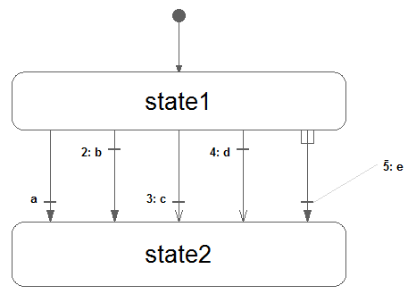
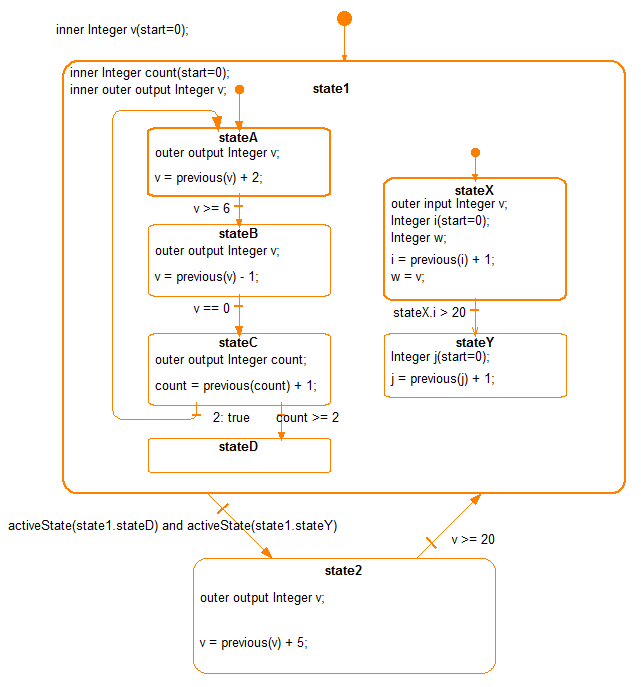
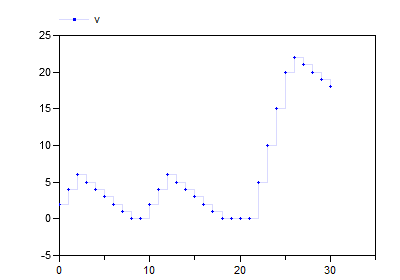
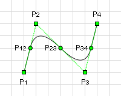
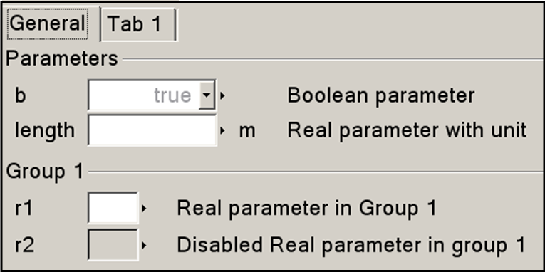
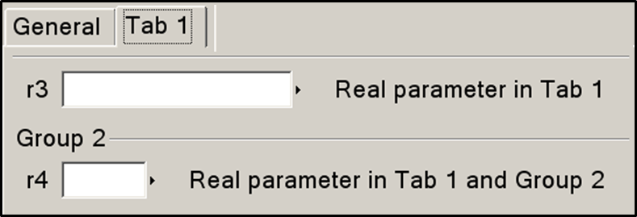
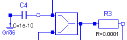
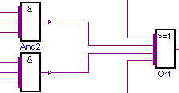
.. |image10| image:: media/image46.png
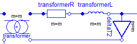
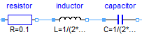
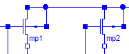
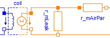
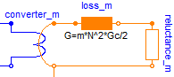
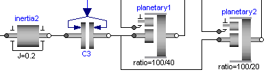
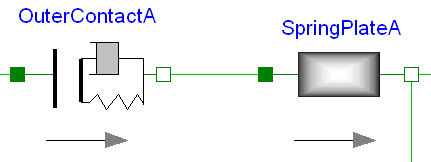
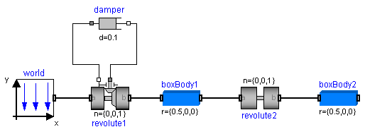
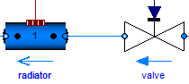
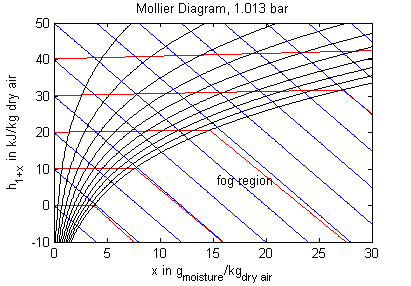
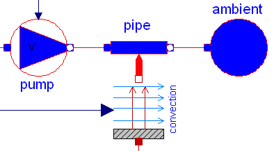
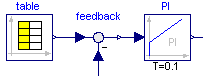
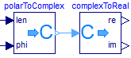
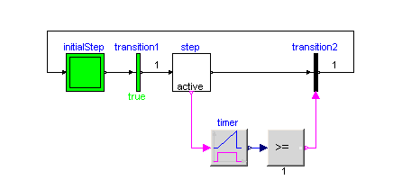

.. |image26| image:: media/image62.png
.. |image27| image:: media/image63.png
.. |image28| image:: media/image64.png

.. |image31| image:: media/image67.png

.. |image34| image:: media/image70.png
.. |image35| image:: media/image71.png
.. |image36| image:: media/image72.png
.. |image37| image:: media/image73.png
.. |image38| image:: media/image74.png
.. |image39| image:: media/image75.png
.. |image40| image:: media/image76.png
.. |image41| image:: media/image77.png
